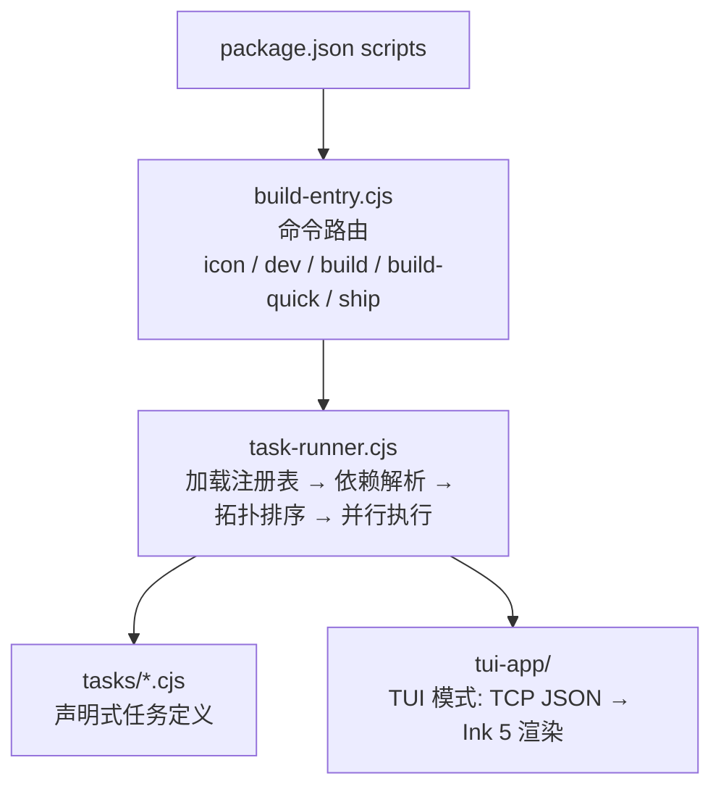
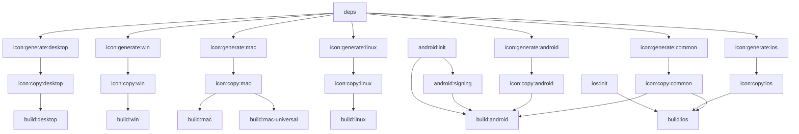
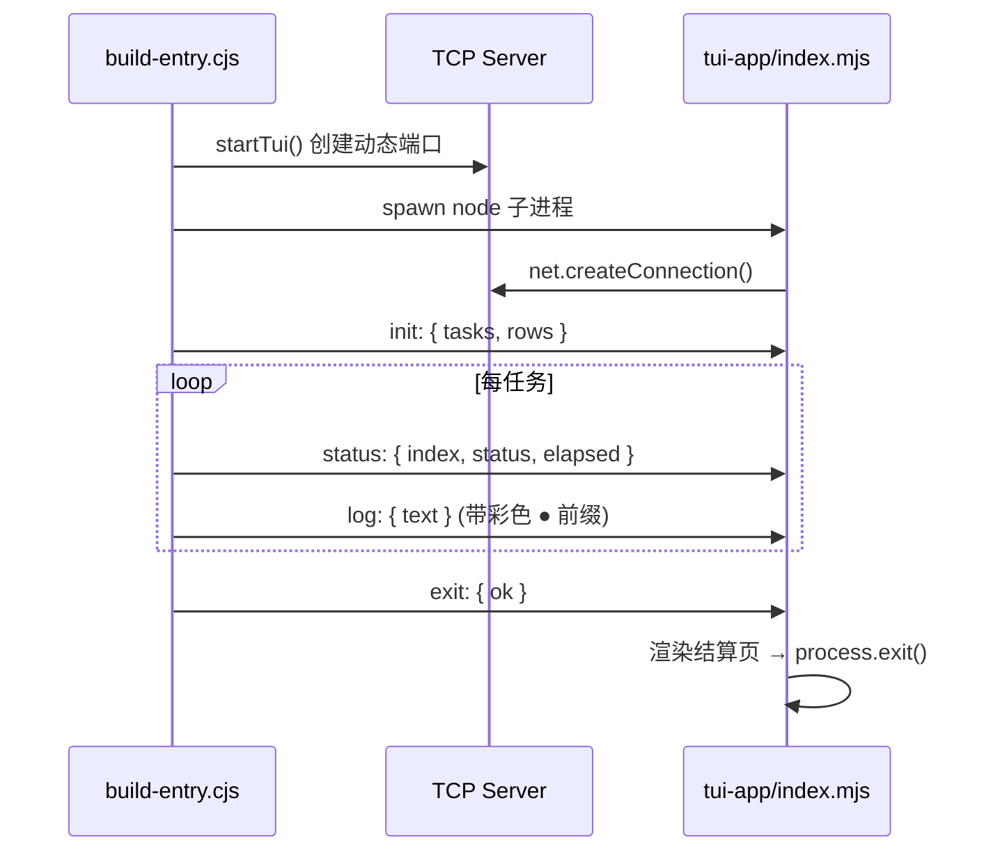

# 构建脚本系统

本文档描述 `scripts/` 下构建系统的架构、任务定义规范与扩展方式。

## 目录结构

```
scripts/
├── build/
│   ├── build-entry.cjs         # 命令入口：路由 → 目标任务 ID → 委托 task-runner
│   ├── task-runner.cjs         # 核心引擎：TaskDAG + ConflictSet + 拓扑排序 + 并行调度
│   ├── tasks/                  # 声明式任务定义（22 个）
│   │   ├── deps.cjs            #   id: deps
│   │   ├── run-tests.cjs       #   id: test
│   │   ├── icon-*.cjs          #   id: icon:{generate,copy}:{platform}  ×7 平台
│   │   ├── android-*.cjs       #   id: android:init / android:signing
│   │   ├── ios-init.cjs        #   id: ios:init
│   │   └── build-*.cjs         #   id: build:{platform}  ×7 + 元任务 ×3
│   ├── gen-icons.cjs           # 图标生成工具（两阶段：generate + copy）
│   ├── clean.cjs               # 清理构建产物
│   ├── copy-keystore.cjs       # Android 签名密钥复制（独立脚本）
│   ├── icon-config.json        # 图标平台配置
│   └── tui-app/
│       └── index.mjs           # Ink 5 分屏 TUI 渲染进程
└── ci/
    ├── check-doc-links.mjs     # 文档链接有效性检查
    └── check-module-paths.mjs  # @module 路径一致性检查
```

## 架构分层



### 设计原则

- **声明式依赖**：每个任务只描述"依赖谁"，不关心"被谁依赖"。执行顺序由拓扑排序自动推导。
- **命令与任务分离**：`build-entry.cjs` 只做命令→目标任务 ID 的映射，不包含任务定义。
- **TUI 可插拔**：`task-runner.cjs` 通过回调接口适配 TUI / 回退内联两种模式，不耦合 Ink。
- **分支隔离失败**：单任务失败不中止全局调度，仅阻断其子孙分支，独立分支继续执行。

## 任务定义规范

每个 `scripts/build/tasks/{name}.cjs` 文件必须导出：

```javascript
/**
 * @file 简短描述
 * @description 一句话职责说明，以句号结尾。
 * @module scripts/build/tasks/{name}
 */

module.exports = {
  /** 唯一标识，冒号分隔命名空间，如 'icon:generate:win'、'build:android' */
  id: 'task:id',

  /** TUI 中显示的任务名称 */
  description: 'Human-readable name',

  /** 依赖的任务 ID 列表，无依赖时传 [] */
  dependsOn: ['other:id'],

  /** 冲突资源名列表，共享同一资源的任务会被 ConflictSet 自动串行化 */
  conflicts: ['resource:cargo-build'],

  /** 执行体，二选一 */
  run: { cmd: 'shell command' }   // shell 命令
    | { fn: someFunction }        // 同步函数，返回 boolean
};
```

### `run` 字段

| 字段 | 类型 | 说明 |
|------|------|------|
| `cmd` | `string` | shell 命令，在项目根目录执行。TUI 模式静默捕获输出，回退模式 inherit stdio |
| `fn` | `() => boolean` | 同步函数，返回 `false` 表示失败。典型用例：`android:signing` 的文件修改逻辑 |

### 冲突资源

通过 `conflicts` 字段声明互斥资源锁。持有同一锁的任务不会并发执行。

| 资源名 | 使用者 | 说明 |
|--------|--------|------|
| `resource:tauri-cli` | `android:init`, `ios:init` | Tauri CLI 初始化互斥 |
| `resource:icons-dir` | 所有 `icon:copy:*` | 图标输出目录互斥 |
| `resource:cargo-build` | 所有 `build:*` | Cargo 编译锁互斥 |

## 依赖图

图标任务采用**两阶段**（generate → copy），为所有 build 任务提供前置。



> **注**：`test` 和 `ios:init` 仅在 `ship` 命令中作为直接依赖引入。build 任务间通过 `resource:cargo-build` 冲突锁串行化。icon copy 任务间通过 `resource:icons-dir` 冲突锁串行化。

### 拓扑排序示例

```
build:android 的解析结果（9 步）：
  1. deps
  2. android:init
  3. icon:generate:android
  4. icon:generate:common
  5. android:signing        ← 依赖 android:init
  6. icon:copy:android      ← 依赖 icon:generate:android
  7. icon:copy:common       ← 依赖 icon:generate:common
  8. [冲突锁串行]
  9. build:android          ← 依赖以上全部

build:win 的解析结果（4 步）：
  1. deps
  2. icon:generate:win
  3. icon:copy:win          ← 依赖 icon:generate:win
  4. build:win              ← 依赖 icon:copy:win
```

## 命令映射

所有命令通过 `build-entry.cjs` 的 `COMMAND_TASKS` / `DEV_SETUP_TASKS` 映射到目标任务 ID。

| 命令 | 平台 | 目标任务 ID |
|------|------|-------------|
| `icon` | `desktop` | `['icon:copy:desktop']` (自动解析依赖) |
| | `all` | 全部 7 个 `icon:copy:*` |
| `dev` | `desktop` | `['deps', 'icon:copy:desktop']` → spawn `tauri dev` |
| | `android` | `['deps', 'android:init', 'icon:copy:android', 'icon:copy:common']` → spawn `tauri android dev` |
| `build` | `win` | `['build:win']` (自动解析依赖) |
| `build-quick` | `win` | 直接 `tauri build`（不经依赖图） |
| `ship` | `mac` | `['test', 'build:mac']` (自动解析依赖) |

### dev 命令特殊性

`dev` 命令分两阶段：
1. **依赖任务阶段**：通过 task-runner 执行 `DEV_SETUP_TASKS`，TUI 中显示进度
2. **长期运行阶段**：TUI 退出后，以 `inherit stdio` spawn `tauri dev`（或 `tauri android dev`）

### build-quick 命令

跳过依赖图，直接执行 Tauri 构建命令。适用于依赖和图标都已就绪时的快速迭代。

## TUI 系统

### 架构



### 消息协议

通过换行分隔的 JSON 消息通信（TCP localhost 动态端口）。

| type | 方向 | payload | 说明 |
|------|------|---------|------|
| `init` | → TUI | `{ tasks: Array<{ name, color }>, rows: Array<{ name, color, indices, prefix, depth }> }` | 任务列表（含调色板颜色）与倒置依赖树 |
| `status` | → TUI | `{ index, status, elapsed? }` | 更新任务状态：running/done/failed/skipped |
| `log` | → TUI | `{ text }` | 追加构建日志行（带任务颜色 ● 前缀） |
| `exit` | → TUI | `{ ok }` | 通知退出，TUI 渲染结算页后等待按键退出 |

### 日志着色

每个运行中任务的日志行以对应调色板颜色的 `●` 为前缀。`init` 阶段为每个任务分配 14 色调色板色（`index % 14`），确保日志 ● 与 TUI 任务行颜色一致。

### 倒置依赖树

TUI 以缩进倒置树展示任务。线性链（唯一父子）折叠为 `A → B` 单行，折叠链中每步显示各自的调色板色图标和名称。

### 结算页

构建完成后显示全量任务终态列表、统计行（done/failed/skipped/total）、失败时的错误日志面板。任意按键退出。

### 回退模式

当 `stdout` 不是 TTY 时（如 CI 环境），自动回退到内联 ANSI 进度输出，不启动 Ink 子进程。

## task-runner.cjs API

```javascript
const {
  loadTaskRegistry,    // () => Map<id, task>
  resolveTaskGraph,    // (targetIds, registry) => { ordered, errors }
  executeTasks,        // (ordered, mode, callbacks?) => Promise<boolean>
  run,                 // (targetIds, mode, callbacks?) => Promise<{ ok, errors }>
  runCmdInherit,       // (cmd) => Promise<boolean>
} = require('./task-runner.cjs');
```

### 执行模式

| 模式 | 入口 | 调度 | 重试 | 适用 |
|------|------|------|------|------|
| `tui` | `executeTasksParallel` | TaskDAG + ConflictSet，最多 4 并发 | 默认 3 次，指数退避 (1/2/4s) | 开发构建 |
| `inline` | `executeTasksSequential` | 串行执行 | 无 | CI / 非 TTY |

### 分支隔离失败

单任务失败后：
- 不调用 `dag.onDone(id)` → 子孙 `remainingDeps` 保持 >0 → 永不可达 → 自动标记 `skipped`
- 其他分支的任务不受影响，继续正常调度
- 所有分支完成后（`ready.size === 0 && running.size === 0`），触发 `onExit`

### 回调接口

```typescript
interface RunCallbacks {
  onInit(payload: {
    tasks: Array<{ name: string, color: string }>,
    rows: Array<{ name: string, color: string, indices: number[], prefix: string, depth: number }>
  }): void;
  onStatus(index: number, status: 'running'|'done'|'failed'|'skipped', elapsed?: number): void;
  onLog(text: string): void;
  onExit(ok: boolean): void;
}
```

### 循环依赖检测

拓扑排序完成后检查 `ordered.length !== needed.size`，若不等则报告 `Circular dependency detected`。

## 添加新任务

1. 在 `scripts/build/tasks/` 下创建 `{name}.cjs`
2. 按规范导出 `{ id, description, dependsOn, run }`
3. 如需与其他任务互斥，添加 `conflicts` 字段
4. 如果新任务需要被某个命令触发，在 `build-entry.cjs` 的 `COMMAND_TASKS` 中添加映射

无需修改 `task-runner.cjs`——它会自动扫描 `tasks/` 目录加载。

### 示例：添加代码检查任务

```javascript
// scripts/build/tasks/lint.cjs
module.exports = {
  id: 'lint',
  description: 'Lint source code',
  dependsOn: [],
  run: { cmd: 'yarn ci-check' },
};
```

然后在 `build-entry.cjs` 中将 `lint` 加入需要它的命令映射：
```javascript
ship: {
  win: ['lint', 'test', 'build:win'],
},
```

## 其他脚本

### clean.cjs

清理构建产物。目标：`target`（Rust）、`gen`（移动端）、`icons`、`temp`。

### gen-icons.cjs

图标生成工具，两阶段执行：
1. **generate**：调用 `yarn tauri icon` 生成全尺寸图标到临时目录
2. **copy**：从临时目录按白名单拷贝到 `src-tauri/icons/`

被 `icon:*` 任务通过 `node gen-icons.cjs {platform} --phase=generate|copy` 调用。

### copy-keystore.cjs

独立脚本，从 `keys/keystore.properties` 复制到 `src-tauri/gen/android/`。注意：`android:signing` 任务内联了此逻辑并有额外 `build.gradle.kts` 修改，不再调用此脚本。

### CI 检查

| 脚本 | 检查内容 |
|------|---------|
| `check-doc-links.mjs` | 扫描 `src/core/**/*.md`，验证 `.md` 相对链接目标存在 |
| `check-module-paths.mjs` | 扫描 `src/core/**/*.js`，验证 `@module` 与实际路径一致 |
