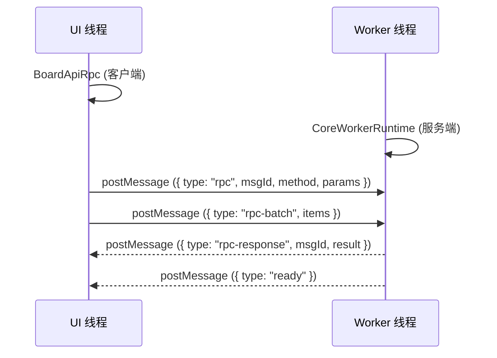

# BoardApi 文档

## 概述

BoardApi 是 UI 线程与 Core Worker 之间的统一通信接口。UI 侧通过 `BoardApiRpc` 暴露异步方法，经过 JSON-RPC 风格的消息协议与 Worker 侧的 `BoardCore` 交互。

BoardApi 不承载业务逻辑，只负责：

- 将 UI 侧操作翻译为 RPC 请求
- 高频写入方法的微任务级批处理合并
- RPC 响应路由与超时管理

## 架构

初始化流程：

1. UI 侧创建 Worker 实例
2. `BoardApiRpc` 构造时绑定 Worker 的 `postMessage` / `addEventListener` / `removeEventListener`
3. Worker 启动后发送 `{ type: "ready" }` 消息，`BoardApiRpc` 记录 `isReady()`
4. UI 侧调用 `waitUntilReady()` 等待就绪，然后通过 `createBoard()` 完成板面初始化

### 消息类型

| type           | 方向        | 说明                                  |
| -------------- | ----------- | ------------------------------------- |
| `rpc`          | UI → Worker | 带 msgId 的单次远程调用，必有响应     |
| `rpc-batch`    | UI → Worker | 批量 fire-and-forget 消息，无独立响应 |
| `rpc-response` | Worker → UI | RPC 调用结果，包含 result 或 error    |
| `ready`        | Worker → UI | Worker 初始化完成通知                 |

## API 面

所有方法返回 `Promise`。参数格式见 `board-api-types.js`。

### 板面生命周期

| 方法                   | 说明                                                               |
| ---------------------- | ------------------------------------------------------------------ |
| `createBoard(options)` | 初始化 Worker 侧 `BoardCore`，可选 `width` / `height` / `rootPath` |
| `destroyBoard()`       | 销毁 BoardCore，清理所有 ViewportCore                              |

### 视口管理

| 方法                          | 说明                                                                            |
| ----------------------------- | ------------------------------------------------------------------------------- |
| `createViewport(options)`     | 创建 Worker 侧 `ViewportCore`，`options` 需含 `viewportId` / `width` / `height` |
| `destroyViewport(viewportId)` | 销毁指定 ViewportCore                                                           |

### 对象创建与提交

| 方法                        | 说明                                                                           |
| --------------------------- | ------------------------------------------------------------------------------ |
| `createObject(type, props)` | 创建对象实例并加入 AOM 动态图。`props` 需含 `id` / `position`。不触发区块加载  |
| `commitObjects(objectIds)`  | 将 AOM 中的对象按动态层关系写入区块静态图。走 `ActiveObjectManager.apply` 路径 |
| `deleteObjects(objectIds)`  | 从 AOM 和静态图中彻底删除对象                                                  |

### 对象修改（高频写入）

| 方法                                          | 说明                                                                      |
| --------------------------------------------- | ------------------------------------------------------------------------- |
| `modifyObject(objectId, patch)`               | 修改单个对象的位置 / 变换 / 属性 / 数据。同帧多次调用自动合并为单次批处理 |
| `modifyObjects(patches)`                      | 批量修改多个对象，不经过批处理缓冲                                        |
| `appendListItem(objectId, key, items)`        | 向列表属性追加元素。同帧合并                                              |
| `replaceListItem(objectId, key, index, item)` | 替换列表属性指定索引元素。同帧覆盖                                        |
| `removeListItem(objectId, key, index)`        | 删除列表属性指定索引元素                                                  |

所有高频写入方法同帧内合并为单条 `rpc-batch` 消息发送，减少 Worker 侧消息处理开销。

### AOM 控制

| 方法                              | 说明                            |
| --------------------------------- | ------------------------------- |
| `addActiveObjects(objectIds)`     | 将对象从静态图检出到 AOM 动态图 |
| `discardActiveObjects(objectIds)` | 将对象从 AOM 丢弃，不修改静态图 |

### 查询

| 方法                          | 说明                                               |
| ----------------------------- | -------------------------------------------------- |
| `queryObjects(ids)`           | 按 id 查询对象摘要（类型、位置、变换、边界、属性） |
| `queryChunkObjects(chunkIds)` | 按区块 id 查询归属该区块的所有对象 id              |
| `hitTest(range, mode)`        | 执行命中检测，返回与指定范围相交的对象 id 列表     |

### 撤销 / 重做

| 方法     | 说明   |
| -------- | ------ |
| `undo()` | [todo] |
| `redo()` | [todo] |

### 调试

| 方法                           | 说明                                            |
| ------------------------------ | ----------------------------------------------- |
| `requestDebug(query, payload)` | 向 Worker 发送 fire-and-forget 调试请求，无响应 |

## 批处理机制

`modifyObject`、`appendListItem`、`replaceListItem`、`removeListItem` 使用微任务级批处理：

1. 调用时，参数存入 `#batchBuffer`（map key 为 `method:objectId:key:index`）
2. 同 key 的后续调用自动合并（`modifyObject` 的 patch 逐字段合入，`appendListItem` 的 items 合并为数组）
3. 在下一个微任务中执行 `#flushBatchNow`，将所有缓冲条目打包为单条 `rpc-batch` 消息发送
4. 发送前若有非批处理方法调用（如 `createObject`），会自动触发 `#flushBatchNow` 确保时序正确

批处理条目为 fire-and-forget，无独立 RPC 响应。

## hitTest 的区块加载行为

`hitTest` 与其它只读查询不同：若查询范围覆盖未加载或仅临时加载的区块，会自动执行 FullLoad 后再进行命中检测。

流程：

1. 计算查询范围覆盖的区块 ID 集合
2. 对每个未 FullLoad 的区块，创建临时 ChunkLoader 发射 FullLoad 请求
3. 逐个等待 `LOAD_COMPLETE` 事件（使用 `on+off` 避免 `EventBus.once` 在并发加载时的竞态）
4. FullLoad 完成后 `syncChunkObjectEntries` 确保对象实例已载入 `objectLoaded`
5. 遍历 `boardCore.objectLoaded` 执行范围相交检测
6. 销毁临时 ChunkLoader，释放引用

这意味着：

- 在可视范围内的 hitTest 总是能找到已提交到静态图的对象
- 在从未访问过的区域 hitTest，会触发一次 FullLoad 后命中，后续不再重复加载
- `mode` 参数当前保留未使用，默认行为等同 `"intersect"`

## RPC 超时

- 默认超时 5000ms
- 可在构造时通过 `timeoutMs` 选项覆盖
- 超时后 Promise reject，错误码 `RPC_TIMEOUT`
- 超时不受 `waitUntilReady` 影响（该超时由独立定时器管理）

## 设计约束

- BoardApi 不依赖 DOM 或特定 Worker 实现，只要求端点满足 `postMessage` / `addEventListener` / `removeEventListener` 接口
- `createObject` 需要显式传入 `id` 字段（当前由 UI 侧 `Board.allocateObjectId()` 分配）
- 同线程实现（`BoardApiLocal`）在 P2 阶段存在但未接入当前运行时
- undo / redo 的实现尚未落地

## 相关文档

- [board-core-document.md](../../engine/orchestration/docs/board-core-document.md)
- [active-object-manager-document.md](../../engine/orchestration/docs/active-object-manager-document.md)
- [core-modules.md](../../docs/core-modules.md)
- [board-api-types.js](../../engine/types/board-api-types.js)
