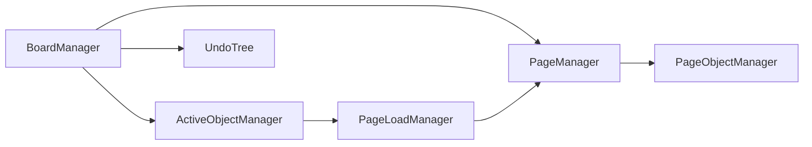

# 组件文档

本文档提供 Core 层组件（components）的总览。

components 目录下的模块用于管理白板运行时状态，负责把对象模型（objects）、历史模型（hit）与工具交互串联起来。

## 组件列表

- `BoardManager`：白板级管理器，负责加载白板、维护页映射与页顺序、持有全局活动对象管理器与历史树。
- `PageManager`：单页管理器，负责页链关系、页加载/卸载流程。
- `PageObjectManager`：页对象管理器，负责静态层叠图与页对象映射。
- `ActiveObjectManager`：全局活动对象管理器，负责选择、分层、置顶与取消选择。
- `PageLoadManager`：活动对象拾取期间的临时页加载器（定义在 `active-object-manager.js` 内）。

## 组件关系图

## 关键设计点

### 白板级与页级分治

`BoardManager` 管白板级元信息与页列表，`PageManager` 管单页状态，`PageObjectManager` 管页内对象与层叠图。

这种拆分让“翻页/加载策略”和“对象关系维护”相互解耦。

### 活动对象单独管理

活动对象不直接写入页静态图，而是由 `ActiveObjectManager` 维护动态层关系。这样可以在拖拽、框选等频繁操作期间减少对静态关系的破坏。

层叠图细节见 [tire-graph-document.md](./tire-graph-document.md)。

## 与其它目录的关系

- 与 `src/core/objects/`：对象实例由页对象管理器持有。
- 与 `src/core/hit/`：白板管理器持有 `UndoTree`，用于后续历史记录与回放。
- 与 `src/core/tools/`：工具操作会驱动活动对象选择与页对象变更。
- 与 `src/core/utils/`：大量依赖 `DirectedGraph`、队列/双端队列、计数池等基础结构。

## 当前实现状态

- `ActiveObjectManager` 算法实现相对完整，已具备拾取、分层、置顶、清理等核心逻辑。
- `BoardManager`、`PageManager`、`PageObjectManager` 已有骨架和关键字段，但仍存在较多 `todo`。
- 文档建议按“先补齐页加载与对象落盘，再串联工具与历史”的顺序推进。