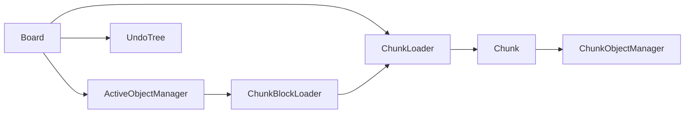

# 组件文档

本文档提供 Core 层组件（components）的总览。

components 目录下的模块用于管理白板运行时状态，负责把对象模型（objects）、历史模型（hit）与工具交互串联起来。

## 组件列表

- `Board`：白板级管理器，负责维护区块实例所有权与加载状态、持有全局活动对象管理器与历史树。
- `Chunk`：区块类，负责区块链关系、区块加载/卸载流程。
- `ChunkLoader`：通用区块加载器，是区块对象的持有者，负责按 id/坐标访问与卸载区块。
- `ChunkObjectManager`：区块对象管理器，负责静态层叠图与区块对象映射。
- `ActiveObjectManager`：全局活动对象管理器，负责选择、分层、置顶与取消选择。
- `ChunkBlockLoader`：`ChunkLoader` 的包装器，负责连续矩形范围的区块缓冲区与当前区块位置管理。

## 组件关系图

## 关键设计点

### 白板级与区块级分治

`Board` 管白板级元信息与区块实例加载状态，根 `ChunkLoader` 管白板级区块实例所有权，`ChunkBlockLoader` 管连续矩形范围的缓冲区表达，`Chunk` 管单区块状态，`ChunkObjectManager` 管区块内对象与层叠图。

这种拆分让“翻区块/加载策略”和“对象关系维护”相互解耦。

### 持有与包装分离

`ChunkLoader` 与 `ChunkBlockLoader` 的职责边界需要明确区分：

- `ChunkLoader` 负责持有区块对象
- `ChunkBlockLoader` 不直接持有区块对象，而是包装一个 `ChunkLoader`
- `ChunkBlockLoader` 只负责把这批区块组织成一个连续矩形范围，并表达当前区块和缓冲区扩缩行为

这使得 `Board` 可以暴露一个根 `ChunkLoader` 作为通用区块访问入口，同时允许上层按需创建多个 `ChunkBlockLoader` 视角。

### 活动对象单独管理

活动对象不直接写入区块静态图，而是由 `ActiveObjectManager` 维护动态层关系。这样可以在拖拽、框选等频繁操作期间减少对静态关系的破坏。

层叠图细节见 [tier-graph-document.md](./tier-graph-document.md)。

## 与其它目录的关系

- 与 `src/core/objects/`：对象实例由区块对象管理器持有。
- 与 `src/core/hit/`：白板类持有 `UndoTree`，用于后续历史记录与回放。
- 与 `src/core/tools/`：工具操作会驱动活动对象选择与区块对象变更。
- 与 `src/core/utils/`：大量依赖 `DirectedGraph`、队列/双端队列、计数池等基础结构。

## 当前实现状态

- `ActiveObjectManager` 算法实现相对完整，已具备拾取、分层、置顶、清理等核心逻辑。
- `Board`、`Chunk`、`ChunkObjectManager` 已有骨架和关键字段；其中 `Board` 已收口到“根 `ChunkLoader` 持有区块对象 + `chunkLoaded` 维护加载状态”的模型，但仍存在较多 `todo`。
- 文档建议按“先补齐区块加载与对象落盘，再串联工具与历史”的顺序推进。