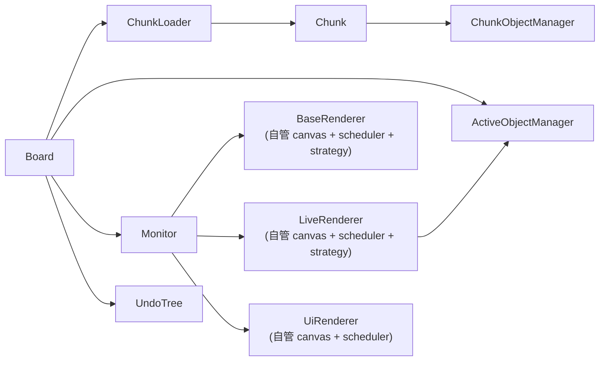

# 组件文档

本文档提供 Core 层组件（components）的总览。

components 目录下的模块用于管理白板运行时状态，负责把对象模型（objects）、历史模型（hit）与工具交互串联起来。

## 目录结构

```
src/core/components/
├── chunk/           # 区块子系统
│   ├── chunk.js
│   ├── chunk-loader.js
│   └── chunk-object-manager.js
├── renderer/        # 渲染管线
│   ├── base-renderer.js
│   ├── live-renderer.js
│   ├── ui-renderer.js
│   ├── render-scheduler.js
│   └── dirty-rect-strategy.js
├── orchestration/   # 编排层
│   ├── board.js
│   ├── monitor.js
│   └── active-object-manager.js
├── index.js         # 统一导出（Board / Monitor）
├── docs/
└── tests/
```

外部代码统一通过 `src/core/components/index.js` 导入 `Board` 和 `Monitor`，不直接引用子目录内部路径。

## 组件列表

### 区块子系统（`chunk/`）

- `Chunk`：区块类，负责区块链关系、区块加载/卸载流程。
- `ChunkLoader`：区块加载器，是区块对象的持有者，负责按 id/坐标访问与卸载区块，并对外发送加载/卸载请求。
- `ChunkObjectManager`：区块对象管理器，负责静态层叠图与对象覆盖区块索引，并通过 `Board` 间接解析对象实例。

### 渲染管线（`renderer/`）

- `BaseRenderer`：静态层渲染器，自管理 baseCanvas、渲染调度器与脏区合并策略。从已加载区块收集静态对象绘制到 baseCanvas。
- `LiveRenderer`：活动层渲染器，自管理 liveCanvas、渲染调度器与脏区合并策略。从 AOM 读取活动对象绘制到 liveCanvas，并通过 copyBase 合成 baseCanvas 缓存。
- `UiRenderer`：UI 覆盖层渲染器，自管理 uiCanvas、渲染调度器。把兼容 overlay 与注册的 UI overlay provider 绘制到 uiCanvas。
- `Renderer`：渲染器基类，封装视口变换、脏区裁剪与渲染管线骨架。BaseRenderer 与 LiveRenderer 继承此类。
- `RenderScheduler`：渲染调度器，负责把多次失效请求合并到单帧 flush 中执行。由各渲染器自行持有。
- `DirtyRectStrategy`：脏区域策略模块，提供基于区域和缩放的脏区域处理策略。在渲染器内部使用。

### 编排层（`orchestration/`）

- `Board`：白板级管理器，负责维护区块实例所有权、对象实例注册表与加载状态，持有全局活动对象管理器与历史树。
- `Monitor`：显示器组件，负责视口坐标变换、设备图挂载，以及多层渲染画布的承载。
- `ActiveObjectManager`：全局活动对象管理器，负责选择、分层、置顶与取消选择。

## 组件关系图



## 关键设计点

### 白板级与区块级分治

`Board` 管白板级元信息、区块实例加载状态与对象实例注册表，根 `ChunkLoader` 管白板级区块实例所有权，`ChunkLoader` 管连续矩形范围的缓冲区表达，`Chunk` 管单区块状态，`ChunkObjectManager` 管区块内静态图与覆盖索引。

这种拆分让“翻区块/加载策略”和“对象关系维护”相互解耦。

### ChunkLoader 分层使用

`Board` 持有一个根 `ChunkLoader` 作为白板级区块实例所有权入口。消费者（Monitor、AOM）通过 `Board.createChunkLoader()` 创建独立的加载器自行管理加载集合，每个加载器的区块加载/卸载请求都通过 Board 事件总线路由。

这使得 `Board` 可以暴露一个根 `ChunkLoader` 作为通用区块访问入口，同时允许上层按需创建独立视角。

### 活动对象单独管理

活动对象不直接写入区块静态图，而是由 `ActiveObjectManager` 维护动态层关系。这样可以在拖拽、框选等频繁操作期间减少对静态关系的破坏。

层叠图细节见 [tier-graph-document.md](./tier-graph-document.md)。

### 视口层承接交互态渲染

当前渲染职责开始向 `Monitor` 视口层收敛。

- `Monitor` 承载三个渲染器实例：`baseRenderer`、`liveRenderer`、`uiRenderer`。每个渲染器自管理自己的画布、渲染调度器和脏区策略。
- `BaseRenderer` 负责把已提交静态对象重绘到 `baseCanvas`，并已支持显式 dirty rect 局部刷新。
- `LiveRenderer` 负责从 `ActiveObjectManager` 读取活动对象，按层顺序重绘到 `liveCanvas`，并通过 `copyBase()` 把 `baseCanvas` 缓存合成到屏幕上。
- `UiRenderer` 负责把 chooser / modifier 工具主动声明的选择框等兼容 overlay 绘制到 `uiCanvas`，并为 chooser 轨迹、控制杆、激光笔等未来 UI overlay 提供 provider 扩展口。
- 活动层和静态层的对象驱动刷新、视口矩形换算与 dirty rect 局部重绘，也开始沿这条链路收口。

这里需要额外强调一条边界：

- 当前 `UiRenderer` 只是 Core 侧的兼容实现
- `uiCanvas` 最终应继续留在 Core，还是迁移到宿主 UI，当前仍未最终定案

这让活动对象的语义仍留在 AOM，而把“何时画、画到哪一层”收口到 Monitor 一侧。

## 与其它目录的关系

- 与 `src/core/objects/`：对象实例由区块对象管理器持有。
- 与 `src/core/hit/`：白板类持有 `UndoTree`，用于后续历史记录与回放。
- 与 `src/core/tools/`：工具操作会驱动活动对象选择与区块对象变更。
- 与 `src/core/utils/`：大量依赖 `DirectedGraph`、队列/双端队列、计数池等基础结构。

## 当前实现状态

- `ActiveObjectManager` 算法实现相对完整，已具备拾取、分层、置顶、清理等核心逻辑。
- `Monitor` 持有三层 renderer 引用；保留 `monitor.canvas -> liveRenderer.canvas` 的兼容入口。
- `BaseRenderer`、`LiveRenderer` 继承 `Renderer` 基类，各渲染器自管理 canvas、`RenderScheduler` 与脏区合并策略；其中 `BaseRenderer` 已支持静态层整层重绘和显式 dirty rect 局部刷新，`LiveRenderer` 已支持活动层整层重绘和显式 dirty rect 局部刷新，`UiRenderer` 已提供兼容 overlay 渲染和 provider 扩展口。
- `Board`、`Chunk`、`ChunkObjectManager` 已有骨架和关键字段；其中 `Board` 已收口到“根 `ChunkLoader` 持有区块对象 + `chunkLoaded` 维护加载状态”的模型，但仍存在较多 `todo`。
- `ActiveObjectManager.add/choose/apply/discard` 已能主动触发活动层刷新，`LiveRenderer.invalidateObjects(...)` 也已覆盖对象前后两帧范围，避免拖拽残影。
- `ActiveObjectManager.requestLiveRender(...)`、creator 和 modifier 的高频几何修改路径，也会同步推动 ui 层刷新，使选择框等兼容 overlay 能及时重绘；但默认选择框是否显示，仍取决于 chooser / modifier 工具是否声明了 overlay，而不是 AOM 成员关系本身。
- `ActiveObjectManager.apply(objects)` 会优先请求 base 层对象级局部失效，并在必要时回退到区块并集刷新；区块缓冲区变化和视口变化也会自动触发 base 层刷新。
- 当前仍处在“活动层已较稳定、静态层已进入第一版增量刷新，但还要继续往区块级补绘推进”的阶段。

## 相关文档

- [monitor-document.md](./monitor-document.md)
- [base-renderer-document.md](./base-renderer-document.md)
- [render-scheduler-document.md](./render-scheduler-document.md)
- [live-renderer-document.md](./live-renderer-document.md)
- [ui-renderer-document.md](./ui-renderer-document.md)
- [active-object-manager-document.md](./active-object-manager-document.md)
