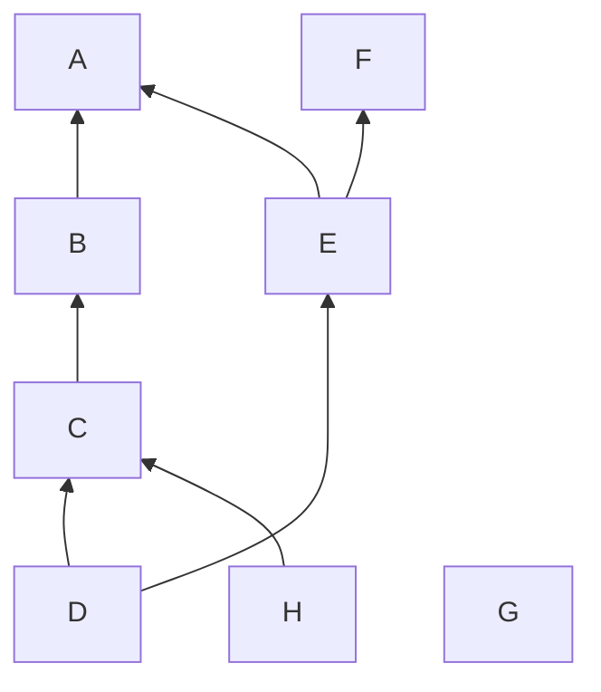
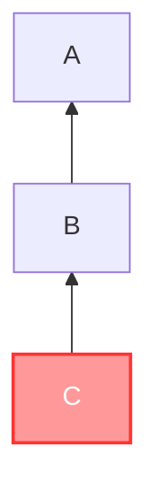
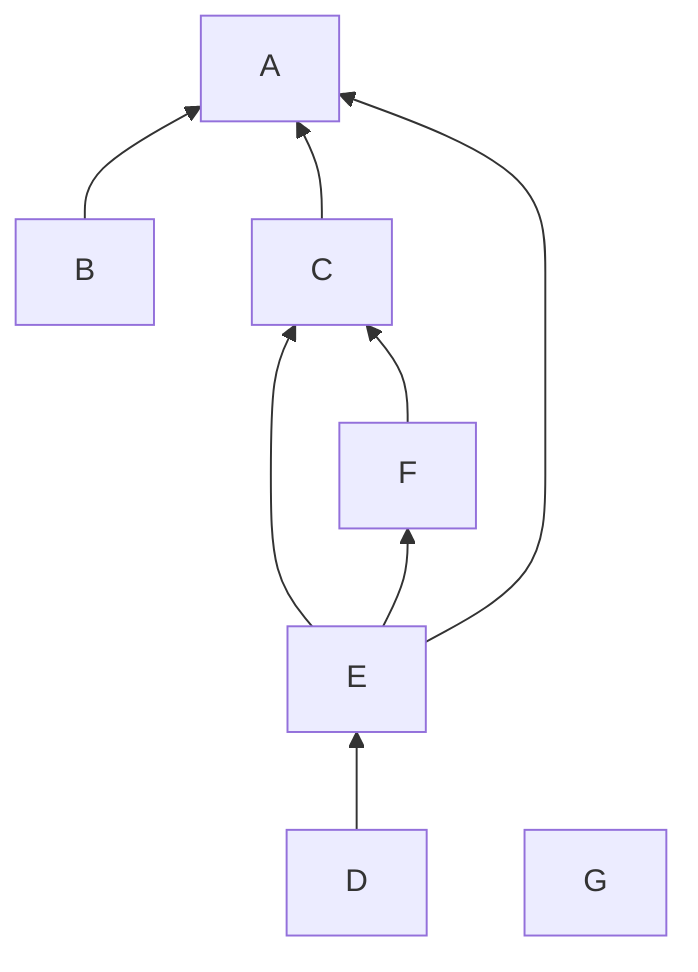
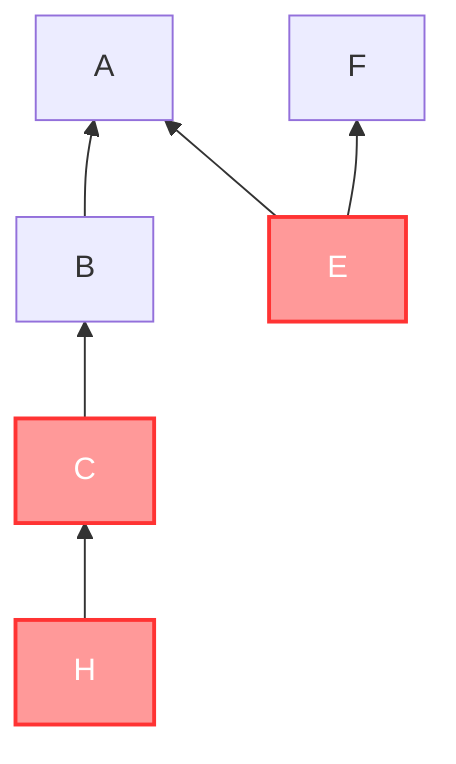
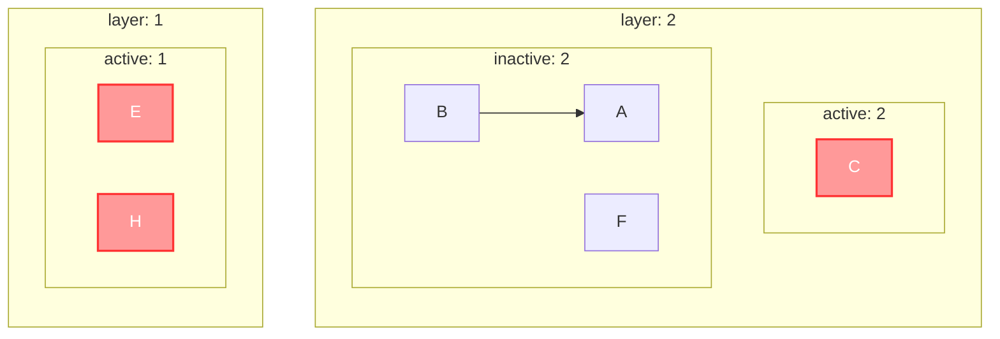
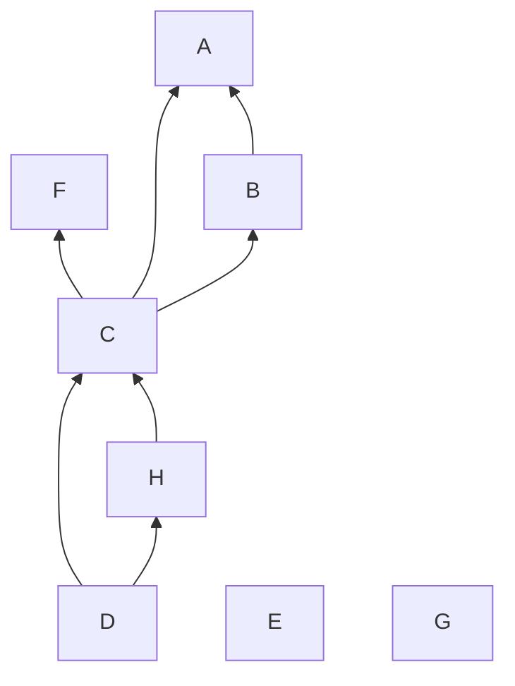

# 层叠图文档

本文档提供层叠图（tier graph）的概述。

层叠图是活动对象管理器（AOM）用来管理对象间层级关系的工具。

## 符号约定

- 所有集合均用大写黑板体表示，如集合 $\mathbb{A}$
- 所有对象均用小写正粗体表示，如对象 $\mathbf{a}$，如未特殊说明，字母相同的对象与点被视为对应的，比如 $\mathbf{a}$ 在图上对应的点为 $A$
- 所有的图均用大写手写体表示，如图 $\mathcal{G}$
- 所有图上的点均用大写斜体表示，如点 $A$
- 所有数组均用大写正粗体表示，如数组 $\mathbf{A}$
- 所有函数和自然数变量均用小写斜体表示，如 $f(x)$
- 函数 $p(\mathcal{G})$ 用以获取图 $\mathcal{G}$ 的点集
- 函数 $s(\mathcal{G})$ 用以获取图 $\mathcal{G}$ 入度为 $0$ 的点的点集
- 函数 $t(\mathcal{G})$ 用以获取图 $\mathcal{G}$ 出度为 $0$ 的点的点集
- $P \to Q$ 表示 $P$ 与 $Q$ 间有条 $P$ 到 $Q$ 的边

## 层叠图概述

对于一页上的对象，我们可以用有向无环图来表示对象间的层级关系（可以不连通）。

我们将维护一张有向无环图: 静态状态图 $\mathcal{S}$。还会维护一个有着 $n$ 个数组 $\mathbf{A}_i$ 和 $n$ 张有向无环图 $\mathcal{D}_i$ 的数组，称为动态状态图 $\mathbf{D}$。其中，每一页都有一张静态状态图，而每一个白板都有一张动态状态图。它们并称层叠图。

静态状态图表示最后一次刷新时对象间的层级关系。若 $P, Q \in p(\mathcal{S})$ 且存在边 $P \to Q$，则 $P$、$Q$ 间有交集，且 $\mathbf{p}$ 在 $\mathbf{q}$ 之下。

动态状态图表示下次刷新时对象额外应遵循的层级关系，主要是判断谁应在该对象之上。若 $P, Q \in \mathbf{D}$ 且 $P$ 能到达 $Q$，则在下次刷新时，若 $\mathbf{p}$、$\mathbf{q}$ 间有交集，则 $\mathbf{p}$ 应在 $\mathbf{q}$ 之下。

## 层叠图基础操作

### 注册某层

动态状态图使用一个链表来管理层与层之间的上下（高低）关系。

注册某层指的是给予这个层一个编号，并将它放在链表中合适的位置。

### 清理动态图

清理动态图是指将无法被被选择的对象到达的层以及空层删去。

## 层叠图操作逻辑

### 在白板中添加对象

默认情况下，越新的对象越应在最上层。

在向白板中添加对象 $\mathbf{a}$ 的开始，即开始画这一笔时，将其添加到动态图中，并连接所有的 $T \in t(\mathcal{D}) \to A$。

在当前实现里，这一步由 `ActiveObjectManager.add(objects)` 表达。它的职责是把“白板外、尚未落入页静态图”的新对象注册到动态图顶层。

在向白板中添加对象的结尾，即这一笔画完松手时，应先算出与之相交的对象集 $\mathbb{C}$，再连接所有的 $C \in \mathbb{A} \to A$

再在静态图中添加对应的从与之相交的对象到新对象的边，最后将其从动态图中删去。

### 在白板中删除对象

直接将其从动态图和静态图中删去即可，然后清理动态图。

### 在白板上选择单个对象

将被选择的对象记为 $\mathbf{a}$。

提取出一个 $\mathcal{S}$ 的子图 $\mathcal{G}$，满足

1. $s(\mathcal{G}) = \mathbb{A}$
2. $\forall P \in p(\mathcal{G})$，存在从 $A$ 到 $P$ 的路径
3. $\forall P \in \complement_{p(\mathcal{S})}\mathcal{G}$，不存在从 $A$ 到 $P$ 的路径

则动态图就是图 $\complement_{\mathcal{G}}A$ 和数组 $\{A\}$ 的集合。

- 若下层存在，将 $V'$ 连向的对象集记为 $\mathbb{V}$，对 $\forall Q \in \mathbb{V}$，创建边 $V \to Q$，并删除边 $V' \to Q$。然后创建边 $V' \to A$ 即可。
- 若下层不存在，则直接将 $V$ 连向这一层中入度为 $0$ 的对象。

这个操作称为插入某层。

最后将层注册到动态图中。

### 在白板上选择多个对象

将被选择的对象集记为 $\mathbb{A}$。

#### 首先，提取出一个 $\mathcal{S}$ 的子图 $\mathcal{G}$：

1. $s(\mathcal{G}) \subseteq \mathbb{A}$
2. $\forall P \in p(\mathcal{G}), \exist Q \in \mathbb{A}$，存在从 $Q$ 到 $P$ 的路径
3. $\forall P \in \complement_{p(\mathcal{S})}\mathcal{G}, \forall Q \in \mathbb{A}$，不存在从 $Q$ 到 $P$ 的路径

#### 得到 $\mathcal{G}$ 后，将其分层并删除跨层边:

1. 定义某点所在的层为“从入度为 $0$ 的点到该点的所有链中拥有活动点数量的最大值”，层是一个正整数
2. 定义某边的层差为“该边终点所在层与该边起点所在层之差”，层差是一个自然数
3. 跨层边为“边终点为活动点且层差大于 $1$ 的边或边终点不为活动点且层差大于 $0$ 的边”
4. 将所在跨层边删去，得到 $\mathcal{G'}$

#### 将 $\mathcal{G}'$ 分至数组 $\mathbf{G}$:

1. 将所有活动对象按层 $i$ 加入 $\mathbf{G}$ 的数组 $\mathbf{A}_i$
2. 将所有活动对象从 $\mathcal{G}'$ 中删去，并将属于层 $i$ 的子图加入 $\mathcal{D}_i$

#### 将 $\mathcal{G}'$ 的每一层按照以下规则插入:

1. 原来就在某一层之上的层，插入之后不会出现在这层之上
2. 这层内的对象如果是以前被选择的对象，那这个对象的层一定不会在这层之下

在白板上选择单个对象是在白板上选择多个对象的特殊情况。

### 提交活动对象

当前实现不再把“取消选择”理解成单纯从动态图里删除对象，而是显式区分提交动作 `apply(objects)`。

`apply(objects)` 的基本流程是：

1. 取出要提交的活动对象实例。
2. 计算它们与白板对象的相交关系。
3. 结合动态图层顺序，确定这些对象在静态图中的上下关系。
4. 计算对象覆盖到的页。
5. 将对象及其覆盖页索引写回对应 `PageObjectManager`。
6. 将这些对象从动态图中删去并清理状态图。

### 置顶选择的对象

1. 直接将要置顶的对象从图中删去
2. 清理状态图
3. 将这些要置顶的对象按层级重新加入到状态图中

## 层叠图实现

在 [directed-graph.js](../utils/directed-graph.js) 中，选用邻接表来实现一个有向无环图。

### API

| 名称                                           | 描述                                         | 类型                                                   |
| ---------------------------------------------- | -------------------------------------------- | ------------------------------------------------------ |
| `pickup(startFrom)`                            | 获取以指定对象集合为起点的子图               | `Iterable<BasicObject> -> DirectedGraph`               |
| `apply(objects)`                               | 将活动对象按当前动态层关系提交回静态图       | `Iterable<BasicObject> -> void`                        |
| `insertLayerUnder(layerNow, layerAbove)`       | 将某层插入到另一层之下                       | `Layer -> Layer \| Undefined -> void`                  |
| `insertLayerUnderById(layerNow, LayerAboveId)` | 将某层插入到另一层之下，其中另一层用 id 表示 | `Layer -> number \| undefined -> void`                 |
| `insertLayerToTop(layerNow)`                   | 将某层插至顶层                               | `Layer -> void`                                        |
| `compareLayerOrderById(layer1, layer2)`        | 比较两层的层次顺序，其中两层都用 id 表示     | `number \| undefined -> number \| undefined -> number` |
| `compareLayerOrder(layer1, layer2)`            | 比较两层的层次顺序                           | `Layer -> Layer -> number`                             |

## 层叠图示例

下面将以几个示例来演示层叠图的工作方式。

先统一说明一下示例中的图示约定：

- 静态图用一整张图表示，动态图用多个子图表示。
- 被选择的对象用红色表示。
- 图中不显示对象的层级关系以外的边。
- 单人意味着只有一个工具在操作，多人意味着有多个工具在操作，单对象或多对象指的是选择的对象数量。

### 示例一: 单人单对象

#### 原始状态

静态图如下:

动态图为空。

#### C 被选择

静态图不变，动态图如下:

#### 将 C 移到 E、F 之上，A 之下，取消选择

静态图如下:

动态图为空。

### 示例二: 单人多对象

#### 原始状态

静态图如下:

动态图为空。

#### C、E、H 被选择

现在，我们提取出来的子图 $\mathcal{G}$ 如下:

然后将其分层，$\mathcal{G'}$ 如下:

放入动态图中，静态图不变，动态图同上。

#### 将 E 移走，H 移到 D 上，C 移到 A、B、F 之下，取消选择

静态图如下:

动态图为空。
