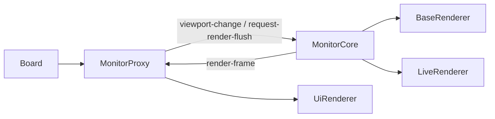

# 显示器组件文档

本文档描述当前显示器家族：`MonitorProxy`、`MonitorCore`。

## 概述

显示器层拆分为两类角色：

| 类             | 线程   | 职责                                                  |
| -------------- | ------ | ----------------------------------------------------- |
| `MonitorProxy` | UI     | Worker 模式下的视口代理，持有 DOM canvas              |
| `MonitorCore`  | Worker | Worker 侧视口、ChunkLoader、base 渲染与 live 合成核心 |

运行链路：

## 职责划分

### `MonitorProxy`

`MonitorProxy` 是 Worker 模式下的 UI 侧代理，职责包括：

- 创建并持有 DOM `canvas`（接收 Worker 合成帧）与 `uiCanvas`（overlay 层）
- 持有 `UiRenderer`
- 维护本地视口状态副本（`origin` / `zoom` / `width` / `height`）
- 发送 `viewport-change` 与 `request-render-flush` 到 Worker
- 接收 `render-frame` 后清空 canvas 并 `drawImage` 绘制 Worker 侧合成后的位图
- 暴露与 `Monitor` 兼容的挂载接口与坐标换算接口

### `MonitorCore`

`MonitorCore` 是 Worker 侧真实视口核心，职责包括：

- 持有 `ChunkLoader`
- 持有 `BaseRenderer` 与 `LiveRenderer`
- 根据视口变化同步 chunk buffer
- 在 OffscreenCanvas 上先渲染 base 层，再到 live 层合成 active 对象
- 输出仅包含 `liveBitmap` 的 `render-frame`

`LiveRenderer` 的渲染管线会在 `_afterClear` 阶段将 base 内容拷贝到 live 画布上，因此 `liveBitmap` 已是包含静态层与活动层的合成帧。`flushRenderFrame()` 在 `transferToImageBitmap()` 后把位图立即画回源 OffscreenCanvas，保持 Worker 侧底图完整，避免下一帧只剩脏区补绘。

## 渲染层分工

### Worker 侧

- `BaseRenderer`：静态对象渲染
- `LiveRenderer`：AOM 中对象渲染

### UI 侧

- `UiRenderer`：overlay 渲染
- `MonitorProxy`：Worker 合成帧的接收与显示

这意味着：

- base/live 的合成像素内容来自 Worker（`liveBitmap` 已合成两层）
- overlay 始终留在 UI 线程
- 视口刷新由 `MonitorProxy` 协调，Worker 只负责渲染与回帧

## 视口控制接口

两种显示器都围绕同一组语义工作：

- `setViewportPosition(position)`
- `setViewportScale(scale, screenAnchor?)`
- `setViewportScaleAroundCenter(scale)`
- `setViewportState({ origin?, zoom? })`
- `flushViewportRender()`
- `resizeRenderLayers(width, height)`
- `requestViewportUiRender()`

差异在于：

- `MonitorProxy` 通过消息驱动 `MonitorCore`
- `MonitorCore` 真正执行 base 渲染与 live 合成

## 设备图挂载

monitor 家族向业务层提供统一的挂载入口：

- `mountSubDAG(path, subDAGDefinition)`
- `mountWorkflow(path, workflow)`
- `unmountWorkflow(path)`
- `addEdge(fromPath, edgeName, toPath)`

这些接口都代理到 `Board.devicesDAG`，显示器本身不持有独立 DAG。

## Worker 模式下的 frame 协议

### UI → Worker

- `viewport-change`
- `request-render-flush`

### Worker → UI

- `render-frame`
  - `monitorId`
  - `frameId`
  - `liveBitmap`（已包含 base 层与 live 层的合成结果）

`viewport-change.force` 已接通到 `MonitorCore.onViewportChange()`，因此 `flushViewportRender()` 可以在视口参数未变化时仍强制产出新帧。

## 当前状态

- `MonitorCore` / `MonitorProxy` 已落地并接通
- demo 默认走 `MonitorProxy` 路径
- Worker 侧 base/live 合成后在 UI 侧单 canvas 显示，overlay 边界已稳定

## 相关文档

- [board-document.md](./board-document.md)
- [ui-renderer-document.md](../../renderer/docs/ui-renderer-document.md)
- [base-renderer-document.md](../../renderer/docs/base-renderer-document.md)
- [live-renderer-document.md](../../renderer/docs/live-renderer-document.md)
- [core-runtime-boundaries.md](../../../docs/core-runtime-boundaries.md)
