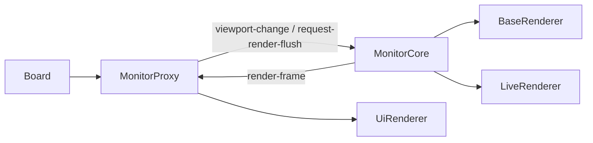

# 显示器组件文档

本文档描述当前显示器家族：`Monitor`、`MonitorProxy`、`MonitorCore`。

## 概述

当前显示器层已经拆分为三类角色：

| 类             | 线程   | 职责                                             |
| -------------- | ------ | ------------------------------------------------ |
| `Monitor`      | UI     | same-thread compat 视口实现                      |
| `MonitorProxy` | UI     | Worker 模式下的视口代理，持有 DOM canvas         |
| `MonitorCore`  | Worker | Worker 侧视口、ChunkLoader 与 base/live 渲染核心 |

因此“Monitor 文档”当前不只描述 `monitor.js` 本身，而是描述显示器家族的整体关系。

## 当前默认路径

demo 默认启用 Worker mode，因此常见运行链路是：

same-thread 模式下，`Board.createMonitor()` 直接返回 `Monitor`，不经过 `MonitorProxy` / `MonitorCore` 分拆链路。

## 职责划分

### `Monitor`

`Monitor` 是 same-thread compat 实现，职责包括：

- 维护视口状态（`origin`、`zoom`）
- 持有 `baseRenderer` / `liveRenderer` / `uiRenderer`
- 提供 `mountSubDAG()` / `mountWorkflow()` 便捷入口
- 管理 render layer 尺寸与视口刷新

### `MonitorProxy`

`MonitorProxy` 是 Worker 模式下的 UI 侧代理，职责包括：

- 创建并持有 DOM `baseCanvas` / `liveCanvas` / `uiCanvas`
- 持有 `UiRenderer`
- 维护本地视口状态副本（`origin` / `zoom` / `width` / `height`）
- 发送 `viewport-change` 与 `request-render-flush` 到 Worker
- 接收 `render-frame` 后先清空对应 canvas，再 `drawImage` 合成位图
- 暴露与 `Monitor` 兼容的挂载接口与坐标换算接口

### `MonitorCore`

`MonitorCore` 是 Worker 侧真实视口核心，职责包括：

- 持有 `ChunkLoader`
- 持有 `BaseRenderer` 与 `LiveRenderer`
- 根据视口变化同步 chunk buffer
- 在 OffscreenCanvas 上执行 base/live 渲染
- 输出 `render-frame`

`MonitorCore.flushRenderFrame()` 当前会在 `transferToImageBitmap()` 后把位图立即画回源 OffscreenCanvas，以保持 Worker 侧 base/live 底图完整，避免下一帧只剩脏区补绘。

## 渲染层分工

### Worker 侧

- `BaseRenderer`：静态对象渲染
- `LiveRenderer`：AOM 中对象渲染

### UI 侧

- `UiRenderer`：overlay 渲染
- `MonitorProxy`：位图合成与 DOM canvas 管理

这意味着：

- base/live 的真实像素内容来自 Worker
- overlay 始终留在 UI 线程
- 视口刷新由 `MonitorProxy` 协调，Worker 只负责渲染与回帧

## 视口控制接口

三种显示器都围绕同一组语义工作：

- `setViewportPosition(position)`
- `setViewportScale(scale, screenAnchor?)`
- `setViewportScaleAroundCenter(scale)`
- `setViewportState({ origin?, zoom? })`
- `flushViewportRender()`
- `resizeRenderLayers(width, height)`
- `requestViewportUiRender()`

差异在于：

- `Monitor` 直接驱动本地 renderer
- `MonitorProxy` 通过消息驱动 `MonitorCore`
- `MonitorCore` 真正执行 base/live 刷新

## 设备图挂载

无论 same-thread 还是 Worker mode，monitor 家族都向业务层提供统一的挂载入口：

- `mountSubDAG(path, subDAGDefinition)`
- `mountWorkflow(path, workflow)`
- `unmountWorkflow(path)`
- `addEdge(fromPath, edgeName, toPath)`

这些接口都代理到 `Board.devicesDAG`，显示器本身不持有独立 DAG。

## Worker 模式下的 frame 协议

### UI → Worker

- `viewport-change`
- `request-render-flush`

### Worker → UI

- `render-frame`
  - `monitorId`
  - `frameId`
  - `baseBitmap`
  - `liveBitmap`

`viewport-change.force` 已接通到 `MonitorCore.onViewportChange()`，因此 `flushViewportRender()` 可以在视口参数未变化时仍强制产出新帧。

## 当前状态

- `MonitorCore` / `MonitorProxy` 已落地并接通
- demo 默认走 `MonitorProxy` 路径
- Worker 侧 base/live 与 UI 侧 overlay 的边界已稳定
- same-thread `Monitor` 作为 compat 路径保留，测试与回归仍在使用

## 相关文档

- [board-document.md](./board-document.md)
- [ui-renderer-document.md](../../renderer/docs/ui-renderer-document.md)
- [base-renderer-document.md](../../renderer/docs/base-renderer-document.md)
- [live-renderer-document.md](../../renderer/docs/live-renderer-document.md)
- [core-runtime-boundaries.md](../../../docs/core-runtime-boundaries.md)
