# 层叠图示例

本文是 [tier-graph-document.md](./tier-graph-document.md) 的示例部分，以具体示例演示层叠图的工作方式。

先统一说明一下示例中的图示约定：

- 静态图用一整张图表示，动态图用多个子图表示。
- 被选择的对象用红色或蓝色表示。
- 图中不显示对象的层级关系以外的边。
- 单人意味着只有一个工具在操作，多人意味着有多个工具在操作，单对象或多对象指的是选择的对象数量。

## 示例一：单人单对象

### 原始状态

**静态图**如下：

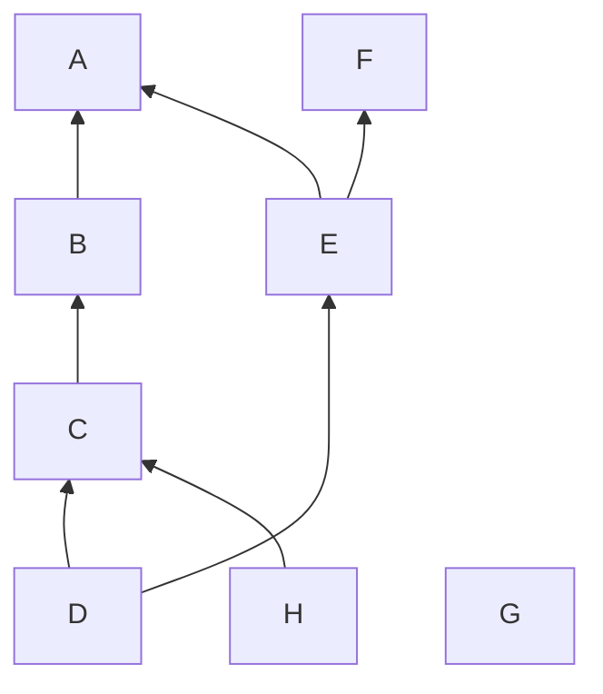

**动态图**为空。

### 选择 C

**静态图**不变，**动态图**如下：

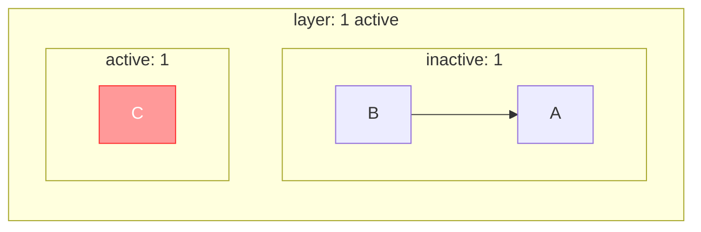

### 将 C 移到 E、F 之上，A 之下，应用修改

**静态图**如下：

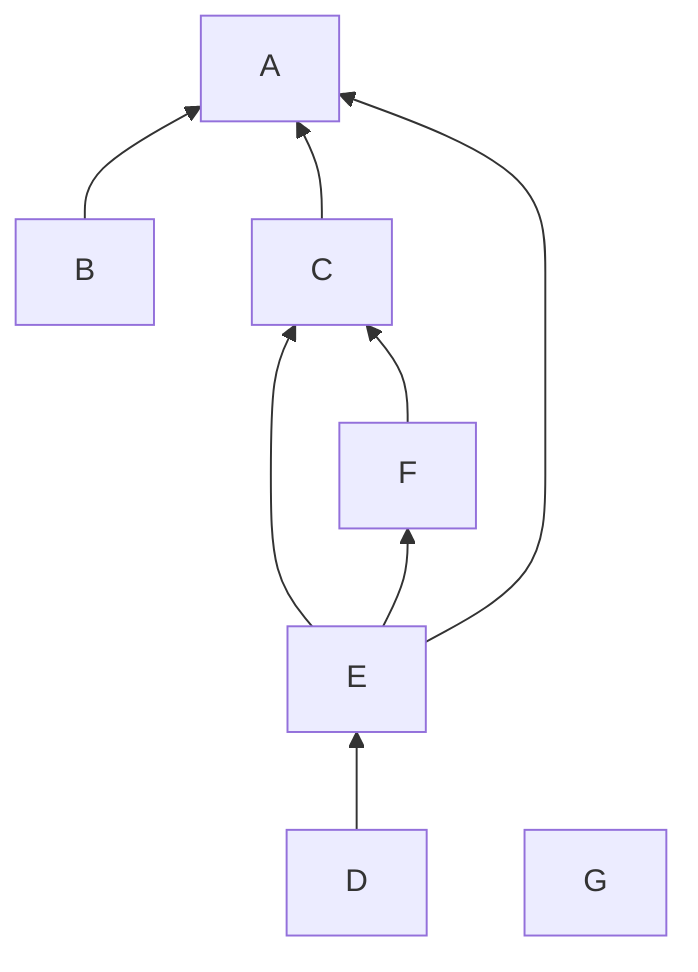

**动态图**为空。

## 示例二：单人多对象

### 原始状态

**静态图**如下：

**动态图**为空。

### 选择 C、E、H

现在，我们提取出来的子图 $\mathcal{G}$ 如下：

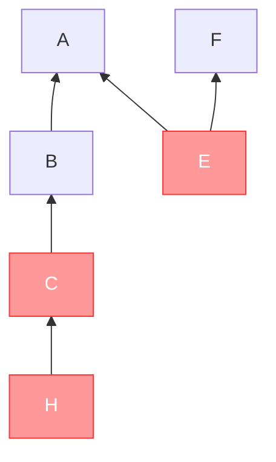

然后将其分层，$\mathcal{G}'$ 如下：

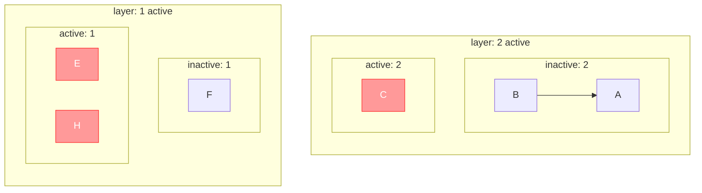

放入**动态图**中，**静态图**不变，**动态图**同上（已分层）。

### 将 E 移走，H 移到 D 上，C 移到 A、B 之下 F 之上，应用修改

**静态图**如下：

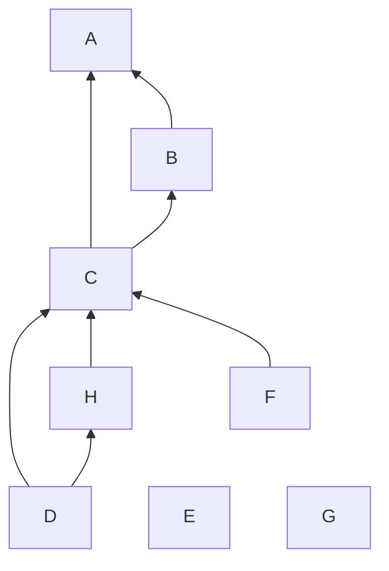

**动态图**为空。

## 示例三：双人同选不相干对象

### 原始状态

**静态图**如下：

**动态图**为空。

### 甲选择 C、E、H

**静态图**不变，**动态图**如下：

### 乙选择 G

**静态图**不变，**动态图**如下：

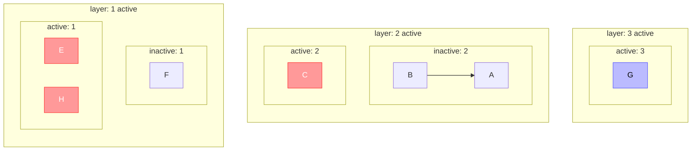

### 乙取消选择 G

**静态图**不变，**动态图**如下：

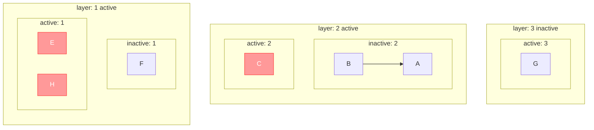

注意此时 G 还在**动态图**中，但该层变为 inactive。

### 甲将 C 移到 G 上，E、H 移开，应用修改

**静态图**变为：

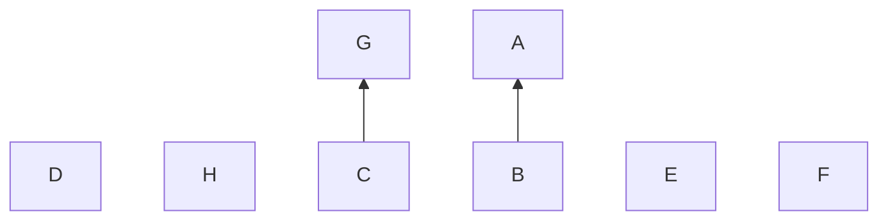

**动态图**为空。

## 示例四：双人同选相干对象·一

### 原始状态

**静态图**如下：

**动态图**为空。

### 甲选择 C

**静态图**不变，**动态图**如下：

### 乙选择 B

**静态图**不变，**动态图**如下：

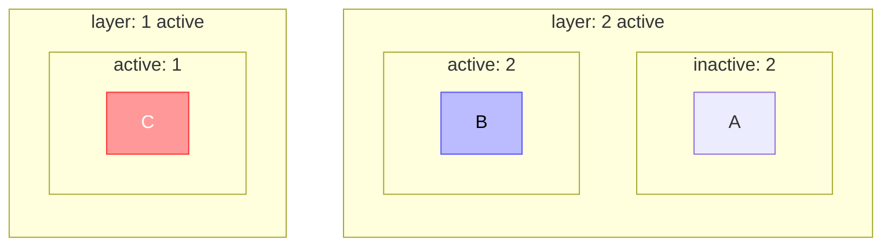

### 甲取消选择 C

**静态图**不变，**动态图**变为：

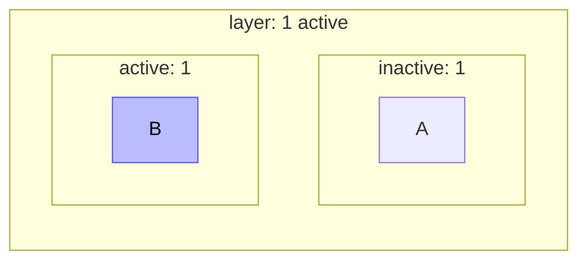

注意刚刚的 layer 1 被清除，而刚刚的 layer 2 变为了现在的 layer 1。

### 乙取消选择 B

**静态图**不变，**动态图**为空。

## 示例五：双人同选相干对象·二

### 原始状态

**静态图**如下：

**动态图**为空。

### 甲选择 C、E、H

**静态图**不变，**动态图**如下：

### 乙选择 D

**静态图**不变，**动态图**如下：

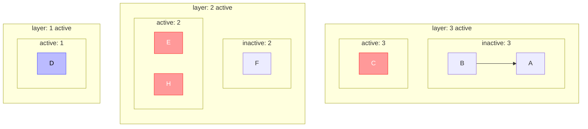

注意新层的位置。

### 甲、乙依次取消选择

**静态图**不变，**动态图**为空。
