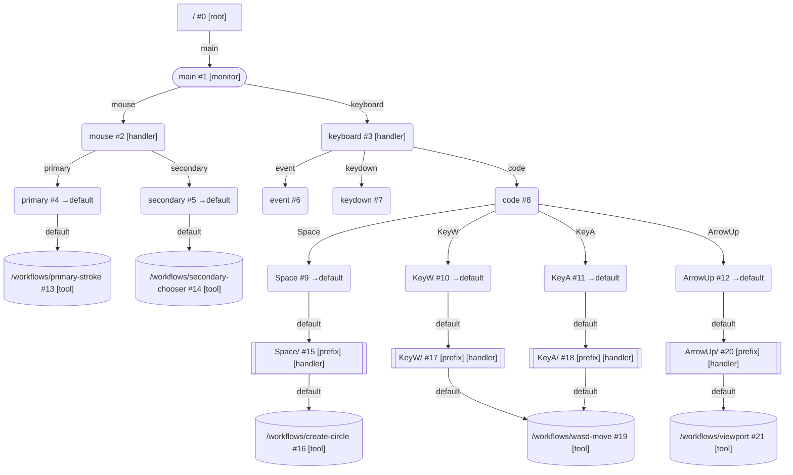

# 设备图示例

## 整体结构

下图展示一个典型白板 Demo 的完整 DevicesDAG 结构（使用 `dagToMermaid` 约定）：



## 简化示例

下面用一个简化的手写笔设备示例说明当前推荐写法：

- 输入子图用 `createSubDAG(rootPath)` 构建
- 根节点只做分流
- `defaultRoute` 只表示默认出边
- workflow 入口挂到 `/workflows/` 下，设备节点通过边连接到它

## 示例代码

```js
import { DevicesDAG, createSubDAG } from "../index.js";
import { Tool } from "../../tools/tool.js";

class PenTool extends Tool {
  process(signalPacket) {
    return {
      to: "",
      signals: signalPacket.signals,
    };
  }

  reset() {}
}

const builder = createSubDAG("/pen");
const root = builder.node().handler((packet) => ({
  to: "pointer",
  signals: packet.signals,
}));
const pointer = builder.node().defaultRoute("tool");
const toolNode = builder.node();

builder.edge("pointer", root, pointer);
builder.edge("tool", pointer, toolNode);

const penSubDAG = builder.build();

const dag = new DevicesDAG();
const tool = new PenTool();

dag.mountSubDAG("/monitor/main", penSubDAG);
dag.mountWorkflow("/monitor/main/workflows/pen", tool, {
  board,
  monitor,
});
dag.addEdge("/monitor/main/pen/pointer", "tool", "/monitor/main/workflows/pen");

const result = dag.dispatch({
  to: "/monitor/main/pen",
  signals: [{ type: "position", context: { value: { x: 10, y: 20 } } }],
});
```

## 处理过程

1. 输入先到 `/monitor/main/pen`
2. 根节点 handler 把包转发到相对路径 `pointer`
3. `/monitor/main/pen/pointer` 没有 handler，但声明了 `defaultRoute: "tool"`
4. 设备图沿 `tool` 出边把输入继续送到 workflow 入口，逻辑路由路径仍表现为 `/monitor/main/pen/pointer/tool`
5. `PenTool.process()` 消费最终信号包

## 带状态的写法

如果需要在设备节点和工具之间共享状态，建议显式写入节点 `state`：

```js
dag.mount("/monitor/main/pen", (packet, context) => {
  context.setNodeState("/monitor/main/pen", { activeStrokeId: 1 });
  return { signals: packet.signals };
});
```

工具侧再通过 `deviceContext.getNodeState` 或 `Tool.resolveNodeState()` 读取。

## 推荐做法

- 根节点做设备态更新与粗分流
- 子节点做稳定语义拆分
- workflow 入口统一挂在 `/workflows/` 下
- 跨节点共享状态走 `getNodeState` 和 `setNodeState`
- 边级信号转换使用 `createEdgePrefix`，不修改节点 handler

## 相关文档

- [设备图](./devices-dag-document.md)
- [工具基类](../../tools/tool-document.md)
- [Core 输入流](../../docs/core-input-flow.md)
