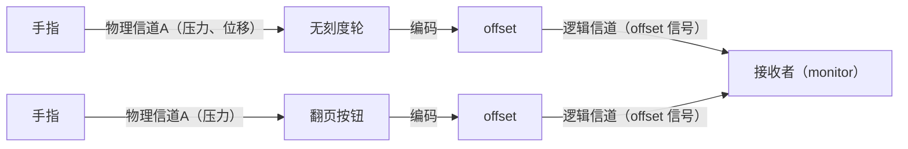
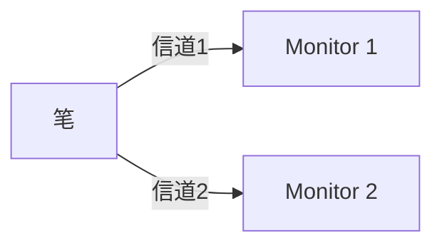
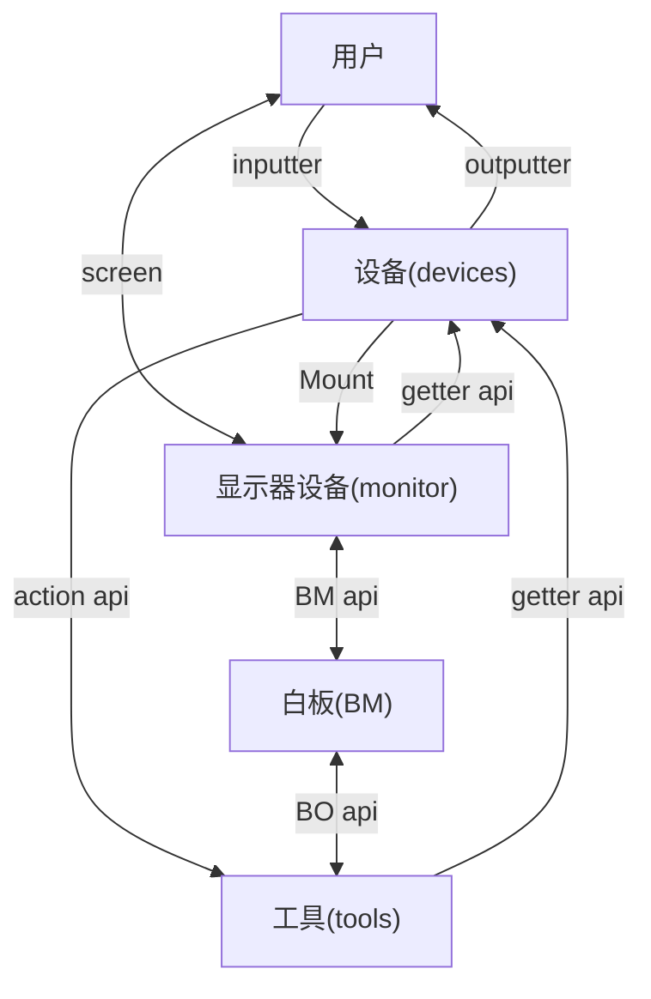

# 设备文档

本文档提供白板中设备的概述。

## 设备的定义

设备是用户与白板交互的媒介。通过设备，用户可以获取和改变白板上的状态及对象信息。

设备是一些 inputters 和 outputters 的集合。比如键盘可以被抽象为 104 个按键的集合。一支 S-Pen 可以被抽象为一个二维位置传感器、一个压力传感器、一个角度传感器和一个按键的集合。尽管位置、压力和角度都是由屏幕获取的，但它们都属于这支 S-Pen。有的设备是没有对应实物的，如用于翻页的虚拟滑轮。它可以被抽象为一个一维位置传感器和一个数字输出控件的集合。位置传感器用来接收用户的滑动翻页操作，而数字输出控件用来给用户展示当前的页码。

设备从 GUI 的 DOM 逻辑中（或蓝牙、网络等）获取用户输入，并将数据通过工具传入 Core 进行处理，而 Core 也可能会改变设备的一些输出数据，再由 GUI 显示（如显示器设备）。

## 设备哲学

### 设备的分裂

设备可分与否取决于需求（**信道**）和编码方式（**信号**）。

所有的信息都可以被编码，因此你可以用一个按钮完成一切输入，用一盏灯接收所有输出。那么设备存在的意义是什么呢？或者还有什么设备不可分呢？

一个信道接收或发送一种信号。根据需要，我们可以设计一套信道，用于接收或发送各种信号。假设两个不同的设备共用一个信道，则可以视为一个设备。

上图中的物理信道是客观存在的，而逻辑信道是人为规定的。如果某设备占据多个逻辑信道，则按信道，该设备可分。

上图展示了一只笔分裂成了两个笔设备。

### 设备的状态指示

设备有两个状态——本原状态和关联状态。当然，从函数式的角度来看，本原状态就是它的状态，而关联状态更多的是一种副作用。

### 设备间通信

严格来讲，设备间是不可以直接通信的，它们只能通过显示器设备来间接通信。比如有一个按钮设备，

## 各设备

### 显示器设备

显示器设备是一个特殊的设备，它可以下辖其它的设备。显示器设备没有输入传感器，而它会输出一个 `ReactElement`。这个 `ReactElement` 内有一个 `canvas`，还有它下辖的设备的其它 `React` 控件。

### 手指设备、笔设备

手指设备、笔设备等是日常生活中常见的绘画设备。它们都会有一个触摸传感器和一个二维位置传感器。对于笔设备，它还可能会有一个按钮（如 S-Pen）、一个角度传感器、一个压力传感器，甚至一个额外的二维位置传感器（如 Apple Pencil 背面的橡皮）。

这里需要注意的是，现实生活中的“手指”“笔”等是没有位置传感器的，是屏幕完成了位置的识别。但在 HWB 中，由于这个位置是属于这根“手指设备”，这支“笔设备”的，所以我们将位置传感器归到这两个设备中（详见[设备哲学](#设备哲学)）。

## 与现实中的设备的区别

HWB 中的设备与现实世界大相径庭。

根据 [wikipedia](https://en.wikipedia.org/wiki/Device)，设备在电子、计算领域有以下含义（部分）：
- 专用于某种任务的机械
- 计算机、手机、平板
- Unix 中的设备文件
- 电子元件
- 小工具
- 外设硬件

而在 HWB 中，设备是用户与白板交互的媒介（详见[设备的定义](#设备的定义)），只要这个东西可以与白板交互，它就可以是一个设备，并抽象出 inputter 和 outputter。

明白了设备概念的区别后，我们再来看看现实世界中的物件与 HWB 中的设备的主要差别：

- 现实世界中的物件可以不与 HWB 中的设备一一对应。比如“手指”，在现实中你只有十根，但在 HWB 中，可能每触摸一次就会多注册一根新的“手指设备”，导致“手指设备”的总数不止十根。
- 现实世界中的物件可以不止是一个设备。比如“S-Pen”，在白板上绘画时使用的就是“S-Pen 设备”。但当你用现实的“S-Pen”划动屏幕上的“虚拟滑轮设备”时，白板会认为你在使用“虚拟滑轮设备”而不是“S-Pen”设备。
- 现实世界中的物件只有在与白板交互时才会被视为设备。比如“鼠标”，其实鼠标指针是一直注册在屏幕上的，但是这个设备不会一直激活，即不会一直调用其 `move` 方法。只有当鼠标键按下时，才会调用这些方法。

