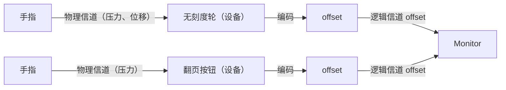
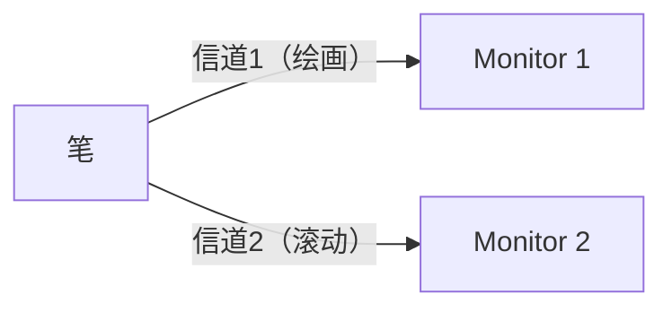
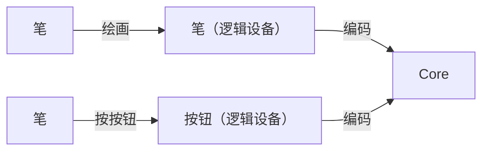
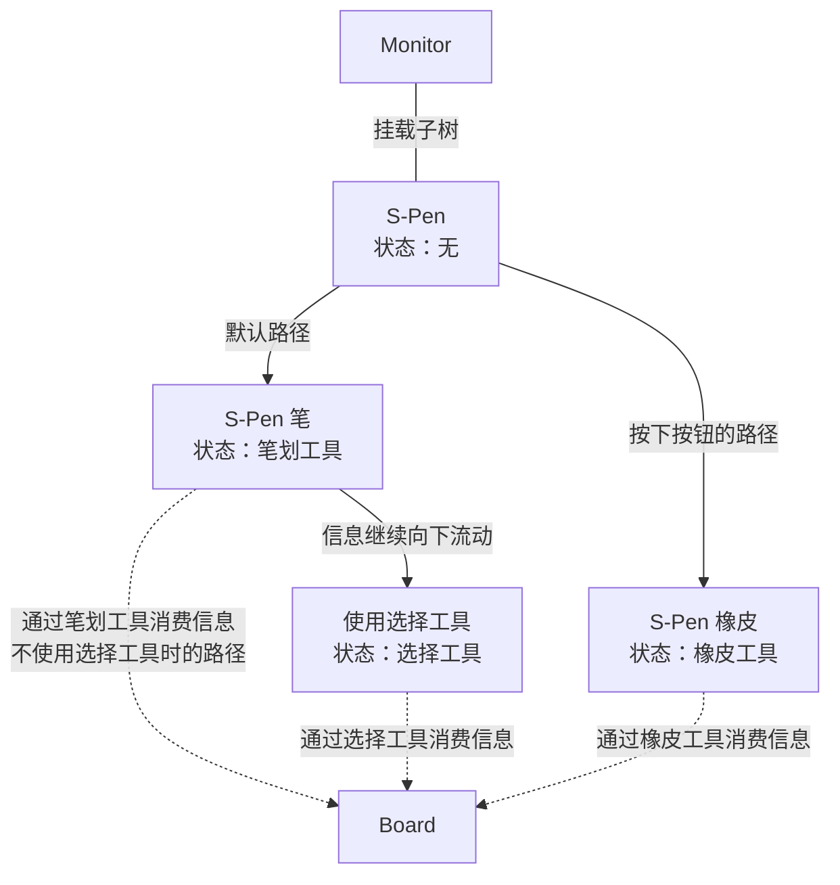

# 设备文档

本文档描述 HoundWhiteboard 中设备的概念定义、分类哲学和状态模型。

## 设备的定义

在当前架构里，设备应理解为挂载在 Monitor 下的一棵**设备子树**。

也就是说：

- 单个节点只是信号处理单元。
- 一组节点组成的子树，才共同表达一个设备。
- 设备的状态，也被拆散并压缩在这些节点之间。

设备由若干 **inputter**（输入信道）和 **outputter**（输出信道）组成：

| 设备示例   | inputter                   | outputter                |
| ---------- | -------------------------- | ------------------------ |
| 键盘       | 104 个按键（按键流）       | —                        |
| S-Pen      | 二维位置、压力、角度、按键 | —                        |
| 虚拟翻页轮 | 一维滑动                   | 当前页码显示（一维数字） |

数据流向是：DOM 事件（或蓝牙/网络）→ 设备节点 → Core；Core 的反馈再由 Monitor 渲染。

设备在 Core 里体现为一棵挂载在 Monitor 上的**子树**，见[设备树文档](./devices-tree-document.md)。

设备子树定义对象先声明节点列表，再为这些节点生成对应的处理器；真正挂到设备树节点上的，只有处理器。

例如，S-Pen 设备就是挂载在 Monitor 上的一棵子树。树上的节点处理位置、压力等输入信号，再把这些信号交给笔划工具、橡皮工具等后续处理单元消费。

真正的输出信号是 Core -> UI 的。比如“显示页数”设备不会把页码直接写进 UI，而是在白板当前页变更时输出“当前页数”信号，再由 UI 消费这个信号并完成显示。

当前实现里，Core 端内部通过成员函数生成节点处理器，再由节点处理器传递信号包。某个设备子树中的节点收到包后，会执行自己挂载的处理器，并返回下一个信号包。

## 设备哲学

### 设备是否可分

设备可分与否取决于**信道**（Channel）的划分——一个信道携带一种信号。共用同一套信道的输入源可视为同一个设备；占据多个不同信道的输入源则可按信道拆分为多个设备。

物理信道客观存在，逻辑信道由开发者规定。两个手势共用同一个逻辑信道（offset），可视为同一设备。

同一支物理笔可按信道拆分为两个逻辑设备。

信号会以事件驱动的方式从 UI 传至 Core。

### 设备的状态指示

设备有两类状态：**本原状态**和**关联状态**。

**本原状态**是设备自身持有的 UI 状态，如动画进度、悬停高亮、按键按下效果等。从函数式角度看，这是设备的"真实状态"——由 React `useState` / `useReducer` 管理，数据流是单向的。

**关联状态**是 OOP 意义下挂载在设备实例上的成员变量（如 `this.isDrawing`、`this.lastPoint`）。本质上，它是外部副作用；也包括设备子树各节点共享或分散持有的状态路由信息。

### 设备的状态压缩

设备的本原状态由 UI 处理，而其关联状态由 Core 处理。

处理方式，就是将非工具的状态压缩到[设备树](./devices-tree-document.md)的节点里。这样，设备变化的状态就化成了设备子树中的不同节点，只存在于现实设备的驱动程序里。

比如现在有支 S-Pen 挂载到了 Monitor 上，其设备树的一部分长这样：

上图中节点 S-Pen 以下以实线连接的部分就是 S-Pen 设备的子树。挂载设备，就是把这棵子树展开为若干节点处理器，再接到 Monitor 根节点上。

设备树本身的节点、路径与分发规则，见[设备树文档](./devices-tree-document.md)。

更复杂的设备也会带来更复杂的状态（如触摸屏的多指聚合），但只要节点划分得当，就可以使这些状态显化并封存到节点中了。

### 设备间通信

设备间不可直接通信，只能通过 Monitor 组件间接传递信息。例如，"橡皮设备"的清除范围需要依赖 Monitor 暴露的 `screenToPage` 来转换坐标，再交给工具处理——设备本身对其他设备无感知。

在当前代码实现中，这种“间接传递”分成两段：

- Core 端内部由设备节点成员函数直接处理并转发信号包。
- 只有当信号跨 Core-UI Interface 边界时，才进入 EventBus 这类总线通道。

因此，设备既不是直接互调，也不是把所有传输都塞进总线。

## 各设备举例

### 触摸屏设备、笔设备

触摸屏设备、笔设备是最常见的绘画设备。笔设备还可能携带按键（S-Pen）、倾斜角（Apple Pencil）、橡皮端（Apple Pencil 背面）等额外信道。

注意：现实中"手指"和"笔"本身没有位置传感器，位置由屏幕识别。HWB 中按信道归属，将位置传感器划归这两个设备（见[设备哲学](#设备哲学)）。

## 与现实中的设备的区别

HWB 中的"设备"与硬件意义上的设备差异显著——任何可与白板交互的东西都可以是一个设备（虚拟设备亦然）。

现实物件与 HWB 设备的主要差异：

- **非一一对应**：一根手指触摸一次就可注册一个新的"手指设备"，总数不受现实手指数量限制。
- **一物多设备**：S-Pen 在白板上绘画时是"笔设备"，但拨动虚拟滑轮时就切换为"滑轮设备"。
- **按需激活**：鼠标指针始终注册在屏幕上，但只有按下鼠标键时设备才被激活并处理事件。
