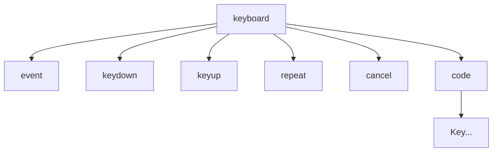

# 键盘设备文档

本文档描述 HoundWhiteboard 当前阶段的键盘设备定义、路由模型与使用边界。

## 概述

键盘设备是挂载在某个 Monitor 下的一棵设备子树。它处理的不是“所有来自键盘的按键”，而是已经被宿主层判定为设备语义的那部分键盘输入。

当前建议只有两类输入进入键盘设备：

- 该输入直接操作 Monitor
- 该输入最终会被工具消费

因此，键盘设备的关键不在“怎么监听键盘”，而在“哪些键盘事件值得进入设备树”。

## 不属于键盘设备的输入

下面这些输入当前不应进入键盘设备：

- `Command+S` / `Ctrl+S` 保存
- 切换工具、打开 UndoTree、打开设置面板等应用级快捷键
- 与 Monitor 操作和工具消费无关的全局热键

这些行为应直接留在宿主 UI 层处理。

## 当前子树结构

当前实现见 [keyboard-device.js](../keyboard-device.js)。设备根路径下会展开出以下节点：

- `/event`：所有进入设备树的键盘事件都会先转发到这里
- `/keydown`：非重复按下事件
- `/keyup`：抬起事件
- `/repeat`：长按重复事件
- `/cancel`：宿主强制中断当前键盘交互，如 Monitor 失焦
- `/code/<KeyCode>`：按键专属挂载锚点，会接收该键位改写后的设备语义信号
- `/code/<KeyCode>/tool`：该键位下通过运行时 `mount` 事件追加的独立工具节点

若通过 `nodeConfigs` 为某些键位声明了绑定，这些 `/code/<KeyCode>` 节点就不再只是“挂工具的锚点”，还可以继续把信号改写并转发到别的公共节点。

更一般地说，现在应优先把它理解成 `DevicesTreeNode` 的通用节点配置：只要是这棵设备子树里的节点，无论是 `/event`、`/keydown`、`/cancel` 还是 `/code/<KeyCode>`，都可以声明自己的 `rewritePacket` 或 `processor`。

示意图如下：



这里的职责边界是：

- 键盘设备只负责产出节点定义
- `DevicesTreeNode` 负责执行节点级 `rewritePacket` 与 `processor`
- `nodeConfigs` 是设备侧声明节点行为的唯一配置入口

这种结构把“通用键盘语义”和“具体绑定键位”拆开了：

- 前者适合 Monitor 级操作，如统一处理视口导航键
- 后者先把原始按键事件改写成工具语义，再交给工具节点消费

当前键盘设备会在根节点把原始键盘信号改写为更稳定的工具信号，并路由到对应的 `/code/<KeyCode>` 挂载锚点：

- 首次 `keydown` 改写为 `trigger`
- `keyup` / `end` 改写为 `release`
- `cancel` 改写为 `cancel`

因此，工具通常不应再直接判断具体键位，也不应再假设自己接收到的是原始 `keydown`。

## 聚合模式

键盘设备现在正式支持一种“按键节点改写后汇流”的模式：

- 某个按键先在自己的 `/code/<KeyCode>` 节点上把信号改写成设备语义信号
- 然后该节点把结果继续转发到一个公共锚点
- 公共锚点下只挂一个工具节点，用来统一消费这批聚合后的信号

这适合 `WASD`、方向键、数字热键组这类“多个键都在驱动同一工具”的场景。

例如：

- `KeyW` 把 `trigger` 改写为 `position: {x: 0, y: -1}`，再转发到 `../../move`
- `KeyA` 把 `trigger` 改写为 `position: {x: -1, y: 0}`，再转发到 `../../move`
- `KeyS`、`KeyD` 同理
- 最终 `/move/tool` 只需要消费统一的 `position` 信号，而不需要知道具体是哪一个键发来的

对应配置形态如下：

```javascript
const keyboardDevice = createKeyboardDevice({
  nodeConfigs: {
    "/code/KeyW": {
      rewritePacket(packet) {
        const signals = packet.signals
          .filter((signal) => signal.type === KEYBOARD_DEVICE_SIGNAL_TYPES.TRIGGER)
          .map(() => ({
            type: "position",
            context: {
              value: { x: 0, y: -1 },
              code: "KeyW",
            },
          }));

        return signals.length === 0 ? [] : { to: "../../move", signals };
      },
    },
  },
});

monitor.mountDevice("/keyboard", keyboardDevice);

board.signalsEventBus.emit("mount", {
  to: `/${monitor.monitorId}/keyboard/move`,
  tool,
});
```

这里的重点是：

- 具体键位节点负责“把键盘事件翻译成工具真正关心的语义”
- 公共节点负责“给同一类工具提供稳定的接入点”
- 工具不再关心 `KeyW`、`KeyA` 这些具体键位，只关心 `position` 这类统一信号

无论是 `/code/<KeyCode>` 还是别的节点，都统一通过 `nodeConfigs` 声明，因为它直接映射到通用 `DevicesTreeNode` 配置。

`nodeConfigs` 负责的是设备挂载时的初始节点配置。若设备已经挂到树上，后续要动态修改某个键位节点，更通用的做法是走事件总线，例如：

```javascript
board.signalsEventBus.emit("configure", {
  to: `/${monitor.monitorId}/keyboard/code/KeyW`,
  options: {
    rewritePacket(packet) {
      const signals = packet.signals
        .filter((signal) => signal.type === KEYBOARD_DEVICE_SIGNAL_TYPES.TRIGGER)
        .map(() => ({
          type: "position",
          context: {
            value: { x: 0, y: -1 },
            code: "KeyW",
          },
        }));

      return signals.length === 0 ? [] : { to: "../../move", signals };
    },
  },
});
```

也就是说，`nodeConfigs` 是“初始声明”，而动态改写应通过 `configure` 事件落到已经挂载的 `DevicesTreeNode` 上。

当前 `configure` 的清空语义也已经固定：

- `defaultPath: null` 或空串表示取消默认下游
- `rewritePacket: null` 表示移除节点改写器
- `processor: null` 表示移除节点处理器

## 状态模型

当前键盘设备维护两类最小状态：

- `activeKeys`：当前仍处于按下状态的键集合
- `lastEvent`：最近一次进入设备树的键盘事件快照

这两类状态都属于设备的关联状态，目的是辅助路由与调试，而不是表达宿主 UI 的全部快捷键系统。

## 输入包约定

当前建议的最小输入包如下：

```javascript
{
  to: "/monitor/keyboard",
  signals: [
    {
      type: "keydown",
      context: {
        code: "Space",
        key: " ",
        repeat: false,
        ctrlKey: false,
        shiftKey: false,
        altKey: false,
        metaKey: false,
      },
    },
  ],
}
```

抬起时发送 `keyup`，失焦或宿主中断时发送 `cancel`。

## 最小使用方式

```javascript
const keyboardDevice = createKeyboardDevice();

monitor.mountDevice("/keyboard", keyboardDevice);

board.signalsEventBus.emit("mount", {
  to: `/${monitor.monitorId}/keyboard/code/Space`,
  tool,
});
```

此时宿主只需把目标 Monitor 的 `keydown` / `keyup` 事件编码后发到 `/${monitorId}/keyboard`，设备树就会把 `Space` 改写为 `trigger` / `release` / `cancel`，并送到 `/code/Space`。如果之前已经通过 `mount` 事件在该锚点下追加了工具节点，信号就会继续落到 `/code/Space/tool` 交给工具消费。

## 设计约束

- 键盘设备不负责定义应用级快捷键系统
- 键盘设备不负责决定一个按键是否应该被某个工具消费
- 键盘设备负责把原始按键信号改写为稳定的设备语义，再交给工具节点
- 用户绑定关系与工具挂载关系应由更上层模块通过 `mount` / `umount` 事件维护，键盘设备只负责状态更新与树上路由

这样可以保持设备层与应用命令层解耦。

## 相关文档

- [device-document.md](./device-document.md)
- [devices-tree-document.md](./devices-tree-document.md)
- [signal-document.md](./signal-document.md)
- [../../docs/core-input-encoding.md](../../docs/core-input-encoding.md)
- [../../components/docs/monitor-document.md](../../components/docs/monitor-document.md)
