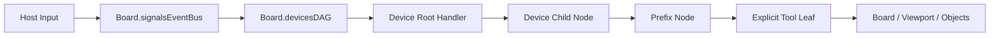

# Core 输入流

## 概述

当前 Core 输入流已经收敛为一条单 DAG 链路：Board 持有唯一 DevicesDAG，Viewport 只负责把设备和工具挂到这张图上。

输入在 Core 内的最短路径是：

- 宿主层识别目标 Viewport
- Board.signalsEventBus 收到输入事件
- Board.devicesDAG.dispatch() 从根节点开始逐段下传
- 设备节点 handler 做状态更新与分流
- 修饰节点按职责执行记录、参数注入、路由、状态机或回调注入
- 显式工具叶子消费最终信号

本文涉及的模块运行边界见 [core-runtime-boundaries.md](./core-runtime-boundaries.md)。

## 关系图



## 关键边界

Board 负责：

- 拥有唯一 DevicesDAG 实例
- 监听 input、mount、umount 事件
- 把挂载或分发所需的固定上下文传给 dispatch、mountWorkflow、mountSubDAG

Viewport 负责：

- 作为某个视口边界提供 mountSubDAG、mountWorkflow、unmountWorkflow 便捷入口
- 通过 board.devicesDAG 代理设备与工具挂载
- 不再持有独立设备图实例

DevicesDAG 负责：

- 根到叶的逐段下传路由
- defaultRoute 自动继续
- append-only 累积上下文
- 节点 state
- 卸载钩子

修饰节点负责：

- 记录和监视信号
- 注入或改写信号字段
- 路由到当前活动 child
- 维护局部状态机
- 通过累积上下文注入回调，把局部完成信号传给下游节点

Tool 负责：

- 消费稳定设备信号
- 修改白板或对象状态
- 通过节点 state 与累积上下文读取相邻链路共享信息

## 输入进入 Core 的前提

不是所有 DOM 输入都会进入 Core。

宿主层需要先明确两件事：

- 这个输入属于哪个 Viewport
- 这个输入应该编码成哪种设备语义

只有完成归属判断之后，输入才会以 SignalPacket 形式进入 Board.signalsEventBus。

## 设备阶段

设备根节点通常承担两类职责：

- 更新设备内部状态，例如 activeTouches、activeKeys、按钮按下态
- 把输入分流到更稳定的子节点语义

例如：

- mouse 根节点可把输入分到 pointer、primary、secondary、wheel
- keyboard 根节点可把输入分到 event、keydown、keyup、repeat、cancel、code/<Key>
- touchscreen 根节点可维护 activeTouches 并输出 contacts

## 修饰节点与工具阶段

业务 workflow 统一挂载到 `/<viewportId>/workflows/` 路径下，通过有向边与设备节点连接：

- `/<viewportId>/workflows/primary-stroke`（鼠标主笔画 workflow）
- `/<viewportId>/workflows/wasd-move`（WASD 坐标 workflow）
- `/<viewportId>/workflows/create-circle`（随机圆 workflow）

设备节点通过 `addEdge` 把信号路由到 `/workflows/` 下的 workflow 节点；
设备叶节点 `defaultRoute` 与 mount edge 统一为 `"default"`。

```
/<viewportId>/mouse/primary --"default"--> /<viewportId>/workflows/primary-stroke
/<viewportId>/keyboard/code/KeyW  --"default"--> [prefix] --"default"--> /<viewportId>/workflows/wasd-move
/<viewportId>/keyboard/code/Space --"default"--> [prefix] --"default"--> /<viewportId>/workflows/create-circle
```

如果某条链路需要"先前置处理，再交给 workflow"，这些修饰节点应作为 workflow 子树的一部分放在 `/workflows/` 下。

## 信号转换

所有信号转换（如键盘 trigger → mouse position）通过 mount 时的 `edge.prefix` 注入完成，不再使用 configure 事件。

mount 事件声明 device 节点 → workflow 之间的边时，可通过 `prefix` 字段插入一个单源单汇子图（通常是单个 `createEdgePrefix` 节点）。prefix 内的 handler 负责将设备信号转换为 workflow 可消费的信号模型。

handler 不应显式指定 `to:`——路由依靠 `defaultRoute: "default"` 自动完成。

## 当前建议

- 设备根节点做粗分流，复杂业务逻辑交给工具
- 需要记录、注入、路由、状态机时，优先引入修饰节点
- workflow 统一挂到 `/<viewportId>/workflows/` 下，通过 `addEdge` 与设备节点连接
- 父子工具共享状态时，显式写入节点 state；短程只读协作则通过累积 context 追加
- Viewport 侧只做挂载代理，不持有第二棵树

## 相关文档

- [设备图](../ui/devices-dag/docs/devices-dag-document.md)
- [对象创建工具](../ui/tools/creator/docs/object-creator-document.md)
- [对象选择工具](../ui/tools/chooser/docs/object-chooser-document.md)
- [对象修改工具](../ui/tools/modifier/docs/object-modifier-document.md)
- [阶段性稳定接口](./core-stable-interfaces.md)
