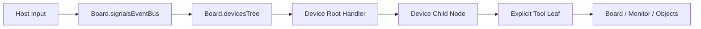

# Core 输入流

## 概述

当前 Core 输入流已经收敛为一条单树链路：Board 持有唯一 DevicesTree，Monitor 只负责把设备和工具挂到这棵树上。

输入在 Core 内的最短路径是：

- 宿主层识别目标 Monitor
- Board.signalsEventBus 收到输入事件
- Board.devicesTree.dispatch() 开始按路径分发
- 设备节点 handler 做状态更新与分流
- 显式工具叶子消费最终信号

## 关系图

## 关键边界

Board 负责：

- 拥有唯一 DevicesTree 实例
- 监听 input、mount、umount、configure 事件
- 把运行时上下文传给 dispatch、mountTool、mountDevice

Monitor 负责：

- 作为某个视口边界提供 mountDevice、mountTool、unmountTool 便捷入口
- 通过 board.devicesTree 代理设备与工具挂载
- 不再持有独立设备树实例

DevicesTree 负责：

- 节点路由
- defaultChild 自动继续
- 节点 state
- 卸载钩子

Tool 负责：

- 消费稳定设备信号
- 修改白板或对象状态
- 通过节点 state 与相邻链路共享上下文

## 输入进入 Core 的前提

不是所有 DOM 输入都会进入 Core。

宿主层需要先明确两件事：

- 这个输入属于哪个 Monitor
- 这个输入应该编码成哪种设备语义

只有完成归属判断之后，输入才会以 SignalPacket 形式进入 Board.signalsEventBus。

## 设备阶段

设备根节点通常承担两类职责：

- 更新设备内部状态，例如 activeTouches、activeKeys、按钮按下态
- 把输入分流到更稳定的子节点语义

例如：

- mouse 根节点可把输入分到 pointer、primary、secondary、wheel
- keyboard 根节点可把输入分到 event、keydown、keyup、repeat、cancel、code/<Key>
- touchscreen 根节点可维护 activeTouches 并输出 contacts

## 工具阶段

业务工具现在要求挂在显式叶子路径上，例如：

- /mouse/pointer/tool
- /keyboard/tools/move/tool
- /keyboard/code/KeyW/tool

这带来两个直接收益：

- 工具归属路径稳定，不依赖隐式挂载约定
- creator、chooser、modifier 可以通过相邻节点 state 做显式 handoff

## 动态配置

运行中的输入链路允许通过 configure 事件更新节点配置，最终落到 DevicesTree.configureNode(path, options)。

当前允许动态调整的内容是：

- handler
- defaultChild
- umount

其中 handler: null 与 defaultChild: "" 表示显式清空。

## 当前建议

- 设备根节点做粗分流，复杂业务逻辑交给工具
- 工具一律显式挂到 /tool 叶子
- 父子工具共享状态时，显式写入节点 state
- Monitor 侧只做挂载代理，不持有第二棵树

## 相关文档

- [设备树](../devices/docs/devices-tree-document.md)
- [工具基类](../tools/tool-document.md)
- [阶段性稳定接口](./core-stable-interfaces.md)
