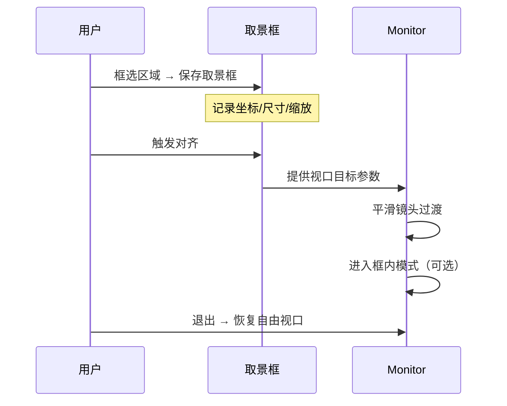

# 取景框（frame）

## 概述

取景框是白板上的一块矩形命名区域，用于标记镜头（monitor 视口）可以对齐的目标位置。

在白板自由布局的场景下，取景框提供了一层可选的"锚点结构"：用户可以将画布上某块内容框选为一个取景框，记录该区域的视口中心与缩放级别，后续通过镜头对齐快速定位到该区域。

取景框本身不改变白板的内容排布方式——它只是叠加在自由布局之上的位置标记，不约束内部内容的编辑行为。

## 术语约定

- **取景框**：一个矩形区域对象，记录坐标、尺寸、标题、方向等元信息，用于镜头对齐。
- **镜头**：monitor 的当前视口，包含视口中心坐标与缩放级别。
- **镜头对齐**：将 monitor 视口平滑过渡到某个取景框所记录的位置与缩放。
- **框内模式**：镜头锁定在取景框边界内的浏览状态。
- **框外模式**：镜头自由移动，不受取景框约束的状态。

## 属性

每个取景框记录以下信息：

| 属性        | 类型     | 含义                                     |
| ----------- | -------- | ---------------------------------------- |
| `id`        | `string` | 取景框唯一标识                           |
| `title`     | `string` | 取景框标题，供侧边栏列表与导航使用       |
| `x`, `y`    | `number` | 取景框在白板坐标系中的左上角坐标         |
| `width`     | `number` | 取景框宽度                               |
| `height`    | `number` | 取景框高度                               |
| `zoom`      | `number` | 推荐缩放级别，镜头对齐时应用             |
| `order`     | `number` | 在所属导引链中的顺序索引（可选）         |
| `direction` | `string` | 方向标记，用于指示浏览方向（如 `"ltr"`） |

## 职责边界

取景框负责：

- 记录一个矩形区域的位置与尺寸。
- 提供镜头对齐所需的目标视口参数（中心点 + 缩放）。
- 作为导引链的基本节点，参与序列浏览。

取景框不负责：

- 改变白板内部对象的布局或编辑行为。
- 约束用户在框外区域的自由操作。
- 自身执行镜头动画——对齐动作由 monitor 或导引链驱动。

## 取景框与 monitor 的关系

取景框与 monitor 的交互路径：

1. 用户在自由画布上选定一块区域，保存为取景框。
2. 取景框记录该时刻的视口中心坐标与推荐缩放级别。
3. 用户触发对齐操作时，monitor 读取取景框参数，执行平滑镜头过渡。
4. 镜头对齐后，可进入框内模式——视口边界受取景框约束，平移不超出框范围。
5. 退出框内模式后，恢复自由视口控制。

## 取景框与导引链的关系

取景框是导引链的基本组成单元。一个导引链由若干取景框（或取景框模板）按顺序串联而成。详见 [导引链文档](./guiding-chain-document.md)。

## 取景框在设备图中的角色

取景框本身是纯数据对象，不进入 DevicesDAG。它在架构中处于数据层：

- 取景框元信息（坐标、尺寸、缩放）存储在 `board.frames` 中，作为白板级数据。
- Navigator tool 通过 `board` 引用读取取景框参数，计算镜头对齐目标。
- Monitor 的 `animateTo()` 接收取景框的视口中心与缩放值，执行过渡动画。
- 取景框列表的增删改由宿主 UI 直接操作 `board.frames`，不经过 DAG。

这种设计保持取景框作为纯位置标记的语义，不参与输入路由和信号处理。

## 关键设计点

### 框内模式与框外模式

框内模式是取景框的核心交互特性之一。进入框内模式后：

- monitor 视口的平移范围被限制在取景框矩形内。
- 缩放操作被限制在取景框的推荐缩放附近（可配置上下限）。
- 用户仍可在框内自由编辑对象。

框外模式则是标准的自由视口行为。两种模式的切换通过镜头对齐/退出操作完成。

### 取景框不参与对象层级

取景框不是白板对象（BasicObject 的子类），不进入区块静态图或活动对象管理器。它只存储元信息，不参与渲染、选中、分层等对象生命周期。

若后续需要在白板画布上视觉化显示取景框边界（如半透明覆盖层），应通过 UiRenderer 的 provider 扩展口实现，而非将取景框注册为白板对象。

### 取景框的持久化

取景框数据属于白板级元信息，应与白板文件一起序列化存储。存储格式建议为取景框列表，与导引链结构并列保存。

## 使用场景

1. **标记关键区域**：在大画布上框选出若干重要内容块，方便后续快速定位。
2. **序列浏览的基础节点**：将多个取景框串联为导引链，支持线性浏览。
3. **演示模式的镜头锚点**：在全屏演示模式下，取景框作为镜头切换的目标位置。

## 相关文档

- [取景框模板文档](./frame-template-document.md)
- [导引链文档](./guiding-chain-document.md)
- [Monitor 文档](../../components/docs/monitor-document.md)
