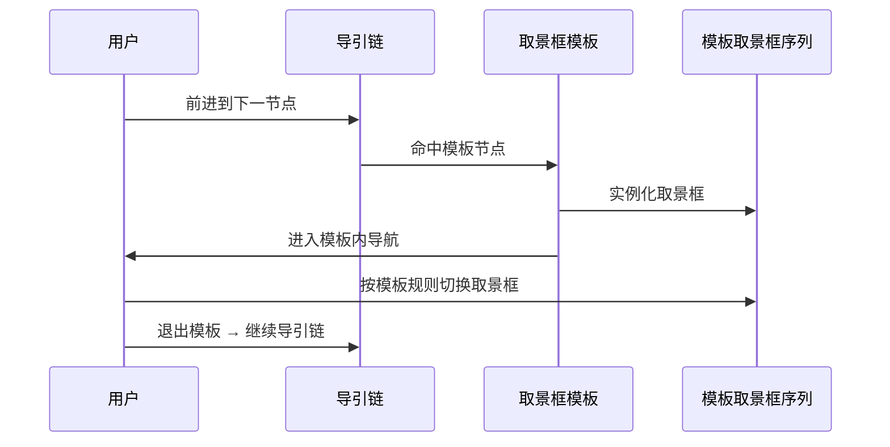

# 取景框模板（frame-template）

## 概述

取景框模板是一类按规则动态生成取景框的元对象。它与普通取景框的区别在于：普通取景框由用户手动框选固定区域，取景框模板则根据布局规则（线性、网格、树状等）自动生成一组有序取景框。

取景框模板适用于需要批量创建有序区域的场景——例如将 PDF 翻页映射为线性取景框序列，或将思维导图节点映射为树状取景框结构。

## 术语约定

- **取景框模板**：一个模板对象，定义了生成取景框的规则与参数。
- **实例化**：根据模板规则生成具体取景框的过程。
- **模板节点**：模板生成的单个取景框，行为与普通取景框一致。
- **模板内导航**：镜头进入模板生成的取景框序列后，按模板规则在节点间移动。

## 类型

### 线性取景框模板

按一维顺序生成一排取景框，适用于翻页场景。

- 参数：起始坐标、偏移方向、步长、数量。
- 典型场景：嵌入 PDF/PPT/Word 文档时，为每一页生成一个取景框。
- 导航行为：上一个/下一个翻页，镜头在取景框间横向或纵向平移。

### 表格取景框模板

按二维网格生成取景框矩阵，适用于表格化内容展示。

- 参数：起始坐标、列数、行数、列宽、行高。
- 典型场景：代码审查时逐格浏览，或多图对比展示。
- 导航行为：支持上下左右方向切换取景框，支持按行列跳转。

### 树状取景框模板

按树状结构生成取景框，适用于思维导图或层级关系展示。

- 参数：根节点坐标、子节点布局方向、层间距。
- 典型场景：思维导图逐节点展开浏览，或组织结构图展示。
- 导航行为：支持父子节点间跳转、同级节点切换、展开/折叠子节点。

### 自定义取景框模板

允许用户定义任意排列规则生成取景框。

- 通过自定义脚本或节点位置列表生成。
- 适用于不规则排列的场景（如环形布局、自由曲线排列）。

## 职责边界

取景框模板负责：

- 定义生成取景框的规则。
- 在实例化时返回一组有序取景框。
- 提供模板内导航的规则（如线性翻页、网格移动、树状展开）。

取景框模板不负责：

- 管理取景框的持久化——实例化后的取景框由上层（导引链或白板）统一管理。
- 渲染模板定义本身——模板的配置 UI 由宿主层实现。
- 约束用户在模板外区域的自由操作。

## 取景框模板在设备图中的角色

取景框模板与普通取景框一样，是纯数据对象，不进入 DevicesDAG。

- 模板元数据（类型、参数、子节点列表）存储在 `board.frameTemplates` 中。
- Navigator tool 在读取导引链节点时，通过 `templateId` 定位模板数据。
- 模板内导航的状态（当前子索引、边界检测）由 GuidingChain prefix 的节点 state（`innerIndex`、`overflow`）维护，不在模板数据中保存。这种分离使模板保持无状态，导航状态随会话生命周期。
- 模板参数的修改由宿主 UI 直接操作 `board.frameTemplates`，修改后触发现已实例化取景框的重新生成。

## 取景框模板与导引链的关系

取景框模板可以作为导引链中的一个节点。

当导引链的某个位置挂载的是取景框模板而非普通取景框时：

1. 镜头进入该模板节点。
2. 模板自动实例化其取景框序列。
3. 镜头切换到模板内的第一个取景框。
4. 用户在模板内按模板规则导航（翻页/网格移动等）。
5. 用户选择退出模板时，导引链继续到下一节点。

## 关键设计点

### 模板嵌套

取景框模板内部可以嵌套另一个取景框模板——例如表格模板的某个单元格内挂载一个线性模板用于翻页。嵌套深度应在实现时设定上限（建议 3 层以内），避免导航路径混乱。

### 实例化时机

实例化有两种策略：

1. **预实例化**：白板加载时或进入导引链时，一次性生成所有取景框。
2. **惰性实例化**：仅在镜头即将进入某模板节点时，才生成该模板内的取景框。

惰性实例化可以减少初始加载时间和内存占用，对于大型表格模板（如 100×100 网格）尤为必要。

### 模板参数可编辑

实例化后的取景框序列应保持与模板参数的关联。当模板参数修改时（如线性模板的步长调整），已实例化的取景框应重新生成或更新。

## 使用场景

1. **文档嵌入翻页**：线性模板为 PDF/PPT 每页生成取景框，支持翻页式浏览。
2. **代码逐格审查**：表格模板将代码分块排列，支持上下左右切换。
3. **思维导图展开**：树状模板为思维导图节点生成取景框，支持父子导航。
4. **多图对比**：表格模板排列多张图片，逐格对比查看。
5. **环形布局展示**：自定义模板将节点排列为环形，旋转切换视角。

## 相关文档

- [取景框文档](./frame-document.md)
- [导引链文档](./guiding-chain-document.md)
