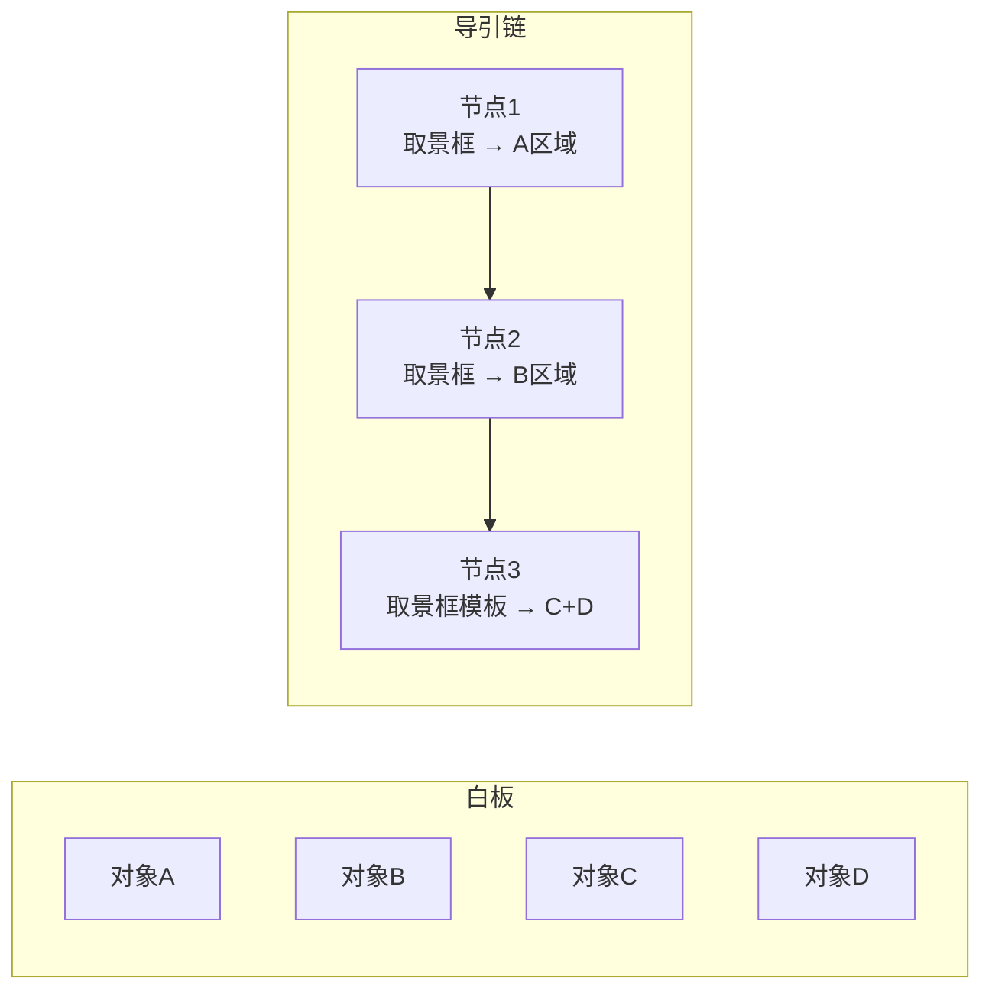
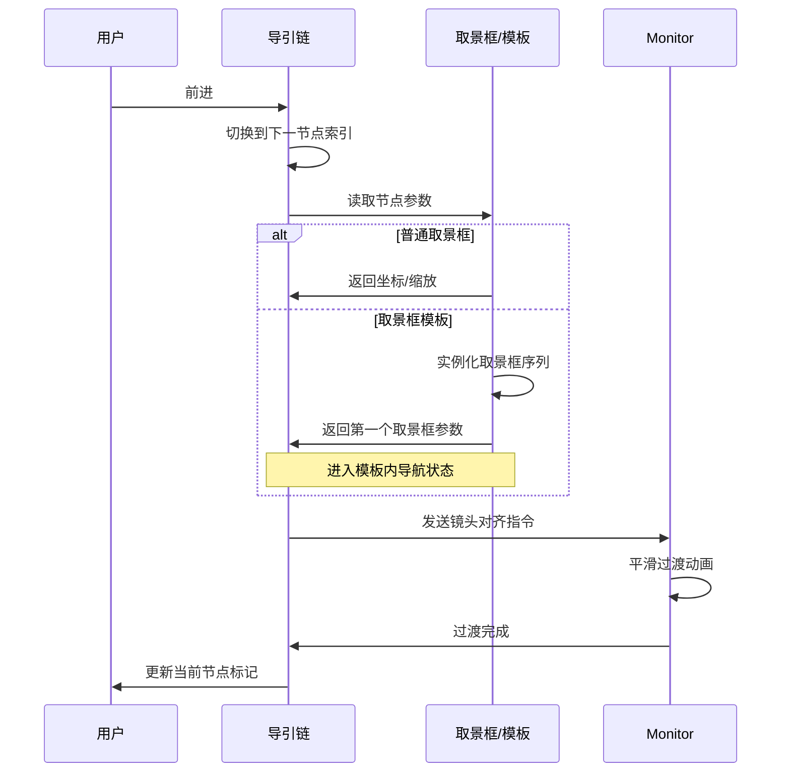
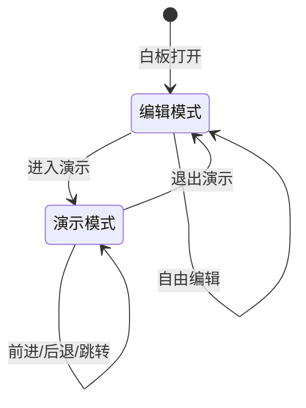
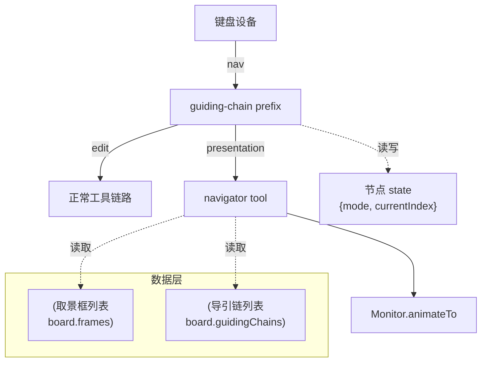
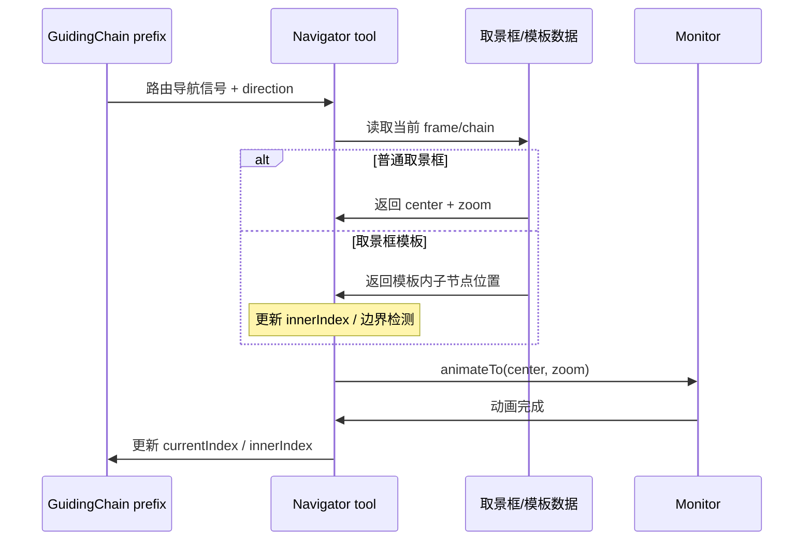

# 导引链（guiding-chain）

## 概述

导引链是将白板上若干取景框（或取景框模板）串联成有序浏览序列的线性结构。

在白板自由布局的基础上，导引链提供了一层可选的"叙事层"。用户无需改变画布内容的空间排布，即可定义一条从 A 到 B 再到 C 的观看路径。这层序列与空间布局正交共存——空间维度负责自由排布，序列维度负责讲述顺序。

按照"取景框-取景框模板"模型，白板上可以创建取景框对象或取景框模板对象。monitor 显示镜头信息，镜头除自由移动外，亦可对齐到取景框或取景框模板。导引链连接这些取景框/模板，当镜头沿导引链前进时，依次对齐到每个节点的视口位置。

## 术语约定

- **导引链**：一个有序的取景框/取景框模板节点列表，定义了浏览序列。
- **节点**：导引链中的单个元素，可以是普通取景框或取景框模板。
- **当前节点**：镜头当前对齐的导引链节点。
- **前进/后退**：沿导引链顺序移动到下一节点或上一节点。
- **模板内导航**：当前节点为取景框模板时，在模板生成的取景框序列内部移动。
- **缩略总览**：以缩略图方式展示导引链所有节点的全局视图。
- **演示模式**：全屏专注浏览状态，导引链作为核心导航骨架。

## 职责边界

导引链负责：

- 维护有序的节点列表。
- 提供前进/后退/跳转到指定节点的导航接口。
- 驱动 monitor 镜头在节点间平滑过渡。
- 在节点为取景框模板时，协调模板内导航与链式导航的切换。

导引链不负责：

- 定义取景框或取景框模板的内部逻辑——这些由各自模块实现。
- 管理白板对象的布局或编辑。
- 改变白板的序列化格式——导引链数据作为白板元信息附加存储。

## 导引链与白板的关系

导引链是白板的附加维度，不是主结构。

- **白板负责**：内容的空间排布、对象生命周期、编辑交互。
- **导引链负责**：定义一条观看路径，不改变内容本身。
- **共存规则**：用户在白板上的自由编辑不受导引链影响；导引链的存在不影响白板原有的所有操作。

这种分离设计确保：

- 用户可以不使用导引链，白板行为与原来完全一致。
- 用户创建导引链后，白板编辑体验不受干扰。
- 导引链可随时创建、编辑、删除，不影响白板内容。



## 导航流程

一次沿导引链前进的完整流程如下：

1. 用户触发前进操作（键盘、按钮、手势）。
2. 导引链读取当前节点索引，切换到下一节点。
3. 若下一节点是普通取景框：导引链读取取景框的坐标、尺寸、推荐缩放，发送镜头对齐指令给 monitor。
4. 若下一节点是取景框模板：导引链通知模板实例化其取景框序列，镜头对齐到模板内第一个取景框，进入模板内导航状态。
5. monitor 执行平滑镜头过渡动画。
6. 过渡完成后，导引链更新当前节点标记。



## 关键设计点

### 镜头过渡动画

节点间切换时的镜头动画是导引链体验的核心。设计要点包括：

- **缓动函数**：使用 ease-in-out 曲线，避免突兀的起停。
- **过渡时长**：建议 300-500ms，可根据节点间距离自动调整。
- **缩放过渡**：节点间缩放级别不同时，缩放与平移同步动画。
- **中断处理**：用户在动画过程中再次操作时，应立即中止当前动画，直接跳转到目标。

### 模板内导航与导引链导航的叠加

当导引链的当前节点是取景框模板时，存在两层导航：

- **模板内导航**：用户在当前模板的取景框序列中翻页/移动。
- **链式导航**：用户退出当前模板，沿导引链前进/后退到下一节点。

这两层导航的关系如下：

- `前进/后退` 在模板内导航时，默认响应模板内移动。
- 模板边界检测：当用户在模板内到达最后一个取景框并再次前进时，行为有两种设计可选：
  - **自动溢出**：自动退出模板，继续导引链到下一节点。
  - **显式退出**：用户需显式操作退出模板，再继续链式导航。

### 缩略总览

导引链的缩略总览以缩略图网格展示所有节点的预览图。用户可以从总览点击任意节点直接跳转。

缩略图的生成策略有两种候选方案：

1. **实时渲染**：动态渲染每个取景框区域的当前内容为缩略图。
2. **缓存快照**：在用户创建/更新取景框时保存缩略图快照。

缓存快照策略可以减少渲染开销，适合缩略图不要求实时更新的场景。

### 演示模式

演示模式是导引链的全屏专注浏览状态。进入演示模式后：

- 白板 UI 元素（工具栏、菜单等）隐藏或半透明。
- monitor 占据全屏显示区域。
- 导引链作为核心导航骨架，支持键盘翻阅（←/→ 或 ↑/↓）。
- 导航控制 UI（前进/后退按钮、节点进度指示器、缩略总览入口）以半透明覆盖层显示。
- 用户可随时退出演示模式，返回白板编辑状态。



### 导引链的持久化

导引链数据作为白板元信息的一部分序列化存储。存储结构建议如下：

```json
{
  "guidingChains": [
    {
      "id": "chain-1",
      "title": "方案汇报",
      "nodes": [
        { "type": "frame", "frameId": "frame-a" },
        { "type": "frame", "frameId": "frame-b" },
        { "type": "frameTemplate", "templateId": "pdf-pages" }
      ]
    }
  ]
}
```

## 实现架构

导引链横跨三层架构：DevicesDAG（输入路由）、白板数据层（元信息存储）、Monitor（视口控制）。

### 设备图中的定位

导引链的核心是 DevicesDAG 中的一个 **state-machine prefix 节点**，及其下游的**导航工具**。

```
/<monitorId>/keyboard --"nav"--> /<monitorId>/workflows/guiding-chain (prefix)
```

| 组件                | 设备图角色                              | 职责                                                                                             |
| ------------------- | --------------------------------------- | ------------------------------------------------------------------------------------------------ |
| GuidingChain prefix | `routePolicy: "state-machine"` 修饰节点 | 根据 `state.mode` 决定信号路由方向：编辑模式 → 原样通过；演示模式 → 拦截方向键等信号发往导航工具 |
| Navigator tool      | 工具节点（tool），作为 prefix 子节点    | 消费导航信号（next/prev/jump），计算目标取景框位置，调用 Monitor 执行镜头过渡                    |
| Frame / Chain 数据  | 不进入 DAG                              | 作为 `board.*` 白板级元信息存储，导航工具通过 `board` 引用读取                                   |



### prefix 实现要点

prefix handler 是一个带状态的路由节点，负责根据当前模式将键盘信号分到不同的下游子节点。它维护一个状态机：

- 编辑模式下，信号原样通过，不干扰正常工具链路。
- 演示模式下，方向键和 Esc 等按键被拦截，路由到 navigator 子节点。
- 模式切换由外部代码写入节点 state 触发。

关键状态字段：

| 字段             | 类型                       | 含义                                               |
| ---------------- | -------------------------- | -------------------------------------------------- |
| `mode`           | `"edit" \| "presentation"` | 当前模式，决定路由策略                             |
| `currentIndex`   | `number`                   | 导引链中当前节点索引                               |
| `currentChainId` | `string \| null`           | 当前激活的导引链 ID                                |
| `innerIndex`     | `number \| null`           | 模板内导航的当前子索引，仅在节点为取景框模板时有值 |
| `overflow`       | `boolean`                  | 模板内导航到达边界标记，触发自动溢出到导引链       |

#### 模式切换

- **进入演示模式**：外部代码（宿主 UI 或快捷键）调用 `dag.setNodeState(path, { mode: "presentation" })`，此后 prefix 的 `resolveTransition` 自动启用演示路由逻辑。
- **退出演示模式**：navigator tool 在收到 `direction: "exit"` 时，将 state 的 `mode` 改回 `"edit"`，同时调用 `monitor.resetViewport()` 恢复到进入前的视口位置。

### navigator tool 职责

navigator 不是内容创建/修改工具，而是一个**视口控制工具**。它的 `processor` 流程：

1. 读取 `ctx.context.direction`（next/prev/jump/exit）。
2. 从 `board.guidingChains` 获取当前导引链和当前节点。
3. 若当前节点是取景框模板，处理模板内导航逻辑（翻页/网格移动/父子切换）。
4. 计算目标取景框的视口中心与推荐缩放。
5. 调用 `monitor.animateTo(center, zoom)` 执行平滑过渡。
6. 更新 prefix state 中的 `currentIndex`（或 `innerIndex`）。



### 模板内导航的叠加流程

当导引链当前节点是取景框模板时，prefix 的 `resolveTransition` 需要区分两层导航：

1. prefix 读取 `state.innerIndex` 和模板元数据，判断当前是否在模板内。
2. 若在模板内且未到达边界：将导航信号路由到 navigator，navigator 在模板子节点间移动。
3. 若在模板内且到达边界（`innerIndex` 已到末端、再次收到前进信号）：prefix 处理自动溢出——将当前导引链的 `currentIndex` 前进一位，重置 `innerIndex`，路由到 navigator 执行链式跳转。
4. 若不在模板内（普通取景框节点）：直接按链式导航处理。

### 各层职责收口

| 层次     | 组件                           | 职责                                      |
| -------- | ------------------------------ | ----------------------------------------- |
| 输入路由 | GuidingChain prefix            | 信号分类 + 模式切换 + 边界检测            |
| 视口控制 | Navigator tool                 | 计算目标位置 + 驱动 monitor               |
| 数据存储 | `board.frames / guidingChains` | 取景框与导引链元信息                      |
| 渲染     | UiRenderer（provider）         | 取景框边界视觉提示、缩略总览              |
| 镜头执行 | Monitor                        | `animateTo()` 平滑过渡、`resetViewport()` |
| 宿主 UI  | 浏览器 DOM                     | 全屏 API、工具栏显隐、覆盖层布局          |

## 使用场景

1. **方案汇报**：将白板上的需求分析、架构图、原型图区域串联成汇报路线。
2. **课堂讲解**：按教学顺序标记知识点区域，引导学生依次观看。
3. **项目复盘**：从背景→问题→方案→复盘四个阶段串联时间线。
4. **设计评审**：将多个设计方案并排放置，逐格对比评审。
5. **脑图推演后的线性讲述**：在思维导图式发散后，定义一条收敛的讲述路径。

## 设计约束

- 导引链不应影响白板原有的自由编辑行为。
- 节点间切换应保持流畅（建议 60fps 动画）。
- 缩略总览的渲染不应阻塞主线程。
- 演示模式退出后应恢复到进入前的编辑状态，包括视口位置。

## 相关文档

- [取景框文档](./frame-document.md)
- [取景框模板文档](./frame-template-document.md)
- [Monitor 文档](../../components/docs/monitor-document.md)
