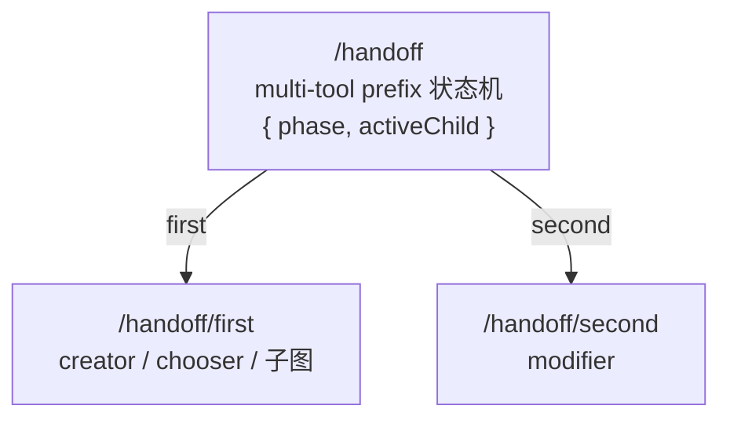
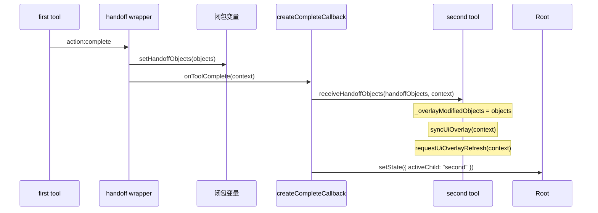

# Handoff 工作流文档

## 概述

`createHandoffSubDAG` 把 first → second 的两阶段工作流封装为一棵结构化子树。典型场景：

- **creator → modifier**：用户画一个笔画，创建完成后直接拖拽修改位置
- **chooser → modifier**：用户选中已有对象，然后拖拽修改位置
- **SubDAGDefinition → modifier**：任意子图作为 first，完成后交给 modifier

## 子树结构



根节点是一个 multi-tool prefix，通过 `resolveTransition` 回调决定下一跳路由。状态为 `{ phase: "first" | "second", activeChild: "first" | "second" }`。

## first 与 second 的包装方式

所有 Tool 类型的 first 和 second 统一通过 `wrapToolForHandoff` 包装，监听 `action:complete` 事件。

| 类型             | 包装方式                                            | 完成检测                      |
| ---------------- | --------------------------------------------------- | ----------------------------- |
| Tool（first）    | `wrapToolForHandoff(tool, { bridgeObjects })`       | `action:complete` 事件触发    |
| Tool（second）   | `wrapToolForHandoff(tool, { completeOnCancel })`    | `action:complete` 事件触发    |
| SubDAGDefinition | `wrapSubDAGForHandoff`，检测 `end` 信号或自定义条件 | `end` 信号或 `shouldComplete` |

### Creator 的提交拦截

creator 的 first 不再通过 `beforeCommitCreatedObject = () => false` 突变来拦截提交，
而是由 handoff 在 `resolveTransition` 中注入 `context.acc.autoCommit = false`。
Creator 的 `completeAction` 在检测到 `autoCommit` 为 false 时跳过 `commitCreatedObject`。

不再需要 `resetHandoff` 清理机制。

## 对象桥接协议

### 数据流



对象存储在 handoff 的闭包变量而非 DAG nodeState。所有阶段切换和数据传递均通过闭包完成，不依赖子节点状态。

### 权威数据源

| 存储位置                | 角色                                                              |
| ----------------------- | ----------------------------------------------------------------- |
| **工具私有字段**        | `_overlayModifiedObjects` 是唯一权威数据来源                      |
| **闭包 handoffObjects** | 跨 dispatch 周期的桥接载体                                        |
| **acc**                 | 承载回调（`onToolComplete`、`setHandoffObjects`），不承载对象数据 |
| **Node state**          | 工具可选写入（供外部 overlay 读取），工具不从 node state 读对象   |

### 同步时机

first 完成后**立即同步**到 second 的私有字段，不等到下一个信号到达。

```
first 完成
  │
  ├── setHandoffObjects(result)           → 闭包 handoffObjects = [...]
  │
  ├── second.receiveHandoffObjects(objects, dagContext)
  │     ├── _overlayModifiedObjects = [...]    ← 私有字段写入
  │     ├── syncUiOverlay(dagContext)          ← 注册 overlay provider
  │     └── requestUiOverlayRefresh(dagContext) ← 刷新 → 立即显示
  │
  └── setState({ activeChild: "second" })
```

### `receiveHandoffObjects(objects, context)`

`GestureBasedObjectModifierTool` 上的方法，由 `createCompleteCallback` 在 first 完成时调用。

- 将对象写入 `_overlayModifiedObjects`（私有字段）
- 调用 `syncUiOverlay(context)` 注册 overlay provider
- 调用 `requestUiOverlayRefresh(context)` 触发 UI 刷新

重复调用时如果 `_overlayModifiedObjects` 已非空则跳过。

### `syncUiOverlay(context)`

`Tool` 基类上的方法，在不处理信号的情况下将当前工具的 overlay provider 注册到 viewport。

- 内部调用 `createUiOverlayBinding()`（已缓存）
- 后续 `processor(packet, context) → sync` 检测到已注册，不再重复注册

### `resolveActiveModifiedObjects` 读取路径

```js
resolveActiveModifiedObjects(context, objects) {
    if (this._overlayModifiedObjects.length > 0) {
      return this._overlayModifiedObjects;    // 私有字段优先
    }
    return this.resolveModifiedObjects(context, objects); // 非 handoff 场景 fallback
}
```

### 生命周期切换

```mermaid
flowchart LR
    subgraph First 完成
        AC["action:complete"] --> SH[setHandoffObjects]
        SH --> OTC[onToolComplete(context)]
        OTC --> Sync["second.receiveHandoffObjects<br/>私有字段 ← syncUiOverlay ← 刷新"]
        Sync --> Switch2["phase: second<br/>activeChild: second"]
    end
    subgraph Second 完成
        SU["action:complete / cancel"] --> OTC2[onToolComplete(context)]
        OTC2 --> Switch1["phase: first<br/>activeChild: first"]
        Switch1 --> Clear["清空闭包变量<br/>触发 UI overlay 刷新"]
    end
```

### 切换判断

- first 完成时：`setHandoffObjects` 被显式调用且对象为空时**不切换**；未被调用（直接调 `onToolComplete`）时**始终切换**
- second 完成时：总是切回 first，清空闭包变量。handoff 不清理子节点 node state

### `acc` 注入字段

| 字段                | 类型       | 语义                                                                 |
| ------------------- | ---------- | -------------------------------------------------------------------- |
| `onToolComplete`    | `Function` | first/second 完成通知，接受 `context` 参数                           |
| `autoUmountOnApply` | `boolean`  | 固定为 `false`，阻止 modifier 自卸载                                 |
| `autoCommit`        | `boolean`  | 固定为 `false`，阻止 creator 提前 commit                             |
| `handoffObjects`    | `Array`    | handoff 闭包中的桥接对象（仅由 createCompleteCallback 在同步时消费） |
| `setHandoffObjects` | `Function` | first wrapper 调用此回调将对象写入闭包变量                           |

## 生命周期机制

所有 Tool 的完成通知统一通过 `action:complete` 事件。handoff handler 订阅该事件，收到后桥接对象并切换阶段。

| 步骤          | 独立模式                          | handoff 模式                                   |
| ------------- | --------------------------------- | ---------------------------------------------- |
| Creator 完成  | `beforeCommit → true` → AOM.apply | `autoCommit: false` → 对象留在 AOM             |
| Creator 通知  | `action:complete` 无人订阅        | handoff `wrapToolForHandoff` 订阅              |
| Chooser 确认  | `action:complete` 无人订阅        | handoff `wrapToolForHandoff` 订阅              |
| Modifier 提交 | AOM.apply → 自卸载                | AOM.apply → `autoUmountOnApply:false` 阻止卸载 |
| Modifier 通知 | `action:complete` 无人订阅        | handoff `wrapToolForHandoff` 订阅              |

## Overlay 职责

| 阶段      | 绘制内容                                                                                                  | 管理方                                                         |
| --------- | --------------------------------------------------------------------------------------------------------- | -------------------------------------------------------------- |
| First 中  | 拖拽选择矩形框（手势期间）                                                                                | `RectangleObjectChooserTool`：只画 drag rect，不画选中对象高亮 |
| Second 中 | 被修改对象的选中外框                                                                                      | `GestureBasedObjectModifierTool.collectUiOverlayEntries`       |
| 切换时    | Second 的 `receiveHandoffObjects` 内调 `syncUiOverlay` + `requestUiOverlayRefresh`，确保 overlay 立即生效 |

## 辅助函数

### `wrapToolForHandoff(tool, options)`

将 Tool 包装为 handoff-ready handler。订阅 `action:complete` 事件，收到后桥接对象并调用 `onToolComplete(context)`。

| 选项               | 类型      | 默认值  | 作用                                   |
| ------------------ | --------- | ------- | -------------------------------------- |
| `bridgeObjects`    | `boolean` | `false` | 完成时将事件结果写入 handoff 闭包变量  |
| `completeOnCancel` | `boolean` | `false` | 收到 `cancel` 信号时丢弃对象后通知完成 |

### `wrapSubDAGForHandoff(subDAGDef, options)`

在子树根节点满足 `shouldComplete` 条件（默认检测 `end` 信号）时，从 `context.acc?.objects` 读取对象并调用 `setHandoffObjects`，然后调用 `onToolComplete`。

- SubDAG（`subDAGDef.nodes instanceof Map`）：为根节点 handler 追加完成通知包装，保留子树结构
- 非 SubDAG（flat `{ handler }` 对象）：直接替换 `nodes.handler`

## 生命周期清理

handoff 不再需要清理 `beforeCommitCreatedObject`（不再进行突变拦截）。second 切回 first 时不清理子节点的 node state（工具自己管理自己的状态）。

## 轻量对象条目协议

creator 产生的 `_entry` 和 chooser/modifier 流转的条目统一遵循 `ObjectSummary` 结构（定义在 `shared/types.js`）：

```js
{
  id: number,
  type: string,
  position: Vector | { x, y },
  boundingBox?: { left, top, width, height },
  range?: Range,
  property: Record<string, any>,
  data: Record<string, any>,
}
```

| 场景   | 代表者                  | `boundingBox` / `range`                                             |
| ------ | ----------------------- | ------------------------------------------------------------------- |
| 创建态 | creator `_entry`        | 创建完成后通过 `resolveCreatedObjectBoundingBox` 回填 `boundingBox` |
| 摘要态 | chooser / modifier 条目 | 来自 Worker 侧 `queryObjects`，携带完整的 `boundingBox` / `range`   |

消费端通过 `Vector.parse()` 统一处理 `position` 的两种形态，通过 `RectangleRange.fromRectLike()` 统一处理 `boundingBox`。

## 相关文档

- [prefix-document.md](./prefix-document.md)
- [object-creator-document.md](../../tools/creator/docs/object-creator-document.md)
- [object-modifier-document.md](../../tools/modifier/docs/object-modifier-document.md)
- [object-chooser-document.md](../../tools/chooser/docs/object-chooser-document.md)
- [core-data-model.md](../../docs/core-data-model.md)
