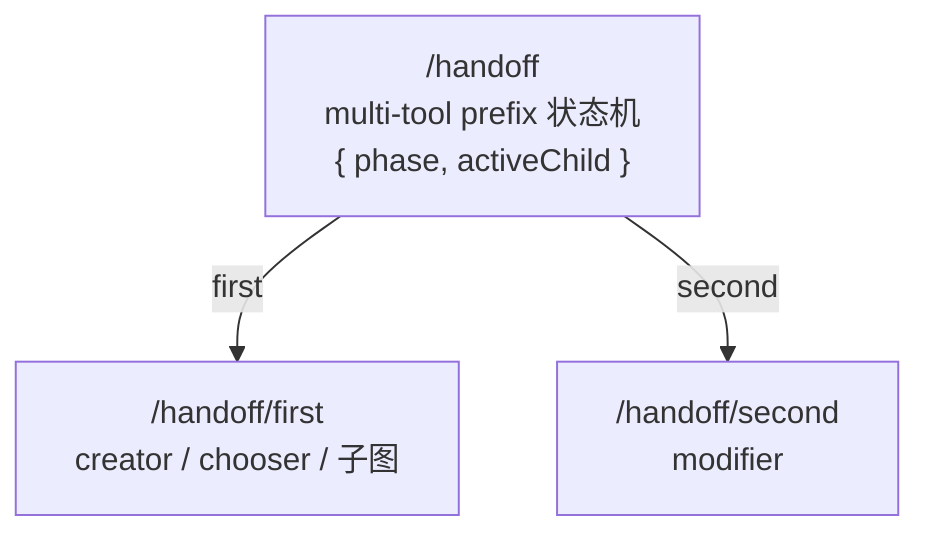
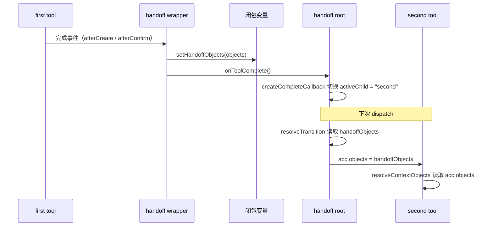
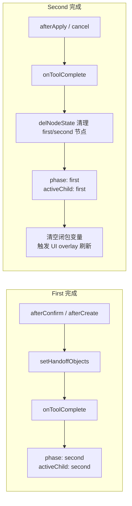

# Handoff 工作流文档

## 概述

`createHandoffSubDAG` 把 first → second 的两阶段工作流封装为一棵结构化子树。典型场景：

- **creator → modifier**：用户画一个笔画，创建完成后直接拖拽修改位置
- **chooser → modifier**：用户选中已有对象，然后拖拽修改位置
- **SubDAGDefinition → modifier**：任意子图作为 first，完成后交给 modifier

## 子树结构



根节点是一个 multi-tool prefix，通过 `resolveTransition` 回调决定下一跳路由。状态为 `{ phase: "first" | "second", activeChild: "first" | "second" }`。

## 三种 first 类型

| 类型             | 包装方式                                                     | 完成检测                      |
| ---------------- | ------------------------------------------------------------ | ----------------------------- |
| Creator          | 覆盖 `beforeCommitCreatedObject → false`，订阅 `afterCreate` | `afterCreate` 事件触发        |
| Chooser          | `wrapChooserForHandoff`，订阅 `afterConfirm`                 | `afterConfirm` 事件触发       |
| SubDAGDefinition | `wrapSubDAGForHandoff`，检测 `end` 信号或自定义条件          | `end` 信号或 `shouldComplete` |

## 对象桥接协议



对象存储在闭包变量而非 DAG nodeState，原因：

- **路径无关**：SubDAGDefinition 的内部工具无需知道节点路径，写 `acc.objects` 即可
- **不污染 nodeState**：`dag.getNodeState("/handoff")` 始终为 `{ phase, activeChild }`

### 生命周期切换



### 切换判断

- first 完成时：`setHandoffObjects` 被显式调用且对象为空时**不切换**；未被调用（直接调 `onToolComplete`）时**始终切换**
- second 完成时：总是切回 first，清空闭包变量并清理节点状态中的 `objects` 键（使用 `delNodeState` 而非设为空数组，避免 `resolveContextObjects` 读到 truthy 空数组后跳过 `acc.objects` 的 fallthrough）

### `acc` 注入字段

| 字段                | 类型       | 语义                                                               |
| ------------------- | ---------- | ------------------------------------------------------------------ |
| `onToolComplete`    | `Function` | first/second 完成通知，触发状态切换                                |
| `autoUmountOnApply` | `boolean`  | 固定为 `false`，阻止 modifier 自卸载                               |
| `objects`           | `Array`    | 当前桥接的对象集合，modifier 通过 `resolveContextObjects` 直接读取 |
| `handoffObjects`    | `Array`    | 同上，供显式读取                                                   |
| `setHandoffObjects` | `Function` | first wrapper 调用此回调将对象写入闭包变量                         |

## 生命周期钩子对照

| 步骤          | 独立模式                          | handoff 模式                                   |
| ------------- | --------------------------------- | ---------------------------------------------- |
| Creator 完成  | `beforeCommit → true` → AOM.apply | `beforeCommit → false` → 对象留在 AOM          |
| Creator 通知  | `afterCreate` 无人订阅            | handoff handler 订阅 `afterCreate`             |
| Chooser 确认  | `confirmSelection` 无人订阅       | handoff handler 订阅 `afterConfirm`            |
| Modifier 提交 | AOM.apply → 自卸载                | AOM.apply → `autoUmountOnApply:false` 阻止卸载 |
| Modifier 通知 | `afterApply` 无人订阅             | handoff handler 订阅 `afterApply`              |

## 辅助函数

### `wrapSubDAGForHandoff(subDAGDef, options)`

在子树根节点满足 `shouldComplete` 条件（默认检测 `end` 信号）时，从 `context.acc.objects` 读取对象并调用 `setHandoffObjects`，然后调用 `onToolComplete`。

### `wrapChooserForHandoff(tool)`

订阅 tool 的 `afterConfirm` 事件，从事件参数取得选中对象，调用 `setHandoffObjects` 后通知完成。

### `wrapSubDAGForHandoff` 对 SubDAG 与 flat 节点的处理

- SubDAG（`subDAGDef.nodes instanceof Map`）：为根节点 handler 追加完成通知包装，保留子树结构
- 非 SubDAG（flat `{ handler }` 对象）：直接替换 `nodes.handler`

## 生命周期清理

handoff 保存 `beforeCommitCreatedObject` 的原始引用。通过 `subDAG.resetHandoff()` 暴露清理入口，卸载时恢复工具原始行为。

## 轻量对象条目协议

creator 产生的 `_entry` 和 chooser/modifier 流转的条目统一遵循 `ObjectSummary` 结构（定义在 `shared/types.js`）：

```js
{
  id: number,
  type: string,
  position: Vector | { x, y },
  boundingBox?: { left, top, width, height },
  range?: Range,
  property: Record<string, any>,
  data: Record<string, any>,
}
```

| 场景   | 代表者                  | `boundingBox` / `range`                                             |
| ------ | ----------------------- | ------------------------------------------------------------------- |
| 创建态 | creator `_entry`        | 创建完成后通过 `resolveCreatedObjectBoundingBox` 回填 `boundingBox` |
| 摘要态 | chooser / modifier 条目 | 来自 Worker 侧 `queryObjects`，携带完整的 `boundingBox` / `range`   |

消费端通过 `Vector.parse()` 统一处理 `position` 的两种形态，通过 `RectangleRange.fromRectLike()` 统一处理 `boundingBox`。

## 相关文档

- [prefix-document.md](./prefix-document.md)
- [object-creator-document.md](../../tools/creator/docs/object-creator-document.md)
- [object-modifier-document.md](../../tools/modifier/docs/object-modifier-document.md)
- [object-chooser-document.md](../../tools/chooser/docs/object-chooser-document.md)
- [core-data-model.md](../../docs/core-data-model.md)
