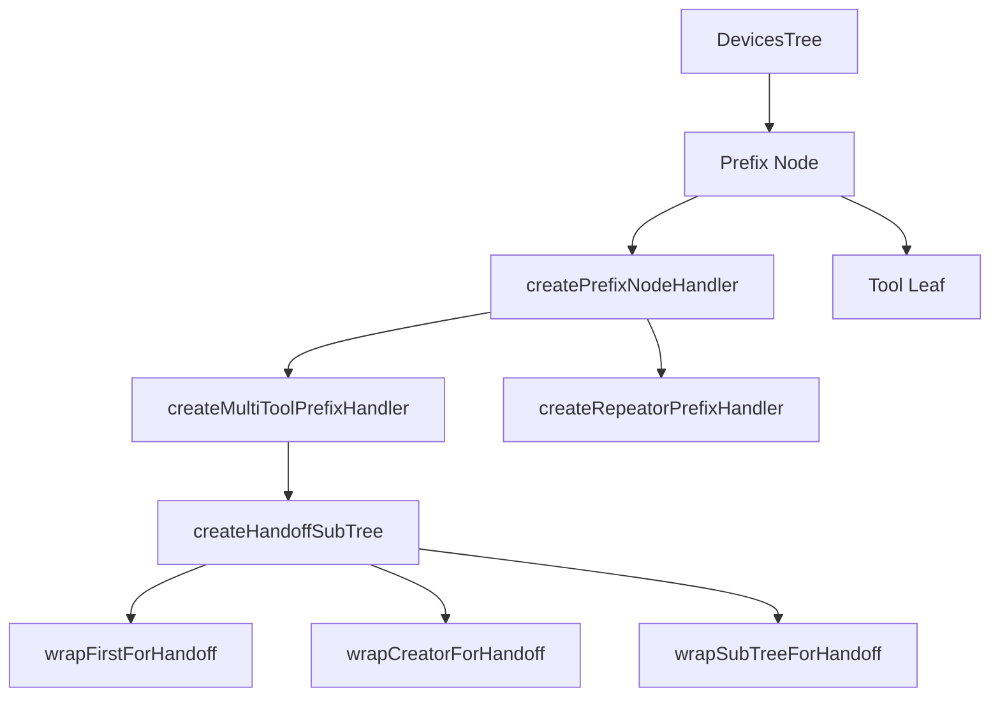
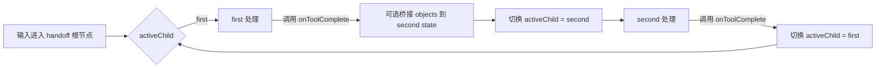

# 修饰节点（prefix）

## 概述

修饰节点是 DevicesTree 中的一种职责语义，不是新的节点类型。它仍然是一个 `DevicesTreeNode`，只是通过 `semantics.prefix === true` 标记。

修饰节点位于信号链路中的前置处理层，负责记录、参数注入、路由分发、状态机切换和局部上下文编排。它与末端消费工具形成互补：修饰节点负责“怎么走”，工具负责“到了之后做什么”。

## `semantics.prefix === true` 是什么

它是 `SubTreeNodeBuilder.prefix(handler)` 自动写入节点元数据的一个标记。

它的作用是：

- 让调试和文档层知道这个节点承担 prefix 职责
- 让阅读 `semantics` 的调用方快速区分普通节点、prefix 节点和 tool 节点
- 不引入新的运行时分发分支

这意味着：

- prefix 仍然是普通 `DevicesTreeNode`
- dispatcher 不会因为 `semantics.prefix` 自动改写路径
- 真正的控制逻辑仍由 `handler`、节点 state 和累积 `context` 决定

## 当前协作模型

prefix 节点现在依赖三条稳定边界：

- **局部向下路由**：后续包只能继续发给当前节点的后代
- **节点 state**：保存可变共享数据，例如锚点、活动 child、桥接对象
- **累积 context**：逐层追加只读信息，例如 `board`、`monitor`、`onToolComplete`

这里需要特别区分两件事：

- 节点 state 适合保存跨多次输入仍然需要保留的局部状态
- 累积 context 适合保存当前链路内的只读注入数据或回调函数

`PREFIX_NODE_SIGNAL_TYPES.TOOL_COMPLETE` 常量仍然保留，但内置 handoff 和多工具状态机已经优先改用回调，不再把它作为新的稳定握手协议。

## 模块清单

| 文件                     | 导出                                                                                            | 用途                        |
| ------------------------ | ----------------------------------------------------------------------------------------------- | --------------------------- |
| `index.js`               | 统一导出入口                                                                                    | 集中导出全部公开 API        |
| `constants.js`           | `PREFIX_NODE_SIGNAL_TYPES`                                                                      | 保留的兼容信号常量          |
| `utils.js`               | `isPlainObject`, `shallowCloneSignals`                                                          | 内部工具方法                |
| `handler.js`             | `createPrefixNodeHandler`                                                                       | 基础修饰节点处理器          |
| `multi-tool-handler.js`  | `createMultiToolPrefixHandler`                                                                  | 多工具状态机路由            |
| `repeator-handler.js`    | `createRepeatorPrefixHandler`                                                                   | 信号复制分发                |
| `handoff-handler.js`     | `createHandoffSubTree`, `wrapFirstForHandoff`, `wrapCreatorForHandoff`, `wrapSubTreeForHandoff` | first → second 两阶段工作流 |
| `drag-anchor-handler.js` | `createDragAnchorPrefixHandler`                                                                 | 拖拽位移转换                |

## 关系图



## 1. 基础处理器：`createPrefixNodeHandler`

所有修饰节点的根基。它封装了节点状态读写和最常用的局部路由 helper。

当前前缀上下文提供的 helper 有：

- `state` / `getState()` / `setState()` / `patchState()`：节点状态管理
- `routeToChild(childName, signals)`：把信号路由到当前节点的某个子节点
- `stop()`：终止当前链路

```js
const handler = createPrefixNodeHandler({
  handle(packet, ctx) {
    ctx.patchState({ count: (ctx.state.count ?? 0) + 1 });
    return ctx.routeToChild("tool", packet.signals);
  },
});
```

这里要注意：

- 基础 helper 只提供 `routeToChild`
- 若要前往更深层后代，可直接返回 `{ packets: [{ to: "child/grandchild", signals }] }`
- 当前公共 API 不再提供 `bubbleToParent()` 这类向上路由 helper

## 2. 多工具状态机：`createMultiToolPrefixHandler`

基于基础处理器构建，通过 `resolveTransition` 回调实现状态驱动的子节点路由。

当前路由决策对象的稳定字段有：

| 字段         | 类型      | 语义                                |
| ------------ | --------- | ----------------------------------- |
| `child`      | `string`  | 路由到特定子节点                    |
| `consume`    | `boolean` | 消费信号，不继续转发                |
| `to`         | `string`  | 覆盖默认 child 路径，仍然只指向后代 |
| `patchState` | `Object`  | 合并到当前状态                      |
| `state`      | `Object`  | 直接替换当前状态                    |
| `signals`    | `Array`   | 改写下发信号                        |
| `context`    | `Object`  | 追加到下游累积 context              |

```js
const handler = createMultiToolPrefixHandler({
  defaultChild: "first",
  initialState: { activeChild: "first", phase: "first" },
  resolveTransition({ state }) {
    return { child: state.activeChild };
  },
});
```

`transition.context` 是这次重构里的关键点：它允许 prefix 在不冒泡的情况下，把回调或只读数据继续传给当前活动子链。

## 3. 信号复制分发：`createRepeatorPrefixHandler`

`repeator` 会把输入信号复制为多份，分别发给不同子节点，或同一个子节点的多份副本。

```js
const handler = createRepeatorPrefixHandler({
  toChildren: ["tool-a", "tool-b"],
});
```

若未显式提供 `toChildren`，它会回退到当前 prefix 节点的 `defaultChild`。

## 4. Handoff 工作流：`createHandoffSubTree`

`createHandoffSubTree` 把 `first → second` 的两阶段工作流封装成一棵结构化子树。

典型场景包括：

- creator → modifier
- chooser → modifier
- 任意 SubTreeDefinition → modifier

### 当前工作方式

- 根节点是一个 `multi-tool prefix`
- 根 prefix 根据当前 `state.activeChild` 选择把信号送到 `first` 或 `second`
- 根 prefix 通过 `transition.context` 向当前活动子链注入 `onToolComplete` 回调
- `first` 完成时，回调切换到 `second`，必要时把对象从 `first` 节点 state 桥接到 `second` 节点 state
- `second` 完成时，回调切换回 `first`



### 辅助函数

- `wrapCreatorForHandoff(tool)`：hook `completeCreatedObject()`，在 creator 真正完成时调用 `onToolComplete`
- `wrapFirstForHandoff(tool)`：creator 走 hook 路径，chooser 则在 `end` 且已选中对象时调用 `onToolComplete`
- `wrapSubTreeForHandoff(subTreeDef, options)`：在子树根节点满足 `shouldComplete` 或收到 `end` 时调用 `onToolComplete`

### 兼容说明

`PREFIX_NODE_SIGNAL_TYPES.TOOL_COMPLETE` 仍然保留，用于旧测试、旧工具或局部自定义 workflow 的兼容场景。但对新的 handoff 设计，应该优先理解为“回调通知完成”，而不是“冒泡一个完成信号”。

## 5. 拖拽位移转换：`createDragAnchorPrefixHandler`

`createDragAnchorPrefixHandler` 将位置序列转换为累计位移 `{ x, y }`，并输出 `displacement` 信号。

工作流程是：

1. 首个 `position` 信号：捕获锚点，不转发
2. 后续 `position` 信号：输出从锚点出发的累计位移
3. `end` 信号：清空锚点并继续下传 `end`

它常用于把鼠标世界坐标转换成 modifier 可直接消费的位移输入。

## 子树构建

修饰节点工作流通常通过 `createSubTree` DSL 构建，再通过 `monitor.mountSubTree()` 注册到 DevicesTree。

```js
const subTree = createSubTree("/mouse/primary/handoff")
  .node("")
  .prefix(createDragAnchorPrefixHandler())
  .defaultChild("tool")
  .node("tool")
  .tool(new CommonObjectModifierTool())
  .end()
  .end()
  .build();

monitor.mountSubTree("", subTree);
```

## 设计约束

- `handler` 与 `tool` 不能在同一结构化节点上同时声明
- prefix 语义通过 `semantics` 标记表达，不引入新的节点类
- 节点状态通过 `getNodeState()` / `setNodeState()` 显式管理
- 新设计不再提供 `bubbleToParent()` 这类向上路由 helper
- first / second 的切换优先使用累积 `context` 中的回调，而不是向上返回信号包

## 相关文档

- [设备树](../devices/docs/devices-tree-document.md)
- [工具基类](../tools/tool-document.md)
- [Core 输入流](../docs/core-input-flow.md)
