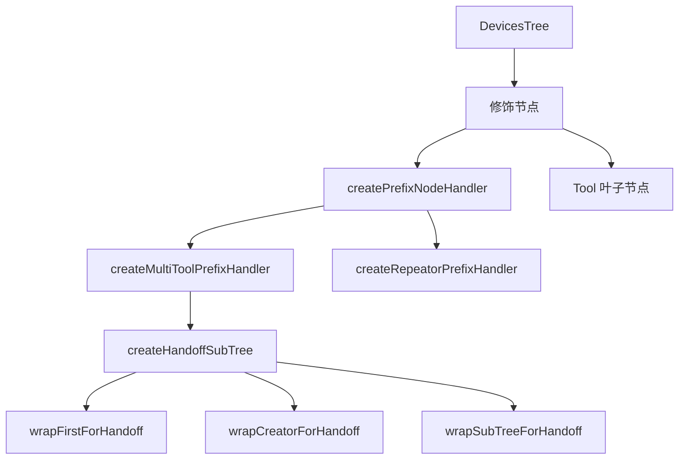
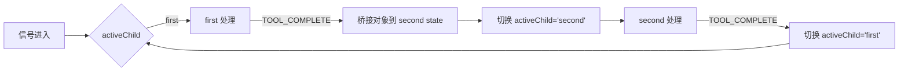
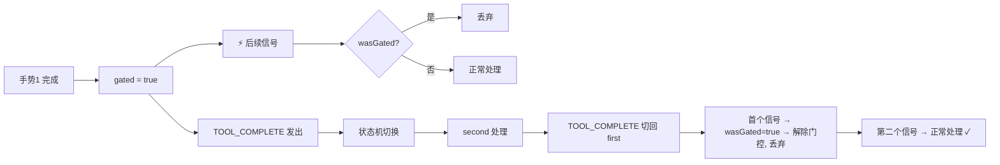

# 修饰节点（prefix）

## 概述

修饰节点是 DevicesTree 中的一种职责语义，不是新的节点类型。它仍然是一个 `DevicesTreeNode`，只是通过 `semantics.prefix === true` 标记（详见下文）。

修饰节点位于信号链路中的前置处理层，负责记录、参数注入、路由分发和状态机切换。它与末端消费工具（Tool）形成互补：修饰节点做前置处理，工具做最终消费。

## `semantics.prefix === true` 是什么？

它是 `SubTreeNodeBuilder.prefix(handler)` 方法自动写入节点元数据的一个标记：

```js
prefix(handler, semantics = {}) {
  return this.handler(handler).semantics({
    prefix: true,
    ...(isPlainObject(semantics) ? semantics : {}),
  });
}
```

**它的作用：**

- **自描述标记** — 告诉阅读 `eventContext.semantics` 或调试设备树的人"这个节点是修饰节点"
- **"文档即数据"** — 没有代码依赖 `semantics.prefix` 做条件判断，它是纯标注
- **和 `semantics.tool` 同类** — `.tool()` 也会写 `semantics.tool = true`，但同样不起路由作用
- **不作为新节点类** — 修饰节点仍然是 `DevicesTreeNode`，信号分发行为与普通 handler 节点完全一致

简言之，`semantics.prefix === true` 只是让节点说"我是一个修饰节点"，仅此而已。

**模块路径**：`src/core/prefixs/`

## 模块清单

| 文件                     | 导出                                                                                            | 用途                                             |
| ------------------------ | ----------------------------------------------------------------------------------------------- | ------------------------------------------------ |
| `index.js`               | 统一导出入口                                                                                    | 集中导出全部公开 API                             |
| `constants.js`           | `PREFIX_NODE_SIGNAL_TYPES`                                                                      | 信号类型常量                                     |
| `utils.js`               | `isPlainObject`, `shallowCloneSignals`                                                          | 内部工具方法                                     |
| `handler.js`             | `createPrefixNodeHandler`                                                                       | 基础修饰节点处理器                               |
| `multi-tool-handler.js`  | `createMultiToolPrefixHandler`                                                                  | 多工具状态机路由                                 |
| `repeator-handler.js`    | `createRepeatorPrefixHandler`                                                                   | 信号复制分发                                     |
| `handoff-handler.js`     | `createHandoffSubTree`, `wrapFirstForHandoff`, `wrapCreatorForHandoff`, `wrapSubTreeForHandoff` | creator→modifier / chooser→modifier 工作流       |
| `drag-anchor-handler.js` | `createDragAnchorPrefixHandler`                                                                 | 拖拽位移转换，输出 `displacement {x,y}` 累计位移 |

## 关系图



## 信号模型

修饰节点之间通过 `SignalPacket` 传递数据，通过 `PREFIX_NODE_SIGNAL_TYPES` 约定的信号类型完成状态协同。

| 信号类型 | 常量                        | 语义                                 |
| -------- | --------------------------- | ------------------------------------ |
| 工具完成 | `TOOL_COMPLETE`             | 子工具已完成当前任务，触发状态机切换 |
| 重复完成 | `REPEATOR_DUPLICATE_SIGNAL` | repeator 已完成信号复制分发          |

## 处理器分类

### 1. 基础处理器 — `createPrefixNodeHandler`

所有修饰节点的根基。封装了节点状态读写和路由 helper。

**前缀上下文提供的 helper**：

- `state` / `getState()` / `setState()` / `patchState()` — 节点状态管理
- `routeTo(to, signals)` — 路由到任意路径
- `routeToChild(childName, signals)` — 路由到当前节点的子节点
- `bubbleToParent(signals)` — 冒泡到父节点
- `stop()` — 停止当前链路

```js
const handler = createPrefixNodeHandler({
  handle(packet, ctx) {
    ctx.patchState({ count: (ctx.state.count ?? 0) + 1 });
    return ctx.routeToChild("tool", packet.signals);
  },
});
```

### 2. 多工具状态机 — `createMultiToolPrefixHandler`

基于基础处理器构建，通过 `resolveTransition` 回调实现状态驱动的子节点路由。

**路由决策对象字段**：

| 字段         | 类型      | 语义                 |
| ------------ | --------- | -------------------- |
| `child`      | `string`  | 路由到特定子节点     |
| `consume`    | `boolean` | 消费信号，不继续转发 |
| `bubble`     | `boolean` | 向上冒泡             |
| `to`         | `string`  | 自定义目标路径       |
| `patchState` | `Object`  | 合并到当前状态       |
| `state`      | `Object`  | 替换当前状态         |

```js
const handler = createMultiToolPrefixHandler({
  defaultChild: "create",
  initialState: { mode: "create" },
  resolveTransition({ signalPacket, state, prefixContext }) {
    const hasComplete = signalPacket.signals.some(
      (s) => s.type === PREFIX_NODE_SIGNAL_TYPES.TOOL_COMPLETE,
    );
    if (!hasComplete) return { child: state.activeChild };
    if (state.mode === "create") {
      return {
        patchState: { mode: "edit", activeChild: "edit" },
        consume: true,
      };
    }
    return {
      patchState: { mode: "create", activeChild: "create" },
      consume: true,
    };
  },
});
```

### 3. 信号复制分发 — `createRepeatorPrefixHandler`

将输入信号包复制为多份，分发给相同或不同的子节点。

```js
const handler = createRepeatorPrefixHandler({
  toChildren: ["tool-a", "tool-b"], // 分叉到不同 child
});
// 或同 child 双发：
// toChildren: ["tool", "tool"]
```

### 4. Handoff 工作流 — `createHandoffSubTree`

将 `first → second` 的两阶段工作流封装为结构化子树。

**first 阶段**：可以是 creator（创建对象）、chooser（选择对象）或任意子树。
**second 阶段**：通常为 modifier（编辑对象）。

两者均可接受 `Tool` 实例或 `SubTreeDefinition`。

```js
// creator → modifier
const subTree = createHandoffSubTree({
  rootPath: "/mouse/primary/handoff",
  first: new StrokeCreatorTool(),
  second: new CommonObjectModifierTool(),
});
monitor.mountSubTree("", subTree);
```

```js
// chooser → modifier
const subTree = createHandoffSubTree({
  first: new RectangleObjectChooserTool(),
  second: new CommonObjectModifierTool(),
});
```

```js
// SubTreeDefinition + wrapSubTreeForHandoff 补 TOOL_COMPLETE
const circle = createRandomCircleSubTree({ rootPath: "/chain" });
const subTree = createHandoffSubTree({
  first: wrapSubTreeForHandoff(circle),
  second: new CommonObjectModifierTool(),
});
```

**Handoff 状态机流程**：



**辅助函数**：

| 函数                                         | 触发机制                                                        | 适用场景          |
| -------------------------------------------- | --------------------------------------------------------------- | ----------------- |
| `wrapFirstForHandoff(tool)`                  | 自动检测：有 `completeCreatedObject` 则 hook，否则 end 信号触发 | creator / chooser |
| `wrapCreatorForHandoff(tool)`                | hook `completeCreatedObject`                                    | 仅 creator        |
| `wrapSubTreeForHandoff(subTreeDef, options)` | `options.shouldComplete` 或 end 信号                            | SubTreeDefinition |

#### 门控机制（Gate）

`wrapCreatorForHandoff` 和 `wrapFirstForHandoff` 都内置了一层**单次门控**，解决"完成信号延迟"问题。

**问题场景**：

```
手势1 结束 → tool.completeCreatedObject() → (可能异步) → TOOL_COMPLETE
                      ↓
              ⚡ 新信号流入（手势2）→ 仍在 first 阶段 → tool 接收新手势
                      ↓
              TOOL_COMPLETE 最终发出 → 状态机切换 phase=second
                      ↓
              ❌ 手势2 的后续信号被路由到 modifier（错误！）
```

**门控机制**：

- `completeCreatedObject` 被调用时，wrapper 设置内部门控 `gated = true`
- 门控期间所有到达的信号被直接丢弃（返回 `[]`）
- 门控在**下次非门控调用**时自动解除（即 handoff 切回 first 后的首个信号）
- 首次解除信号也被丢弃（因为不知道是哪个阶段的残余），第二个信号开始正常处理



这牺牲了从 second 切回 first 后的首个信号，换取了竞态安全——在同步模型中不影响体验，在异步模型中防止状态机紊乱。

### 5. 拖拽位移转换 — `createDragAnchorPrefixHandler`

将鼠标世界坐标序列转换为累计位移 `{x, y}`，以 `"displacement"` 信号输出。
锚点保持不变，每次输出从锚点出发的累计偏移量。下游手势驱动 modifier
（如 CommonObjectModifierTool）直接以 `initPos + {x, y}` 更新对象。

**工作流程**：

1. 首个 `position` 信号 → 捕获锚点 `(anchorX, anchorY)`，不转发
2. 后续 `position` 信号 → 计算 `x = current.x − anchor.x`, `y = current.y − anchor.y`，输出 `{ type: "displacement", context: { value: { x, y } } }`
3. `end` 信号 → 清空锚点，转发 end

```js
// 手势驱动 modifier
const subTree = createSubTree("/mouse/primary/handoff")
  .node("")
  .prefix(createDragAnchorPrefixHandler())
  .defaultChild("tool")
  .node("tool")
  .tool(new CommonObjectModifierTool())
  .end()
  .end()
  .build();
```

信号路径：

```mermaid
flowchart LR
    Mouse[鼠标世界坐标] --> Anchor[createDragAnchorPrefixHandler]
    Anchor --> Disp["displacement {x,y} 累计位移"]
    Disp --> Modifier[CommonObjectModifierTool]
    Modifier -->|initPos + {x,y}| Obj["obj.position 更新"]
```

## 子树构建

修饰节点工作流通过 `createSubTree` DSL 构建，挂载时通过 `monitor.mountSubTree(path, subTreeDefinition)` 注册到 DevicesTree。

```js
const subTree = createSubTree("/path")
  .node("")
  .prefix(createPrefixNodeHandler({ ... }))
  .defaultChild("child")
  .node("child")
  .tool(someTool)
  .end()
  .end()
  .build();

monitor.mountSubTree("", subTree);
```

构建器 API 详见 [设备树文档](../devices/docs/devices-tree-document.md)。

## 设计约束

- handler 与 tool 不能在同一结构化节点上同时声明
- 修饰节点语义通过 semantics 元数据与复用 helper 表达，不引入新的节点类
- 节点状态通过 `getNodeState` / `setNodeState` 显式管理，不依赖隐式共享上下文
- TOOL_COMPLETE 是父子节点间的标准握手协议
- **creator / chooser 不再内建 modifier 挂载逻辑**：与 modifier 的衔接全部由 `createHandoffSubTree` 的 `autoBridgeObjects` 完成。creator 在 handoff 模式下仅标记 `isObjectCreationCompleted = true` 而不 apply，chooser 仅做选择并写回上下文，不挂载下游 modifier。

## 相关文档

- [设备树](../devices/docs/devices-tree-document.md)
- [工具基类](../tools/tool-document.md)
- [Core 输入流](../docs/core-input-flow.md)
