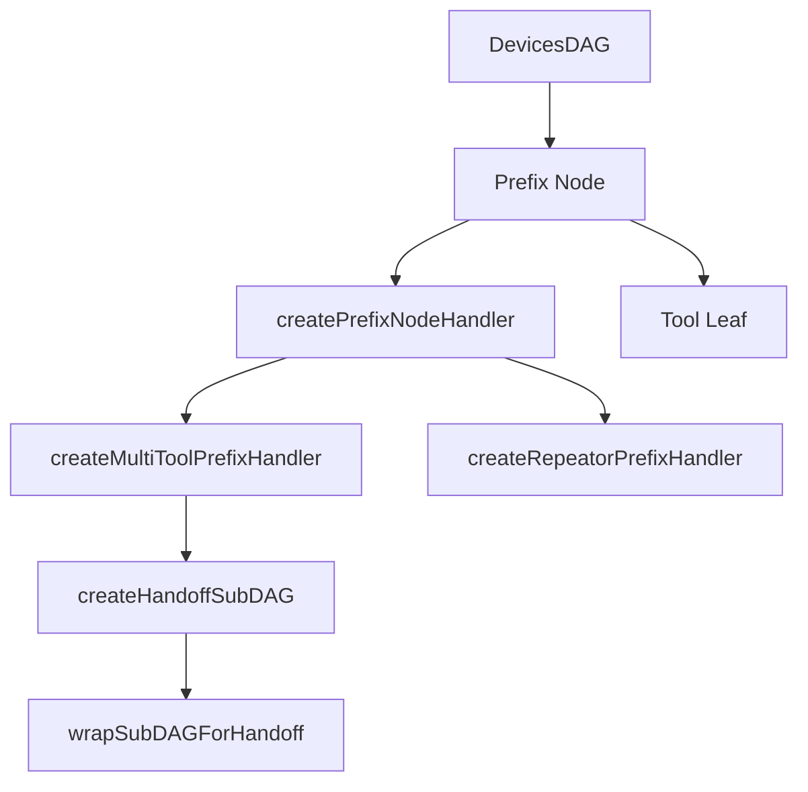

# 修饰节点（prefix）

## 概述

修饰节点是 DevicesDAG 中的一种职责语义，不是新的节点类型。它仍然是一个 `DevicesDAGNode`，只是通过 `semantics.prefix === true` 标记。

修饰节点位于信号链路中的前置处理层，负责记录、参数注入、路由分发、状态机切换和局部上下文编排。它与末端消费工具形成互补：修饰节点负责“怎么走”，工具负责“到了之后做什么”。

## `semantics.prefix === true` 是什么

它是 `DAGNodeBuilder.prefix(handler)` 自动写入节点元数据的一个标记。

它的作用是：

- 让调试和文档层知道这个节点承担 prefix 职责
- 让阅读 `semantics` 的调用方快速区分普通节点、prefix 节点和 tool 节点
- 不引入新的运行时分发分支

这意味着：

- prefix 仍然是普通 `DevicesDAGNode`
- dispatcher 不会因为 `semantics.prefix` 自动改写路径
- 真正的控制逻辑仍由 `handler`、节点 state 和累积 `context` 决定

## 当前协作模型

prefix 节点现在依赖三条稳定边界：

- **局部向下路由**：后续包只能继续发给当前节点的后代
- **节点 state**：保存可变共享数据，例如锚点、活动 child、桥接对象
- **累积 context**：逐层追加只读信息，例如 `board`、`monitor`、`onToolComplete`

这里需要特别区分两件事：

- 节点 state 适合保存跨多次输入仍然需要保留的局部状态
- 累积 context 适合保存当前链路内的只读注入数据或回调函数

## 模块清单

| 文件                     | 导出                                          | 用途                        |
| ------------------------ | --------------------------------------------- | --------------------------- |
| `index.js`               | 统一导出入口                                  | 集中导出全部公开 API        |
| `utils.js`               | `isPlainObject`, `shallowCloneSignals`        | 内部工具方法                |
| `handler.js`             | `createPrefixNodeHandler`                     | 基础修饰节点处理器          |
| `multi-tool-handler.js`  | `createMultiToolPrefixHandler`                | 多工具状态机路由            |
| `repeator-handler.js`    | `createRepeatorPrefixHandler`                 | 信号复制分发                |
| `handoff-handler.js`     | `createHandoffSubDAG`, `wrapSubDAGForHandoff` | first → second 两阶段工作流 |
| `drag-anchor-handler.js` | `createDragAnchorPrefixHandler`               | 拖拽位移转换                |

## 关系图



## 基础处理器：`createPrefixNodeHandler`

`createPrefixNodeHandler` 是最轻量的 handler 工厂。它的唯一额外职责是提供 `initialState` 默认值合并——使 `ctx.state` 自动包含初始默认值。

状态管理（`state` / `getState` / `setState` / `patchState`）和路由操作（`routeToChild` / `stop`）**均来自 DevicesDAG 的标准上下文**，不由本模块注入。

```js
const handler = createPrefixNodeHandler({
  initialState: { anchor: null },
  handle(packet, ctx) {
    // ctx.state 自动带有 { anchor: null } 默认值
    // ctx.routeToChild / ctx.stop 来自 DAG
    ctx.patchState({ anchor: current });
    return ctx.routeToChild("tool", packet.signals);
  },
});
```

若不需要 `initialState`，可以直接用裸 handler，拿到的 ctx 也有同样的 helper。

## 多工具状态机：`createMultiToolPrefixHandler`

基于基础处理器构建，通过 `resolveTransition` 回调实现状态驱动的子节点路由。

当前路由决策对象的稳定字段有：

| 字段         | 类型      | 语义                                |
| ------------ | --------- | ----------------------------------- |
| `child`      | `string`  | 路由到特定子节点                    |
| `consume`    | `boolean` | 消费信号，不继续转发                |
| `to`         | `string`  | 覆盖默认 child 路径，仍然只指向后代 |
| `patchState` | `Object`  | 合并到当前状态                      |
| `state`      | `Object`  | 直接替换当前状态                    |
| `signals`    | `Array`   | 改写下发信号                        |
| `context`    | `Object`  | 追加到下游累积 context              |

```js
const handler = createMultiToolPrefixHandler({
  defaultChild: "first",
  initialState: { activeChild: "first", phase: "first" },
  resolveTransition({ state }) {
    return { child: state.activeChild };
  },
});
```

`transition.acc` 是 prefix 把回调或只读数据传给当前活动子链的关键途径。

## 信号复制分发：`createRepeatorPrefixHandler`

`repeator` 会把输入信号复制为多份，分别发给不同子节点，或同一个子节点的多份副本。

```js
const handler = createRepeatorPrefixHandler({
  toChildren: ["tool-a", "tool-b"],
});
```

若未显式提供 `toChildren`，它会回退到当前节点的 `defaultRoute`。

## Handoff 工作流：`createHandoffSubDAG`

详细文档见 [handoff-handler-document.md](./handoff-handler-document.md)。

`createHandoffSubDAG` 把 first → second 的两阶段工作流封装成一棵结构化子树。典型场景包括 creator → modifier、chooser → modifier、SubDAGDefinition → modifier。

辅助函数：

- `wrapSubDAGForHandoff(subDAGDef, options)`：子树根节点满足条件时调用 `onToolComplete`
- handler 内部桥接：在 first / second 节点 handler 中临时订阅工具钩子，触发时调用累计 context 中的 `onToolComplete`

钩子清理：handoff 保存 `beforeCommitCreatedObject` 原始引用，通过 `subDAG.resetHandoff()` 恢复。

## 拖拽位移转换：`createDragAnchorPrefixHandler`

`createDragAnchorPrefixHandler` 将位置序列转换为累计位移 `{ x, y }`，并输出 `displacement` 信号。

工作流程：

1. 每次收到 `position` 信号：计算从锚点出发的累计位移并替换：
   - 首个 `position` 同时记录锚点，位移为 `{x: 0, y: 0}`
   - 后续 `position` 基于锚点计算累计位移
2. 同包中非 `position` 信号**保留不变**，仅 `position` 被替换为 `displacement`
3. `end` 信号：清空锚点，但同包中的 `position` 仍转为 `displacement` 后再转发

信号变换示意：

```text
输入: [position, customA, end]  ->  输出: [customA, end, displacement]   （end 分支，仍替换 position）
输入: [position, customB]       ->  输出: [customB, displacement]        （锚点就绪时替换）
输入: [position]                ->  输出: [displacement]                 （仅 position 时）
```

> **注意**：`GestureBasedObjectModifierTool` 及其子类 `CommonObjectModifierTool` 直接消费 `position` 信号，不再需要 `drag-anchor` 前缀转换。此 prefix 仍可用于其他需要累计位移的消费方。

## 子树构建

修饰节点工作流通常通过 `createSubDAG` DSL 构建，再通过 `monitor.mountSubDAG()` 注册到 DevicesDAG。

```js
const builder = createSubDAG("/mouse/primary/tool");
const toolNode = builder.node().tool(new CommonObjectModifierTool());

builder.edge("tool", null, toolNode);

monitor.mountSubDAG("", builder.build());
```

## 设计约束

- `handler` 与 `tool` 不能在同一结构化节点上同时声明
- prefix 语义通过 `semantics` 标记表达，不引入新的节点类
- 节点状态通过 `getNodeState()` / `setNodeState()` 显式管理
- first / second 的切换使用累积 `context` 中的回调完成
- handoff 通过生命周期钩子订阅实现完成通知，不替换工具方法

## 相关文档

- [handoff-handler-document.md](./handoff-handler-document.md)
- [handler 上下文（ctx）用法](../../devices-dag/docs/handler-context-document.md)
- [设备图](../../devices-dag/docs/devices-dag-document.md)
- [对象创建工具](../../tools/creator/docs/object-creator-document.md)
- [对象选择工具](../../tools/chooser/docs/object-chooser-document.md)
- [对象修改工具](../../tools/modifier/docs/object-modifier-document.md)
- [Core 输入流](../../docs/core-input-flow.md)
