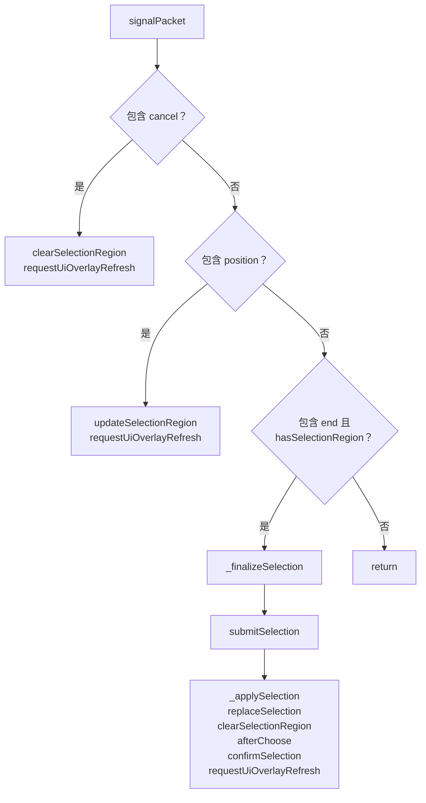
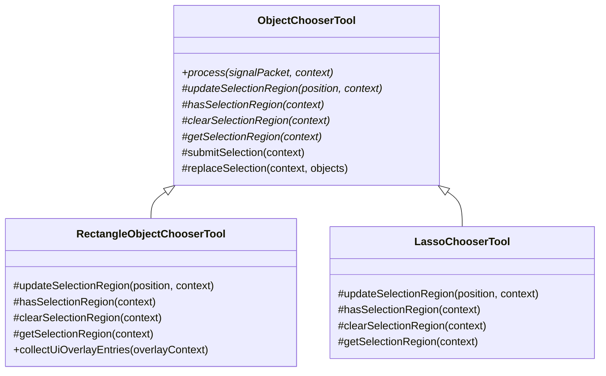
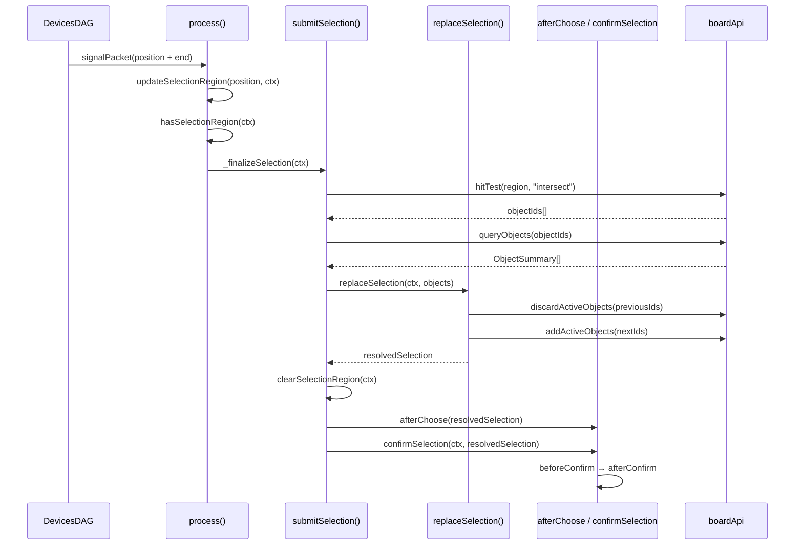

# 对象选择工具文档

## 概述

对象选择工具负责从白板中挑选对象，并把它们加入 AOM 动态图，作为后续 modifier 的输入来源。

chooser 本身不修改对象几何。它的职责是：

- 决定哪些对象被选中
- 把这些对象送入 AOM
- 在必要时把选择结果桥接给 handoff / modifier

## 运行边界

- chooser 运行在 UI 线程
- 真实命中与对象摘要读取通过 `BoardApiRpc` 发往 Worker
- 选中对象进入 AOM 后，动态图由 Worker 侧 `ActiveObjectManager` 维护

## 数据形态

chooser 统一使用 `ObjectSummary` 纯数据条目，通过以下方法处理：

- `resolveSelectedObjectReference()` — 条目透传
- `resolveSelectedObjectReferences()` — 批量归一化
- `resolveObjectSelectionWorldRange()` — 世界范围解析
- `resolveObjectIds()` — 提取数字 ID

## process 调度

`ObjectChooserTool.process()` 实现所有选择工具共享的手势状态机，子类只需实现区域 hook：



## 子类 hook

子类通过实现以下 hook 来声明自己的选择区域：



| Hook                                       | 职责                                              |
| ------------------------------------------ | ------------------------------------------------- |
| `updateSelectionRegion(position, context)` | 用新位置创建或更新选择区域几何                    |
| `hasSelectionRegion(context)`              | 返回当前是否存在有效区域                          |
| `clearSelectionRegion(context)`            | 清理区域状态（umount 和 cancel 时调用）           |
| `getSelectionRegion(context)`              | 返回区域对象，供默认 `submitSelection` 做命中检测 |

## 可选覆写

`submitSelection(context)` 默认实现：

```
getSelectionRegion(context)
  → region 无效？返回 []
  → boardApi 不存在？返回 []
  → boardApi.hitTest(region, "intersect")
  → boardApi.queryObjects(objectIds)
  → ObjectSummary[]
```

子类可覆写此方法以自定义命中方式。例如点选用 `"enclosed"` 模式、路径选用多边形命中。

`replaceSelection(context, objects)` 处理通用的选择替换：

1. 丢弃上一轮选择（`boardApi.discardActiveObjects`）
2. 清空 context objects
3. 解析新条目
4. 激活新对象（`boardApi.addActiveObjects`）
5. 写回 context

## 选择生命周期



`_applySelection` 总是在 end 手势后执行一次 `replaceSelection`，即使命中结果为空——空选择同样会清理上一轮选择。`afterChoose` 和 `confirmSelection` 只在有选中对象时触发。

## overlay

父类默认 overlay 路径：

```js
renderer.createCompatSelectionEntriesForSummaries(objects, "chooser");
```

兼容 summary-like 条目和 plain `boundingBox` / `worldRect`。子类可在 `collectUiOverlayEntries` 中通过 `super.collectUiOverlayEntries()` 组合基类结果后附加自己的区域 overlay。

## 卸载清理

`umount(context)` 依次执行：

1. `clearSelectionRegion(context)` — 清理子类区域状态
2. `discardActiveObjects` — 丢弃当前活动对象
3. `clearContextObjects` — 清空节点上下文
4. `super.umount()`

## 与 modifier 的对称性

| 工具族   | 父类 process（手势骨架） | 子类提供（hook 方法）                                                                          |
| -------- | ------------------------ | ---------------------------------------------------------------------------------------------- |
| modifier | `ObjectModifierTool`     | `beginModifyGesture` / `applyModifyGesture` / `completeModifyGesture` / `cancelModifyGesture`  |
| chooser  | `ObjectChooserTool`      | `updateSelectionRegion` / `hasSelectionRegion` / `clearSelectionRegion` / `getSelectionRegion` |

两个工具族共用同一模式：父类骨架处理信号调度与生命周期，子类通过 hook 注入具体行为。

## 相关文档

- [rectangle-object-chooser-document.md](./rectangle-object-chooser-document.md)
- [object-modifier-document.md](../../modifier/docs/object-modifier-document.md)
- [ui-renderer-document.md](../../../components/renderer/docs/ui-renderer-document.md)
- [core-runtime-boundaries.md](../../../docs/core-runtime-boundaries.md)
