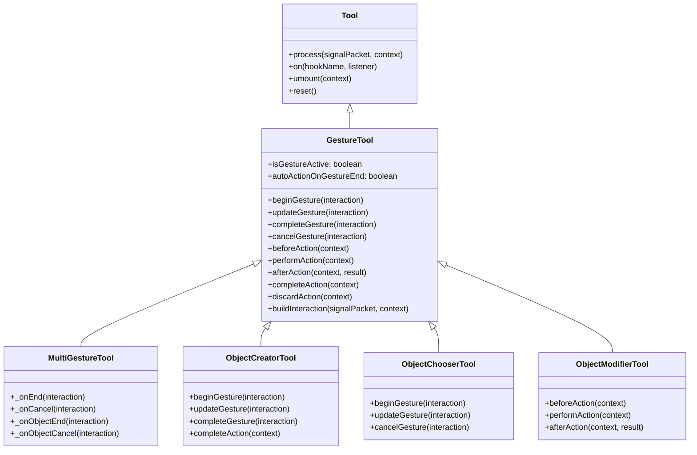

# 手势工具基类

## 概述

`GestureTool` 和 `MultiGestureTool` 是白板交互工具的公共基类，位于 `Tool` 之上。

它们将工具的交互行为规范为两个独立的生命周期层：

- **手势生命周期**：物理交互过程（鼠标按下拖拽、笔划绘制）
- **动作生命周期**：交互结果的含义（创建/选择/修改对象的语义提交）

三族工具（Creator / Chooser / Modifier）统一挂在该骨架下，共享相同的信号路由与事件机制。

## 继承关系



## 手势生命周期

手势层模拟一次拖拽交互的完整过程：

```
beginGesture  →  updateGesture*  →  completeGesture / cancelGesture
```

| 方法                           | 触发条件                   | 职责                                  |
| ------------------------------ | -------------------------- | ------------------------------------- |
| `canBeginGesture(interaction)` | 首个 `position` 信号到达时 | 准入检测；返回 `false` 则拒绝开始手势 |
| `beginGesture(interaction)`    | 准入通过后                 | 记录锚点、创建草稿、初始化状态        |
| `updateGesture(interaction)`   | 后续每个 `position` 信号   | 追加路径点、更新选择区域、计算位移    |
| `completeGesture(interaction)` | `end` 信号到达时           | 清理临时状态（手势结束，不提交）      |
| `cancelGesture(interaction)`   | `cancel` 信号到达时        | 回滚到手势前状态                      |

`GestureTool` 不直接处理 `displacement` 信号，这一通道由 `GestureBasedObjectModifierTool` 自行处理。

## 动作生命周期

动作层处理交互结果的语义提交：

```
beforeAction  →  performAction  →  afterAction
completeAction(context)   ← 编排方法
discardAction(context)    ← 丢弃方法
```

| 方法                           | 职责                                              |
| ------------------------------ | ------------------------------------------------- |
| `beforeAction(context)`        | 控制流拦截，返回 `false` 阻止 `performAction`     |
| `performAction(context)`       | 核心语义操作：commitObjects / replaceSelection 等 |
| `afterAction(context, result)` | 通知钩子，触发 `action:complete` 事件             |
| `completeAction(context)`      | 编排 `beforeAction → performAction → afterAction` |
| `discardAction(context)`       | 丢弃当前动作持有的对象或状态                      |

### Creator 特殊语义

Creator 的 `completeAction` 具有独特的非对称语义：

1. `finalizeCreatedObject(interaction)` — **总是**执行，回填 boundingBox、标记完成
2. `beforeCommitCreatedObject(interaction)` — 决定是否 commit
3. `commitCreatedObject(interaction)` — 仅当 beforeCommit 返回 true 时执行
4. `afterCompleteCreatedObject(interaction, completedObject)` — **总是**执行
5. `super.afterAction(context, completedObject)` — 触发 `action:complete`

即：finalize 和通知始终执行，commit 受控于 beforeCommit。handoff 通过注入 `context.acc.autoCommit = false` 拦截 commit。

## 信号分派

```mermaid
flowchart TD
    S[process(signalPacket, context)] --> OC{"hasObjectCancel?"}
    OC -->|是| OCC[_onObjectCancel]
    OC -->|否| C{"hasCancel?"}
    C -->|是| CC[_onCancel]
    C -->|否| OE{"hasObjectEnd?"}
    OE -->|是| OEE[_onObjectEnd]
    OE -->|否| SU{"hasSuccess?"}
    SU -->|是| SS[_onSuccess]
    SU -->|否| PO{"has position?"}
    PO -->|是| GS[gesture state machine]
    GS --> EN{"has end?"}
    EN -->|是| EE[_onEnd]
```

### 优先级

1. `object-cancel` — 最高优先级，丢弃整个对象
2. `cancel` — 取消当前手势
3. `object-end` — 结束整个对象（多手势模式专用）
4. `success` — 显式提交动作
5. `position` — 驱动手势状态机
6. `end` — 结束手势 + 可选自动动作

### 默认语义（GestureTool）

| 方法              | 行为                                                                |
| ----------------- | ------------------------------------------------------------------- |
| `_onEnd`          | `completeGesture` + `autoActionOnGestureEnd ? completeAction : nop` |
| `_onCancel`       | `cancelGesture` + `discardAction`                                   |
| `_onObjectEnd`    | 委托给 `_onEnd`（单手势下等价）                                     |
| `_onObjectCancel` | 委托给 `_onCancel`（单手势下等价）                                  |
| `_onSuccess`      | `completeGesture` + `completeAction`                                |

### 多手势语义（MultiGestureTool）

| 方法              | 行为                                 |
| ----------------- | ------------------------------------ |
| `_onEnd`          | 仅 `completeGesture`，不触发 action  |
| `_onCancel`       | 仅 `cancelGesture`，不丢弃对象       |
| `_onObjectEnd`    | `completeGesture` + `completeAction` |
| `_onObjectCancel` | `cancelGesture` + `discardAction`    |
| `_onSuccess`      | `completeGesture` + `completeAction` |

## 信号驱动方式

| 信号            | 手势模式   | 动作模式           | 来源               |
| --------------- | ---------- | ------------------ | ------------------ |
| `position`      | 驱动状态机 | —                  | 鼠标/触摸位移      |
| `displacement`  | 无状态增量 | —                  | 键盘快捷键（WASD） |
| `end`           | 结束手势   | 可选自动动作       | 鼠标/触摸释放      |
| `cancel`        | 取消手势   | 丢弃动作           | Escape 键          |
| `success`       | —          | 显式提交           | Enter 键           |
| `object-end`    | 结束手势   | 提交动作（多手势） | 显式完成操作       |
| `object-cancel` | 取消手势   | 丢弃动作（多手势） | 显式取消操作       |

## 事件机制

统一事件名，namespace 格式：

| 事件              | 触发时机                 |
| ----------------- | ------------------------ |
| `gesture:begin`   | `beginGesture()` 之后    |
| `gesture:update`  | `updateGesture()` 之后   |
| `gesture:end`     | `completeGesture()` 之后 |
| `gesture:cancel`  | `cancelGesture()` 之后   |
| `action:complete` | `afterAction()` 中       |

订阅方式：

```js
tool.on("action:complete", (context, result) => {
  // result 是 performAction 的返回值
});
```

## 创建 Processor

`GestureTool` 不覆写 `Tool.createProcessor()`，但 `GestureBasedObjectModifierTool` 覆写了 `process()` 以添加 displacement 双通道的支持。三种族的 process 入口统一走 `GestureTool.process()`。

## 三族对比

| 方面     | Creator                                         | Chooser                                   | Modifier                                           |
| -------- | ----------------------------------------------- | ----------------------------------------- | -------------------------------------------------- |
| 手势起始 | 首个 position → `ensureObject` + `beginGesture` | 首个 position → `beginGesture`            | 首个 position → `canBeginGesture` + `beginGesture` |
| 手势更新 | `updateGesture`                                 | `updateGesture` → `updateSelectionRegion` | `updateGesture` + 可选 `displacement`              |
| 手势结束 | `completeGesture` + `completeAction`            | `completeGesture` + `completeAction`      | `completeGesture` 不动作                           |
| 提交     | end 自动提交，`beforeCommitCreatedObject` 拦截  | end 自动提交，`beforeAction` 拦截         | success 显式提交                                   |
| 取消     | 回调 + discard                                  | 清拖拽区，不撤已选                        | 回滚到初始位置 + discard                           |

## `buildInteraction`

从信号包中提取统一交互上下文：

```js
{
  signalPacket,
  context,
  signals,
  position,         // Vector|null，世界坐标
  hasCancel,
  hasEnd,
  hasObjectCancel,
  hasObjectEnd,
  hasSuccess,
}
```

Creator 扩展为 `buildInteractionContext`，额外提供 `injectedProperty`、`objectId`、`isGestureEnded` 等兼容字段。

## 相关文档

- [tool-document.md](./tool-document.md)
- [object-creator-document.md](./creator/docs/object-creator-document.md)
- [object-chooser-document.md](./chooser/docs/object-chooser-document.md)
- [object-modifier-document.md](./modifier/docs/object-modifier-document.md)
- [handoff-handler-document.md](../prefixs/docs/handoff-handler-document.md)
