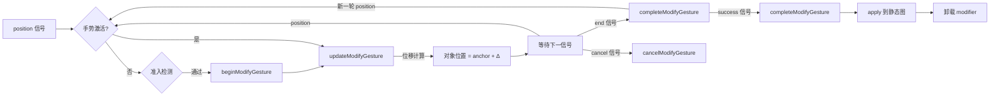

# 对象修改工具文档

## 概述

对象修改工具负责对已有对象进行几何或属性编辑。其核心目标是保证修改前后状态一致，并让活动层渲染正确刷新。

## 架构概览

```
ObjectModifierTool（基类：基础设施）
  ├─ withGeometryMutation()         ← 快照/刷新协议
  ├─ applyModifiedObjects()         ← 提交到静态图
  ├─ resolveActiveModifiedObjects() ← AOM 过滤
  ├─ umount() / collectUiOverlayEntries()
  └─ ...
  │
  └─ GestureBasedObjectModifierTool（中间抽象层：手势调度）
       ├─ process()                       ← 固定手势调度逻辑
       ├─ buildModifyInteractionContext() ← 信号提取
       ├─ canBeginModifyGesture()         ← hook（准入）
       ├─ beginModifyGesture()            ← hook（抽象）
       ├─ updateModifyGesture()           ← hook（抽象）
       ├─ completeModifyGesture()         ← hook
       ├─ cancelModifyGesture()           ← hook
       └─ reset() / umount()              ← 状态清理
            │
            └─ CommonObjectModifierTool（具体实现：位置位移）
                 ├─ canBeginModifyGesture → 合矩形命中检测
                 ├─ beginModifyGesture    → 记录锚点 + 初始位置
                 ├─ updateModifyGesture   → 锚点基准位移计算
                 ├─ completeModifyGesture → 清空缓存
                 └─ reset()               → 清空缓存 + 调用 super
```

## 关键能力

`ObjectModifierTool`（基类）

- `resolveModifiedObjects(modificationContext, objects)`：规整本次修改涉及的对象集合
- `resolveActiveModifiedObjects(modificationContext, objects)`：仅保留当前仍在 AOM 动态图中的对象
- `beforeGeometryMutation(modificationContext, objects)`：修改前捕获对象快照
- `afterGeometryMutation(modificationContext, objects)`：修改后通知 LiveRenderer.invalidateObjects(...)，并同步推动 ui 层兼容 overlay 刷新
- `withGeometryMutation(modificationContext, mutate, objects)`：把一次对象修改封装为"快照 → 变更 → 失效"的统一流程
- `applyModifiedObjects(modificationContext, objects)`：将当前对象提交回静态图并结束本次修改流程

`GestureBasedObjectModifierTool`（手势驱动中间层）

- `process(signalPacket, deviceContext)`：固定手势调度逻辑，子类无需覆写
- `buildModifyInteractionContext(signalPacket, deviceContext)`：从信号包提取 position/end/cancel/success
- `canBeginModifyGesture(interaction)`：准入检测 hook，子类可覆写
- `beginModifyGesture(interaction)`：手势开始 hook（abstract）
- `updateModifyGesture(interaction)`：手势更新 hook（abstract）
- `completeModifyGesture(interaction)`：手势完成 hook
- `cancelModifyGesture(interaction)`：手势取消 hook

## 提交生命周期钩子

`applyModifiedObjects(modificationContext, objects)` 内部按钩子编排提交流程：

```
applyModifiedObjects(modificationContext, objects)
  │
  ├─ ① resolveActiveModifiedObjects()  ← 解析 AOM 动态图中的对象
  │
  ├─ ② beforeApplyModifiedObjects()    ← 控制型钩子，返回 bool
  │     └─ false → 终止，不提交
  │
  ├─ ③ AOM.apply()                     ← 提交到静态图
  │
  ├─ ④ autoUmountOnApply 检查          ← 支持双层读取（顶层 / 累积 context）
  │     └─ handoff 通过 context 注入 false 阻止自卸载
  │
  └─ ⑤ afterApplyModifiedObjects()     ← 通知型钩子，触发 "afterApply" 事件
```

### 控制型钩子：`beforeApplyModifiedObjects`

决定是否执行 apply。handoff 可通过覆盖或订阅控制提交行为。

```js
// 默认：允许提交
beforeApplyModifiedObjects(modificationContext, objects) {
  return true;
}
```

### 通知型钩子：`afterApplyModifiedObjects`

提交成功后触发 `"afterApply"` 事件，handoff 借以感知 modifier 完成并切回 first。

```js
modifier.on("afterApply", (ctx, objects, result) => {
  // 修改已提交，可切回 creator
});
```

### autoUmountOnApply 的双层读取

`applyModifiedObjects` 检查 `autoUmountOnApply` 时支持两层：

1. `modificationContext.autoUmountOnApply` — 直接传入
2. `modificationContext.context?.autoUmountOnApply` — 通过累积 context 注入（handoff 方式）

handoff 通过 `resolveTransition` 的 `transition.context` 注入 `autoUmountOnApply: false`，无需覆盖 modifier 的任何方法。

## 上下文解析规则

修改工具统一通过 Tool.resolveContextObjects() 读取对象集合。

modifier 优先消费：

- 当前 modificationContext 上已经显式提供的 object 或 objects
- 当前节点 state 中的 object 或 objects

creator 和 chooser 若需要把对象交给 modifier，不再写 nodeContext，而是显式把对象同步到目标 modifier 节点路径的 state。

当前 `UiRenderer` 的兼容选择框实现也会读取这份 modifier 节点 state。

这意味着：

- 当当前工具是 modifier 时，选择框显示在当前被修改对象各自的矩形范围上
- 若当前修改的是多个对象，除了各自矩形框，还会额外显示这些矩形的最小外接大矩形

真正开始修改前，还会再做一层 AOM 过滤：

- 如果当前 board.activeObjectManager.activeObjectIndex 可用，则只保留仍在动态图里的对象
- 不在 AOM 中的对象不会被 modifier 继续修改

## 手势驱动模型

`GestureBasedObjectModifierTool` 采用 `position` 信号驱动的手势模型，与 Creator 侧的 `SingleGestureObjectCreatorTool` 对齐。

### 信号类型

| 信号类型 | 常量                       | 语义                                                   |
| -------- | -------------------------- | ------------------------------------------------------ |
| 位置更新 | `POSITION: "position"`     | 携带世界坐标 `{ x, y }`，内部以锚点为基准计算位移      |
| 手势结束 | `GESTURE_END: "end"`       | 结束当前手势，对象保留在动态图中，后续可开始新一轮手势 |
| 手势取消 | `GESTURE_CANCEL: "cancel"` | 取消当前手势（对象不回滚，仅停止接收后续位置更新）     |
| 提交修改 | `SUCCESS: "success"`       | 将修改完毕的对象 apply 到静态图，结束修改流程          |

### 手势生命周期



### process() 调度流程

`GestureBasedObjectModifierTool.process()` 内部编排如下：

1. `SignalPacket.from(signalPacket)` 归一化信号包
2. `buildModifyInteractionContext()` 提取 position、end、cancel、success 等信号
3. 构造扁平的 `modificationContext`（使基类方法能访问 `context.board/monitor`）
4. `resolveActiveModifiedObjects()` 解析 AOM 动态图中的对象
5. cancel 信号 → `cancelModifyGesture()`，清空手势（对象不回滚）
6. success 信号 → `completeModifyGesture()` → `applyModifiedObjects()`，提交到静态图
7. 无 position → 仅处理孤立 end 信号
8. 首个 position → `canBeginModifyGesture()` 准入检测 → `withGeometryMutation({ beginModifyGesture + updateModifyGesture })`
9. 后续 position → `withGeometryMutation({ updateModifyGesture })`
10. end 信号 → `withGeometryMutation({ completeModifyGesture })`，对象留在动态图

### GestureBasedObjectModifierTool —— 手势调度中间层

将 `process()` 固定下来，定义手势生命周期编排流程。**子类只需实现 hook，无需关心 process() 调度细节**，与 Creator 侧 `SingleGestureObjectCreatorTool` 的子类模式完全一致。

所有 `begin/update/complete` 调用都包裹在 `withGeometryMutation` 中，自动执行 `captureObjectSnapshot` → mutate → `invalidateObjects` 协议，子类 hook 只需关心业务逻辑。

### CommonObjectModifierTool —— 通用位置位移修改器

`beginModifyGesture` 以手势起始光标位置为锚点 (`_anchorPosition`)，`updateModifyGesture` 计算位移 = `position - anchor` 并更新所有对象。

锚点语义（保持光标偏移）：

- 用户手势起点 `position` = `(35, 35)`，对象在 `(10, 20)`
- `beginModifyGesture`：锚点 = `(35, 35)`（光标位置），记录对象初始位置 `(10, 20)`
- 首个 `updateModifyGesture`：位移 = `(35 - 35, 35 - 35)` = `(0, 0)`，对象保持在 `(10, 20)`
- 光标移动到 `(40, 40)` 时：位移 = `(40 - 35, 40 - 35)` = `(5, 5)`，对象移到 `(15, 25)`
- 光标与对象之间的初始相对偏移 `(25, 15)` 始终保持不变

多对象选择时所有对象共用同一锚点，朝同方向移动等量位移，各自保持与光标的初始相对偏移。

### 手势准入检测

首个 `position` 信号到来时，`canBeginModifyGesture` 判断世界坐标是否落在持有对象的合矩形范围内：

- **在合矩形内** → 正常启动手势
- **在合矩形外** → 拒绝手势，不修改对象
- 若对象不支持 `getRange()`，则跳过准入检测

## 为什么使用 withGeometryMutation

ObjectModifierTool 的典型场景是“某个已存在对象的一次性修改”。

因此它适合提供统一包装器：

- 修改前自动抓取旧几何状态
- 执行修改回调
- 修改后自动触发活动层刷新，并让选中框等兼容 ui overlay 跟上对象变化

这避免了各个 modifier 子类重复写相同的刷新逻辑。

## 当前状态

- `ObjectModifierTool` 已经把几何刷新协议沉淀到基类
- `GestureBasedObjectModifierTool` 提供手势调度中间层，子类只需实现 hook
- `CommonObjectModifierTool` 为位置位移的具体实现，使用 `position` 信号驱动
- 具体 modifier 应优先复用基类的 `withGeometryMutation()`
- modifier 当前只修改 AOM 中的动态对象，不直接编辑静态图对象
- success 提交后 modifier 会卸载，umount 时也会执行清理
- 上下文共享仅限当前工作流涉及的节点路径，不应跨事件复用
- 这条 ui 刷新链当前仍属于 Core 兼容行为，不代表 ui overlay 的最终归属已经定案
