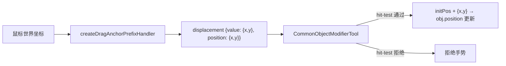

# 对象修改工具文档

## 概述

对象修改工具负责对已有对象进行几何或属性编辑。其核心目标是保证修改前后状态一致，并让活动层渲染正确刷新。

## 关键能力

- resolveModifiedObjects(modificationContext, objects)：规整本次修改涉及的对象集合
- resolveActiveModifiedObjects(modificationContext, objects)：仅保留当前仍在 AOM 动态图中的对象
- beforeGeometryMutation(modificationContext, objects)：修改前捕获对象快照
- afterGeometryMutation(modificationContext, objects)：修改后通知 LiveRenderer.invalidateObjects(...)，并同步推动 ui 层兼容 overlay 刷新
- withGeometryMutation(modificationContext, mutate, objects)：把一次对象修改封装为“快照 -> 变更 -> 失效”的统一流程
- applyModifiedObjects(modificationContext, objects)：将当前对象提交回静态图并结束本次修改流程

## 提交生命周期钩子

`applyModifiedObjects(modificationContext, objects)` 内部按钩子编排提交流程：

```
applyModifiedObjects(modificationContext, objects)
  │
  ├─ ① resolveActiveModifiedObjects()  ← 解析 AOM 动态图中的对象
  │
  ├─ ② beforeApplyModifiedObjects()    ← 控制型钩子，返回 bool
  │     └─ false → 终止，不提交
  │
  ├─ ③ AOM.apply()                     ← 提交到静态图
  │
  ├─ ④ autoUmountOnApply 检查          ← 支持双层读取（顶层 / 累积 context）
  │     └─ handoff 通过 context 注入 false 阻止自卸载
  │
  └─ ⑤ afterApplyModifiedObjects()     ← 通知型钩子，触发 "afterApply" 事件
```

### 控制型钩子：`beforeApplyModifiedObjects`

决定是否执行 apply。handoff 可通过覆盖或订阅控制提交行为。

```js
// 默认：允许提交
beforeApplyModifiedObjects(modificationContext, objects) {
  return true;
}
```

### 通知型钩子：`afterApplyModifiedObjects`

提交成功后触发 `"afterApply"` 事件，handoff 借以感知 modifier 完成并切回 first。

```js
modifier.on("afterApply", (ctx, objects, result) => {
  // 修改已提交，可切回 creator
});
```

### autoUmountOnApply 的双层读取

`applyModifiedObjects` 检查 `autoUmountOnApply` 时支持两层：

1. `modificationContext.autoUmountOnApply` — 直接传入
2. `modificationContext.context?.autoUmountOnApply` — 通过累积 context 注入（handoff 方式）

handoff 通过 `resolveTransition` 的 `transition.context` 注入 `autoUmountOnApply: false`，无需覆盖 modifier 的任何方法。

## 上下文解析规则

修改工具现在统一通过 Tool.resolveContextObjects() 读取对象集合。

也就是说，modifier 优先消费：

- 当前 modificationContext 上已经显式提供的 object 或 objects
- 当前节点 state 中的 object 或 objects

creator 和 chooser 若需要把对象交给 modifier，不再写 nodeContext，而是显式把对象同步到目标 modifier 节点路径的 state。

当前 `UiRenderer` 的兼容选择框实现也会读取这份 modifier 节点 state。

这意味着：

- 当当前工具是 modifier 时，选择框显示在当前被修改对象各自的矩形范围上
- 若当前修改的是多个对象，除了各自矩形框，还会额外显示这些矩形的最小外接大矩形

真正开始修改前，还会再做一层 AOM 过滤：

- 如果当前 board.activeObjectManager.activeObjectIndex 可用，则只保留仍在动态图里的对象
- 不在 AOM 中的对象不会被 modifier 继续修改

## 手势驱动的修改语义

CommonObjectModifierTool 采用与 creator 一致的手势模型，不再依赖绝对坐标。

### 信号类型

| 信号类型 | 常量                                   | 语义                                                   |
| -------- | -------------------------------------- | ------------------------------------------------------ |
| 位移更新 | `"displacement"`                       | 携带 `{ x, y }` 从手势锚点出发的累计位移               |
| 手势结束 | `"end"`                                | 结束当前手势，对象保留在动态图中，后续可开始新一轮手势 |
| 提交修改 | `OBJECT_MODIFIER_SIGNAL_TYPES.SUCCESS` | 将修改完毕的对象 apply 到静态图，结束修改流程          |

### 手势生命周期

```mermaid
flowchart LR
    A[displacement 信号] --> B{手势激活?}
    B -->|否| C[记录初始位置]
    C --> D[对象位置 = initPos + {x,y}]
    B -->|是| D
    D --> E[等待下一信号]
    E -->|displacement| B
    E -->|end 信号| F[手势结束]
    F -->|新一轮 displacement| B
    E -->|success 信号| G[apply 到静态图]
    G --> H[卸载 modifier]
```

### 与 drag-anchor 的协作

`createDragAnchorPrefixHandler` 输出累计 `{ x, y }` 位移信号，同时保留原始世界坐标 `position`。modifier 通过 `context.value` 取位移、通过 `context.position` 做手势准入检测。

drag-anchor **只挂在 modifier 路径上**，不覆盖 handoff 整体：

```js
// handoff 结构：first 直通原始信号，second 经过 drag-anchor → modifier
const builder = createSubDAG("/mouse/primary/tool");
const toolNode = builder
  .node()
  .prefix(createDragAnchorPrefixHandler())
  .tool(new CommonObjectModifierTool());

// 外部将这个 builder 构建为 modifier 子图，挂入 handoff 的 second 分支
```

### 手势准入检测

首个 `displacement` 信号到来时，modifier 会根据 `context.position` 判断当前鼠标位置是否落在持有对象的合矩形范围内：

- **在合矩形内** → 正常启动手势，记录各对象初始位置，应用位移
- **在合矩形外** → 拒绝整个手势，不记录锚点、不修改对象

若没有 `context.position`（向后兼容），或对象不支持 `getRange()`，则跳过准入检测，直接启动手势。

### 信号路径



### 设计要点

- **锚点在 drag-anchor 中**：modifier 无需关心世界坐标，只消费已转换好的累计位移
- **drag-anchor 保留 position**：输出位移时同时携带世界坐标，供准入检测使用
- **手势准入检测**：首个 displacement 时检查 position 是否在对象合矩形内，避免误拖拽
- **无内部累加**：drag-anchor 输出累计值，modifier 直接 `initPos + {x, y}`，无浮点累积误差
- **手势语义清晰**：与 creator 的 `begin/update/completeCreationGesture` 模型一致

## 为什么使用 withGeometryMutation

ObjectModifierTool 的典型场景是“某个已存在对象的一次性修改”。

因此它适合提供统一包装器：

- 修改前自动抓取旧几何状态
- 执行修改回调
- 修改后自动触发活动层刷新，并让选中框等兼容 ui overlay 跟上对象变化

这避免了各个 modifier 子类重复写相同的刷新逻辑。

## 当前状态

- ObjectModifierTool 已经把几何刷新协议沉淀到基类
- 具体 modifier 应优先复用基类的 withGeometryMutation(...)
- modifier 当前只修改 AOM 中的动态对象，不直接编辑静态图对象
- success 提交后 modifier 会卸载，umount 时也会执行清理
- 上下文共享仅限当前工作流涉及的节点路径，不应跨事件复用
- 这条 ui 刷新链当前仍属于 Core 兼容行为，不代表 ui overlay 的最终归属已经定案
