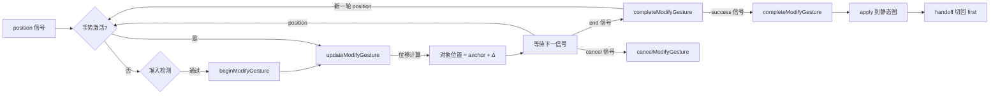

# 对象修改工具文档

## 概述

对象修改工具负责对已有对象进行几何或属性编辑。其核心目标是保证修改前后状态一致，并让活动层渲染正确刷新。

## 术语约定

| 术语       | 含义                                                      |
| ---------- | --------------------------------------------------------- |
| `context`  | `DevicesDAGHandlerContext` 类型，DAG 分发的唯一上下文物件 |
| AOM 动态图 | `ActiveObjectManager` 管理的临时对象层，修改在此层进行    |
| handoff    | creator/chooser → modifier 的两阶段工作流编排             |
| 锚点       | 手势起始光标位置，用于计算位移基准                        |

## 架构概览

```
Tool（基类）
  └─ ObjectModifierTool（基础设施）
       ├─ withGeometryMutation()         ← 快照/刷新协议（try-finally 保护）
       ├─ applyModifiedObjects()         ← 提交到静态图
       ├─ resolveActiveModifiedObjects() ← AOM 过滤
       ├─ umount() / collectUiOverlayEntries()
       └─ ...
       │
       └─ GestureBasedObjectModifierTool（手势调度中间层）
            ├─ process()                       ← 固定手势调度逻辑
            ├─ buildModifyInteractionContext() ← 信号提取
            ├─ canBeginModifyGesture()         ← hook（准入）
            ├─ beginModifyGesture()            ← hook（abstract）
            ├─ updateModifyGesture()           ← hook（abstract）
            ├─ completeModifyGesture()         ← hook
            ├─ cancelModifyGesture()           ← hook
            └─ reset() / umount()              ← 状态清理
                 │
                 └─ CommonObjectModifierTool（具体实现：位置位移）
                      ├─ canBeginModifyGesture → 合矩形命中检测
                      ├─ beginModifyGesture    → 记录锚点 + 初始位置
                      ├─ updateModifyGesture   → 锚点基准位移计算
                      ├─ completeModifyGesture → 清空缓存
                      └─ reset()               → 清空缓存 + 调用 super
```

## 关键能力

### ObjectModifierTool（基类）

方法接受的 `context` 参数均为 `DevicesDAGHandlerContext` 类型，由 DAG 分发时提供。
工具直接使用此上下文，不自构造或改写。

| 方法                                             | 职责                                                                                                                       |
| ------------------------------------------------ | -------------------------------------------------------------------------------------------------------------------------- |
| `resolveModifiedObjects(context, objects)`       | 规整本次修改涉及的对象集合                                                                                                 |
| `resolveActiveModifiedObjects(context, objects)` | 仅保留当前仍在 AOM 动态图中的对象                                                                                          |
| `beforeGeometryMutation(context, objects)`       | 修改前捕获对象快照                                                                                                         |
| `afterGeometryMutation(context, objects)`        | 修改后通知 LiveRenderer 失效 + UI 刷新                                                                                     |
| `withGeometryMutation(context, mutate, objects)` | 把一次对象修改封装为"快照 → 变更 → 失效"的统一流程。`mutate` 抛出异常时，`afterGeometryMutation` 由 `try-finally` 确保执行 |
| `applyModifiedObjects(context, objects)`         | 将当前对象提交回静态图并结束本次修改流程                                                                                   |

### GestureBasedObjectModifierTool（手势驱动中间层）

| 方法                                                   | 职责                                     |
| ------------------------------------------------------ | ---------------------------------------- |
| `process(signalPacket, context)`                       | 固定手势调度逻辑，子类无需覆写           |
| `buildModifyInteractionContext(signalPacket, context)` | 从信号包提取 position/end/cancel/success |
| `canBeginModifyGesture(interaction)`                   | 准入检测 hook，子类可覆写                |
| `beginModifyGesture(interaction)`                      | 手势开始 hook（abstract）                |
| `updateModifyGesture(interaction)`                     | 手势更新 hook（abstract）                |
| `completeModifyGesture(interaction)`                   | 手势完成 hook                            |
| `cancelModifyGesture(interaction)`                     | 手势取消 hook                            |

## 上下文（context）

整个 DAG 中只有一种上下文类型：`DevicesDAGHandlerContext`。

工具收到的 `context` 包含：

- `context.path` — 当前节点路径
- `context.dag` — 所属设备图
- `context.getNodeState(path)` / `context.setNodeState(path, state)` — 节点状态读写
- `context.acc` — 累积上下文，沿分发路径逐层追加
  - `context.acc.board` — Board 实例
  - `context.acc.monitor` — Monitor 实例
  - `context.acc.objects` — 当前工具的操作对象集合
  - `context.acc.autoUmountOnApply` — [handoff] 阻止 modifier 自卸载

**工具不应自行构造、扁平化或改写上下文。** 直接使用 DAG
分发的 `context` 即可。

## 提交生命周期钩子

`applyModifiedObjects(context, objects)` 内部按钩子编排提交流程：

```
applyModifiedObjects(context, objects)
  │
  ├─ ① resolveActiveModifiedObjects()  ← 解析 AOM 动态图中的对象
  │
  ├─ ② beforeApplyModifiedObjects()    ← 控制型钩子，返回 bool
  │     └─ false → 终止，不提交
  │
  ├─ ③ AOM.apply()                     ← 提交到静态图
  │
  ├─ ④ autoUmountOnApply 检查          ← 通过累积 context 注入
  │     └─ handoff 通过 context 注入 false 阻止自卸载
  │
  └─ ⑤ afterApplyModifiedObjects()     ← 通知型钩子，触发 "afterApply" 事件
```

### 控制型钩子：`beforeApplyModifiedObjects`

决定是否执行 apply。handoff 可通过覆盖或订阅控制提交行为。

```js
// 默认：允许提交
beforeApplyModifiedObjects(context, objects) {
  return true;
}
```

### 通知型钩子：`afterApplyModifiedObjects`

提交成功后触发 `"afterApply"` 事件，handoff 借以感知 modifier 完成并切回 first。

```js
modifier.on("afterApply", (ctx, objects, result) => {
  // 修改已提交，可切回 creator
});
```

### autoUmountOnApply 的注入方式

`autoUmountOnApply` 只能通过累积上下文 (`context.context`) 注入，不支持直接作为 `context` 的属性传入。

handoff 通过 `resolveTransition` 的 `transition.acc` 注入 `autoUmountOnApply: false`，无需覆盖 modifier 的任何方法。

注入链路：

```
resolveTransition transition.acc
  → handler context.acc
    → modifier 读取 context.acc?.autoUmountOnApply
```

## 上下文解析规则

修改工具统一通过 `Tool.resolveContextObjects()` 读取对象集合。

modifier 优先消费：

1. 当前 `context` 的累积上下文中已提供的 `context.context.objects`
2. 当前节点 state 中的 `objects`（handoff 通过此路径桥接）

creator 和 chooser 若需要把对象交给 modifier，通过 handoff 的回调将对象写入
modifier 节点路径的 state。

开始修改前还会再做一层 AOM 过滤：

- 如果 `board.activeObjectManager.activeObjectIndex` 可用，只保留仍在动态图中的对象
- 不在 AOM 中的对象不会被 modifier 继续修改

## 手势驱动模型

`GestureBasedObjectModifierTool` 采用 `position` 信号驱动的手势模型，
与 Creator 侧的 `SingleGestureObjectCreatorTool` 对齐。

### 信号类型

| 信号类型 | 常量                       | 语义                                                   |
| -------- | -------------------------- | ------------------------------------------------------ |
| 位置更新 | `POSITION: "position"`     | 携带世界坐标 `{ x, y }`，内部以锚点为基准计算位移      |
| 手势结束 | `GESTURE_END: "end"`       | 结束当前手势，对象保留在动态图中，后续可开始新一轮手势 |
| 手势取消 | `GESTURE_CANCEL: "cancel"` | 取消当前手势并将对象回滚到手势开始时的初始位置         |
| 提交修改 | `SUCCESS: "success"`       | 将修改完毕的对象 apply 到静态图，结束修改流程          |

### 手势生命周期



### process() 调度流程

`GestureBasedObjectModifierTool.process()` 内部编排如下：

1. `SignalPacket.from(signalPacket)` 归一化信号包
2. `resolveActiveModifiedObjects(context)` 解析 AOM 动态图中的对象
3. `setContextObjects(context, objects)` 同步对象到上下文
4. `buildModifyInteractionContext()` 提取 position、end、cancel、success 等信号
5. cancel 信号 → `cancelModifyGesture()`，回滚对象到手势起始位置
6. success 信号 → `completeModifyGesture()` → `applyModifiedObjects()`，提交到静态图
7. 无 position → 仅处理孤立 end 信号
8. 首个 position → `canBeginModifyGesture()` 准入检测 → `withGeometryMutation({ begin + update })`
9. 后续 position → `withGeometryMutation({ update })`
10. end 信号 → `completeModifyGesture()`，对象留在动态图

所有 `begin/update` 调用包裹在 `withGeometryMutation` 中，自动执行
`captureObjectSnapshot → mutate → invalidateObjects` 协议。
`mutate` 抛出异常时，`afterGeometryMutation` 由 `try-finally` 确保执行。

### CommonObjectModifierTool —— 通用位置位移修改器

锚点语义（保持光标偏移）：

- 用户手势起点 `position` = `(35, 35)`，对象在 `(10, 20)`
- `beginModifyGesture`：锚点 = `(35, 35)`（光标位置），记录对象初始位置 `(10, 20)`
- 首个 `updateModifyGesture`：位移 = `(35 - 35, 35 - 35)` = `(0, 0)`，对象保持在 `(10, 20)`
- 光标移动到 `(40, 40)` 时：位移 = `(40 - 35, 40 - 35)` = `(5, 5)`，对象移到 `(15, 25)`
- 光标与对象之间的初始相对偏移 `(25, 15)` 始终保持不变

多对象选择时所有对象共用同一锚点，朝同方向移动等量位移。

### 手势准入检测

首个 `position` 信号到来时，`canBeginModifyGesture` 判断世界坐标是否落在
持有对象的合矩形范围内：

- **在合矩形内** → 正常启动手势
- **在合矩形外** → 拒绝手势，不修改对象
- 若对象不支持 `getRange()`，则跳过准入检测
- 手势激活后不再重复检测准入

## 设计约束

- modifier 只修改 AOM 动态图中的对象，不直接编辑静态图对象
- end 与 success 之间的窗口期内，若对象被外部从 AOM 移除，
  `applyModifiedObjects` 返回 false，`afterApply` 不触发，handoff 不会切回 first
- `withGeometryMutation` 已使用 `try-finally` 保护 `afterGeometryMutation`，
  但 `mutate` 内部抛异常时工具状态（`_anchorPosition`、`isModifyingGestureActive`）不会回滚
- `autoUmountOnApply` 只通过累积上下文注入，不支持作为 `context` 的直接属性

## 相关文档

- [Base Tool 文档](../../docs/core-modules.md)
- [handoff handler 文档](../../prefixs/docs/prefix-document.md)
- [AOM 文档](../../components/docs/active-object-manager-document.md)
