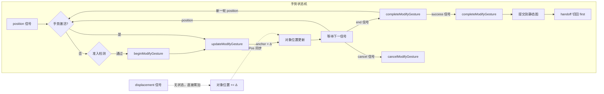

# 对象修改工具文档

## 概述

对象修改工具负责对已有对象进行几何或属性编辑。其核心目标是保证修改前后状态一致，并让活动层渲染正确刷新。

## 术语约定

| 术语       | 含义                                                                                                              |
| ---------- | ----------------------------------------------------------------------------------------------------------------- |
| `context`  | `DevicesDAGHandlerContext` 类型，DAG 分发的唯一上下文物件                                                         |
| AOM 动态图 | `ActiveObjectManager` 管理的临时对象层，修改在此层进行                                                            |
| handoff    | creator/chooser → modifier 的两阶段工作流编排                                                                     |
| 锚点       | 手势起始光标位置，用于计算位移基准                                                                                |
| 同步兼容层 | 通过 `resolveModifiedObjectId/Position/WorldRect` 等 helper 兼容 `BasicObject` 与 summary-like 对象的辅助方法集合 |

## 架构概览

```
Tool（基类）
  └─ ObjectModifierTool（基础设施）
       ├─ withGeometryMutation()         ← 快照/刷新协议（try-finally 保护）
       │    ├─ BoardApi 路径：跳过 liveRenderer，仅 overlay 刷新
       │    └─ Legacy 路径：captureObjectSnapshot + invalidateObjects
       ├─ applyModifiedObjects()         ← BoardApi-first 提交到静态图
       ├─ resolveActiveModifiedObjects() ← AOM 过滤（兼容 BoardApi + board 路径）
       ├─ umount() / collectUiOverlayEntries()
       ├─ setModifiedObjectPosition()    ← BoardApi-first 位置写入
       ├─ resolveModifiedObjectId / Position / WorldRect / Ids / Range
       └─ ...
       │
       └─ GestureBasedObjectModifierTool（手势调度中间层，双通道）
            ├─ process()                       ← 固定手势调度逻辑
            ├─ buildModifyInteractionContext() ← 信号提取（position + displacement）
            ├─ _handleSpatialUpdate()          ← 三步编排：position → displacement → end
            ├─ canBeginModifyGesture()         ← hook（准入，仅 position）
            ├─ beginModifyGesture()            ← hook（abstract）
            ├─ updateModifyGesture()           ← hook（abstract）
            ├─ completeModifyGesture()         ← hook
            ├─ cancelModifyGesture()           ← hook
            ├─ onBeforeDisplacement()          ← hook（displacement 前置）
            ├─ onAfterDisplacement()           ← hook（displacement 后置）
            ├─ applyDisplacementToObjects()    ← 默认位移累加实现（通过 setModifiedObjectPosition）
            └─ reset() / umount()              ← 状态清理
                 │
                 └─ CommonObjectModifierTool（具体实现：位置位移 + basePos 同步）
                      ├─ canBeginModifyGesture → 合矩形命中检测
                      ├─ beginModifyGesture    → 记录锚点 + 初始位置
                      ├─ updateModifyGesture   → 锚点基准位移计算
                      ├─ completeModifyGesture → 清空缓存
                      ├─ onBeforeDisplacement  → 记录 _initialPositions（供 cancel）
                      ├─ onAfterDisplacement   → 同步基准位置（锚点不动）
                      └─ reset()               → 清空缓存 + 调用 super
```

## BoardApi 双路径

与 Creator 一致，ObjectModifierTool 支持两条写路径，通过 `context.acc.boardApi` 是否注入来决定：

**BoardApi 路径**：

- 位置写入 → `boardApi.modifyObject(id, { position })`
- 提交 → `boardApi.commitObjects(objectIds)`
- 撤销 → `boardApi.discardActiveObjects(objectIds)`
- 几何脏区 → Core 自动触发（跳过 `liveRenderer.*`）
- UI overlay 刷新 → 保留 `requestUiOverlayRefresh`

**Legacy 路径**：

- 位置写入 → 直接 `obj.position = new Vector(...)`
- 提交 → `AOM.apply(new Set(objects))`
- 撤销 → `AOM.discard(new Set(objects))`
- 几何脏区 → `liveRenderer.captureObjectSnapshot` + `invalidateObjects`
- UI overlay 刷新 → `monitor.requestViewportUiRender`

**读路径同步兼容层**：无论 BoardApi 是否注入，modifier 通过 `resolveModifiedObjectPosition()`、`resolveModifiedObjectWorldRect()` 等 helper 读取几何数据，兼容 `BasicObject` 与 summary-like 对象，不依赖 `queryObjects()`。

## 关键能力

### ObjectModifierTool（基类）

方法接受的 `context` 参数均为 `DevicesDAGHandlerContext` 类型，由 DAG 分发时提供。

| 方法                                              | 职责                                                                                          |
| ------------------------------------------------- | --------------------------------------------------------------------------------------------- |
| `resolveModifiedObjects(context, objects)`        | 规整本次修改涉及的对象集合                                                                    |
| `resolveModifiedObjectId(objectEntry)`            | 从对象条目提取数字 objectId                                                                   |
| `resolveModifiedObjectIds(context, objects)`      | 批量提取去重 objectId 列表                                                                    |
| `resolveModifiedObjectPosition(objectEntry)`      | 从对象条目提取当前位置（Vector）                                                              |
| `resolveModifiedObjectRange(objectEntry)`         | 从对象条目提取局部判定范围                                                                    |
| `resolveModifiedObjectWorldRect(objectEntry)`     | 计算对象的世界矩形（兼容 range + position / boundingBox + position）                          |
| `resolveActiveModifiedObjects(context, objects)`  | 仅保留当前仍在 AOM 动态图中的对象（兼容 boardApi.getBoardCore 与 board 路径）                 |
| `setModifiedObjectPosition(context, object, pos)` | BoardApi-first 写入位置：优先 `boardApi.modifyObject(id, { position })`，同步更新本地条目     |
| `beforeGeometryMutation(context, objects)`        | BoardApi 路径跳过；Legacy 路径调用 `captureObjectSnapshot`                                    |
| `afterGeometryMutation(context, objects)`         | BoardApi 路径仅 overlay 刷新；Legacy 路径调用 `invalidateObjects` + `requestViewportUiRender` |
| `withGeometryMutation(context, mutate, objects)`  | 封装一次几何修改的快照/刷新协议，try-finally 保护                                             |
| `applyModifiedObjects(context, objects)`          | BoardApi-first 提交到静态图：`commitObjects` 或 `AOM.apply()`                                 |
| `umount(context)`                                 | BoardApi-first 撤销未提交对象：`discardActiveObjects` 或 `AOM.discard()`                      |
| `collectUiOverlayEntries(overlayContext)`         | 收集 modifier 当前声明的兼容 ui overlay                                                       |

### GestureBasedObjectModifierTool（手势驱动中间层）

| 方法                                                   | 职责                                                  |
| ------------------------------------------------------ | ----------------------------------------------------- |
| `process(signalPacket, context)`                       | 固定手势调度逻辑，子类无需覆写                        |
| `buildModifyInteractionContext(signalPacket, context)` | 从信号包提取 position/displacement/end/cancel/success |
| `_handleSpatialUpdate(interaction, context, objects)`  | 三步编排：position → displacement → end               |
| `canBeginModifyGesture(interaction)`                   | 准入检测 hook（仅 position），子类可覆写              |
| `beginModifyGesture(interaction)`                      | 手势开始 hook（abstract）                             |
| `updateModifyGesture(interaction)`                     | 手势更新 hook（abstract）                             |
| `completeModifyGesture(interaction)`                   | 手势完成 hook                                         |
| `cancelModifyGesture(interaction)`                     | 手势取消 hook                                         |
| `onBeforeDisplacement(interaction)`                    | displacement 前置 hook                                |
| `onAfterDisplacement(interaction)`                     | displacement 后置 hook                                |
| `applyDisplacementToObjects(interaction)`              | 默认位移累加实现（通过 `setModifiedObjectPosition`）  |

## 上下文（context）

工具收到的 `context` 包含：

- `context.path` — 当前节点路径
- `context.dag` — 所属设备图
- `context.getNodeState(path)` / `context.setNodeState(path, state)` — 节点状态读写
- `context.acc` — 累积上下文，沿分发路径逐层追加
  - `context.acc.board` — Board 实例（兼容阶段保留）
  - `context.acc.boardApi` — BoardApi 实例（BoardApi-first 路径使用）
  - `context.acc.monitor` — Monitor 实例
  - `context.acc.objects` — 当前工具操作对象集合（`BasicObject` 或 summary-like 条目）
  - `context.acc.autoUmountOnApply` — [handoff] 阻止 modifier 自卸载

**工具不应自行构造、扁平化或改写上下文。** 直接使用 DAG 分发的 `context` 即可。

## 提交生命周期钩子

`applyModifiedObjects(context, objects)` 内部按钩子编排提交流程：

```
applyModifiedObjects(context, objects)
  │
  ├─ ① resolveActiveModifiedObjects()  ← 解析 AOM 动态图中的对象
  │
  ├─ ② beforeApplyModifiedObjects()    ← 控制型钩子，返回 bool
  │     └─ false → 终止，不提交
  │
  ├─ ③ 提交（BoardApi-first）
  │     ├─ boardApi.commitObjects(objectIds)  ← 优先
  │     └─ AOM.apply(new Set(objects))       ← Legacy 路径
  │
  ├─ ④ autoUmountOnApply 检查          ← 通过累积 context 注入
  │     └─ handoff 通过 context.acc 注入 false 阻止自卸载
  │
  └─ ⑤ afterApplyModifiedObjects()     ← 通知型钩子，触发 "afterApply" 事件
```

### 控制型钩子：`beforeApplyModifiedObjects`

决定是否执行 apply。handoff 可通过覆盖或订阅控制提交行为。

```js
// 默认：允许提交
beforeApplyModifiedObjects(context, objects) {
  return true;
}
```

### 通知型钩子：`afterApplyModifiedObjects`

提交成功后触发 `"afterApply"` 事件，handoff 借以感知 modifier 完成并切回 first。

```js
modifier.on("afterApply", (ctx, objects, result) => {
  // 修改已提交，可切回 creator
});
```

### autoUmountOnApply 的注入方式

`autoUmountOnApply` 只能通过累积上下文 (`context.acc`) 注入，不支持直接作为 `context` 的属性传入。

handoff 通过 `resolveTransition` 的 `transition.acc` 注入 `autoUmountOnApply: false`，无需覆盖 modifier 的任何方法。

注入链路：

```
resolveTransition transition.acc
  → handler context.acc
    → modifier 读取 context.acc?.autoUmountOnApply
```

## 令牌化表达与同步兼容层

P2 迁移后，Modifier 以 `objectId` 作为真正的写入令牌，同时保留一层读路径兼容层：

- **写路径**：所有位置修改通过 `setModifiedObjectPosition()`，内部优先走 `boardApi.modifyObject(id, { position })`，同时同步更新本地上下文条目的 `position`
- **读路径**：通过 `resolveModifiedObjectId`、`resolveModifiedObjectPosition`、`resolveModifiedObjectWorldRect` 等 helper，兼容 `BasicObject` 实例与 summary-like 条目
- **`context.acc.objects` 暂不强制收口为 `objectId[]`**：P2 阶段条目可以是 `BasicObject` 或 summary-like 对象

## 几何刷新分流

不同路径下几何刷新的行为：

**BoardApi 路径**：

- `beforeGeometryMutation` → 直接 return（由 Core `modifyObject` 内部自动处理脏区）
- `afterGeometryMutation` → 仅调用 `requestUiOverlayRefresh()`

**Legacy 路径**：

- `beforeGeometryMutation` → `monitor.liveRenderer.captureObjectSnapshot(objects)`
- `afterGeometryMutation` → `monitor.liveRenderer.invalidateObjects(objects)` + `monitor.requestViewportUiRender()`

## 手势驱动模型

`GestureBasedObjectModifierTool` 采用 `position` 信号驱动的手势模型，
与 Creator 侧的 `SingleGestureObjectCreatorTool` 对齐。

### 信号类型

| 信号类型 | 常量                           | 语义                                                            |
| -------- | ------------------------------ | --------------------------------------------------------------- |
| 位置更新 | `POSITION: "position"`         | 携带世界坐标 `{ x, y }`，以锚点为基准计算位移（驱动手势状态机） |
| 相对位移 | `DISPLACEMENT: "displacement"` | 携带相对增量 `{ x, y }`，无状态直接累加到对象位置               |
| 手势结束 | `GESTURE_END: "end"`           | 结束当前手势，对象保留在动态图                                  |
| 手势取消 | `GESTURE_CANCEL: "cancel"`     | 取消手势，对象回滚到手势开始时的初始位置                        |
| 提交修改 | `SUCCESS: "success"`           | 将修改完毕的对象提交到静态图，结束修改流程                      |

### 双通道信号处理

`GestureBasedObjectModifierTool` 同时接受 `position` 和 `displacement` 两种空间信号，
在 `_handleSpatialUpdate` 中按顺序处理：

1. **position** 驱动手势状态机（begin → update → end/cancel），以锚点为基准计算位移
2. **displacement** 作为无状态增量，在 position 之后直接累加到对象位置
3. 两者可在同一帧并存：position 先算 → displacement 再叠 → basePos 跟随位移同步
4. displacement 不参与手势状态机，不与 position 竞争的 `isModifyingGestureActive` 互斥

#### displacement 信号特点

- **无准入检测**：到达时跳过 `canBeginModifyGesture`
- **可与 position 叠加**：basePos 跟随位移同步，锚点不动，保持光标-对象偏移不变
- **手势结束后仍可用**：end 之后 displacement 直接累加对象位置
- **cancel 兼容**：`onBeforeDisplacement` hook 在首次 displacement 时记录初始位置

#### 新增 hook

| 方法                                      | 职责                                                    |
| ----------------------------------------- | ------------------------------------------------------- |
| `onBeforeDisplacement(interaction)`       | 位移应用前调用，子类可在此记录初始位置供 cancel 回退    |
| `onAfterDisplacement(interaction)`        | 位移应用后调用，子类可在此同步基准位置（锚点不动）      |
| `applyDisplacementToObjects(interaction)` | 基类默认实现——通过 `setModifiedObjectPosition` 累加位移 |

### 手势生命周期



#### \_handleSpatialUpdate 调度流程

`GestureBasedObjectModifierTool._handleSpatialUpdate()` 内部分三步：

**Step 1 — position 处理**

1. 手势未激活 → `canBeginModifyGesture()` 准入检测 → `withGeometryMutation({ begin + update })`
2. 手势已激活 → `withGeometryMutation({ update })`（锚点基准位移）

**Step 2 — displacement 处理** 3. `onBeforeDisplacement(interaction)` — 记录初始位置等 4. `applyDisplacementToObjects(interaction)` — 通过 `setModifiedObjectPosition` 累加5. `onAfterDisplacement(interaction)` — 子类同步 basePos（锚点不动）

**Step 3 — end 检查** 6. 同包附带的 end 信号 → `completeModifyGesture()`

所有 `begin/update` 及 `applyDisplacementToObjects` 调用包裹在 `withGeometryMutation` 中，自动执行几何刷新协议。BoardApi 路径下刷新路径由 Core 自动处理或仅做 overlay 刷新。`mutate` 抛出异常时，`afterGeometryMutation` 由 `try-finally` 确保执行。

### CommonObjectModifierTool —— 通用位置位移修改器

锚点语义（保持光标偏移）：

- 用户手势起点 `position` = `(35, 35)`，对象在 `(10, 20)`
- `beginModifyGesture`：锚点 = `(35, 35)`（光标位置），记录对象初始位置 `(10, 20)`
- 首个 `updateModifyGesture`：位移 = `(35 - 35, 35 - 35)` = `(0, 0)`，对象保持在 `(10, 20)`
- 光标移动到 `(40, 40)` 时：位移 = `(40 - 35, 40 - 35)` = `(5, 5)`，对象移到 `(15, 25)`
- 光标与对象之间的初始相对偏移 `(25, 15)` 始终保持不变

多对象选择时所有对象共用同一锚点，朝同方向移动等量位移。

位置写入通过 `setModifiedObjectPosition(context, obj, { x, y })` 完成：

- BoardApi 路径 → `boardApi.modifyObject(id, { position })`
- Legacy 路径 → `obj.position = new Vector(x, y)`

### 手势准入检测

首个 `position` 信号到来时，`canBeginModifyGesture` 判断世界坐标是否落在
持有对象的合矩形范围内：

- **在合矩形内** → 正常启动手势
- **在合矩形外** → 拒绝手势，不修改对象
- 若对象不支持 `getRange()`，则跳过准入检测
- 手势激活后不再重复检测准入

检测通过 `resolveModifiedObjectWorldRect(obj)` 读取世界矩形，兼容 `BasicObject` 与 summary-like 条目。

## 设计约束

- modifier 只修改 AOM 动态图中的对象，不直接编辑静态图对象
- end 与 success 之间的窗口期内，若对象被外部从 AOM 移除，`applyModifiedObjects` 返回 false，`afterApply` 不触发，handoff 不会切回 first
- `withGeometryMutation` 已使用 `try-finally` 保护 `afterGeometryMutation`，但 `mutate` 内部抛异常时工具状态（`_anchorPosition`、`isModifyingGestureActive`）不会回滚
- `autoUmountOnApply` 只通过累积上下文注入，不支持作为 `context` 的直接属性

## 相关文档

- [Base Tool 文档](../../docs/core-modules.md)
- [handoff handler 文档](../../prefixs/docs/prefix-document.md)
- [AOM 文档](../../components/docs/active-object-manager-document.md)
