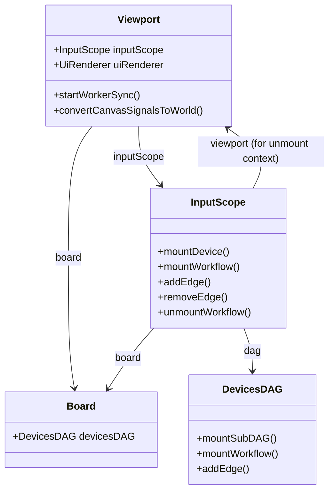

# InputScope 文档

## 概述

`InputScope` 是视口级别的设备图接线入口，封装 `viewportId` 的路径前缀拼接，将 `mountDevice` / `mountWorkflow` / `addEdge` 等操作定向到白板级 `DevicesDAG` 的对应视口子树范围。

职责：

- 提供 `mountDevice(name, subDAG)` 挂载设备子图
- 提供 `mountWorkflow(name, workflow)` 挂载工具 workflow（name 支持嵌套路径）
- 提供 `addEdge({ from, to, name?, prefix? })` 建立设备到 workflow 的信号通路
- 提供 `removeEdge` / `unmountWorkflow` 拆除信号通路
- 所有路径自动补全 `/{viewportId}/` 前缀，调用方只写相对于视口根的路径

## 术语约定

| 术语        | 说明                                                              |
| ----------- | ----------------------------------------------------------------- |
| 设备子图    | mouse / keyboard / touchscreen 等输入设备的 DAG 子图定义          |
| tool        | 末端消费型处理器，接收信号后通过 RPC 修改白板数据                 |
| workflow    | tool 实例或 SubDAGDefinition 的统称，挂载在 `workflows/{name}` 下 |
| 信号通路    | 从设备子图某节点到 workflow 的有向边                              |
| 边级 prefix | 插在设备节点与 workflow 之间的信号转换子图                        |

## 路径模型

InputScope 的所有方法自动在路径前拼接 `/{viewportId}`：

| 调用                                                                              | 实际 DAG 路径                                                                        |
| --------------------------------------------------------------------------------- | ------------------------------------------------------------------------------------ |
| `mountDevice("mouse", subDAG)`                                                    | `/{vpId}/mouse`                                                                      |
| `mountWorkflow("stroke", tool)`                                                   | `/{vpId}/workflows/stroke`                                                           |
| `mountWorkflow("switcher/stroke", tool)`                                          | `/{vpId}/workflows/switcher/stroke`（嵌套路径，挂到子图内部节点）                    |
| `addEdge({ from: "mouse/primary", to: "workflows/stroke" })`                      | `/{vpId}/mouse/primary` ──"default"──→ `/{vpId}/workflows/stroke`                    |
| `addEdge({ from: "keyboard/code/Space", to: "workflows/random-circle", prefix })` | 挂 prefix 于 `/{vpId}/keyboard/code/Space`，再连到 `/{vpId}/workflows/random-circle` |
| `addEdge({ from: "mouse/primary", to: "workflows/stroke", name: "tool" })`        | 使用边名 `tool` 而非默认的 `default`                                                 |
| `addEdge({ from: "workflows/switcher/stroke" })`                                  | 省略 to，创建匿名目标节点                                                            |

## API

### mountDevice(name, subDAG)

挂载设备子图。`name` 为空时回退使用子图自身的 `rootPath`。

```javascript
scope.mountDevice("mouse", createMouseDevice());
scope.mountDevice("keyboard", createKeyboardDevice());
```

### mountWorkflow(name, workflow)

挂载 tool 或 SubDAGDefinition 到 `workflows/{name}`。

`name` 支持嵌套路径（如 `"parent-workflow/child"`），典型场景是把工具挂到
已存在子图的内部节点。所有 Tool 都挂载在 `/{vpId}/workflows/...` 之下。

挂载走完整契约：tool 实例注册（禁止重复挂载）、`semantics.tool` 标记、
umount 钩子链（`processor.dispose → tool.umount → 原钩子`）。目标节点已有
handler 时抛错。

```javascript
scope.mountWorkflow("stroke", new StrokeCreatorTool({...}));
scope.mountWorkflow("random-circle", createRandomCircleSubDAG({...}));

// handoff 两阶段工作流是单个 wrapper tool，一次挂载完成
scope.mountWorkflow(
  "secondary-chooser",
  new HandoffWrapperTool({
    first: new RectangleObjectChooserTool(),
    second: new CommonObjectModifierTool({ processor: new DragGestureProcessor() }),
  }),
);
```

> **约定**：节点的 `handler` 只允许通过 `mountWorkflow`（或子图定义中的
> `builder.node().handler()`）写入。禁止直接给 `node.handler` 赋值——那会绕过
> 实例注册与 umount 钩子链，导致卸载行为不一致。

### addEdge({ from, to, name?, prefix? })

建立信号通路。

- `from` / `to` — 相对于视口根的路径
- `name` — 边名，默认 `"default"`
- `prefix` — 可选边级 prefix 子图定义

`to` 可省略。省略时创建匿名目标节点，返回的 `DevicesDAGEdge.target` 可供后续接线参考。
如需在目标节点上挂工具，请使用 `mountWorkflow` 而非直接给 `node.handler` 赋值。

```javascript
// 简单直连
scope.addEdge({ from: "mouse/primary", to: "workflows/stroke" });

// 带 prefix 转换
scope.addEdge({
  from: "keyboard/code/Space",
  to: "workflows/random-circle",
  prefix: createEdgePrefix(buildKeyboardTriggerForwardNodeConfig()),
});

// 自定义边名
scope.addEdge({
  from: "mouse/primary",
  to: "workflows/stroke",
  name: "tool",
});
```

### removeEdge({ from, edge? })

移除有向边。

- `from` — 源节点路径（相对于视口根）
- `edge` — 边名，与 `addEdge` 的 `name` 对应，默认 `"default"`

### unmountWorkflow(name, edgesToRemove?)

卸载 workflow 节点。可选传入入边列表一并拆除。

## 与 Viewport 的关系



Viewport 构造函数自动创建 `InputScope(board, this)`。接线操作通过 `viewport.inputScope` 完成。

## 相关文档

- [viewport-document.md](./viewport-document.md)
- [board-document.md](./board-document.md)
- [devices-dag-document.md](../../../devices-dag/docs/devices-dag-document.md)
- [wrapper-document.md](../../../devices-dag/tools/wrapper/docs/wrapper-document.md)
