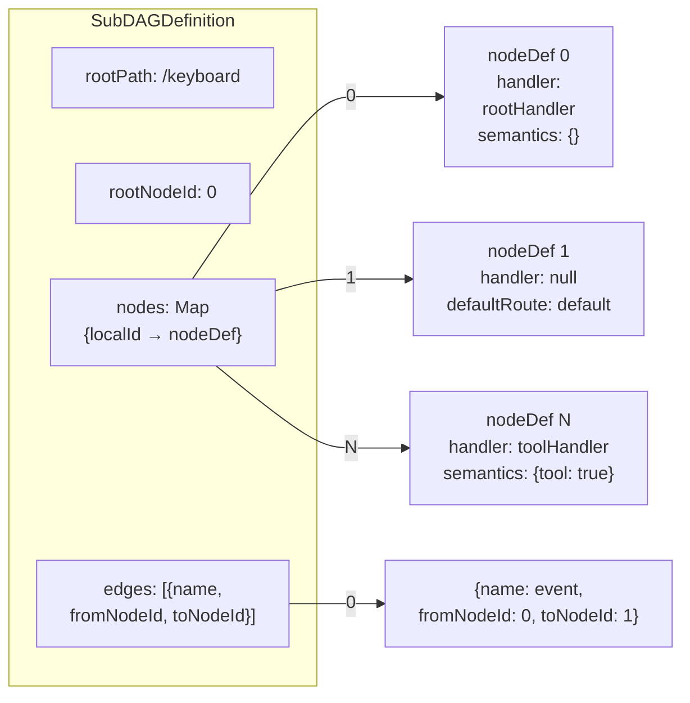
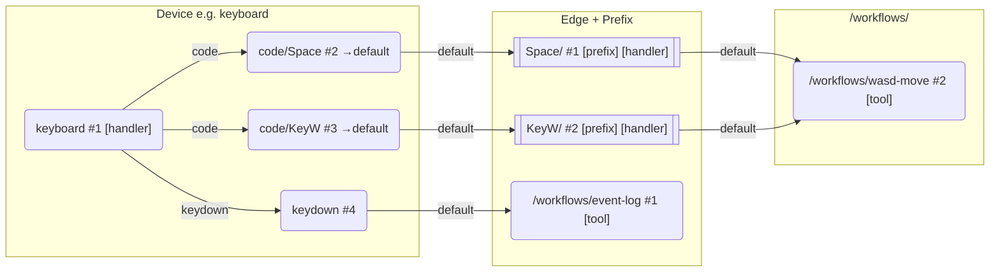

# 设备定义

## 概述

设备在当前 Core 中不是一组零散回调，而是一份结构化的 `SubDAGDefinition`。

它描述的是：

- 设备根路径 `rootPath`
- 子图根节点 `rootNodeId`
- 节点定义表 `nodes`
- 边定义表 `edges`
- 可选的设备级状态接口，例如 `resetState()`、`getState()`

在这个模型里，设备不是直接映射到某个物理硬件，而是一个“信号空间”的结构化路由。它定义了一个根路径与一张局部 DAG，用来接收、稳定化并分发已经归属的输入信号。

当前模型遵守以下约束：

- 路由逐层向下
- 节点只能把信号继续发给自己的后继节点
- 跨节点可变共享数据写入节点 `state`
- 短程只读协作通过累积 `acc` 追加
- 同一节点允许有多条入边，多条路径可达同一个节点

## 结构

`SubDAGDefinition` 的数据结构可表达为：



最小实现：

```js
{
  rootPath: "/keyboard",
  rootNodeId: 0,
  nodes: new Map([
    [0, { handler: rootHandler, defaultRoute: "event" }],
    [1, { handler: eventHandler }],
  ]),
  edges: [
    { name: "event", fromNodeId: 0, toNodeId: 1 },
  ],
  resetState() {},
  getState() {},
}
```

推荐直接使用 `createSubDAG()` 构建，而不是手写 `nodes + edges`。

## createSubDAG 构建器

典型写法如下：

```js
const builder = createSubDAG("/debugger");
const root = builder.node().handler(rootHandler);
const report = builder.node().handler(reportHandler);

builder.edge("report", root, report);

const device = builder
  .expose({
    resetState() {},
    getState() {},
  })
  .build();
```

构建器支持：

- `node()`：声明一个节点并返回 `DAGNodeBuilder`
- `edge(name, from, to)`：声明一条有向边
- `prefix(fn, semantics)`：把节点标记为修饰节点语义，并设置 `handler`
- `handler(fn)`：设置节点处理器
- `defaultRoute(name)`：设置默认出边
- `semantics(meta)`：写入节点职责语义元数据
- `tool(toolInstance, toolContext)`：把某个节点声明为工具节点
- `umount(fn)`：设置节点卸载钩子
- `expose(api)`：暴露设备级 API
- `build()`：生成 `SubDAGDefinition`

当前 builder 用显式节点和显式边描述链路。例如随机圆 workflow 可表达为：

```js
// workflow 子树统一放在 /workflows/ 下
const builder = createSubDAG("/workflows/create-circle");
const root = builder.node().prefix(randomPrefixHandler).defaultRoute("params");
const params = builder
  .node()
  .prefix(circleParamPrefixHandler)
  .defaultRoute("circle-creator");
const tool = builder.node().tool(circleTool);

builder.edge("params", root, params);
builder.edge("circle-creator", params, tool);

const workflow = builder.build();
```

然后通过 `addEdge` 将键位节点连接到工具子树：

```js
viewport.addEdge(
  "/keyboard/code/Space",
  "create-circle",
  "/workflows/create-circle",
);
```

## 设备 → Workflow 连接模式

以下 Mermaid 图展示当前推荐的整体连接模式（使用 `dagToMermaid` 约定）：



核心约定：

- 设备叶节点（channel / code）`defaultRoute` 统一为 `"default"`
- mount edge 名统一为 `"default"`
- 无需信号转换时（如鼠标），设备直连 workflow
- 需要信号转换时，通过 `edge.prefix` 注入

## 设备与 Workflow 的分工

设备负责：

- 保存设备级状态，例如 `activeTouches`、`activeKeys`、按钮状态
- 把原始设备输入改写为稳定信号
- 决定输入应进入哪些设备子节点
- 在需要时给下游追加只读 context，例如 `board`、`viewport` 或局部回调

workflow 负责：

- 消费已经稳定的设备信号
- 修改白板对象、视口或交互状态
- 通过节点 `state` 与上游设备或同链路工具共享上下文

这里要特别强调一条边界：

- `button`、`buttons`、active button state 这类字段属于设备路由语义
- 一旦设备已经按这些字段把输入分发到正确的子节点或工具叶子，这些字段就不应再成为工具自己的判断条件
- 因此，“哪个按钮触发了这次输入”应由设备决定；“收到这组稳定信号后做什么”才由工具决定

## 坐标转换约定

`position` 信号携带的坐标分两种：canvas 相对坐标（DOM 事件原始坐标）与世界坐标（白板坐标系）。

约定如下：

- **设备根节点负责完成 canvas→world 转换**——mouse 与 touchscreen 的根 handler 都通过 `viewport.convertCanvasSignalsToWorld` 在分流前完成转换，下游通道节点与工具拿到的已是世界坐标
- 转换逻辑的唯一实现是 `viewport.convertCanvasSignalsToWorld`，任何转换点都必须委托它，禁止各自重写换算公式
- **`canvas-to-world-handler` prefix 用于非标准链路**：信号源未经设备根节点转换时（如测试桩、自定义 adapter 直连 workflow），在边上插入该 prefix 补齐转换
- 工具与下游 prefix 一律假定 `position` 信号已是世界坐标，不再做二次转换

新设备接入时应遵循同一模式：在根 handler 中委托 `viewport.convertCanvasSignalsToWorld` 完成转换，而不是让下游各自处理。

## 设备挂载

业务侧应优先通过 Viewport 挂载设备：

```js
viewport.mountSubDAG("", createKeyboardDevice());
```

也可以指定额外挂载前缀：

```js
viewport.mountSubDAG("/presentation", createKeyboardDevice());
```

最终仍会由 Board 持有的 `DevicesDAG` 执行 `mountSubDAG(basePath, subDAGDefinition, mountContext)`。

## 状态暴露

设备内部常有两类状态：

- 私有运行态，例如 `Map`、`Set`、最近一次事件
- 对外可观测快照，通过 `getState()` 返回

如果设备需要被测试、调试或热切换重置，建议额外暴露 `resetState()`。

需要跨节点共享的短生命周期状态，不建议继续塞回设备对象本身；更适合写入 `DevicesDAG` 节点 `state`。

## 设计约束

- `rootPath` 必须是绝对路径
- `nodes` 与 `edges` 必须显式声明，不再接受旧对象树协议
- 单个节点上不能同时声明 `handler` 与 `tool`
- `defaultRoute` 只写当前节点的出边名，不写完整绝对路径
- 设备挂载路径由设备定义 `rootPath` 与 `mountSubDAG(basePath, ...)` 共同决定
- 设备子节点不能再通过相对路径向上跳回兄弟分支

## 当前实践

当前仓库内的 debugger、touchscreen、mouse、keyboard 都已经迁移到 `createSubDAG(rootPath)` 新模型。

它们的共同特点是：

- 根节点只做设备态更新与初始分流
- 设备通过 `defaultRoute` + 出边连接到 `/<viewportId>/workflows/` 下的 workflow 节点
- 设备状态通过 `expose()` 对外暴露
- debugger 的根节点是修饰节点语义，用于记录经过该节点的信号并继续下传

## 相关文档

- [设备图](../../docs/devices-dag-document.md)
- [键盘设备](./keyboard-device-document.md)
- [输入流](../../../../docs/core-input-flow.md)
