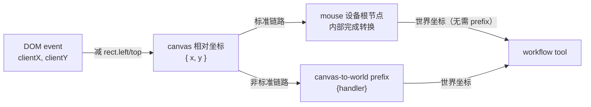

# canvas-to-world-handler

## 概述

`createCanvasToWorldPrefixHandler` 是一个边级 prefix 处理器，负责把 `position` 信号中的坐标从 **canvas 相对坐标**转为**世界坐标**。

> **定位**：标准链路（mouse / touchscreen 设备）的根 handler 已完成转换，**不需要**再挂本 prefix——挂在设备通道下游会导致二次转换。本 prefix 只用于**非标准链路**：信号源未经设备根节点转换时（如测试桩、自定义 adapter 直连 workflow），在边上补齐转换。详见 [设备文档的坐标转换约定](../../devices/docs/device-document.md#坐标转换约定)。

源文件：`src/ui-thread/devices-dag/prefixes/canvas-to-world-handler.js`

## 信号转换规则

- 优先委托 `viewport.convertCanvasSignalsToWorld` 完成转换，保证与设备内转换逻辑一致
- 该方法不存在时回退到手动换算：`worldX = canvasX / viewport.zoom + viewport.origin.x`，`worldY = canvasY / viewport.zoom + viewport.origin.y`
- 输入信号中的 `position` 信号：取出 `context.value`（应为 canvas 相对坐标 `Vector` 或 `{ x, y }`）
- 输出：`context.value` 替换为世界坐标 `Vector`
- 非 `position` 信号：原样透传

如果 `ctx.services.viewport` 不可达或缺少 `zoom` 字段，所有信号原样透传，不发生转换报错。

## 依赖

- 视口实例来自 `ctx.services.viewport`（由 `Board.createViewport` 在 `/<viewportId>` 节点声明）
- 优先使用 `viewport.convertCanvasSignalsToWorld`；缺失时回退到直接读取 `viewport.origin` 与 `viewport.zoom`

## 用法

仅当信号源未经过标准设备根节点时使用，例如自定义 adapter 直连 workflow：

```js
import {
  createEdgePrefix,
  createCanvasToWorldPrefixHandler,
} from "../prefixes/index.js";

// customSource 直接发出 canvas 相对坐标，未经设备转换
scope.addEdge({
  from: "custom-source",
  to: "workflows/stroke",
  prefix: createEdgePrefix({
    handler: createCanvasToWorldPrefixHandler(),
  }),
});
```

> **警告**：不要把它插在 mouse / touchscreen 设备通道下游——设备根节点已转换，再转一次会得到错误坐标。

## 输入坐标系约定

本 handler 期望输入的 `position` 信号 `context.value` 为 **canvas 相对坐标**：

```
canvasX = clientX - canvas.getBoundingClientRect().left
canvasY = clientY - canvas.getBoundingClientRect().top
```

宿主层在编码鼠标信号时应完成 canvas 偏移扣除，再将 canvas 相对坐标送入设备图。

## 关系图



## 相关文档

- [设备图](../../docs/devices-dag-document.md)
- [修饰节点](./prefix-document.md)
- [鼠标设备](../../devices/docs/mouse-device-document.md)
- [Core 输入编码](../../../../docs/core-input-encoding.md)
