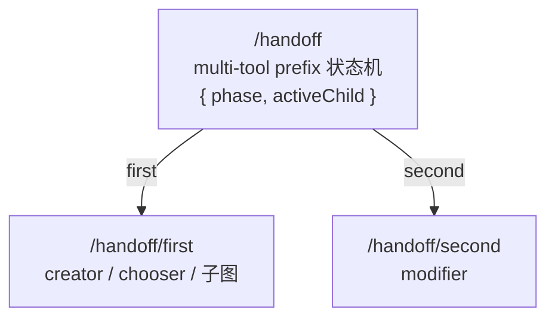
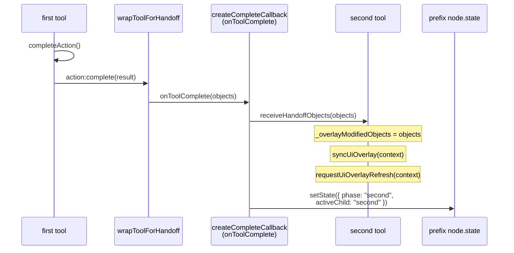
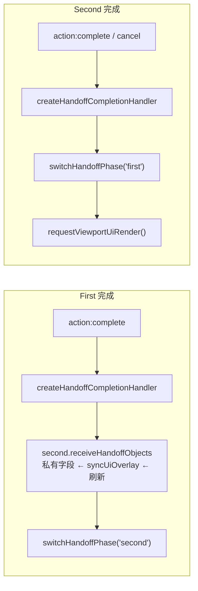

# Handoff 工作流文档

## 概述

`createHandoffSubDAG` 把 first → second 的两阶段工作流封装为一棵结构化子树。典型场景：

- **creator → modifier**：用户画一个笔画，创建完成后直接拖拽修改位置
- **chooser → modifier**：用户选中已有对象，然后拖拽修改位置
- **SubDAGDefinition → SubDAGDefinition**：任意子图作为 first，完成后交给作为 second 的另一子图处理

Handoff prefix 只做两件事：**路由** + **传递**。它不持有领域数据，所有工具对象归各工具节点所有。

## 子树结构



根节点是一个 multi-tool prefix，通过 `resolveTransition` 回调决定下一跳路由。状态为 `{ phase: "first" | "second", activeChild: "first" | "second" }`。

## first 与 second 的包装方式

所有 Tool 类型的 first 和 second 统一通过 `wrapToolForHandoff` 包装，监听 `action:complete` 事件。

| 类型             | 包装方式                                            | 完成检测                      |
| ---------------- | --------------------------------------------------- | ----------------------------- |
| Tool（first）    | `wrapToolForHandoff(tool, { bridgeObjects })`       | `action:complete` 事件触发    |
| Tool（second）   | `wrapToolForHandoff(tool, { completeOnCancel })`    | `action:complete` 事件触发    |
| SubDAGDefinition | `wrapSubDAGForHandoff`，检测 `end` 信号或自定义条件 | `end` 信号或 `shouldComplete` |

### Creator 的提交拦截

creator 的 first 通过 `context.acc.autoCommit = false` 阻止提前 commit（由 handoff 在 `resolveTransition` 中注入）。
Creator 的 `completeAction` 在检测到 `autoCommit` 为 false 时跳过 `commitCreatedObject`。

### SubDAG 作为 first / second

当 first 或 second 是 SubDAGDefinition 时，通过 `attachDAGSubDAG` 将其结构融合到手写子树中。
SubDAG 内的工具不经过 `wrapToolForHandoff` 包装，其完成检测由 `wrapSubDAGForHandoff` 包装器完成。

## 对象桥接协议

### 数据流



对象以回调参数的形式传递，不在 handoff 中停留。

### 权威数据源

| 存储位置                     | 角色                                                        |
| ---------------------------- | ----------------------------------------------------------- |
| **first tool `node.state`**  | first 阶段的数据真相源                                      |
| **second tool 实例字段**     | `_overlayModifiedObjects` 是 handoff 后 second 的缓存真相源 |
| **second tool `node.state`** | second 阶段的数据真相源（下次 process 时同步）              |
| **`ctx`**                    | 回调参数传递，不承载对象数据                                |

### 同步时机

first 完成后立即桥接到 second 的私有字段，不等到下一个信号到达。

```
first 完成
  │
  ├── action:complete (ctx, objects)                ← 数据作为事件参数传入
  │
  ├── createHandoffCompletionHandler
  │     ├── second.receiveHandoffObjects(objects, context)
  │     │     ├── _overlayModifiedObjects = [...]    ← 私有字段写入
  │     │     ├── syncUiOverlay(context)             ← 注册 overlay provider
  │     │     └── requestUiOverlayRefresh(context)   ← 刷新 → 立即显示
  │     └── switchHandoffPhase(context, "second")
  │           └── setNodeState({ phase: "second", activeChild: "second" })
```

### `receiveHandoffObjects(objects, context)`

`GestureBasedObjectModifierTool` 上的方法，由 `createCompleteCallback` 在 first 完成时调用。

- 将对象写入 `_overlayModifiedObjects`（私有字段）
- 调用 `syncUiOverlay(context)` 注册 overlay provider
- 调用 `requestUiOverlayRefresh(context)` 触发 UI 刷新

重复调用时如果 `_overlayModifiedObjects` 已非空则跳过。

### `syncUiOverlay(context)`

`Tool` 基类上的方法，在不处理信号的情况下将当前工具的 overlay provider 注册到 viewport。

- 内部调用 `createUiOverlayBinding()`（已缓存）
- 后续 `processor(packet, context) → sync` 检测到已注册，不再重复注册

### `resolveActiveModifiedObjects` 读取路径

```js
resolveActiveModifiedObjects(context, objects) {
  if (this._overlayModifiedObjects.length > 0) {
    return this._overlayModifiedObjects;        // 私有字段优先
  }
  return this.resolveModifiedObjects(context, objects); // 非 handoff 场景 fallback
}
```

### 生命周期切换



### 切换判断

- first 完成时：`objects` 为空数组时（无产出对象）**不切换**；非空或未显式传入对象时**始终切换**
- second 完成时：总是切回 first

### `acc` 注入字段

| 字段                | 类型      | 语义                                     |
| ------------------- | --------- | ---------------------------------------- |
| `autoUmountOnApply` | `boolean` | 固定为 `false`，阻止 modifier 自卸载     |
| `autoCommit`        | `boolean` | 固定为 `false`，阻止 creator 提前 commit |

## 数据所有权迁移

```
第一阶段：first tool 持有对象
  node.state.objects = [{ id: 1, ... }]       ← first tool 的 node.state 是真相源

第二阶段：second tool 持有对象
  receiveHandoffObjects(objects)              ← 写入实例字段
  process() → setContextObjects(context, objects) → 写入 node.state
  node.state.objects = [{ id: 1, ... }]       ← second tool 的 node.state 是真相源
```

Handoff prefix 全程不持有 `objects`。它的职责局限于：

1. 通过 `wrapToolForHandoff` 订阅 `action:complete` 事件
2. 在回调中调用 `second.receiveHandoffObjects(objects)`
3. 更新自己的 `node.state.phase` + `activeChild` 控制下一跳路由
4. 通过 `acc` 注入 `autoCommit` 和 `autoUmountOnApply` 控制下游行为

## 生命周期机制

所有 Tool 的完成通知统一通过 `action:complete` 事件。handoff handler 订阅该事件，收到后桥接对象并切换阶段。

| 步骤          | 独立模式                          | handoff 模式                                   |
| ------------- | --------------------------------- | ---------------------------------------------- |
| Creator 完成  | `beforeCommit → true` → AOM.apply | `autoCommit: false` → 对象留在 AOM             |
| Creator 通知  | `action:complete` 无人订阅        | handoff `wrapToolForHandoff` 订阅              |
| Chooser 确认  | `action:complete` 无人订阅        | handoff `wrapToolForHandoff` 订阅              |
| Modifier 提交 | AOM.apply → 自卸载                | AOM.apply → `autoUmountOnApply:false` 阻止卸载 |
| Modifier 通知 | `action:complete` 无人订阅        | handoff `wrapToolForHandoff` 订阅              |

## Overlay 职责

| 阶段      | 绘制内容                                                                                                  | 管理方                                                         |
| --------- | --------------------------------------------------------------------------------------------------------- | -------------------------------------------------------------- |
| First 中  | 拖拽选择矩形框（手势期间）                                                                                | `RectangleObjectChooserTool`：只画 drag rect，不画选中对象高亮 |
| Second 中 | 被修改对象的选中外框                                                                                      | `GestureBasedObjectModifierTool.collectUiOverlayEntries`       |
| 切换时    | Second 的 `receiveHandoffObjects` 内调 `syncUiOverlay` + `requestUiOverlayRefresh`，确保 overlay 立即生效 |

## 辅助函数

### `wrapToolForHandoff(tool, options)`

将 Tool 包装为 handoff-ready handler。订阅 `action:complete` 事件，收到后桥接对象并调用 `onToolComplete(objects)`。

| 选项               | 类型      | 默认值  | 作用                                               |
| ------------------ | --------- | ------- | -------------------------------------------------- |
| `bridgeObjects`    | `boolean` | `false` | 完成时将事件结果规整后传入 `onToolComplete`        |
| `completeOnCancel` | `boolean` | `false` | 收到 `cancel` 信号时丢弃对象后通知完成，传入空数组 |

### `wrapSubDAGForHandoff(subDAGDef, options)`

在子树根节点满足 `shouldComplete` 条件（默认检测 `end` 信号）时，从 `context.acc?.objects` 读取对象并调用 `onToolComplete(objects)`。

- SubDAG（`subDAGDef.nodes instanceof Map`）：为根节点 handler 追加完成通知包装，保留子树结构
- 非 SubDAG（flat `{ handler }` 对象）：直接替换 `nodes.handler`

### `normalizeHandoffBridgeObjects(result, context)`

将 `action:complete` 的事件载荷规整为对象数组。支持以下几种输入：

- 数组：直接过滤 null/undefined
- 非 null 值：包装为单元素数组
- null/undefined：回退到 `context.acc?.objects`（SubDAG 场景的瞬态通道）
- 全空时返回 `[]`

## 轻量对象条目协议

creator 产生的 `_entry` 和 chooser/modifier 流转的条目统一遵循 `ObjectSummary` 结构（定义在 `engine/types/types.js`）：

```js
{
  id: number,
  type: string,
  position: Vector | { x, y },
  boundingBox?: { left, top, width, height },
  range?: Range,
  property: Record<string, any>,
  data: Record<string, any>,
}
```

| 场景   | 代表者                  | `boundingBox` / `range`                                             |
| ------ | ----------------------- | ------------------------------------------------------------------- |
| 创建态 | creator `_entry`        | 创建完成后通过 `resolveCreatedObjectBoundingBox` 回填 `boundingBox` |
| 摘要态 | chooser / modifier 条目 | 来自 Worker 侧 `queryObjects`，携带完整的 `boundingBox` / `range`   |

消费端通过 `Vector.parse()` 统一处理 `position` 的两种形态，通过 `RectangleRange.fromRectLike()` 统一处理 `boundingBox`。

## 相关文档

- [状态模型](../../docs/state-model-document.md)
- [prefix-document.md](./prefix-document.md)
- [object-creator-document.md](../../tools/creator/docs/object-creator-document.md)
- [object-modifier-document.md](../../tools/modifier/docs/object-modifier-document.md)
- [object-chooser-document.md](../../tools/chooser/docs/object-chooser-document.md)
- [core-data-model.md](../../../../docs/core-data-model.md)
