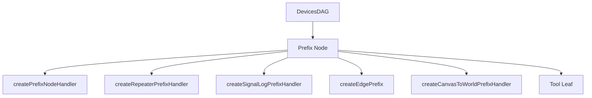

# 修饰节点（prefix）

## 概述

修饰节点是 DevicesDAG 中的一种职责语义，不是新的节点类型。它仍然是一个 `DevicesDAGNode`，只是通过 `semantics.prefix === true` 标记。

修饰节点位于信号链路中的前置处理层，负责记录、参数注入、路由分发、状态机切换和局部上下文编排。它与末端消费工具形成互补：修饰节点负责“怎么走”，工具负责“到了之后做什么”。

## `semantics.prefix === true` 是什么

它是 `DAGNodeBuilder.prefix(handler)` 自动写入节点元数据的一个标记。

它的作用是：

- 让调试和文档层知道这个节点承担 prefix 职责
- 让阅读 `semantics` 的调用方快速区分普通节点、prefix 节点和 tool 节点
- 不引入新的运行时分发分支

这意味着：

- prefix 仍然是普通 `DevicesDAGNode`
- dispatcher 不会因为 `semantics.prefix` 自动改写路径
- 真正的控制逻辑仍由 `handler`、节点 state 和累积 `context` 决定

## 当前协作模型

prefix 节点现在依赖三条稳定边界：

- **局部向下路由**：后续包只能继续发给当前节点的后代
- **节点 state**：保存可变共享数据，例如锚点、活动 child、桥接对象
- **静态 services**：声明式注入的基础设施依赖，例如 `board`、`boardApi`、`viewport`

这里需要特别区分两件事：

- 节点 state 适合保存跨多次输入仍然需要保留的局部状态
- services 适合保存声明式注入的只读基础设施

## 模块清单

| 文件                         | 导出                                 | 用途                         |
| ---------------------------- | ------------------------------------ | ---------------------------- |
| `index.js`                   | 统一导出入口                         | 集中导出全部公开 API         |
| `utils.js`                   | `isPlainObject`, `shallowCloneSignals` | 内部工具方法               |
| `handler.js`                 | `createPrefixNodeHandler`            | 基础修饰节点处理器           |
| `repeater-handler.js`        | `createRepeaterPrefixHandler`        | 信号复制分发                 |
| `signal-log-handler.js`      | `createSignalLogPrefixHandler`       | 信号观测与日志               |
| `edge-prefix.js`             | `createEdgePrefix`                   | 边级 prefix 子图包装         |
| `canvas-to-world-handler.js` | `createCanvasToWorldPrefixHandler`   | canvas 相对坐标→世界坐标转换 |

## 关系图



## 基础处理器：`createPrefixNodeHandler`

`createPrefixNodeHandler` 是最轻量的 handler 工厂。它的唯一额外职责是提供 `initialState` 默认值合并——使 `ctx.state` 自动包含初始默认值。

状态管理（`state` / `getState` / `setState` / `patchState`）和路由操作（`routeToChild` / `stop`）**均来自 DevicesDAG 的标准上下文**，不由本模块注入。

```js
const handler = createPrefixNodeHandler({
  initialState: { anchor: null },
  handle(packet, ctx) {
    // ctx.state 自动带有 { anchor: null } 默认值
    // ctx.routeToChild / ctx.stop 来自 DAG
    ctx.patchState({ anchor: current });
    return ctx.routeToChild("tool", packet.signals);
  },
});
```

若不需要 `initialState`，可以直接用裸 handler，拿到的 ctx 也有同样的 helper。

## 信号复制分发：`createRepeaterPrefixHandler`

`repeater` 会把输入信号复制为多份，分别发给不同子节点，或同一个子节点的多份副本。

```js
const handler = createRepeaterPrefixHandler({
  toChildren: ["tool-a", "tool-b"],
});
```

若未显式提供 `toChildren`，它会回退到当前节点的 `defaultRoute`。

## 子树构建

修饰节点工作流通常通过 `createSubDAG` DSL 构建，再通过 `viewport.mountSubDAG()` 注册到 DevicesDAG。

```js
const builder = createSubDAG("/mouse/primary/tool");
const toolNode = builder.node().tool(new CommonObjectModifierTool());

builder.edge("tool", null, toolNode);

viewport.mountSubDAG("", builder.build());
```

## 设计约束

- `handler` 与 `tool` 不能在同一结构化节点上同时声明
- prefix 语义通过 `semantics` 标记表达，不引入新的节点类
- 节点状态通过 `getNodeState()` / `setNodeState()` 显式管理
- first → second 顺序流与 1-of-N 互斥路由不属于 prefix 职责，由 `tools/wrapper/` 的 wrapper tool 承担

## 相关文档

- [wrapper（复合设备）](../../tools/wrapper/docs/wrapper-document.md)
- [handler 上下文（ctx）用法](../../docs/handler-context-document.md)
- [设备图](../../docs/devices-dag-document.md)
- [对象创建工具](../../tools/creator/docs/object-creator-document.md)
- [对象选择工具](../../tools/chooser/docs/object-chooser-document.md)
- [对象修改工具](../../tools/modifier/docs/object-modifier-document.md)
- [Core 输入流](../../../../docs/core-input-flow.md)
