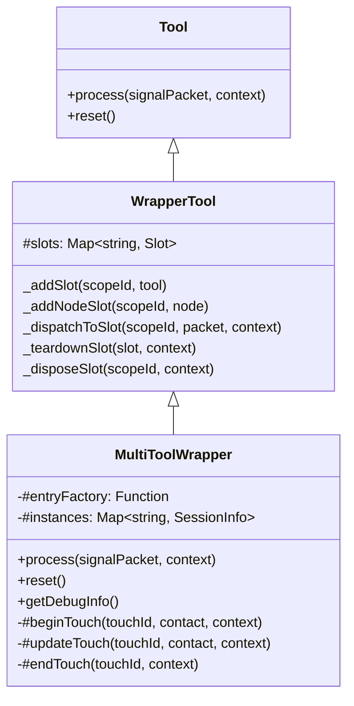

# 多工具并发包装器

## 概述

`MultiToolWrapper` 是一个泛型**包装器工具（wrapper tool）**，建在 `WrapperTool` 基座之上。
它将一条多指输入流按 `touchId` 分流为多个独立节点图，使设备图保持静态的同时支持多指并发。

作为 wrapper tool，它继承 `WrapperTool` → `Tool` 的全部生命周期钩子（`beginAction`、`completeAction`、
`endAction` 等），供 tool-switcher 等外部编排统一调用；但 `process()` 不直接消费信号修改白板，
而是将信号委托给内部动态管理的触点槽位。

### 解决的问题

touchscreen device 输出的 `touch-contacts` 信号包含所有活动触点的全量快照。如果直接将这个信号连到一个 `StrokeCreatorTool`，单指绘制正常，但多指同时绘制时所有触点共用一个 `isGestureActive`、一个 `objectId`，无法独立跟踪每根手指。

`MultiToolWrapper` 以 `touchId` 为 scopeId，把每个触点的子图入口节点登记为基座的**动态 node 槽位**（`_addNodeSlot`）。从设备图的角度看，它只是一个普通的叶子节点——图的结构在设计期就已确定。

## 继承关系



`MultiToolWrapper` 不继承 `GestureTool`——它本身不是手势工具，而是将信号分发给内部手势工具的调度器。

## 实例生命周期

```
触点按下（changedTouchId 在 contacts 中，且尚无会话）
    │
    ▼
#beginTouch
    │  entry = this.#entryFactory(touchId)
    │  _addNodeSlot(touchId, entry)            // 登记为基座动态 node 槽位
    │  _dispatchToSlot(touchId, packet, ctx)   // position 信号
    │  instances.set(touchId, { sessionId, createdAt })
    │
触点移动（changedTouchId 在 contacts 中，且已有会话）
    │
    ▼
#updateTouch
    │  _dispatchToSlot(touchId, packet, ctx)   // position 信号
    │
触点抬起（changedTouchId 不在 contacts 中）
    │
    ▼
#endTouch
    │  _dispatchToSlot(touchId, packet, ctx)   // end 信号
    │  _disposeSlot(touchId, ctx)              // 触发 _teardownSlot：沿 outEdges 递归 handler.dispose
    │  instances.delete(touchId)
```

### 信号转发方式

wrapper 从 `touch-contacts` 信号中提取 `contacts` 和 `changedTouchIds`，为每个变化的触点构造一条独立的 `SignalPacket` 并通过基座的 `_dispatchToSlot` 路由：

| 触点状态     | 构造的信号包                                               | 目标                            |
| ------------ | ---------------------------------------------------------- | ------------------------------- |
| 新触点       | `[{type: "position", context: {value: contact.position}}]` | 新槽位入口节点的 `dispatch()`   |
| 已有触点移动 | 同上                                                       | 已有槽位入口节点的 `dispatch()` |
| 触点抬起     | `[{type: "end", context: {}}]`                             | 已有槽位入口节点的 `dispatch()` |

`deviceContext` 中的 `services`（包含 `board`、`viewport`、`boardApi` 等）作为 `dispatch` 的选项原样透传。
每个子图入口看到的是同一套上下文；`_dispatchToSlot` 还会附带 `${parentPath}/${touchId}` 形式的
`path` 标识，仅作调试标识用途（槽位节点 `dag === null`，path 无副作用）。

每触点可配置单工具或多节点子图：

- **单工具**：入口节点 handler 设为工具 processor
- **多节点链**：通过 `builder.edge()` 声明节点间信号路由，handler 返回 `{ to: "next", signals }` 沿边走

## 与设备图哲学的关系

设备图哲学要求节点在设计期静态声明。mouse 的 5 个通道、keyboard 的每个 code 节点都在 `createMouseDevice() / createKeyboardDevice()` 时就建死。

touch 的触点数在设计期未知。如果用"动态挂载工具"的方案，每个 `touchstart` 都要 `mountWorkflow`、每个 `touchend` 都要 `unmountWorkflow`，不仅复杂度高，也违背静态声明原则。

`MultiToolWrapper` 是**图内分流**——设备图只有一个节点，多路并发由基座槽位表（`Map<scopeId, slot>`）管理。设备图始终是静态的。

## 使用方式

使用 `createSubDAG` + `DevicesDAGNode.createGraph` 构建每触点的子图模板：

```js
import { MultiToolWrapper } from "./tools/wrapper/multi-tool-wrapper.js";
import { DevicesDAGNode } from "./dag-core/dag-node-edge.js";
import { createSubDAG } from "./index.js";
import { StrokeCreatorTool } from "./tools/creator/stroke-creator-tool.js";

const multiStroke = new MultiToolWrapper((touchId) => {
  const builder = createSubDAG("/touch");
  builder.node().tool(
    new StrokeCreatorTool({
      property: { color: "#ff0000", width: 2 },
    }),
  );
  return DevicesDAGNode.createGraph(builder.build());
});
```

也可为多节点子图（如 handoff：chooser → modifier）声明边连接：

```js
new MultiToolWrapper((touchId) => {
  const builder = createSubDAG("/touch");
  const entry = builder.node().handler((pkt) => ({
    to: "first",
    signals: pkt.signals,
  }));
  const first = builder.node().handler(firstProcessor);
  const second = builder.node().handler(secondProcessor);
  builder.edge("first", entry, first);
  builder.edge("second", first, second);
  return DevicesDAGNode.createGraph(builder.build());
});
```

挂载到设备图：

```js
viewport.mountWorkflow("touch-stroke", multiStroke, [
  { from: "touchscreen/contacts", edge: "default" },
]);
```

## 设计约束

- 只消费 `touch-contacts` 信号（`TOUCHSCREEN_DEVICE_SIGNAL_TYPES.CONTACTS`），其他信号静默跳过
- 入口节点工厂函数每次触点按下时调用，返回 `DevicesDAGNode` 实例
- `reset()` 销毁全部触点槽位并清空会话，不会触发 `end` 信号
- 不处理 `cancel` 信号——触点 `touchcancel` 到设备层时已转为 `changedTouchId` 不在 `contacts` 中的情况，走 `#endTouch` 路径
- `#endTouch` 在发送 `end` 信号后经 `_teardownSlot` 递归遍历子图节点调用 `handler.dispose()` 清理外部资源（如 overlay）

## 会话模型

每个触点对应一个独立会话。入口节点由基座槽位持有（scopeId 即 touchId），
会话元信息（`#instances`）只保留：

| 字段        | 类型     | 说明                  |
| ----------- | -------- | --------------------- |
| `sessionId` | `number` | 递增分配的唯一会话 id |
| `createdAt` | `number` | 会话创建时间戳        |

### 可观察方法

| 方法                    | 返回值                                               | 说明                       |
| ----------------------- | ---------------------------------------------------- | -------------------------- |
| `getActiveTouchCount()` | `number`                                             | 当前活跃触点数             |
| `getSessionDebugInfo()` | `Array<{ touchId, sessionId, createdAt }>`           | 活跃会话摘要列表           |
| `getDebugInfo()`        | `{ activeTouchCount: number, sessions: Array<...> }` | 基座可观察性约定的调试摘要 |

活跃触点数还会经 `context.patchState` 以 `activeTouchCount` 键镜像到 wrapper 自己的
节点 state（触点增减及 complete/cancel/reset 路径上同步），供 `dag.getNodeState` 观察。

### 独立子图与主 DAG 的关系

per-touch 子图通过 `DevicesDAGNode.createGraph()` 创建，脱离主 DAG 运行。这意味着：

- `dag === null`：子图内 `getNodeState` / `setNodeState` 退化为仅读写本节点 `state`
- 子图节点不注册到主 DAG 的全局节点表
- 子图节点不可通过 `dag.getNode(path)` 访问

这是当前的设计选择：per-touch 子图是短暂的（随触点创建和销毁），不需要跨节点状态访问和主 DAG 可观察性。如果未来需要更强的可观察性，可考虑引入正式的 `SubgraphSession` 抽象，将会话注册到主 DAG 的调试层。

## 相关文档

- [wrapper（复合设备 / 组合子）](./wrapper-document.md)
- [touchscreen-device 文档](../../../devices/docs/device-document.md)
- [工具基类文档（含 wrapper tool 说明）](../../docs/tool-document.md)
- [手势工具基类](../../docs/gesture-tool-document.md)
