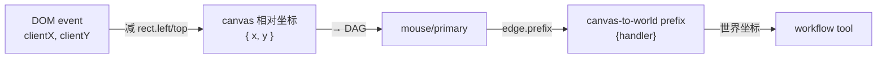

# canvas-to-world-handler

## 概述

`createCanvasToWorldPrefixHandler` 是一个边级 prefix 处理器，负责把 `position` 信号中的坐标从 **canvas 相对坐标**转为**世界坐标**。

源文件：`src/core/ui/devices-dag/prefixes/canvas-to-world-handler.js`

## 信号转换规则

- 输入信号中的 `position` 信号：取出 `context.value`（应为 canvas 相对坐标 `Vector` 或 `{ x, y }`）
- 转换：`worldX = canvasX / viewport.zoom + viewport.origin.x`，`worldY = canvasY / viewport.zoom + viewport.origin.y`
- 输出：`context.value` 替换为世界坐标 `Vector`
- 非 `position` 信号：原样透传

如果 `ctx.acc.viewport` 不可达或缺少 `zoom` 字段，所有信号原样透传，不发生转换报错。

## 依赖

- 视口实例来自 `ctx.acc.viewport`（由 `Board.createViewport` 在 `/<viewportId>` 节点注入）
- 不依赖 `Viewport.screenToWorld` 方法，直接使用 `viewport.origin` 和 `viewport.zoom`

## 用法

作为边级 prefix 插入鼠标设备通道：

```js
import {
  createEdgePrefix,
  createCanvasToWorldPrefixHandler,
} from "../prefixes/index.js";

board.signalsEventBus.emit("mount", {
  viewportId: "main",
  name: "primary-stroke",
  workflow: strokeTool,
  edges: [
    {
      from: "mouse/primary",
      edge: "default",
      prefix: createEdgePrefix({
        handler: createCanvasToWorldPrefixHandler(),
      }),
    },
  ],
});
```

## 输入坐标系约定

本 handler 期望输入的 `position` 信号 `context.value` 为 **canvas 相对坐标**：

```
canvasX = clientX - canvas.getBoundingClientRect().left
canvasY = clientY - canvas.getBoundingClientRect().top
```

宿主层在编码鼠标信号时应完成 canvas 偏移扣除，再将 canvas 相对坐标送入设备图。

## 关系图



## 相关文档

- [设备图](../../docs/devices-dag-document.md)
- [修饰节点](./prefix-document.md)
- [鼠标设备](../../devices/docs/mouse-device-document.md)
- [Core 输入编码](../../../../docs/core-input-encoding.md)
