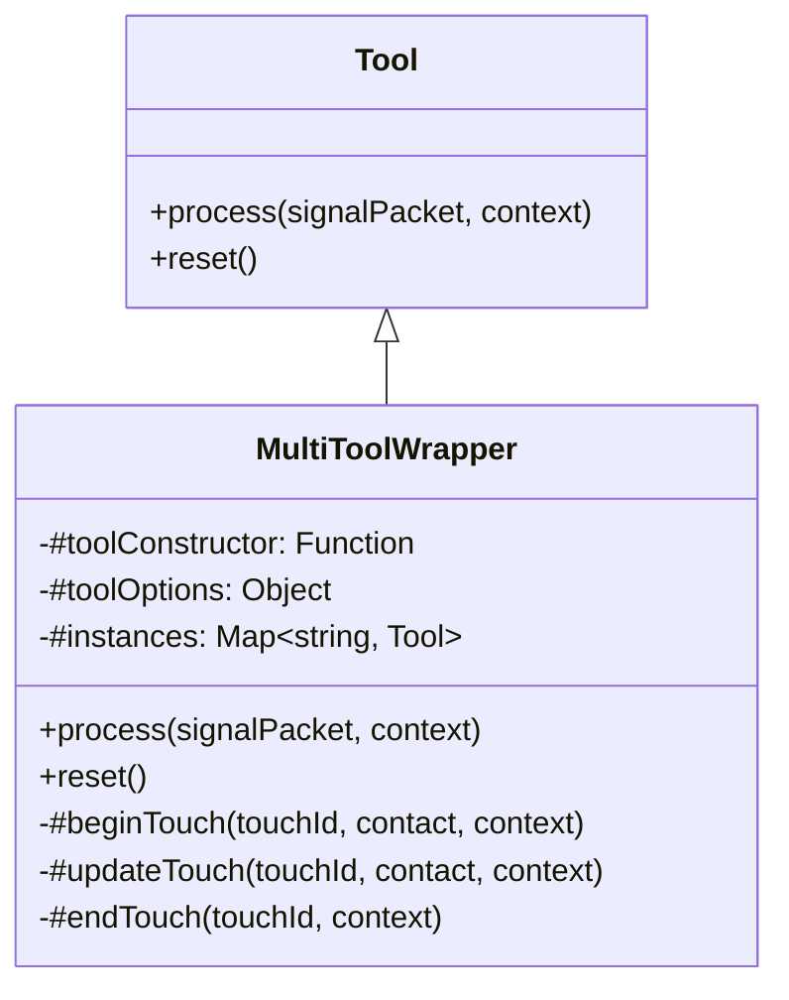

# 多工具并发包装器

## 概述

`MultiToolWrapper` 是一个泛型包装器，位于 `Tool` 之上。它将一条多指输入流按 `touchId` 分流为多个独立工具实例，使设备图保持静态的同时支持多指并发。

### 解决的问题

touchscreen device 输出的 `touch-contacts` 信号包含所有活动触点的全量快照。如果直接将这个信号连到一个 `StrokeCreatorTool`，单指绘制正常，但多指同时绘制时所有触点共用一个 `isGestureActive`、一个 `objectId`，无法独立跟踪每根手指。

`MultiToolWrapper` 在工具内部维护 `Map<touchId, Tool>`，为每个触点分配独立的工具实例。从设备图的角度看，它只是一个普通的叶子节点——图的结构在设计期就已确定。

## 继承关系



`MultiToolWrapper` 不继承 `GestureTool`——它本身不是手势工具，而是将信号分发给内部手势工具的调度器。

## 实例生命周期

```
触点按下（changedTouchId 在 contacts 中，且尚无实例）
    │
    ▼
#beginTouch
    │  new StrokeCreatorTool(options)
    │  instance.process({position, value: contact.position})
    │  instances.set(touchId, instance)
    │
触点移动（changedTouchId 在 contacts 中，且已有实例）
    │
    ▼
#updateTouch
    │  instance.process({position, value: contact.position})
    │
触点抬起（changedTouchId 不在 contacts 中）
    │
    ▼
#endTouch
    │  instance.process({end})
    │  instances.delete(touchId)
```

### 信号转发方式

wrapper 从 `touch-contacts` 信号中提取 `contacts` 和 `changedTouchIds`，为每个变化的触点构造一条独立的 `SignalPacket`：

| 触点状态     | 构造的信号包                                               | 目标                   |
| ------------ | ---------------------------------------------------------- | ---------------------- |
| 新触点       | `[{type: "position", context: {value: contact.position}}]` | 新实例的 `process()`   |
| 已有触点移动 | 同上                                                       | 已有实例的 `process()` |
| 触点抬起     | `[{type: "end", context: {}}]`                             | 已有实例的 `process()` |

`deviceContext`（包含 `acc.board`、`acc.viewport`、`acc.boardApi` 等）原样透传，每个工具实例看到的上下文与单指场景完全一致。

## 与设备图哲学的关系

设备图哲学要求节点在设计期静态声明。mouse 的 5 个通道、keyboard 的每个 code 节点都在 `createMouseDevice() / createKeyboardDevice()` 时就建死。

touch 的触点数在设计期未知。如果用"动态挂载工具"的方案，每个 `touchstart` 都要 `mountWorkflow`、每个 `touchend` 都要 `unmountWorkflow`，不仅复杂度高，也违背静态声明原则。

`MultiToolWrapper` 是**图内分流**——设备图只有一个节点，多路并发由节点内部的 `Map` 管理。设备图始终是静态的。

## 使用方式

```js
import { MultiToolWrapper } from "./tools/multi-tool-wrapper.js";
import { StrokeCreatorTool } from "./tools/creator/stroke-creator.js";

const multiStroke = new MultiToolWrapper(StrokeCreatorTool, {
  property: { color: "#ff0000", width: 2 },
});
```

挂载到设备图：

```js
effectiveBoard.signalsEventBus.emit("mount", {
  viewportId: viewport.viewportId,
  name: "touch-stroke",
  workflow: multiStroke,
  edges: [{ from: "touchscreen/contacts", edge: "default" }],
});
```

## 设计约束

- 只消费 `touch-contacts` 信号（`TOUCHSCREEN_DEVICE_SIGNAL_TYPES.CONTACTS`），其他信号静默跳过
- 内部工具实例通过构造函数的 `new` 创建，构造函数签名需与 `options` 参数匹配
- `reset()` 清空所有实例，不会触发 `end` 信号
- 不处理 `cancel` 信号——触点 `touchcancel` 到设备层时已转为 `changedTouchId` 不在 `contacts` 中的情况，走 `#endTouch` 路径

## 相关文档

- [touchscreen-device 文档](../../devices/docs/device-document.md)
- [tool-document.md](./tool-document.md)
- [gesture-tool-document.md](./gesture-tool-document.md)
