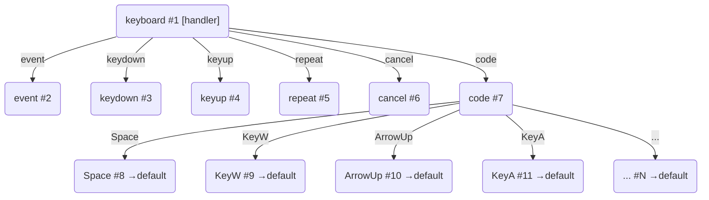
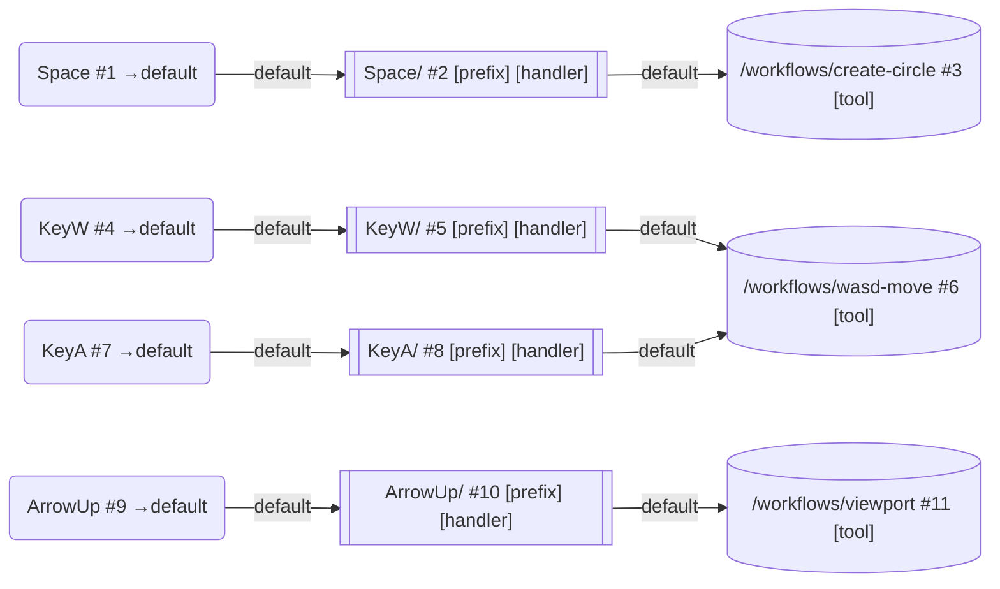

# 键盘设备

## 概述

键盘设备负责把宿主层已经确认归属到某个 Viewport 的键盘输入，翻译成 Core 内稳定的设备信号。

根路径固定为 `/keyboard`，整体结构由 `createSubDAG("/keyboard")` 构建。

`createKeyboardDevice()` **不接受任何参数**——设备内部预创建了 `STANDARD_KEYBOARD_CODES`（105 个标准键位）的全部 code 节点，每个 code 节点统一 `defaultRoute = "default"`。设备不负责信号转换，只负责从原始键盘事件中稳定产出 `trigger` / `release` / `cancel` 三类工具层信号。

## 节点结构

### 内部结构

键盘设备默认创建以下节点：



文本形式：

```
keyboard/ (root handler: 更新状态 + 分流)
├── event/ ← 所有原始键盘事件
├── keydown/ ← 非 repeat 的 keydown
├── keyup/ ← keyup 或 end
├── repeat/ ← repeat keydown
├── cancel/ ← cancel
└── code/ ← code 节点容器
    ├── Space/ ← defaultRoute: "default"
    ├── KeyW/ ← defaultRoute: "default"
    ├── ArrowUp/ ← defaultRoute: "default"
    ├── Digit1/ ← defaultRoute: "default"
    ├── KeyA/ ← defaultRoute: "default"
    ├── F1/ ← defaultRoute: "default"
    └── ... 共 105 个
```

所有 105 个 code 节点（从 `KeyA` 到 `ContextMenu`）均**不带 handler**，统一 `defaultRoute: "default"`。外部通过 `edge.prefix` 在"code 节点 → workflow"的边上插入修饰节点来完成信号转换。

### 外部接入

外部通过 `edge.prefix` 在 code 节点的 `"default"` 边上注入信号转换：



## 信号语义

键盘设备内部会把宿主事件规整为两层语义：

- 原始层：`keydown`、`keyup`、`cancel`、`end`
- 工具层：`trigger`、`release`、`cancel`

转换规则如下：

| 原始信号        | 生成信号  | 条件               |
| --------------- | --------- | ------------------ |
| `keydown`       | `trigger` | `repeat === false` |
| `keyup` / `end` | `release` | —                  |
| `cancel`        | `cancel`  | —                  |
| `keydown`       | _忽略_    | `repeat === true`  |

工具层信号类型定义在 `KEYBOARD_DEVICE_SIGNAL_TYPES` 中：

- `KEYBOARD_DEVICE_SIGNAL_TYPES.TRIGGER` = `"trigger"`
- `KEYBOARD_DEVICE_SIGNAL_TYPES.RELEASE` = `"release"`
- `KEYBOARD_DEVICE_SIGNAL_TYPES.CANCEL` = `"cancel"`

## 设备状态

键盘设备维护两份状态：

- `activeKeys`：当前仍处于按下状态的键集合快照
- `lastEvent`：最近一次处理过的键事件描述

设备定义通过 `expose()` 暴露：

- `resetState()`：清空内部状态
- `getState()`：返回可序列化快照

## 常量

`STANDARD_KEYBOARD_CODES` 定义了 105 个标准键盘码，涵盖：

| 分类       | 数量 | 示例                                              |
| ---------- | ---- | ------------------------------------------------- |
| 字母       | 26   | `KeyA` ~ `KeyZ`                                   |
| 主键盘数字 | 10   | `Digit0` ~ `Digit9`                               |
| 功能键     | 12   | `F1` ~ `F12`                                      |
| 方向键     | 4    | `ArrowUp` / `Down` / `Left` / `Right`             |
| 导航       | 4    | `Home`, `End`, `PageUp`, `PageDown`               |
| 编辑       | 3    | `Insert`, `Delete`, `Backspace`                   |
| 空白       | 3    | `Space`, `Tab`, `Enter`                           |
| 修饰键     | 8    | `ShiftLeft` / `Right`, `ControlLeft` / `Right` 等 |
| 符号       | 12   | `Minus`, `Equal`, `BracketLeft` / `Right` 等      |
| 小键盘     | 16   | `Numpad0` ~ `Numpad9`, 运算符, 小数点, 回车       |
| 锁定       | 3    | `CapsLock`, `NumLock`, `ScrollLock`               |
| 其它       | 4    | `Escape`, `Pause`, `PrintScreen`, `ContextMenu`   |

`DEVICE_DEFAULT_ROUTE` 定义为字符串 `"default"`，是所有设备叶节点的默认路由名。

从 `devices/index.js` 统一导出：

```js
import {
  createKeyboardDevice,
  KEYBOARD_DEVICE_SIGNAL_TYPES,
  STANDARD_KEYBOARD_CODES,
  DEVICE_DEFAULT_ROUTE,
} from "../devices/index.js";
```

## ⚠️ 一个 Tool 实例只能挂载到一个节点

**不要将同一个 Tool 实例通过 `mountWorkflow` 挂载到多个不同的 DAG 节点上。**

原因：

- Tool 实例内部持有可变状态（如 WASD 坐标工具的 `position`）
- 如果同一实例挂在多个节点上，每次信号到达都会修改这个共享状态
- 不同路径的信号会在彼此不知情的情况下覆盖对方的累积结果
- 卸载时也会导致问题（`unmount` 钩子只在第一个节点卸载时触发一次）

**正确做法**：创建一个共享 workflow 节点，然后通过 `addEdge` 让多条路径汇聚到它，每条路径挂各自的 prefix：

```js
// ✅ 正确：每个键位通过各自 prefix 汇聚到共享 workflow
const wasdPrefix = (code, vector) =>
  createEdgePrefix({
    handler(packet) {
      const signals = packet.signals
        .filter((s) => s.type === KEYBOARD_DEVICE_SIGNAL_TYPES.TRIGGER)
        .map((s) => ({
          type: "position",
          context: { value: { ...vector }, code, sourceType: s.type },
        }));
      return signals.length === 0 ? [] : { signals };
    },
  });

board.signalsEventBus.emit("mount", {
  viewportId: "main",
  name: "wasd-move",
  workflow: wasdTool,
  edges: [
    {
      from: "/keyboard/code/KeyW",
      edge: "default",
      prefix: wasdPrefix("KeyW", { x: 0, y: -1 }),
    },
    {
      from: "/keyboard/code/KeyA",
      edge: "default",
      prefix: wasdPrefix("KeyA", { x: -1, y: 0 }),
    },
    {
      from: "/keyboard/code/KeyS",
      edge: "default",
      prefix: wasdPrefix("KeyS", { x: 0, y: 1 }),
    },
    {
      from: "/keyboard/code/KeyD",
      edge: "default",
      prefix: wasdPrefix("KeyD", { x: 1, y: 0 }),
    },
  ],
});
```

## 推荐挂载方式

键盘设备本身挂在 Viewport 边界下：

```js
viewport.mountSubDAG("", createKeyboardDevice());
```

所有 workflow 统一通过 `signalsEventBus.emit("mount", ...)` 挂载，使用 `edge.prefix` 注入信号转换逻辑：

```js
// 简单的信号转发（如 Space 触发随机圆）
board.signalsEventBus.emit("mount", {
  viewportId: "main",
  name: "create-circle",
  workflow: randomCircleSubDAG,
  edges: [
    {
      from: "/keyboard/code/Space",
      edge: "default",
      prefix: createEdgePrefix(buildKeyboardTriggerForwardNodeConfig()),
    },
  ],
});

// 需要 viewport 引用的信号转换（如视口平移）
board.signalsEventBus.emit("mount", {
  viewportId: "main",
  name: "viewport",
  workflow: ViewportTool,
  edges: [
    {
      from: "/keyboard/code/ArrowUp",
      edge: "default",
      prefix: createEdgePrefix(
        buildViewportPositionNodeConfig({ x: 0, y: -200 }),
      ),
    },
  ],
});

// 鼠标设备不需要 prefix（信号直接可被工具消费）
board.signalsEventBus.emit("mount", {
  viewportId: "main",
  name: "primary-stroke",
  workflow: strokeTool,
  edges: [{ from: "/mouse/primary", edge: "default" }],
});
```

prefix handler 不应指定 `to:`。路由由 `defaultRoute: "default"` 自动完成。

## 设计要点

- `createKeyboardDevice()` 无参数：预创建全部 105 个标准 code 节点，不依赖外部配置
- 设备只负责信号产出：原始键盘事件 → `trigger` / `release` / `cancel`
- 信号转换交给 `edge.prefix`：在 mount 时注入，不修改设备节点
- 所有 code 节点 `defaultRoute` 统一为 `"default"`：handler 不写 `to:` 时自动走边
- 多键位汇聚到同一 workflow：通过 `edge.prefix` 各走各的 prefix，汇聚到共享 workflow 节点
- 常量从 `devices/constant.js` 集中管理，`devices/index.js` 统一导出

## 相关文档

- [设备定义](./device-document.md)
- [设备图](../../devices-dag/docs/devices-dag-document.md)
- [Core 输入编码](../../../docs/core-input-encoding.md)
