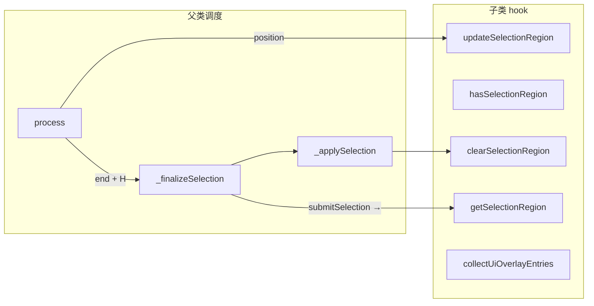
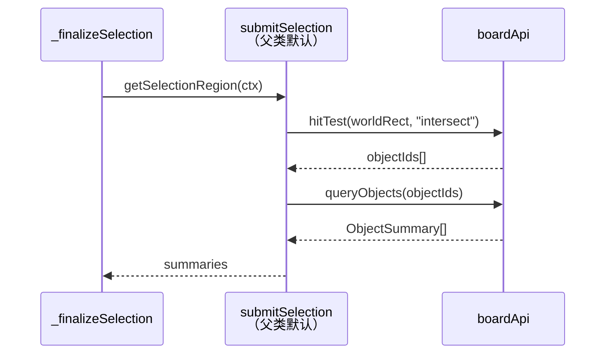
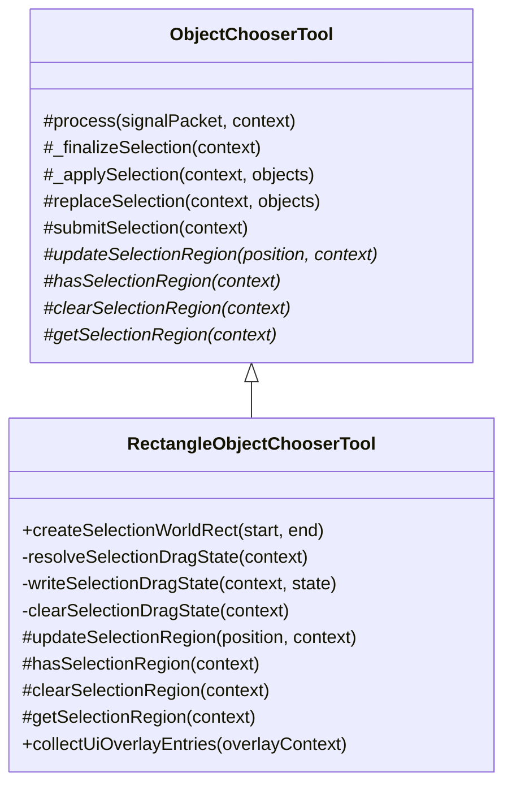

# 矩形框选工具文档

## 概述

`RectangleObjectChooserTool` 通过四个 hook 接入父类的选择手势骨架，提供矩形框选功能。

子类职责限定在"区域是什么"和"区域怎么画"，信号调度与选择生命周期由父类 `ObjectChooserTool` 统一管理。

## hook 实现



### `updateSelectionRegion(position, context)`

每次 position 信号到达时：

1. 从节点 state 读取当前拖拽状态
2. 若无起点则以当前 position 为起点
3. 通过 `createSelectionWorldRect` 计算 `startPosition → position` 矩形
4. 写回节点 state

### `hasSelectionRegion(context)`

检查节点 state 中 `worldRect` 是否存在。

### `clearSelectionRegion(context)`

清空节点 state 中的全部拖拽字段，代理到 `clearSelectionDragState`。

### `getSelectionRegion(context)`

返回节点 state 中的 `worldRect`，供父类默认 `submitSelection` 做命中检测。

## 拖拽状态

节点 state 中的字段：

| 字段                 | 类型             | 说明                 |
| -------------------- | ---------------- | -------------------- |
| `isSelecting`        | `boolean`        | 拖拽是否激活         |
| `selectionStart`     | `Vector`         | 拖拽起点（世界坐标） |
| `selectionCurrent`   | `Vector`         | 最近一次位置         |
| `selectionWorldRect` | `RectangleRange` | 当前框选矩形         |

这些状态由 `updateSelectionRegion` 写入，`clearSelectionRegion` 清理。

## 命中读取

父类 `submitSelection` 的默认实现使用 `getSelectionRegion()` 获取矩形区域：



异步路径由父类 `_finalizeSelection` 自动处理。

## overlay

`collectUiOverlayEntries()` 只返回拖拽过程中的矩形选择框，不返回选中对象的外框高亮：

- `type: "rect"`
- `worldRect: dragState.worldRect`
- 半透明蓝色填充 + 1px 虚线边框

```js
// 颜色常量
RECTANGLE_SELECTION_OVERLAY_STROKE_STYLE = "#33a1ff";
RECTANGLE_SELECTION_OVERLAY_FILL_STYLE = "rgba(51, 161, 255, 0.14)";
RECTANGLE_SELECTION_OVERLAY_LINE_WIDTH = 1;
RECTANGLE_SELECTION_OVERLAY_LINE_DASH = [4, 4];
```

不调用 `super.collectUiOverlayEntries()`，因此基类 `ObjectChooserTool` 中的选中对象高亮条目不会被收集。
选中对象的外框由 handoff 切换后的 modifier 负责绘制。

## 卸载

父类 `umount()` 自动调用本工具的 `clearSelectionRegion()`，子类无需重写 `umount`。

## 子类职责



子类提供区域 hook 和 overlay 渲染，其余全部由父类完成。

## 相关文档

- [object-chooser-document.md](./object-chooser-document.md)
- [ui-renderer-document.md](../../../components/renderer/docs/ui-renderer-document.md)
- [core-input-flow.md](../../../../docs/core-input-flow.md)
