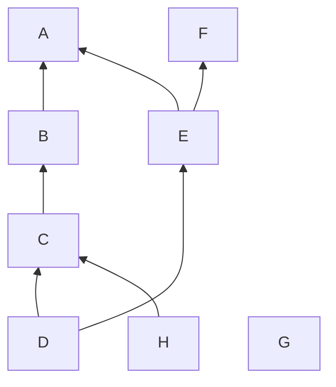
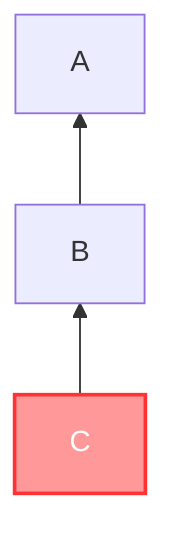
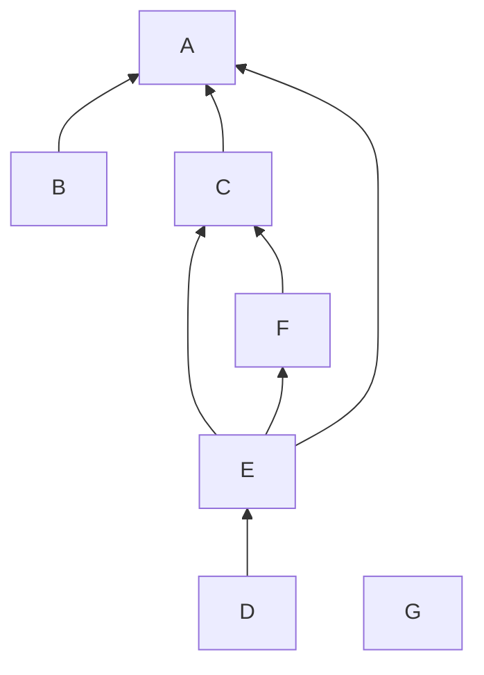
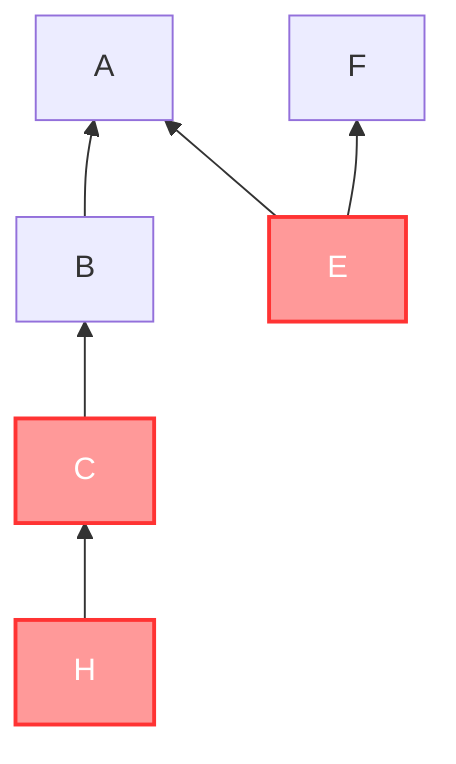
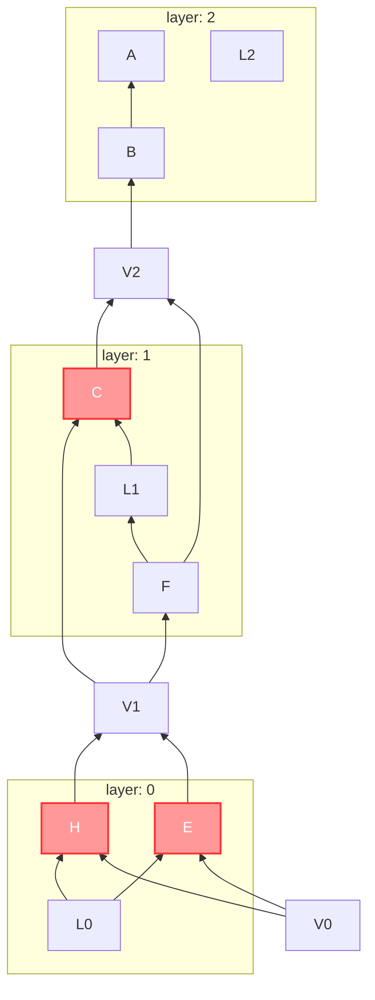
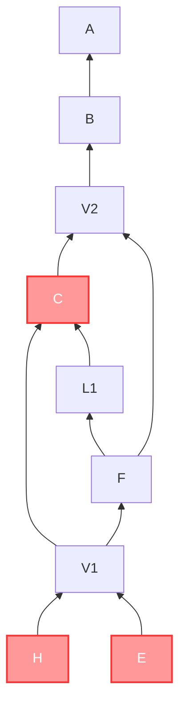
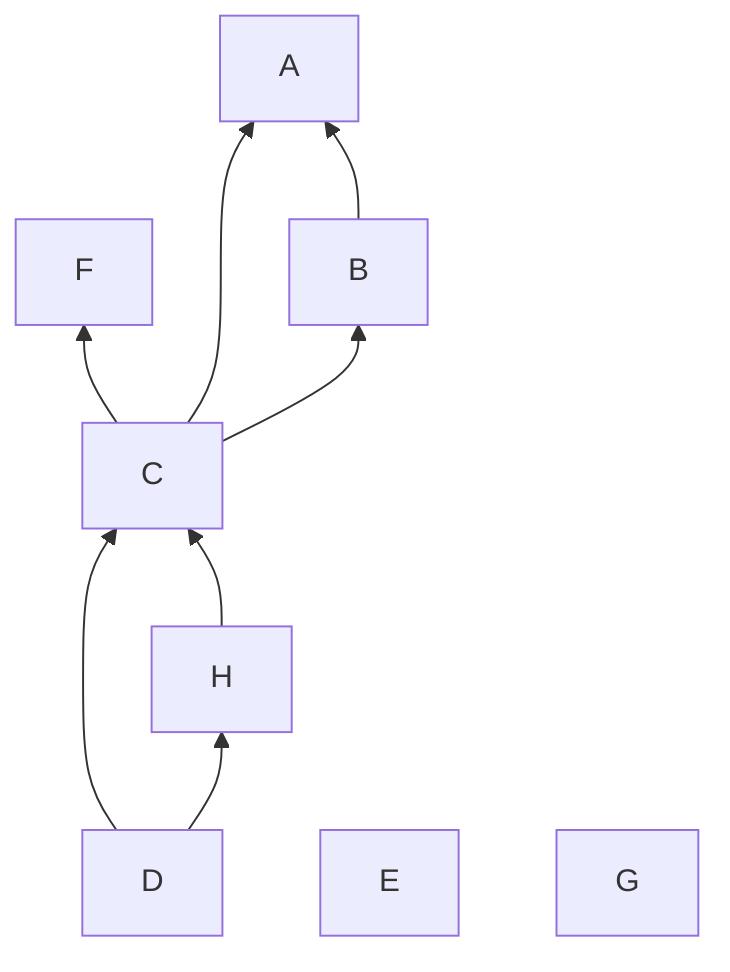

# 层叠图文档

本文档提供白板中用来管理对象间层级关系的工具——层叠图的概述。

## 符号约定

- 所有集合均用大写黑板体表示，如集合 $\mathbb{A}$
- 所有对象均用小写正粗体表示，如对象 $\mathbf{a}$，如未特殊说明，字母相同的对象与点被视为对应的，比如 $\mathbf{a}$ 在图上对应的点为 $A$
- 所有的图均用大写手写体表示，如图 $\mathcal{G}$
- 所有图上的点均用大写斜体表示，如点 $A$
- 所有函数和自然数变量均用小写斜体表示，如 $f(x)$
- 函数 $p(\mathcal{G})$ 用以获取图 $\mathcal{G}$ 的点集
- 函数 $s(\mathcal{G})$ 用以获取图 $\mathcal{G}$ 入度为 $0$ 的点的点集
- 函数 $t(\mathcal{G})$ 用以获取图 $\mathcal{G}$ 出度为 $0$ 的点的点集
- $P \to Q$ 表示 $P$ 与 $Q$ 间有条 $P$ 到 $Q$ 的边

## 层叠图概述

对于一页上的对象，我们可以用有向无环图来表示对象间的层级关系（可以不连通）。

我们将维护两张有向无环图: 静态状态图 $\mathcal{S}$ 和动态状态图 $\mathcal{D}$。其中，每一页都有一张静态状态图，而每一个白板都有一张动态状态图。它们并称层叠图。

静态状态图表示最后一次刷新时对象间的层级关系。若 $P, Q \in \mathcal{S}$ 且存在边 $P \to Q$，则 $P$、$Q$ 间有交集，且 $\mathbf{p}$ 在 $\mathbf{q}$ 之下。

动态状态图表示下次刷新时对象额外应遵循的层级关系，主要是判断谁应在该对象之上。若 $P, Q \in \mathcal{D}$ 且 $P$ 能到达 $Q$，则在下次刷新时，若 $\mathbf{p}$、$\mathbf{q}$ 间有交集，则 $\mathbf{p}$ 应在 $\mathbf{q}$ 之下。

## 层叠图基础操作

### 注册某层

动态状态图使用一个链表来管理层与层之间的上下（高低）关系。

注册某层指的是给予这个层一个编号，并将它放在链表中合适的位置。

### 清理动态图

清理动态图是保证 $\forall \mathbf{p} \in p(\mathcal{D})$ 都是正在被操作的对象，或是它对应的点可以被某被操作的对象对应的点到达，且保证不存在重复对象的操作。

## 层叠图操作逻辑

### 在白板中添加对象

默认情况下，越新的对象越应在最上层。

在向白板中添加对象 $\mathbf{a}$ 的开始，即开始画这一笔时，将其添加到动态图中，并连接所有的 $T \in t(\mathcal{D}) \to A$。

在向白板中添加对象的结尾，即这一笔画完松手时，应先算出与之相交的对象集 $\mathbb{C}$，再连接所有的 $C \in \mathbb{A} \to A$ 

再在静态图中添加对应的从与之相交的对象到新对象的边，最后将其从动态图中删去。

### 在白板中删除对象

直接将其从动态图和静态图中删去即可，然后清理动态图。

### 在白板上选择单个对象

将被选择的对象记为 $\mathbf{a}$。

提取出一个 $\mathcal{S}$ 的子图 $\mathcal{G}$，满足

1. $s(\mathcal{G}) = \mathbb{A}$
2. $\forall P \in p(\mathcal{G})$，存在从 $A$ 到 $P$ 的路径
3. $\forall P \in \complement_{p(\mathcal{S})}\mathcal{G}$，不存在从 $A$ 到 $P$ 的路径

然后额外创建一个外虚点 $V$ ，将 $\mathcal{G}$ 中出度为 $0$ 的点向 $V$ 连边。其中虚点指的是没有对应对象的点。

如果 $\mathcal{G}$ 之中没有先前被选择过的节点，则动态图就是 $\mathcal{G}$。

如果有，那就 $\mathcal{G}$ 之中先前被选择的节点之中 `layer` 最低的那一个所在的层。这一层的下层存在一个外虚点，记为 $V'$。

- 若下层存在，将 $V'$ 连向的对象集记为 $\mathbb{V}$，对 $\forall Q \in \mathbb{V}$，创建边 $V \to Q$，并删除边 $V' \to Q$。然后创建边 $V' \to A$ 即可。
- 若下层不存在，则直接将 $V$ 连向这一层中入度为 $0$ 的对象。

这个操作称为插入某层。

最后将层注册到动态图中。

### 在白板上选择多个对象

将被选择的对象集记为 $\mathbb{A}$。

首先，提取出一个 $\mathcal{S}$ 的子图 $\mathcal{G}$，满足

1. $s(\mathcal{G}) \subseteq \mathbb{A}$
2. $\forall P \in p(\mathcal{G}), \exist Q \in \mathbb{A}$，存在从 $Q$ 到 $P$ 的路径
3. $\forall P \in \complement_{p(\mathcal{S})}\mathcal{G}, \forall Q \in \mathbb{A}$，不存在从 $Q$ 到 $P$ 的路径

得到 $\mathcal{G}$ 后，将其分层并删除跨层边，算法如下:

1. 对于每个点，有属性 `layer` 表示该点所在的层，属性 `stash` 表示该点的暂存的边，有全局变量 `currentLayer` 表示当前正在处理的层，`activeNumber` 表示当前是还需处理多少个 `activeQueue` 中的点，队列 `activeQueue` 和 `inactiveQueue` 分别存被选中对象和未被选中对象
2. 计算每个点的入度
3. 将入度为 $0$ 的点入队，将 `currentLayer` 赋予这些点
4. 若 `inactiveQueue` 中有元素且 `activeNumber` 为 $0$，则将 `inactiveQueue` 中一元素出队，记为 $P$，对 $P$ 的所有后继节点进行如下操作
   1. 假设当前操作的节点为 $Q$
   2. 若 $Q$ 的 `layer` 比 `currentLayer` 小，则将其 `stash` 里的所有边从 $\mathcal{G}$ 中删去，将 `stash` 清空，并将 `currentLayer` 赋予 $Q$
   3. 将 $Q$ 的入度减一，若 $Q$ 的入度变成了 $0$，则将 $Q$ 入队，并清空 $Q$ 的 `stash`，否则，将 $P \to Q$ 加入 $Q$ 的 `stash`
5. 若 `inactiveQueue` 中无元素但 `activeQueue` 中有元素，则将 `activeNumber` 设为 `activeQueue` 的元素数
6. 若 `activeNumber` 不为 $0$ 且 `activeQueue` 中有元素，则将 `activeQueue` 中一元素出队，记为 $P$，对 $P$ 的所有后继节点进行如下操作
   1. 假设当前操作的节点为 $Q$
   2. 若 $Q$ 的 `layer` 比 `currentLayer` 小，则将其 `stash` 里的所有边从 $\mathcal{G}$ 中删去，将 `stash` 清空，并将 `currentLayer` 赋予 $Q$
   3. 将 $Q$ 的入度减一，若 $Q$ 的入度变成了 $0$，则将 $Q$ 入队，并清空 $Q$ 的 `stash`，否则，将 $P \to Q$ 加入 $Q$ 的 `stash`
   4. 将 `activeNumber` 减一，若 `activeNumber` 被减为 $0$，则将 `currentLayer` 加一
7. 若 `inactiveQueue` 或 `activeQueue` 中有元素，则重复第 4 到第 6 步
8. 在跨层的边不算入度和出度的情况下计算每个点的入度和出度
9. 创建 `currentLayer + 1` 个外虚点，记为 $V_i (i \in \mathbb{N})$
10. 再创建 `currentLayer + 1` 个内虚点，记为 $L_i (i \in \mathbb{N})$
11. 让 `layer` 为 $i$ 的、出度为 $0$ 的节点向 $V_i$ 连边
12. 在 `layer` 为 $i$ 的、入度为 $0$ 的节点向 $L_i$ 连边，且让 $L_i$ 连向它们的后继，删除原有的边
13. 最终，得到图 $\mathcal{G'}$

将 $\mathcal{G}'$ 的每一层按照以下规则插入:

1. 原来就在某一层之上的层，插入之后不会出现在这层之上
2. 这层内的对象如果是以前被选择的对象，那这个对象的层一定不会在这层之下

在白板上选择单个对象是在白板上选择多个对象的特殊情况。

### 取消选择对象

首先将要取消选择的对象集合 $\mathbb{A}$ 提取出来，对于每一个 $\mathbf{a} \in \mathbb{A}$，都有对象集 $\mathbb{B}_{\mathbf{a}}$ 表示动态图中它能到达的对象，有对象集 $\mathbb{C}_{\mathbf{a}}$ 表示与它有交集的对象，于是我们有对象集 $\mathbb{D}_{\mathbf{a}} = \mathbb{B}_{\mathbf{a}} \cap \mathbb{C}_{\mathbf{a}}$ 表示在静态图中它将要连边的对象，而 $\mathbb{E}_{\mathbf{a}} = \complement_{\mathbb{C}_{\mathbf{a}}}\mathbb{D}_{\mathbf{a}}$ 表示在静态图中将要连边到它的对象。

然后依据刚刚算出来的 $\mathbb{D}_a$ 和 $\mathbb{E}_a$ 连边。

最后合并每一个刚刚取消选择了对象的层和它下一层。

### 置顶选择的对象

todo

## 层叠图实现

在 [tire-graph.js](./tier-graph.js) 中，选用邻接表来实现一个有向无环图。

## 层叠图示例

下面将以几个示例来演示层叠图的工作方式

### 示例一: 单人单对象

#### 原始状态

静态图如下:

动态图为空。

#### C 被选择

静态图不变，动态图如下:

#### 将 C 移到 E、F 之上，A 之下，取消选择

静态图如下:

动态图为空。

### 示例二: 单人多对象

#### 原始状态

静态图如下:

动态图为空。

#### C、E、H 被选择

现在，我们提取出来的子图 $\mathcal{G}$ 如下:

然后将其分层，$\mathcal{G'}$ 如下:

放入动态图中，静态图不变，动态图清理后如下:

#### 将 E 移走，H 移到 D 上，C 移到 A、B、F 之下，取消选择

静态图如下:

动态图为空。
