# 层叠图文档

本文档提供白板中用来管理对象间层级关系的工具——层叠图的概述。

## 符号约定

- 所有集合均用大写黑板体表示，如集合 $\mathbb{A}$
- 所有对象均用小写正粗体表示，如对象 $\mathbf{a}$，如未特殊说明，字母相同的对象与点被视为对应的，比如 $\mathbf{a}$ 在图上对应的点为 $A$
- 所有的图均用大写手写体表示，如图 $\mathcal{G}$
- 所有图上的点均用大写斜体表示，如点 $A$
- 所有函数和自然数变量均用小写斜体表示，如 $f(x)$
- 函数 $p(\mathcal{G})$ 用以获取图 $\mathcal{G}$ 的点集
- 函数 $s(\mathcal{G})$ 用以获取图 $\mathcal{G}$ 入度为 $0$ 的点的点集
- 函数 $t(\mathcal{G})$ 用以获取图 $\mathcal{G}$ 出度为 $0$ 的点的点集
- $from(X) = \mathbb{I}$，其中 $\forall I \in \mathbb{I}$ 都有边 $I \to X$ 且 $\forall I \notin \mathbb{I}$ 都没有边 $I \to X$。
- $to(X) = \mathbb{I}$, 其中 $\forall I \in \mathbb{I}$ 都有边 $X \to I$ 且 $\forall I \notin \mathbb{I}$ 都没有边 $X \to I$。
- $P \to Q$ 表示 $P$ 与 $Q$ 间有条 $P$ 到 $Q$ 的边

## 层叠图概述

对于一页上的对象，我们可以用有向无环图来表示对象间的层级关系 (可以不连通)。

我们将维护两张有向无环图: 静态状态图 $\mathcal{S}$ 和动态状态图 $\mathcal{D}$。其中，每一页都有一张静态状态图，而每一个白板都有一张动态状态图。它们并称层叠图。

静态状态图表示最后一次刷新时对象间的层级关系。若 $P, Q \in \mathcal{S}$ 且存在边 $P \to Q$，则 $P$、$Q$ 间有交集，且 $\mathbf{p}$ 在 $\mathbf{q}$ 之下。

动态状态图表示下次刷新时对象额外应遵循的层级关系，主要是判断谁应在该对象之上。若 $P, Q \in \mathcal{D}$ 且 $P$ 能到达 $Q$，则在下次刷新时，若 $\mathbf{p}$、$\mathbf{q}$ 间有交集，则 $\mathbf{p}$ 应在 $\mathbf{q}$ 之下。

## 层叠图操作逻辑

### 清理动态图

清理动态图是保证 $\forall \mathbf{p} \in p(\mathcal{D})$ 都是正在被操作的对象的操作。

清理动态图的方法是进行拓扑排序，但只将不是正在被操作的对象从序列中移走并从动态图中删除，最终序列中只会剩下正在被操作的对象或什么都没有。

### 在白板中添加对象

默认情况下，越新的对象越应在最上层。

在向白板中添加对象 $\mathbf{a}$ 的开始，即开始画这一笔时，将其添加到动态图中，并连接所有的 $T \in t(\mathcal{D}) \to A$。

在向白板中添加对象的结尾，即这一笔画完松手时，应先算出与之相交的对象集 $\mathbb{C}$，再连接所有的 $C \in \mathbb{A} \to A$ 

再在静态图中添加对应的从与之相交的对象到新对象的边，最后将其从动态图中删去。

### 在白板中删除对象

直接将其从动态图和静态图中删去即可，记得清理动态图。

### 在白板上选择单个对象

将被选择的对象记为 $\mathbf{a}$，将提取出以选择对象为起点的子图加入动态图中，然后连接所有的 $T \in t(\mathcal{D}) \to A$。

接下来，以拓扑序去重。若有重复，则保留拓扑序靠后的那个。

### 在白板上选择多个对象

将被选择的对象集记为 $\mathbb{A}$。

首先，提取出一个 $\mathcal{S}$ 的子图 $\mathcal{G}$，满足

1. $s(\mathcal{G}) \sube \mathbb{A}$
2. $p(\mathcal{G}) \sube \mathbb{G}$

我们称 $\mathcal{G}$ 为在 $\mathcal{S}$ 中以 $a \in \mathbb{A}$ 中的点为起点的子图。

得到 $\mathcal{G}$ 后，将其分块。分块的规则如下:

1. 在每个块内都有一张有向无环图 $\mathcal{G}_x$，若忽略边的方向，则它应该是一张连通图
2. 对 $\forall T \in t(\mathcal{G}_x)$ 都有 $T \in t(\mathcal{G}) \cup \mathbb{A}$
3. 对 $\forall S \in s(\mathcal{G}_x)$ 都有 $S \in s(\mathcal{G})$ 或存在边 $A \in \mathbb{A} \to S$
4. $\complement_{p(\mathcal{G}_x)}t(\mathcal{G}_x) \cap \mathbb{A} = \emptyset$ (可由 2. 和 3. 证出)

然后，以块为节点创建一张块的有向图 $\mathcal{B}$。若两块间节点有相连，则两块所在节点也应相连且方向一致，易得 $\mathcal{B}$ 无环。又可由上述规则证明出每一块内的有向图是无环的。

现在将 $\mathcal{B}$ 的边反向，记为 $\mathcal{B'}$，然后使用拓扑排序求每个 $B \in p(\mathcal{B'})$ 的深度。这里的 $B$ 既是图 $\mathcal{B'}$ 中的点，也是一张图。

记函数 $get\_depth(B)$ 为点 $B$ 在 $\mathcal{B'}$ 中的深度 (深度已用拓扑排序定义)。

对于 $\forall W \in \mathcal{B}$，$\mathcal{W}$ 是 $W$ 下的有向无环图，则有有向无环图集 $\mathbb{V}$ 表示与 $W$ 同深度的节点下的有向无环图，而 $\mathbb{U}$ 表示比 $W$ 深度小 $1$ 的节点下的有向无环图集。

则 $\forall V_i \in \mathbb{V}, \mathcal{V_i}$ 是 $V_i$ 下的有向无环图，$t(\mathcal{V}) = \bigcup t(\mathcal{V_i})$，$\forall U_i \in \mathbb{U}, \mathcal{U_i}$ 是 $U_i$ 下的有向无环图，$t(\mathcal{U}) = \bigcup t(\mathcal{U_i})$

我们将在 $\mathcal{G}$ 中连接以下的边
- $\forall X \in from(t(\mathcal{W})) \to \forall Y \in t(\mathcal{W})$
- $\forall X \in from(t(\mathcal{W})) \to \forall Y \in t(\mathcal{V})$
- $\forall X \in t(\mathcal{W}) \to \forall Y \in s(\mathcal{U})$

接下来，将刚刚处理完了的图 $\mathcal{G}$ 加入 $\mathcal{D}$ 中，连接所有的 $T \in t(\mathcal{D}) \to S \in \mathbb{A}$。

最终，以拓扑序去重。去重的规则见[上文](#在白板上选择单个对象)。

在白板上先择单个对象是在白板上选择多个对象的特殊情况。

### 取消选择对象

首先将要取消选择的对象集合 $\mathbb{A}$ 提取出来，对于每一个 $a \in \mathbb{A}$，都有对象集 $\mathbb{B}_a$ 表示动态图中它能到达的对象，有对象集 $\mathbb{C}_a$ 表示与它有交集的对象，于是我们有对象集 $\mathbb{D}_a = \mathbb{B}_a \cap \mathbb{C}_a$ 表示在静态图中它将要连边的对象，而 $\mathbb{E}_a = \complement_{\mathbb{C}_a}\mathbb{D}_a$ 表示在静态图中将要连边到它的对象。

然后，我们在静态图中将原有的 $a \in \mathbb{A}$ 删去，再依据刚刚算出来的 $\mathbb{D}_a$ 和 $\mathbb{E}_a$ 连边。

### 置顶选择的对象

将要置顶的对象集记为 $\mathbb{A}$。

首先，将 $A \in \mathbb{A}$ 从动态图中删去，然后清理动态图，再连接所有的 $T \in t(\mathcal{D})$ 到 $A \in \mathbb{A}$ 的边。

## 层叠图示例

下面将以几个示例来演示层叠图的工作方式

### 原始状态

静态图如下:

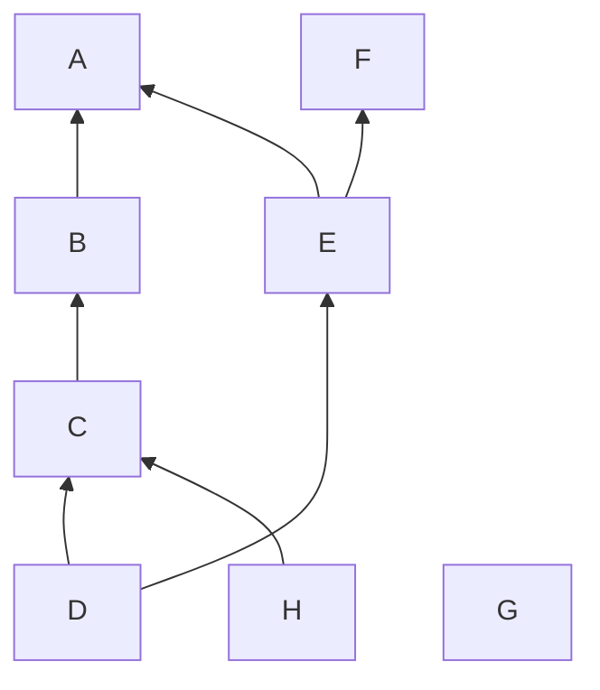

动态图为空。

### 示例一: 单人单对象

#### C 被选择

静态图不变，动态图如下:

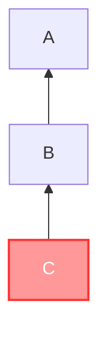

#### 将 C 移到 E、F 之上，A 之下，取消选择

静态图如下:

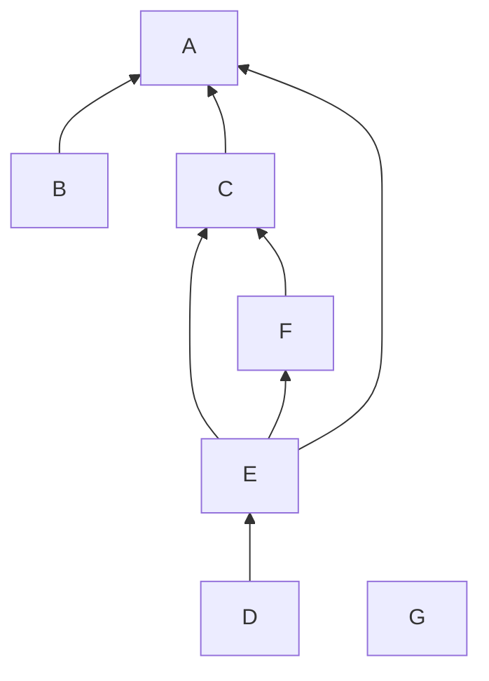

动态图为空。

### 示例二: 单人多对象

#### C、E、H 被选择

现在，我们提取出来的子图 $\mathcal{G}$ 如下:

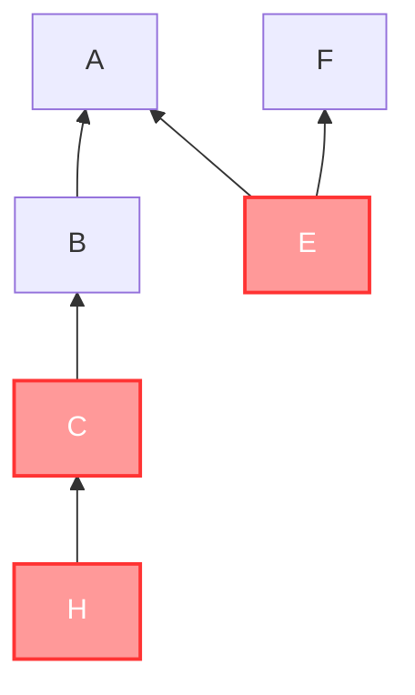

然后将其分块，如下:

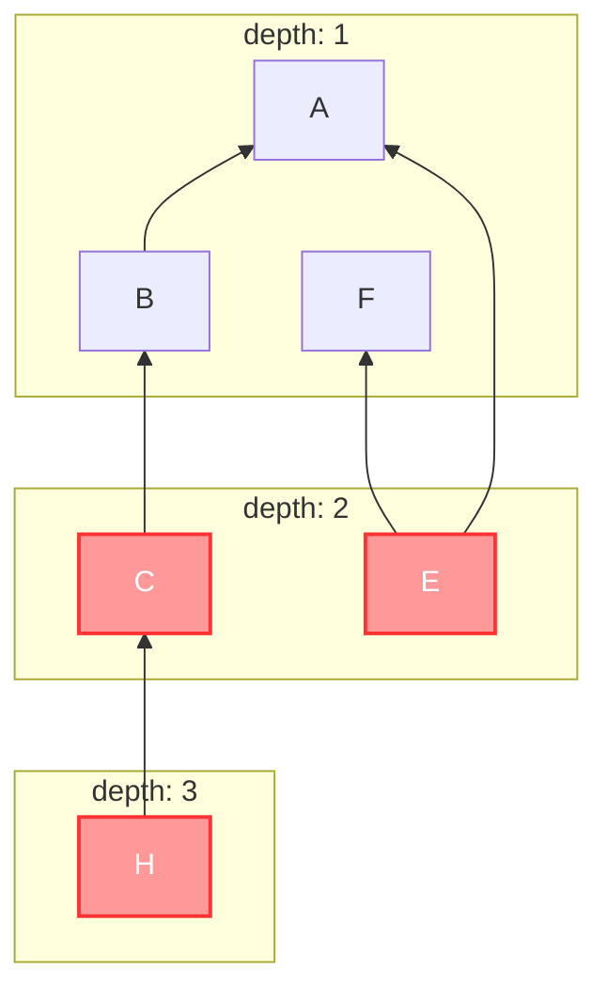

连边处理，如下:

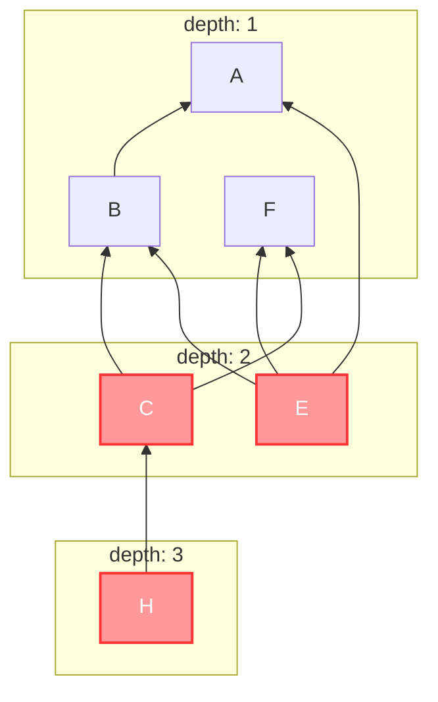

放入动态图中，静态图不变，动态图如下:
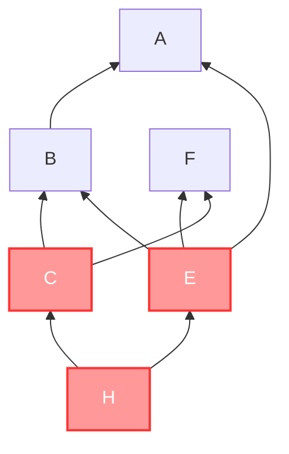

#### 将 E 移走，H 移到 D 上，C 移到 A、B、F 之下，取消选择

静态图如下:

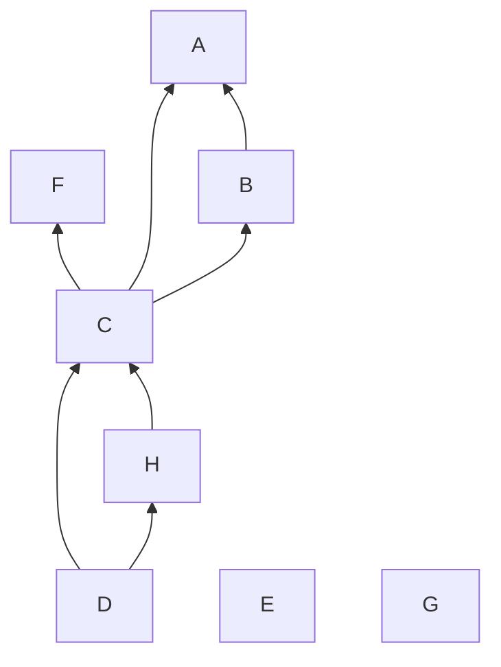

动态图为空。

### 示例三: 多人协作同选·一

#### 甲先选 C，乙再选 G

静态图不变，动态图如下:

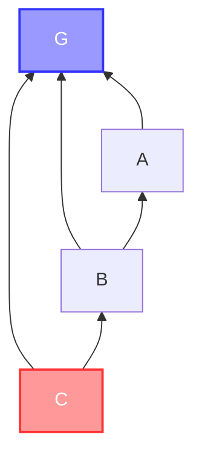

#### 乙把 G 移到 A 之上，乙取消选择

静态图如下:

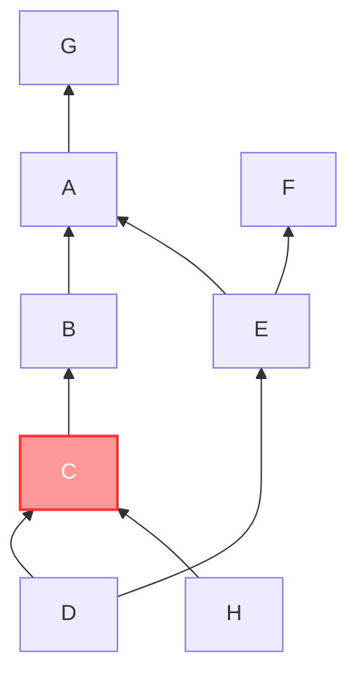

动态图如下:

### 示例四: 多人协作同选·二

#### 甲先选 C，乙再选 G

静态图不变，动态图如下:

#### 甲取消选择

静态图如下:

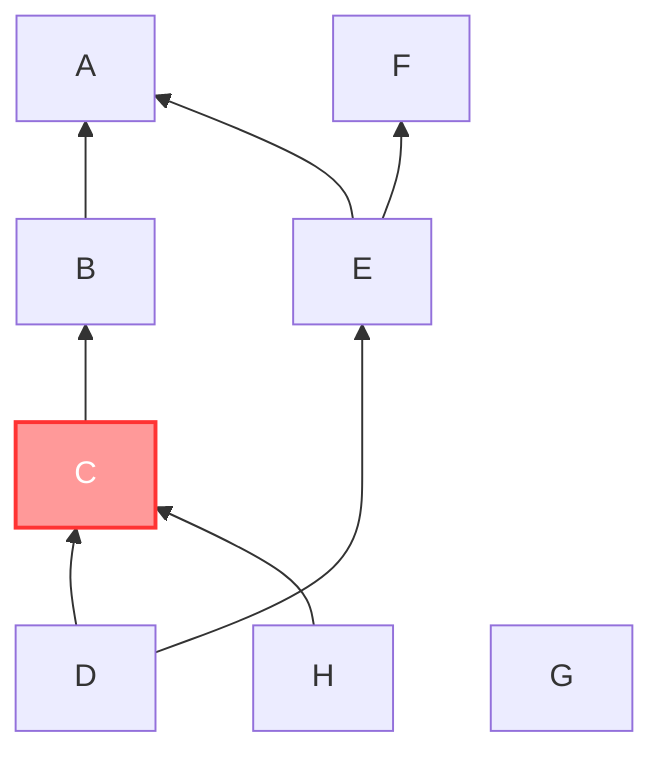

动态图如下:

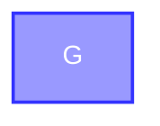
