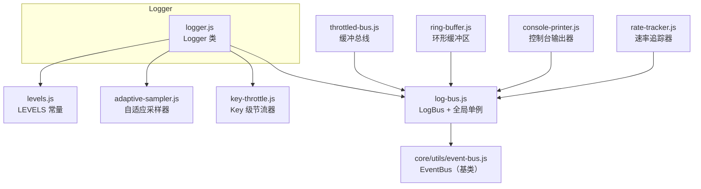
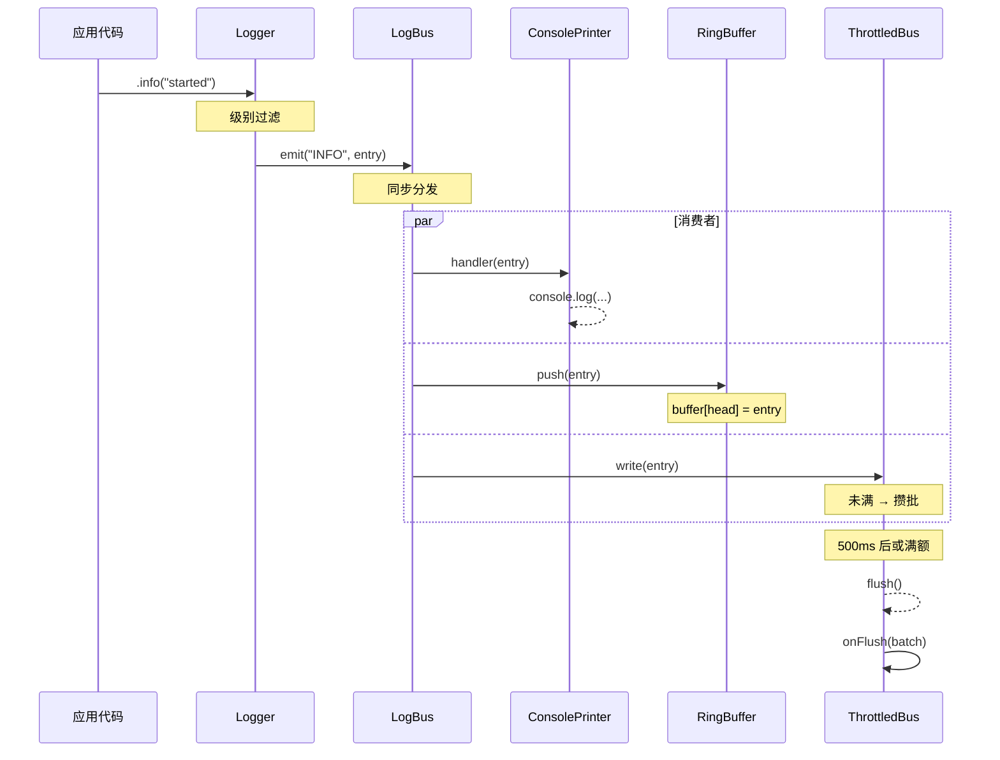

# 日志系统 - 内部原理文档

本文档提供 `src/utils/log/` 的架构设计和内部实现原理。

## 模块职责

`utils/log/` 负责提供一套基于 EventBus 的解耦日志体系。它不负责日志持久化策略、远程上报或 UI 渲染——这些由宿主应用通过订阅 LogBus 自行实现。

## 模块列表

| 文件                  | 职责                                                  |
| --------------------- | ----------------------------------------------------- |
| `levels.js`           | 日志级别枚举 `LEVELS` 和字符串解析工具 `resolveLevel` |
| `adaptive-sampler.js` | 高频 DEBUG 日志的自适应降采样器                       |
| `key-throttle.js`     | 按 key 的源头节流器，防止重复告警                     |
| `logger.js`           | Logger 类：命名空间、级别过滤、采样、节流、发射       |
| `log-bus.js`          | LogBus 类：增强型 EventBus，全局单例                  |
| `throttled-bus.js`    | 缓冲总线：攒批后定时/满额刷出                         |
| `ring-buffer.js`      | 环形缓冲区：固定大小，始终保留最近 N 条               |
| `console-printer.js`  | 控制台输出器：带颜色和时间的 console 订阅者           |
| `rate-tracker.js`     | 速率追踪器：各 Logger 的发射频率统计                  |

## 模块关系



Logger 依赖四个底层模块（levels、adaptive-sampler、key-throttle、log-bus），消费者依赖 LogBus 的类型引用。

## 数据流



## 关键设计点

### 逐层过滤，尽早丢弃

日志从应用代码到最终消费者经过多道过滤关卡：

```
log.info(...)
  │
  ├─ ① 级别过滤（Logger.level）
  │   level > INFO → 直接 return
  │
  ├─ ② 自适应采样（仅 DEBUG）
  │   sampler.sample() === false → 直接 return
  │
  ├─ ③ Key 节流（仅 throttled* 方法）
  │   keyThrottle.tryEmit(key) === false → 直接 return
  │
  ├─ ④ LogBus 分发（所有订阅者）
  │
  ├─ ⑤ ThrottledBus 缓冲
  │   buffer.length ≥ maxBufferSize → dropped++
  │
  └─ ⑥ 消费者处理
```

越靠前的关卡开销越低、丢弃率越高。**高开销操作（文件 I/O、UI 更新）靠后**，只处理经过层层筛选后的少量日志。

### LogBus 的增强分发

LogBus 继承自 `EventBus`，对 `emit` 做了增强：一条日志发射时会同时通知**级别订阅者**和**通配符订阅者**。

```js
emit(level, entry) {
  if (this.listeners.has(level)) super.emit(level, entry);
  if (this.listeners.has("*"))   super.emit("*", entry);
}
```

这使得一个消费者可以选择"只收 ERROR"（`on("ERROR", handler)`），也可以选择"收全部"（`onAny(handler)`），二者互不干扰。一个 entry 发射时两种订阅者都会收到。

### 自适应采样

`AdaptiveSampler` 解决"高频 DEBUG 日志打爆总线"的问题。

核心逻辑：

- 追踪上次放行的时间戳 `lastTime`。
- 距上次不足 `minGapMs`（默认 10ms）时视为"密集突发"。
- 密集期间按 **衰减采样率** 决定是否放行：`rate = max(minRate, 1 / (skipCount + 1))`。
- 每次跳过使采样率按 `1/n` 衰减，迅速压低到 `minRate`。
- 间隔恢复后 `skipCount` 归零，回到满采样。

效果：60fps 渲染循环中 debug 日志 100 条/帧 → 实际放行约 3-5 条/秒。

首次调用和 reset 后使用 `lastTime === null` 作为初始状态标记，避免 `Date.now()` 为 0 时与真实时间戳冲突。

### 源头节流

`KeyThrottle` 解决"同一条告警重复刷屏"的问题。

- 每个 key 维护一个时间戳和跳过计数。
- 请求放行时，若距上次放行不足 `windowMs`（默认 200ms）则拒绝。
- 不同 key 独立计时。
- `skipCount` 可查，用于辅助观察被抑制的频率。

### ThrottledBus 的缓冲策略

ThrottledBus 有两种触发刷出的条件：

| 条件   | 触发时机                        | 说明                                       |
| ------ | ------------------------------- | ------------------------------------------ |
| 定时刷 | `setTimeout(fn, flushInterval)` | 首次写入启动定时器，刷出后自动重启         |
| 满额刷 | `buffer.length ≥ maxBufferSize` | 缓冲区写满时立即刷，同时清除未到期的定时器 |

两个条件互斥：满额刷时会清除定时器；定时刷时必定 buffer 未满（否则已满额刷出）。

刷盘回调 `onFlush(batch)` 是同步执行的。消费者如果需要异步处理（如文件写入），应在回调内部自行管理异步边界。

### RingBuffer 的环形结构

```js
push(entry) {
  buffer[head] = entry;
  head = (head + 1) % size;
  count++;
}

dump() {
  // 未绕圈 → 从 0 开始
  // 已绕圈 → 从 head 开始
  const start = count < size ? 0 : head;
  return buffer[(start + 0) % size],
         buffer[(start + 1) % size],
         ...;
}
```

- 不满时 `dump()` 从下标 0 到 `count-1` 输出。
- 绕圈后 `dump()` 从 `head`（最老的有效条目）到 `head-1`（最新条目）输出。
- `totalPushed` 累计写入次数，始终递增，不受绕圈影响。

### 无 LogBus 时的降级

Logger 在创建时若未传入 `bus`，调用 `#emit` 时会走 `#consoleFallback`：

```js
#consoleFallback(level, args) {
  const prefix = `[${this.name}]`;
  console[level === "ERROR" ? "error" : level === "WARN" ? "warn" : "log"](prefix, ...args);
}
```

这使得 Logger 在未初始化 LogBus 的环境中可以零配置工作，适合早期模板代码或临时脚本。

### 子 Logger 的元数据继承

```js
child(subName, extraMeta) {
  const child = new Logger(`${this.name}:${subName}`, this.level, this.bus);
  child._meta = { ...this._meta, ...extraMeta };
  return child;
}
```

- 命名空间用 `:` 拼接形成路径，如 `"Monitor:BaseRenderer"`。
- `_meta` 使用 `_` 前缀（非 `#` 私有字段），因为 child 需要读取父级的 meta。
- 额外的 meta（如 `{ chunkId: 5 }`）会被合并到父 meta 之上。

## 测试策略

测试按模块拆分到 `tests/` 目录，每个模块对应一个测试文件：

| 测试文件                   | 覆盖内容                                         |
| -------------------------- | ------------------------------------------------ |
| `levels.test.js`           | 常量值、`resolveLevel` 大小写/failed             |
| `adaptive-sampler.test.js` | 首次放行、间隔恢复、密集采样、reset              |
| `key-throttle.test.js`     | 窗口内节流、窗口恢复、独立 key、skipCount、clear |
| `logger.test.js`           | 发射、级别过滤、child、fallback、节流、采样      |
| `log-bus.test.js`          | 级别/通配符分发、onLevels、取消订阅              |
| `throttled-bus.test.js`    | 定时/满额刷出、手动 flush、shutdown、subscribe   |
| `ring-buffer.test.js`      | 顺序、绕圈、length、dumpByLevel、subscribe       |
| `console-printer.test.js`  | 级别映射、指定级别、取消订阅                     |
| `rate-tracker.test.js`     | 速率计算、窗口外忽略、subscribe、clear           |

使用 `jest.useFakeTimers()` 控制时间相关的测试。所有关键路径（采样、节流、缓冲刷出）均依赖 `Date.now()` 而非 `performance.now()`，因为 Jest 的 fake timer 正确处理前者。

## 设计约束

- LogBus 的 `emit` 是同步的——所有订阅者在当前调用栈中依次执行。如果消费者需要异步处理（如网络上报），应自行包装。
- ThrottledBus 的 `onFlush` 回调同步执行，设计上 `queueMicrotask` 被移除以确保测试可预测性。消费者如需异步化，应在回调内处理。
- 当前不提供跨进程日志收集。主进程（Tauri 侧）如需接入，需通过 IPC 通道转发，或单独在主进程中创建 LogBus 实例。
- 日志条目中的 `args` 是原始参数数组的引用，不是深拷贝。如果后续有异步消费者（如延迟写入），调用方应自行确保参数在消费时仍然有效。

## 相关文档

- [log-usage-document.md](./log-usage-document.md) — 用法示例与 API 参考
