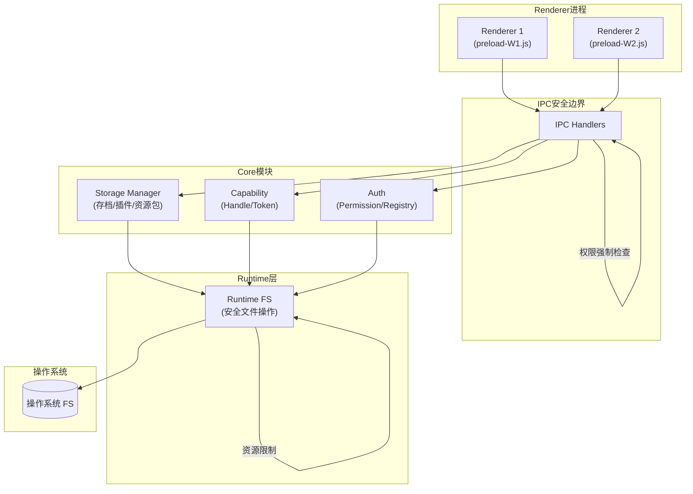
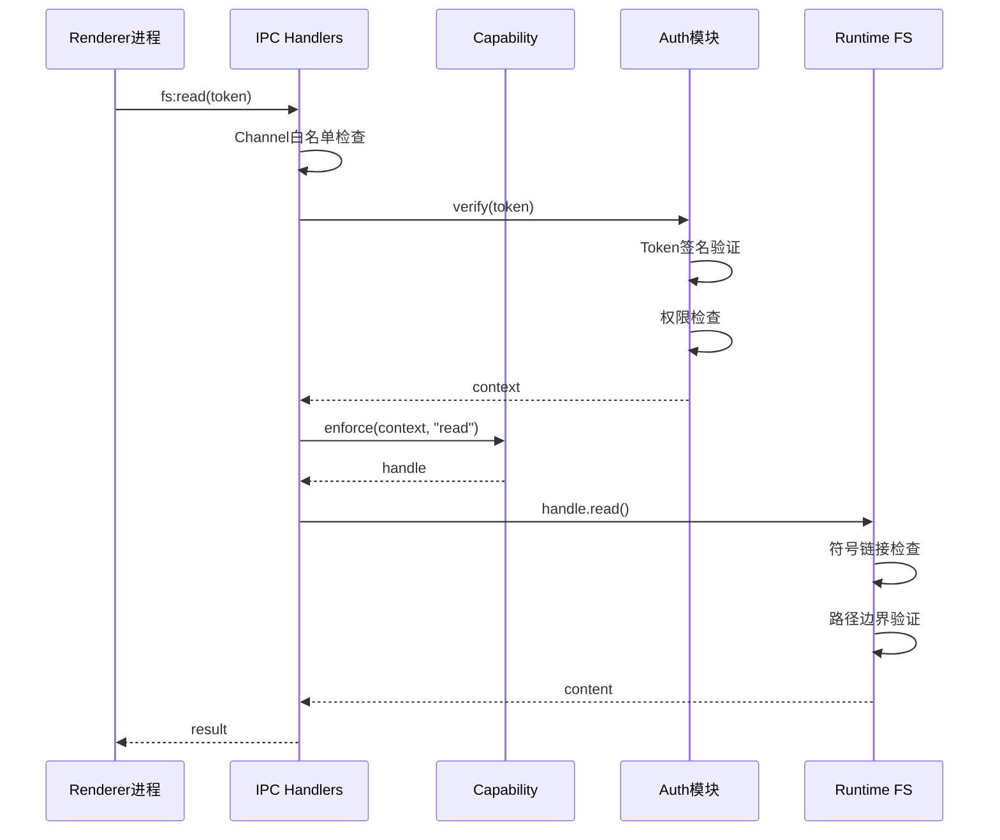
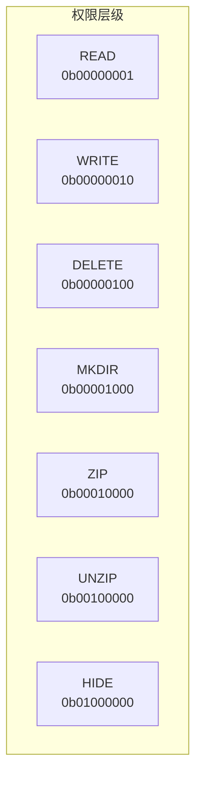
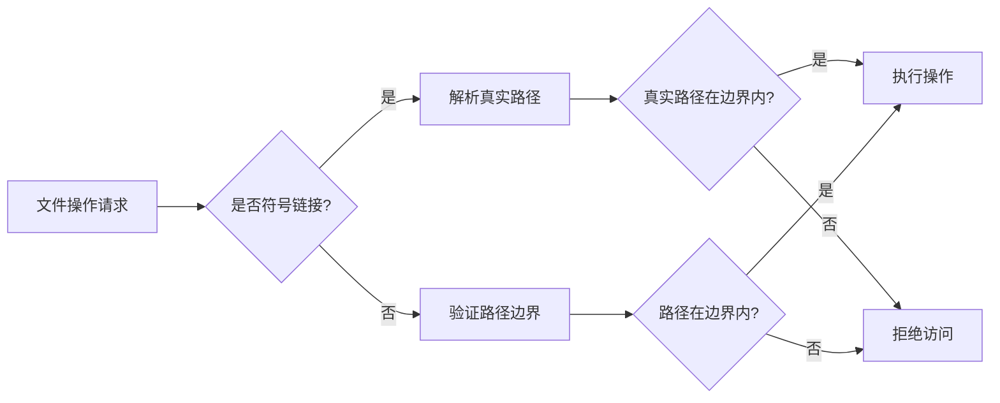
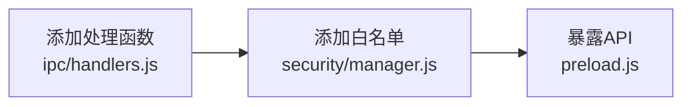

# Safe-IO 安全文件操作框架

> 基于 Capability-based Security 模型的安全文件IO框架，支持存档文件、插件和资源包的安全管理。

## 📋 目录

- 架构概览
- 核心组件
- 权限系统
- 安全特性
- API 参考
- 使用示例
- 开发指南

---

## 🏗️ 架构概览





---

## 🧩 核心组件

| 模块 | 路径 | 职责 |
|------|------|------|
| **Auth** | `auth/` | 授权管理、权限验证、注册表 |
| **Capability** | `capability/` | Token生成、文件句柄管理 |
| **IPC** | `ipc/` | IPC消息处理、安全边界 |
| **Runtime** | `runtime/` | 安全文件操作封装 |
| **Security** | `security/` | 安全管理器、动态preload生成 |
| **Storage** | `storage/` | 存档、插件、资源包管理 |
| **Crypto** | `crypto/` | 签名、加密、安全验证 |

---

## 🔐 权限系统

### 权限预设

框架支持多种权限预设，根据不同场景选择合适的预设：

| 预设名称 | 适用场景 | 文件系统 | 隐藏 | 压缩 |
|----------|----------|---------|------|------|
| `READ_ONLY` | 只读窗口 | ✅ 读/列 | ❌ | ✅ 压缩 |
| `READ_WRITE` | 编辑窗口 | ✅ 读写/列/创建 | ✅ | ✅ |
| `FULL` | 管理窗口 | ✅ 全部(含删除) | ✅ | ✅ |
| `SAVE_ONLY` | 存档窗口 | ✅ 读写/存在 | ❌ | ❌ |
| `PLUGIN` | 插件窗口 | ✅ 读/列 | ❌ | ✅ 解压 |

### Bitmask 权限值

```javascript
const Permission = {
  READ:    0b00000001,  // 1
  WRITE:   0b00000010,  // 2
  DELETE:  0b00000100,  // 4
  MKDIR:   0b00001000,  // 8
  ZIP:     0b00010000,  // 16
  UNZIP:   0b00100000,  // 32
  HIDE:    0b01000000,  // 64
};
```



---

## 🛡️ 安全特性

### 1. 符号链接防护



### 2. 路径穿越防护
- 使用 `safeResolve` 禁止 `..` 路径穿越
- 验证路径深度（最大20级）
- 根目录边界检查

### 3. 动态权限管理
- 支持权限更新、授予、撤销
- Token生命周期绑定窗口生命周期
- 自动GC清理过期Token

### 4. 审计日志
- 全局审计日志 + 实例级历史
- 记录操作类型、路径、时间、结果
- 便于安全审计和问题排查

### 5. 资源限制
- 文件大小限制：100MB
- 路径深度限制：20级
- 操作频率限制

---

## 📚 API 参考

### IPC 通道列表

#### 文件系统操作
| 通道 | 参数 | 说明 |
|------|------|------|
| `fs:read` | `(token)` | 读取文件 |
| `fs:write` | `(token, content)` | 写入文件 |
| `fs:exists` | `(token)` | 检查存在 |
| `fs:delete` | `(token)` | 删除文件 |
| `fs:ls` | `(token)` | 列出目录 |
| `fs:mkdir` | `(token)` | 创建目录 |
| `fs:zip` | `(token, outPath)` | 压缩 |
| `fs:unzip` | `(token, outDir)` | 解压 |
| `fs:hide` | `(token)` | 隐藏文件 |
| `fs:unhide` | `(token)` | 显示文件 |

#### 存档管理
| 通道 | 参数 | 说明 |
|------|------|------|
| `save:create` | `(name, data)` | 创建存档 |
| `save:read` | `(saveId)` | 读取存档 |
| `save:update` | `(saveId, data)` | 更新存档 |
| `save:delete` | `(saveId)` | 删除存档 |
| `save:list` | `()` | 列出存档 |

#### 插件管理
| 通道 | 参数 | 说明 |
|------|------|------|
| `plugin:install` | `(pluginDir)` | 安装插件 |
| `plugin:load` | `(pluginId)` | 加载插件 |
| `plugin:uninstall` | `(pluginId)` | 卸载插件 |
| `plugin:list` | `()` | 列出插件 |
| `plugin:get-resource` | `(pluginId, path)` | 获取插件资源 |

#### 资源包管理
| 通道 | 参数 | 说明 |
|------|------|------|
| `resource:install` | `(packPath)` | 安装资源包 |
| `resource:apply` | `(packId)` | 应用资源包 |
| `resource:uninstall` | `(packId)` | 卸载资源包 |
| `resource:list` | `()` | 列出资源包 |
| `resource:get-resource` | `(path)` | 获取资源 |

#### 权限控制
| 通道 | 参数 | 说明 |
|------|------|------|
| `cap:revoke` | `(tokenId)` | 撤销Token |
| `storage:authorize-save` | `(saveName)` | 获取存档授权 |
| `storage:authorize-plugin` | `(pluginId)` | 获取插件授权 |
| `storage:authorize-resource` | `(packId)` | 获取资源包授权 |

---

## 💡 使用示例

### 示例1：创建并读取存档

```javascript
// Renderer进程
const { safeIO } = window;

// 创建存档
const createResult = await safeIO.storage.authorizeSave("my-save");
if (createResult) {
  await safeIO.fs.write(createResult, JSON.stringify({ level: 1, score: 100 }));
}

// 读取存档
const readResult = await safeIO.save.read("my-save_1234567890");
console.log(readResult.data);
```

### 示例2：安装和加载插件

```javascript
// 安装插件
await safeIO.plugin.install("/path/to/plugin");

// 列出插件
const plugins = await safeIO.plugin.list();
console.log(plugins);

// 加载插件
const plugin = await safeIO.plugin.load("my-plugin");
```

### 示例3：应用资源包

```javascript
// 安装资源包
await safeIO.resource.install("/path/to/resource-pack");

// 应用资源包
await safeIO.resource.apply("my-resource-pack");

// 获取资源路径
const iconPath = await safeIO.resource.getResource("icons/icon.png");
```

---

## 🚀 开发指南

### 添加新的IPC通道



### 添加新的权限预设

1. 在 `security/manager.js` 的 `PERMISSION_PRESETS` 中添加新预设
2. 在 `auth/permission.js` 中添加对应的bitmask值（如果需要）

### 添加新的存储类型

1. 在 `storage/index.js` 中创建新的Manager类
2. 在 `ipc/handlers.js` 中注册对应的IPC处理函数
3. 在 `preload.js` 中暴露API

---

## 📁 目录结构

```
safe-io/
├── api/                    # 对外API封装
│   └── safe-io.js          # 统一入口
├── auth/                   # 授权与权限
│   ├── authorize.js        # 授权逻辑
│   ├── permission.js       # 权限定义与检查
│   └── registry.js         # Capability注册表
├── capability/             # Capability系统
│   ├── handle.js           # 文件句柄管理
│   └── token.js            # Token生成与验证
├── core/                   # 核心逻辑
│   └── safe-io-core.js     # 核心API
├── crypto/                 # 加密与签名
│   └── sign.js             # 签名验证
├── ipc/                    # IPC处理
│   ├── handlers.js         # IPC处理器
│   └── verify.js           # Token验证中间件
├── runtime/                # 运行时
│   ├── fs.js               # 安全文件操作
│   ├── hide.js             # 文件隐藏操作
│   └── zip.js              # 压缩解压操作
├── security/               # 安全管理
│   └── manager.js          # 安全管理器（动态preload）
├── storage/                # 存储管理
│   └── index.js            # 存档/插件/资源包管理
├── functional.js           # 函数式工具
└── README.md               # 说明文档
```

---

## 📝 版本历史

| 版本 | 日期 | 说明 |
|------|------|------|
| v1.0 | - | 基础安全IO功能 |
| v2.0 | - | 整合Bitmask权限系统 |
| v3.0 | - | 添加存档/插件/资源包管理 |

---

## 📄 许可证

GNU General Public License v3.0
