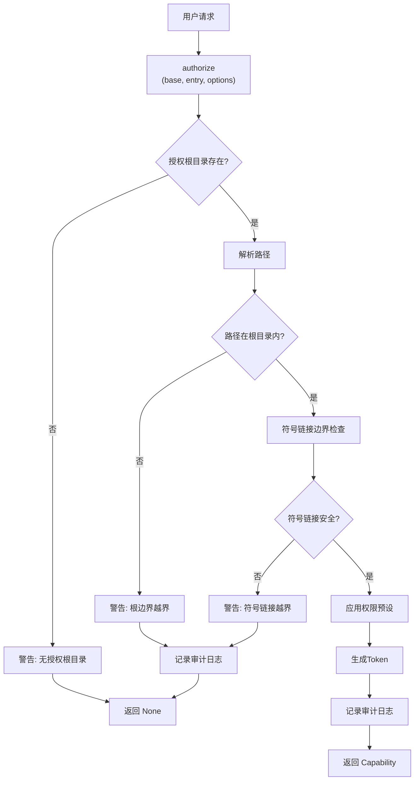
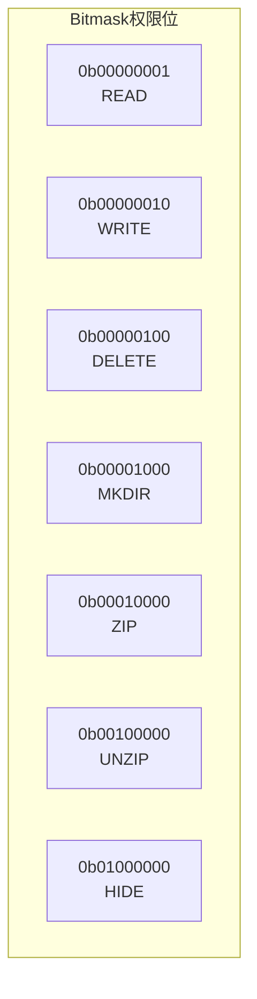
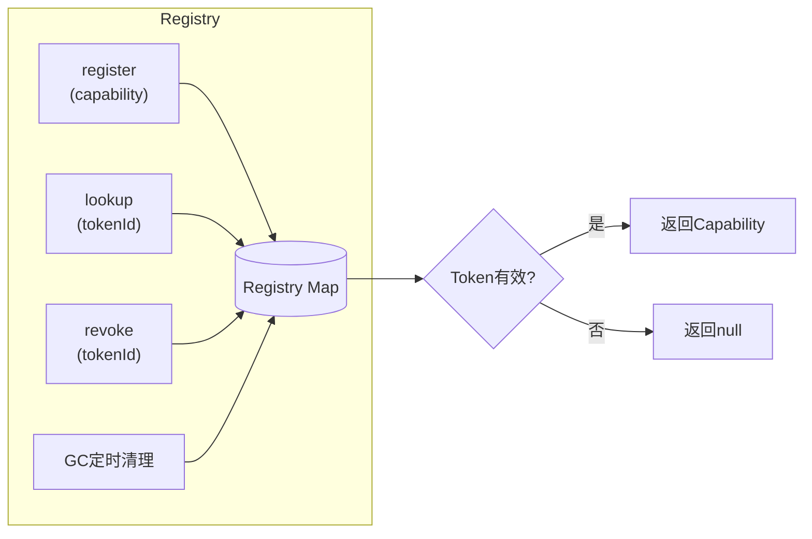
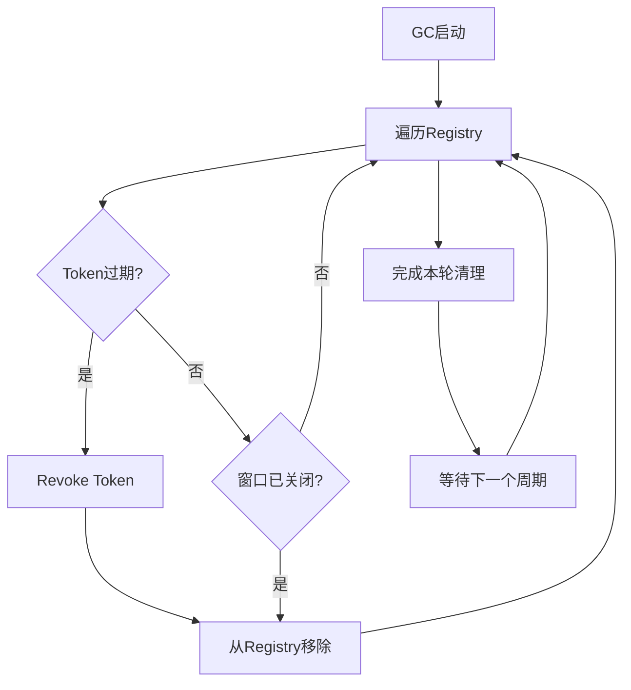
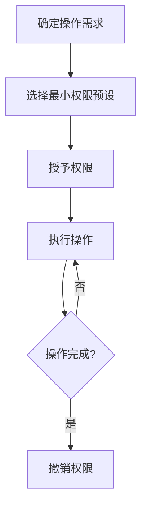

# Auth 授权模块

> 授权与权限管理核心模块

## 📋 目录

- [授权流程](#授权流程)
- [authorize.js](#authorizejs)
- [permission.js](#permissionjs)
- [registry.js](#registryjs)

---

## 🔄 授权流程



---

## 📦 authorize.js

### 函数列表

| 函数 | 说明 | 参数 | 返回值 |
|------|------|------|--------|
| `authorize(base, entry, options)` | 授权入口 | `base`: 基础路径, `entry`: 目标条目, `options`: 选项 | `Option<Token>` |
| `registerRoot(path)` | 注册授权根目录 | `path`: 根目录路径 | `Option<string>` |
| `isUnderRoot(path)` | 检查路径是否在授权范围内 | `path`: 路径 | `boolean` |
| `checkSymlinkBoundary(path)` | 检查符号链接边界 | `path`: 路径 | `boolean` |
| `isPathAuthorized(path)` | 检查路径是否已授权 | `path`: 路径 | `boolean` |
| `getAuthorizedRoots()` | 获取所有授权根目录 | - | `Set<string>` |

### 权限预设

```javascript
// 预设映射
const PRESETS = {
  READ_ONLY: { read: true },
  READ_WRITE: { read: true, write: true, mkdir: true },
  FULL: { read: true, write: true, mkdir: true, delete: true },
};
```

### 使用示例

```javascript
import { authorize, registerRoot } from "./auth/authorize.js";

// 注册根目录
registerRoot("/Users/app/data");

// 创建授权
const token = authorize(
  { segments: ["Users", "app", "data"] },
  { __type: "File", name: "save.json" },
  { preset: "READ_WRITE" }
);

if (token.isSome()) {
  console.log("授权成功:", token.unwrap());
}
```

---

## 📦 permission.js

### 权限常量

```javascript
const Permission = {
  READ:    0b00000001,  // 读取权限
  WRITE:   0b00000010,  // 写入权限
  DELETE:  0b00000100,  // 删除权限
  MKDIR:   0b00001000,  // 创建目录权限
  ZIP:     0b00010000,  // 压缩权限
  UNZIP:   0b00100000,  // 解压权限
  HIDE:    0b01000000,  // 隐藏权限
};
```



### 函数列表

| 函数 | 说明 | 参数 | 返回值 |
|------|------|------|--------|
| `enforcePermission(ctx, operation)` | 强制权限检查 | `ctx`: 上下文, `operation`: 操作名 | `Handle` |
| `hasPermission(permissions, permission)` | 检查是否有权限 | `permissions`: 权限bitmask, `permission`: 权限值 | `boolean` |
| `addPermission(permissions, permission)` | 添加权限 | `permissions`: 当前权限, `permission`: 要添加的权限 | `number` |
| `removePermission(permissions, permission)` | 移除权限 | `permissions`: 当前权限, `permission`: 要移除的权限 | `number` |
| `permissionToBitmask(permObj)` | 对象转bitmask | `permObj`: 权限对象 | `number` |
| `bitmaskToPermission(bitmask)` | bitmask转对象 | `bitmask`: 权限值 | `Object` |

### 使用示例

```javascript
import { Permission, hasPermission } from "./auth/permission.js";

const permissions = Permission.READ | Permission.WRITE;

if (hasPermission(permissions, Permission.READ)) {
  console.log("有读取权限");
}
```

---

## 📦 registry.js

### 核心功能

- Capability注册表管理
- Token生命周期管理
- 自动GC清理过期Token



### 函数列表

| 函数 | 说明 | 参数 | 返回值 |
|------|------|------|--------|
| `register(capability)` | 注册Capability | `capability`: Capability对象 | `string` (tokenId) |
| `lookup(tokenId)` | 查找Capability | `tokenId`: Token ID | `Capability|null` |
| `revoke(tokenId)` | 撤销Capability | `tokenId`: Token ID | `boolean` |
| `startGC(interval)` | 启动GC | `interval`: 清理间隔(ms) | `void` |
| `getStats()` | 获取统计信息 | - | `Object` |

### GC机制



---

## 🔐 安全设计

### 最小权限原则



### 防御性编程

1. 路径验证：检查路径穿越
2. 符号链接检查：防止越界访问
3. 参数验证：所有输入都进行校验
4. 错误处理：统一错误处理和日志记录
