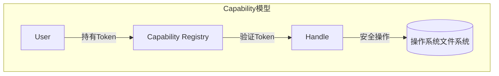
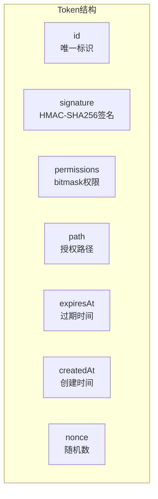
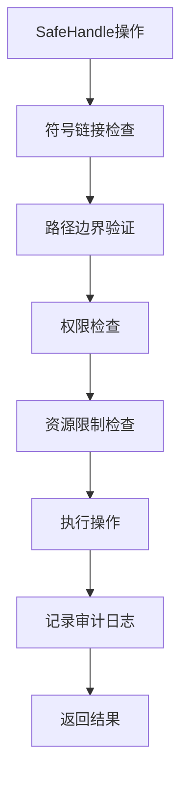
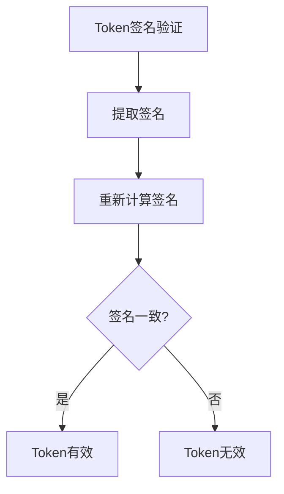
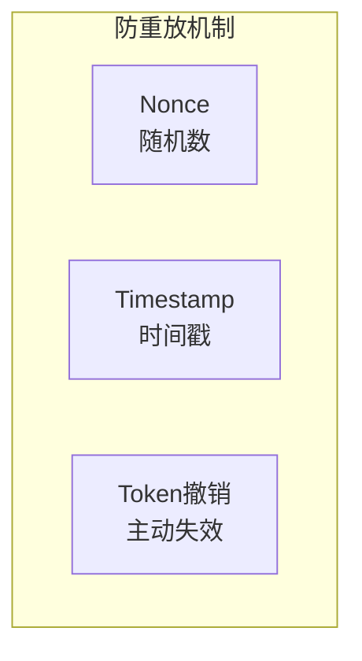
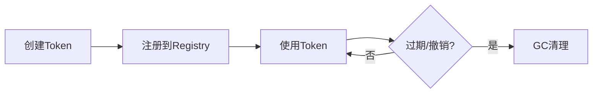
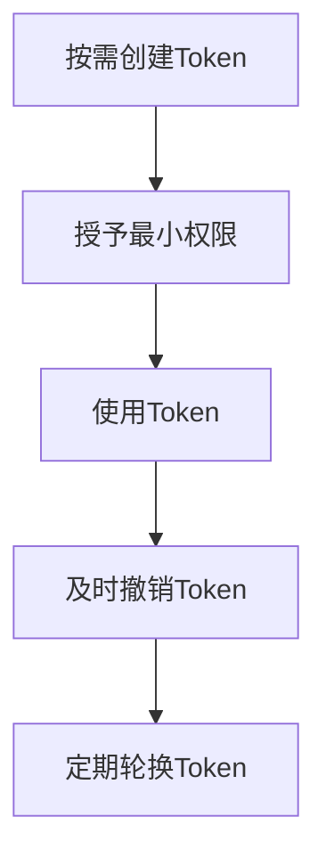

# Capability 模块

> Capability-based Security 的核心实现

## 📋 目录

- [设计理念](#设计理念)
- [handle.js](#handlejs)
- [token.js](#tokenjs)

---

## 🧠 设计理念

### Capability 模式



### Token 结构



---

## 📦 handle.js

### 核心功能

- 文件句柄管理
- 安全文件操作封装
- 审计日志记录
- 符号链接安全检查

### 类结构

```javascript
class SafeHandle {
  constructor(resolvedPath, permissions, options) { ... }
  
  // 文件操作
  read()        // 读取文件
  write(content) // 写入文件
  exists()      // 检查存在
  rm()          // 删除文件
  ls()          // 列出目录
  mkdir()       // 创建目录
  zip(outPath)  // 压缩
  unzip(outDir) // 解压
  hide()        // 隐藏文件
  unhide()      // 显示文件
  
  // 审计日志
  getHistory()  // 获取操作历史
}
```

### 安全特性

| 特性 | 说明 |
|------|------|
| 符号链接检查 | 读取时解析真实路径 |
| 路径边界验证 | 确保操作在授权范围内 |
| 资源限制 | 文件大小、路径深度限制 |
| 审计日志 | 记录所有操作 |



---

## 📦 token.js

### 核心功能

- Token生成与验证
- 权限格式转换
- 签名与验证

### 函数列表

| 函数 | 说明 | 参数 | 返回值 |
|------|------|------|--------|
| `createToken(path, permissions)` | 创建Token | `path`: 路径, `permissions`: 权限 | `Token` |
| `createTokenWithPreset(path, preset)` | 使用预设创建Token | `path`: 路径, `preset`: 预设名称 | `Token` |
| `validateToken(token)` | 验证Token有效性 | `token`: Token对象 | `boolean` |
| `signToken(token)` | 签名Token | `token`: Token对象 | `Token` |
| `verifySignature(token)` | 验证签名 | `token`: Token对象 | `boolean` |
| `permissionsObjToBitmask(obj)` | 对象转bitmask | `obj`: 权限对象 | `number` |
| `bitmaskToPermissions(bitmask)` | bitmask转对象 | `bitmask`: 权限值 | `Object` |

### 权限预设

```javascript
const PRESETS = {
  READ_ONLY:  { read: true },
  READ_WRITE: { read: true, write: true, mkdir: true },
  FULL:       { read: true, write: true, mkdir: true, delete: true },
  SAVE_ONLY:  { read: true, write: true },
  PLUGIN:     { read: true, unzip: true },
};
```

### 使用示例

```javascript
import { createTokenWithPreset, validateToken } from "./capability/token.js";

// 创建Token
const token = createTokenWithPreset("/data/save.json", "READ_WRITE");

// 验证Token
if (validateToken(token)) {
  console.log("Token有效");
}
```

---

## 🔐 安全机制

### 签名验证



```javascript
// 签名生成
signature = HMAC-SHA256(secret, token.id + token.path + token.permissions + token.nonce)
```

### 防重放攻击



### Token生命周期



---

## 💡 最佳实践

### Token管理



### 错误处理

1. 捕获并记录所有错误
2. 不要泄露敏感信息
3. 使用统一的错误格式
