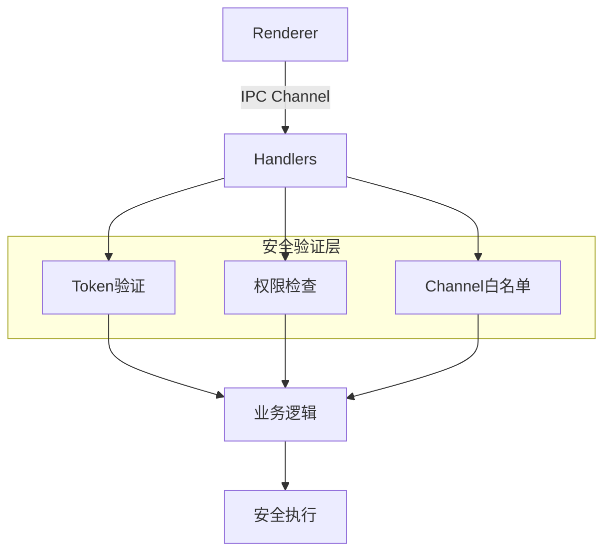

# IPC 模块

> IPC消息处理与安全边界控制

## 📋 目录

- [设计概述](#设计概述)
- [handlers.js](#handlersjs)
- [verify.js](#verifyjs)
- [安全机制](#安全机制)

---

## 🏗️ 设计概述

### IPC架构



### 通道分类

| 类别 | 通道前缀 | 说明 |
|------|----------|------|
| 文件系统 | `fs:` | 文件读写操作 |
| 存档 | `save:` | 存档管理 |
| 插件 | `plugin:` | 插件管理 |
| 资源包 | `resource:` | 资源包管理 |
| 权限 | `cap:` | Capability控制 |
| 用户 | `user:` | 用户管理 |
| 主题 | `theme:` | 主题管理 |
| 国际化 | `locale:` | 国际化 |
| 窗口 | `window:` | 窗口管理 |
| 存储授权 | `storage:` | 存储授权 |

---

## 📦 handlers.js

### 核心功能

- IPC通道注册与处理
- 统一执行包装器
- 权限强制检查
- 错误处理与日志

### 执行流程

```javascript
// 执行包装器
const exec = (fn) => {
  try {
    return fn();
  } catch (e) {
    console.error("[safe-io ipc error]", e);
    throw new Error("IPC execution failed");
  }
};

// 权限强制检查
const enforce = (ctx, action) => {
  // 1. 验证上下文存在
  // 2. 映射操作到权限
  // 3. 调用权限检查
  return enforcePermission(ctx, operation);
};
```

### Dispatch Table

Dispatch表定义了通道到处理函数的映射：

```javascript
const dispatch = {
  "fs:read": (token) => exec(() => {
    const ctx = verify(token);
    const handle = enforce(ctx, "read");
    return handle.read();
  }),
  // ... 其他通道
};
```

### 通道列表

#### 文件系统 (`fs:`)
- `fs:read` - 读取文件
- `fs:write` - 写入文件
- `fs:exists` - 检查存在
- `fs:delete` - 删除文件
- `fs:ls` - 列出目录
- `fs:mkdir` - 创建目录
- `fs:zip` - 压缩
- `fs:unzip` - 解压
- `fs:hide` - 隐藏文件
- `fs:unhide` - 显示文件

#### 存档 (`save:`)
- `save:create` - 创建存档
- `save:read` - 读取存档
- `save:update` - 更新存档
- `save:delete` - 删除存档
- `save:list` - 列出存档

#### 插件 (`plugin:`)
- `plugin:install` - 安装插件
- `plugin:load` - 加载插件
- `plugin:uninstall` - 卸载插件
- `plugin:list` - 列出插件
- `plugin:get-resource` - 获取插件资源

#### 资源包 (`resource:`)
- `resource:install` - 安装资源包
- `resource:apply` - 应用资源包
- `resource:uninstall` - 卸载资源包
- `resource:list` - 列出资源包
- `resource:get-resource` - 获取资源

#### 权限控制 (`cap:`)
- `cap:revoke` - 撤销Token

#### 用户管理 (`user:`)
- `user:load` - 加载用户数据
- `user:save` - 保存用户数据
- `user:list` - 列出用户

#### 主题管理 (`theme:`)
- `theme:load` - 加载主题
- `theme:apply` - 应用主题

#### 国际化 (`locale:`)
- `locale:load` - 加载语言包

#### 窗口管理 (`window:`)
- `window:create` - 创建窗口
- `window:close` - 关闭窗口

#### 存储授权 (`storage:`)
- `storage:authorize-save` - 获取存档授权
- `storage:authorize-plugin` - 获取插件授权
- `storage:authorize-resource` - 获取资源包授权
- `storage:get-directories` - 获取存储目录

---

## 📦 verify.js

### 核心功能

- Token验证
- Capability查找
- 上下文构建

### 验证流程

```javascript
const verify = (token) => {
  // 1. 验证Token结构
  if (!token || !token.id || !token.signature) {
    throw new Error("invalid token");
  }
  
  // 2. 验证签名
  if (!verifySignature(token)) {
    throw new Error("invalid signature");
  }
  
  // 3. 查找Capability
  const cap = lookup(token.id);
  if (!cap) {
    throw new Error("capability not found");
  }
  
  // 4. 检查过期
  if (cap.expiresAt && Date.now() > cap.expiresAt) {
    revoke(token.id);
    throw new Error("token expired");
  }
  
  // 5. 返回上下文
  return {
    handle: cap.handle,
    permissions: cap.permissions,
    id: cap.id,
    root: cap.root,
  };
};
```

---

## 🔐 安全机制

### Channel白名单

```javascript
const ALLOWED_CHANNELS = new Set([
  // 文件系统
  "fs:read", "fs:write", "fs:exists", "fs:delete",
  // ... 其他通道
]);

// 在preload中检查
if (!ALLOWED_CHANNELS.has(channel)) {
  throw new Error("[safe-io] blocked channel: " + channel);
}
```

### Token守卫

```javascript
const assertToken = (token) => {
  if (!token || typeof token !== "object") {
    throw new Error("invalid token");
  }
  if (!token.id || !token.signature) {
    throw new Error("invalid token structure");
  }
};
```

### 错误处理

1. **统一错误格式**: 所有错误使用统一格式抛出
2. **安全日志**: 记录错误但不泄露敏感信息
3. **优雅降级**: 错误时返回明确的错误信息

---

## 💡 开发指南

### 添加新通道

1. **在handlers.js中添加处理函数**
```javascript
dispatch["custom:action"] = (param1, param2) =>
  exec(() => {
    // 业务逻辑
  });
```

2. **在security/manager.js中添加到白名单**
```javascript
ALLOWED_CHANNELS.add("custom:action");
```

3. **在preload.js中暴露API**
```javascript
api.custom = {
  action: (param1, param2) => invoke("custom:action", param1, param2),
};
```

### 安全检查清单

- [ ] Token验证
- [ ] 权限检查
- [ ] 路径验证
- [ ] 参数验证
- [ ] 错误处理
- [ ] 日志记录
