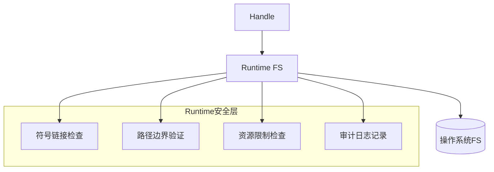
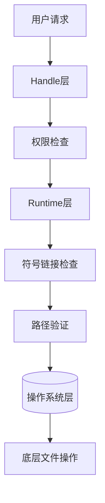

# Runtime 运行时模块

> 安全文件操作的底层实现

## 📋 目录

- [设计概述](#设计概述)
- [fs.js](#fsjs)
- [hide.js](#hidejs)
- [zip.js](#zipjs)

---

## 🏗️ 设计概述

### Runtime架构



### 安全层

| 层 | 功能 | 说明 |
|----|------|------|
| 符号链接防护 | 解析真实路径 | 防止路径穿越攻击 |
| 路径边界 | 验证在授权范围内 | 防止越权访问 |
| 资源限制 | 文件大小、深度限制 | 防止资源滥用 |
| 审计日志 | 记录所有操作 | 便于安全审计 |

---

## 📦 fs.js

### 核心功能

- 安全文件读写操作
- 符号链接检测与处理
- 路径验证
- 资源限制

### 函数列表

| 函数 | 说明 | 参数 | 返回值 |
|------|------|------|--------|
| `safeReadFile(path, options)` | 安全读取文件 | `path`: 路径, `options`: 选项 | `string|Buffer` |
| `safeWriteFile(path, content, options)` | 安全写入文件 | `path`: 路径, `content`: 内容 | `void` |
| `safeExists(path)` | 安全检查存在 | `path`: 路径 | `boolean` |
| `safeUnlink(path)` | 安全删除文件 | `path`: 路径 | `void` |
| `safeReadDir(path)` | 安全列出目录 | `path`: 路径 | `string[]` |
| `safeMkdir(path, options)` | 安全创建目录 | `path`: 路径 | `void` |
| `checkSymlink(path, boundary)` | 检查符号链接 | `path`: 路径, `boundary`: 边界 | `{ realPath, isSymlink, isInBoundary }` |
| `checkDirectorySymlinks(path, boundary)` | 递归检查目录符号链接 | `path`: 路径, `boundary`: 边界 | `boolean` |
| `safeResolve(...paths)` | 安全路径解析 | `...paths`: 路径片段 | `string` |

### 安全特性

#### 符号链接检查

```javascript
const checkSymlink = (p, boundary = null) => {
  try {
    const stat = fs.lstatSync(p);
    
    if (stat.isSymbolicLink()) {
      const realPath = fs.realpathSync(p);
      let isInBoundary = true;
      
      if (boundary) {
        const absBoundary = path.resolve(boundary);
        const absRealPath = path.resolve(realPath);
        isInBoundary = absRealPath === absBoundary || 
                       absRealPath.startsWith(absBoundary + path.sep);
      }
      
      return { realPath, isSymlink: true, isInBoundary };
    }
    
    // 非符号链接的边界检查
    // ...
    
    return { realPath: p, isSymlink: false, isInBoundary };
  } catch {
    return null;
  }
};
```

#### 路径穿越防护

```javascript
const safeResolve = (...paths) => {
  const resolved = path.resolve(...paths);
  
  // 检查路径穿越
  const parts = resolved.split(path.sep);
  if (parts.includes("..")) {
    throw new Error("path traversal detected");
  }
  
  // 检查路径深度
  if (parts.length > 20) {
    throw new Error("path too deep");
  }
  
  return resolved;
};
```

### 资源限制

| 限制类型 | 值 | 说明 |
|----------|-----|------|
| 文件大小 | 100MB | 单个文件最大大小 |
| 路径深度 | 20级 | 最大目录深度 |
| 目录大小 | 1GB | 单个目录最大大小 |

---

## 📦 hide.js

### 核心功能

- 文件隐藏/显示操作
- 跨平台支持

### 函数列表

| 函数 | 说明 | 参数 | 返回值 |
|------|------|------|--------|
| `hideFile(path)` | 隐藏文件 | `path`: 路径 | `void` |
| `unhideFile(path)` | 显示文件 | `path`: 路径 | `void` |
| `isHidden(path)` | 检查是否隐藏 | `path`: 路径 | `boolean` |

### 跨平台实现

```javascript
// Windows: 使用hidefile库
// macOS/Linux: 添加.前缀

const hideFile = (filePath) => {
  if (process.platform === "win32") {
    return hidefile.hideSync(filePath);
  } else {
    const dir = path.dirname(filePath);
    const name = path.basename(filePath);
    const newPath = path.join(dir, "." + name);
    fs.renameSync(filePath, newPath);
    return newPath;
  }
};
```

---

## 📦 zip.js

### 核心功能

- 文件压缩
- 文件解压
- 安全解压验证

### 函数列表

| 函数 | 说明 | 参数 | 返回值 |
|------|------|------|--------|
| `zipDirectory(source, outPath)` | 压缩目录 | `source`: 源目录, `outPath`: 输出路径 | `void` |
| `unzipFile(zipPath, outDir)` | 解压文件 | `zipPath`: zip路径, `outDir`: 输出目录 | `void` |
| `createZip(files, outPath)` | 创建zip | `files`: 文件列表, `outPath`: 输出路径 | `void` |

### 安全解压

```javascript
const unzipFile = (zipPath, outDir) => {
  // 1. 验证输出目录在授权范围内
  if (!isPathInBoundary(outDir)) {
    throw new Error("outDir outside authorized boundary");
  }
  
  // 2. 解压前检查
  // ...
  
  // 3. 执行解压
  // ...
  
  // 4. 解压后检查符号链接
  checkDirectorySymlinks(outDir);
};
```

---

## 🔐 安全设计

### 纵深防御



### 错误处理

1. **统一错误类型**: 使用统一的错误类
2. **安全日志**: 记录错误但脱敏敏感信息
3. **快速失败**: 尽早发现并拒绝不安全操作

---

## 💡 最佳实践

### 文件操作

1. **使用safe版本**: 始终使用safeReadFile等安全函数
2. **验证路径**: 在操作前验证路径有效性
3. **处理异常**: 妥善处理文件操作异常
4. **清理资源**: 确保文件句柄正确关闭

### 安全检查

1. **符号链接**: 写入操作前检查符号链接
2. **路径边界**: 验证路径在授权范围内
3. **资源限制**: 遵守文件大小和深度限制
4. **审计日志**: 记录所有文件操作
