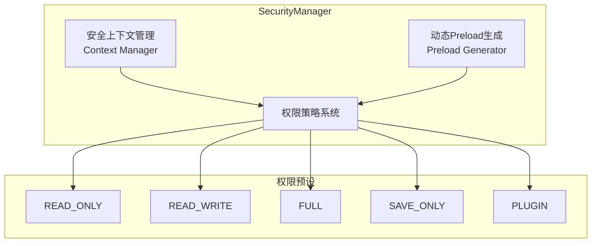
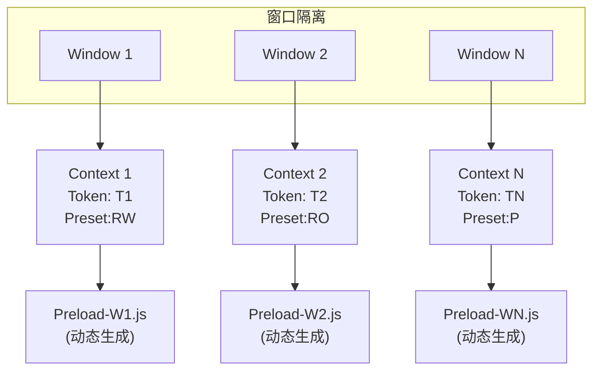
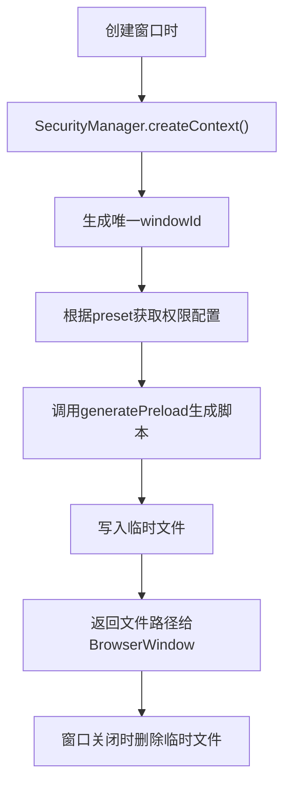
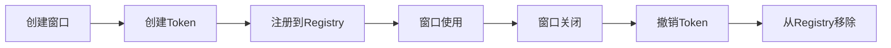

# Security 安全模块

> 安全管理器与动态Preload生成

## 📋 目录

- [设计概述](#设计概述)
- [manager.js](#managerjs)
- [动态Preload生成](#动态preload生成)
- [权限策略](#权限策略)

---

## 🏗️ 设计概述

### Security架构



### 窗口隔离模型



---

## 📦 manager.js

### 核心功能

- 窗口级安全上下文管理
- 动态Preload脚本生成
- 权限策略管理
- Token生命周期管理

### SecurityManager类

```javascript
class SecurityManager {
  constructor() {
    this.contexts = new Map();      // 安全上下文映射
    this.preloadCache = new Map();  // Preload缓存
    this.preloadDir = "/path/to/preloads";
  }
  
  // 创建安全上下文
  createContext(options) {
    // options: { windowId, preset, bindFile }
    // 返回: { id, windowId, preset, permissions, token, tokenId }
  }
  
  // 销毁安全上下文
  destroyContext(windowId) {
    // 清理上下文、删除preload文件、revoke token
  }
  
  // 获取安全上下文
  getContext(windowId) {
    // 返回上下文或null
  }
  
  // 生成动态Preload
  generatePreload(windowId, securityContext) {
    // 返回preload文件路径
  }
  
  // 更新窗口权限
  updatePermissions(windowId, newPreset) {
    // 更新权限预设并重新生成preload
  }
  
  // 获取上下文摘要
  getContextsSummary() {
    // 返回所有上下文摘要
  }
}
```

---

## 📝 动态Preload生成

### Preload模板

```javascript
const PRELOAD_TEMPLATE = (permissions, windowId) => `
const { contextBridge, ipcRenderer } = require("electron");

// Window ID: ${windowId}
// Generated at: ${new Date().toISOString()}

const ALLOWED_CHANNELS = new Set(${JSON.stringify(getAllowedChannels(permissions))});

const invoke = (channel, ...args) => {
  if (!ALLOWED_CHANNELS.has(channel)) {
    throw new Error("[safe-io] blocked channel: " + channel);
  }
  return ipcRenderer.invoke(channel, ...args);
};

const assertToken = (token) => {
  if (!token || typeof token !== "object") throw new Error("invalid token");
  if (!token.id || !token.signature) throw new Error("invalid token structure");
};

const api = {};

${generateFSAPI(permissions)}
${generateUserAPI(permissions)}
// ... 其他API

contextBridge.exposeInMainWorld("safeIO", api);
`;
```

### API生成函数

| 函数 | 说明 |
|------|------|
| `generateFSAPI(permissions)` | 根据权限生成文件系统API |
| `generateHideAPI(permissions)` | 根据权限生成隐藏API |
| `generateZipAPI(permissions)` | 根据权限生成压缩API |
| `generateUserAPI(permissions)` | 根据权限生成用户API |
| `generateThemeAPI(permissions)` | 根据权限生成主题API |
| `generateLocaleAPI(permissions)` | 根据权限生成本地化API |
| `generateCapAPI()` | 生成权限控制API |
| `generateStorageAPI()` | 生成存储授权API |

### Preload生成流程



---

## 🔐 权限策略

### 预设定义

```javascript
const PERMISSION_PRESETS = {
  READ_ONLY: {
    fs: ["read", "exists", "ls"],
    hide: [],
    zip: ["zip"],
    user: ["load", "list"],
    locale: ["load"],
    theme: ["load"],
    icon: ["load"],
  },
  READ_WRITE: {
    fs: ["read", "write", "exists", "ls", "mkdir"],
    hide: ["hide", "unhide"],
    zip: ["zip", "unzip"],
    user: ["load", "save", "list"],
    locale: ["load"],
    theme: ["load", "apply"],
    icon: ["load"],
  },
  FULL: {
    fs: ["read", "write", "exists", "delete", "ls", "mkdir"],
    hide: ["hide", "unhide"],
    zip: ["zip", "unzip"],
    user: ["load", "save", "list"],
    locale: ["load"],
    theme: ["load", "apply"],
    icon: ["load"],
  },
  SAVE_ONLY: {
    fs: ["read", "write", "exists"],
    hide: [],
    zip: [],
    user: [],
    locale: [],
    theme: [],
    icon: [],
  },
  PLUGIN: {
    fs: ["read", "exists", "ls"],
    hide: [],
    zip: ["unzip"],
    user: [],
    locale: [],
    theme: [],
    icon: [],
  },
};
```

### 预设适用场景

| 预设 | 适用场景 | 说明 |
|------|----------|------|
| `READ_ONLY` | 预览窗口 | 只读访问，禁止修改 |
| `READ_WRITE` | 编辑窗口 | 读写访问，允许创建 |
| `FULL` | 管理窗口 | 完全权限，包含删除 |
| `SAVE_ONLY` | 存档窗口 | 仅限存档读写 |
| `PLUGIN` | 插件窗口 | 只读+解压 |

---

## 🔒 安全特性

### 窗口隔离

1. **独立上下文**: 每个窗口有独立的安全上下文
2. **独立Token**: 每个窗口使用独立的Token
3. **独立Preload**: 每个窗口使用动态生成的Preload
4. **独立Session**: 每个窗口使用独立的session分区

### Token生命周期



### 自动清理

1. **Preload清理**: 窗口关闭时删除临时preload文件
2. **Token清理**: 窗口关闭时revoke token
3. **GC清理**: 定期清理过期Token

---

## 💡 开发指南

### 添加新权限预设

1. **在PERMISSION_PRESETS中添加预设**
```javascript
MY_CUSTOM_PRESET: {
  fs: ["read", "write"],
  // ... 其他权限
},
```

2. **确保getAllowedChannels正确映射**
```javascript
// 确保新权限映射到正确的IPC通道
```

### 扩展Preload模板

1. **添加新的API生成函数**
```javascript
function generateCustomAPI(permissions) {
  // 生成自定义API
}
```

2. **在PRELOAD_TEMPLATE中调用**
```javascript
${generateCustomAPI(permissions)}
```

### 安全检查清单

- [ ] 窗口关闭时清理上下文
- [ ] Token正确revoke
- [ ] Preload文件正确删除
- [ ] 权限预设正确应用
- [ ] Channel白名单正确配置
