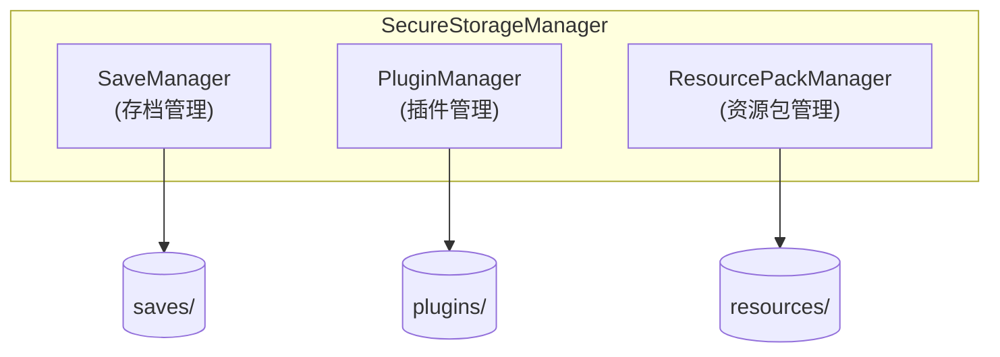
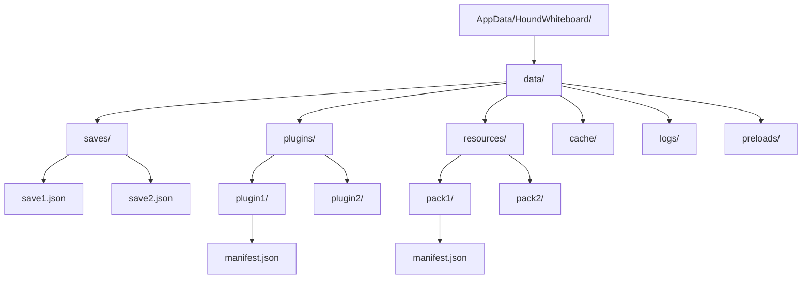
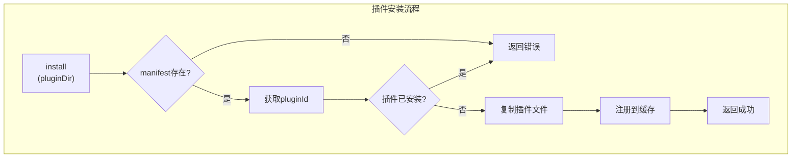
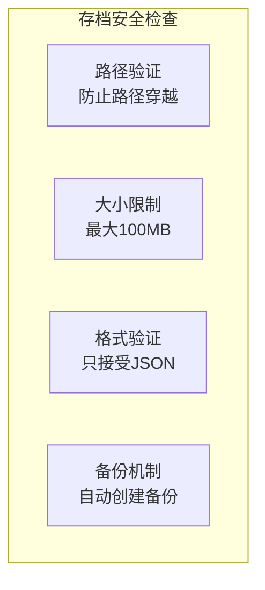
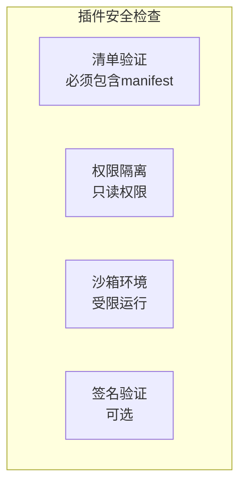
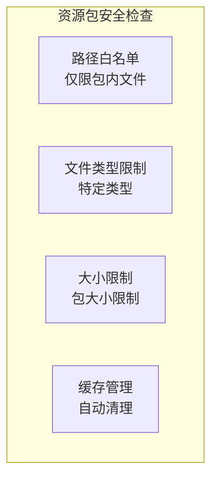
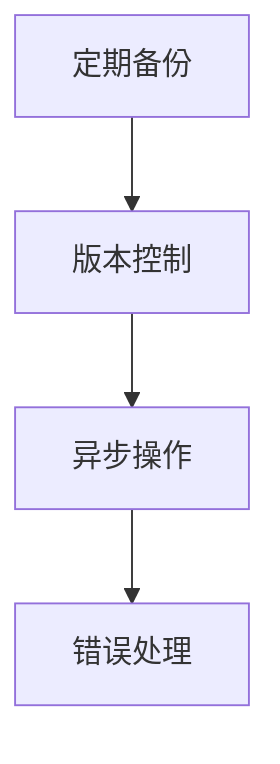
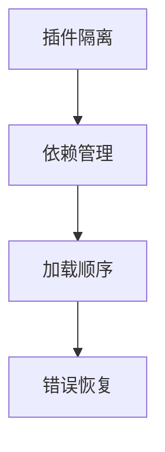
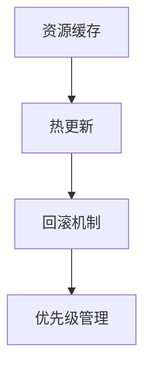

# Storage 存储模块

> 存档、插件、资源包的统一管理

## 📋 目录

- [设计概述](#设计概述)
- [SaveManager](#savemanager)
- [PluginManager](#pluginmanager)
- [ResourcePackManager](#resourcepackmanager)
- [安全考虑](#安全考虑)

---

## 🏗️ 设计概述

### 存储架构



### 目录结构



> **设计说明**：所有应用数据统一放在 `data/` 目录下，`AppData/HoundWhiteboard/` 根目录可用于存放配置文件等非数据文件。

---

## 📦 SaveManager

### 核心功能

- 创建、读取、更新、删除存档
- 存档版本管理
- 存档列表管理

### 方法列表

| 方法 | 说明 | 参数 | 返回值 |
|------|------|------|--------|
| `create(name, data)` | 创建存档 | `name`: 存档名称, `data`: 数据 | `{ success, saveId, path }` |
| `read(saveId)` | 读取存档 | `saveId`: 存档ID | `{ success, data }` |
| `update(saveId, data)` | 更新存档 | `saveId`: 存档ID, `data`: 更新数据 | `{ success }` |
| `delete(saveId)` | 删除存档 | `saveId`: 存档ID | `{ success }` |
| `list()` | 列出所有存档 | - | `{ success, saves }` |
| `getPath(saveId)` | 获取存档路径 | `saveId`: 存档ID | `string|null` |

### 存档格式

```javascript
{
  id: "save_name_1234567890",
  name: "save_name",
  data: { /* 用户数据 */ },
  createdAt: 1234567890,
  modifiedAt: 1234567890,
  version: "1.0.0",
}
```

### 使用示例

```javascript
import { SaveManager } from "./storage/index.js";

const saveManager = new SaveManager("/path/to/saves");

// 创建存档
const result = await saveManager.create("my-save", { level: 1, score: 100 });
console.log("Save ID:", result.saveId);

// 读取存档
const data = await saveManager.read(result.saveId);
console.log(data);

// 更新存档
await saveManager.update(result.saveId, { score: 200 });

// 列出存档
const list = await saveManager.list();
console.log(list.saves);
```

---

## 📦 PluginManager

### 核心功能

- 插件安装、加载、卸载
- 插件清单管理
- 插件资源访问

### 方法列表

| 方法 | 说明 | 参数 | 返回值 |
|------|------|------|--------|
| `install(pluginDir)` | 安装插件 | `pluginDir`: 插件目录 | `{ success, pluginId, manifest }` |
| `load(pluginId)` | 加载插件 | `pluginId`: 插件ID | `{ success, plugin }` |
| `uninstall(pluginId)` | 卸载插件 | `pluginId`: 插件ID | `{ success }` |
| `list()` | 列出所有插件 | - | `{ success, plugins }` |
| `getResourcePath(pluginId, path)` | 获取插件资源路径 | `pluginId`: 插件ID, `path`: 资源路径 | `string|null` |

### 插件清单格式

```javascript
// manifest.json
{
  id: "plugin-unique-id",
  name: "插件名称",
  version: "1.0.0",
  description: "插件描述",
  author: "作者",
  dependencies: [],
  entry: "main.js",
}
```



### 使用示例

```javascript
import { PluginManager } from "./storage/index.js";

const pluginManager = new PluginManager("/path/to/plugins");

// 安装插件
await pluginManager.install("/path/to/plugin-source");

// 加载插件
const plugin = await pluginManager.load("my-plugin");
console.log(plugin.manifest);

// 卸载插件
await pluginManager.uninstall("my-plugin");
```

---

## 📦 ResourcePackManager

### 核心功能

- 资源包安装、应用、卸载
- 资源包激活管理
- 资源查找与加载

### 方法列表

| 方法 | 说明 | 参数 | 返回值 |
|------|------|------|--------|
| `install(packPath)` | 安装资源包 | `packPath`: 资源包路径 | `{ success, packId, manifest }` |
| `apply(packId)` | 应用资源包 | `packId`: 资源包ID | `{ success }` |
| `uninstall(packId)` | 卸载资源包 | `packId`: 资源包ID | `{ success }` |
| `list()` | 列出所有资源包 | - | `{ success, packs }` |
| `getResourcePath(path)` | 获取资源路径 | `path`: 资源相对路径 | `string|null` |

### 资源包清单格式

```javascript
// manifest.json
{
  id: "resource-pack-id",
  name: "资源包名称",
  version: "1.0.0",
  description: "资源包描述",
  author: "作者",
  type: "theme|texture|sound",
}
```

### 使用示例

```javascript
import { ResourcePackManager } from "./storage/index.js";

const resourceManager = new ResourcePackManager("/path/to/resources");

// 安装资源包
await resourceManager.install("/path/to/resource-pack");

// 应用资源包
await resourceManager.apply("my-resource-pack");

// 获取资源
const iconPath = resourceManager.getResourcePath("icons/icon.png");
```

---

## 🔐 安全考虑

### 存档安全



### 插件安全



### 资源包安全



---

## 📝 最佳实践

### 存档管理



### 插件管理



### 资源包管理


